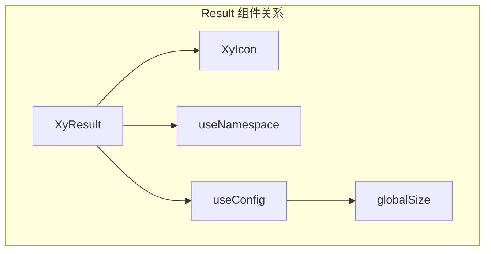

# 60 Result 结果

> 导读：Result 为操作结果提供标准化的反馈视图，将状态码、图标、文案和操作按钮整合为统一的终端页

## 设计哲学

结果页是用户操作链路的「终点站」——成功、失败、错误码都通过它传达。Result 的设计原则是**让结果可感知、可行动**：

- **双维度语义**：`status`（场景语义，如 404/500）和 `icon`（视觉语义，如 success/warning）独立控制，允许「500 错误但用 warning 色调」这类定制
- **accent 色自动推导**：根据 status 或 icon 自动计算 `--xy-result-accent-color` 系列变量，图标壳、边框、背景一体联动
- **向后兼容的描述槽**：保留 `sub-title` 槽位兼容旧 API，同时提供 `description` 作为正式命名

```mermaid
graph LR
  A[Result 组件] --> B{icon prop?}
  B -- 有 --> C[从 ICON_NAME_MAP 取图标名]
  C --> D[从 ICON_STATUS_MAP 取色调]
  B -- 无 --> E[从 STATUS_ICON_MAP 取图标名]
  E --> F[从 STATUS_TONE_MAP 取色调]
  D --> G[设置 is-{tone} 修饰类]
  F --> G
  G --> H[CSS 变量联动 accent-color / surface / border]
```

## 源码架构

```
packages/components/result/
├── index.ts              # withInstall 导出
├── src/
│   ├── result.vue        # 主组件
│   └── result.ts         # 类型 + 映射常量
└── __tests__/
    └── result.spec.ts
```



### 核心 type 定义

```ts
type ResultIconType = "primary" | "success" | "warning" | "info" | "error";
type ResultVariant = "plain" | "card";
type ResultStatus = ComponentStatus | "info" | "error" | "403" | "404" | "500";

interface ResultProps {
  title?: string;
  subTitle?: string;         // 兼容旧 API
  icon?: ResultIconType;
  status?: ResultStatus;
  description?: string;
  size?: ComponentSize;
  variant?: ResultVariant;
  iconSize?: number | string;
}
```

### 映射常量体系

Result 的核心数据结构是四张映射表，将 status / icon 双维度映射到图标名和色调：

```ts
// status -> 图标名
const RESULT_STATUS_ICON_MAP: Record<ResultStatus, string> = {
  neutral: "mdi:information-outline",
  success: "mdi:check-circle-outline",
  "404":   "mdi:file-question-outline",
  "500":   "mdi:server-network-off",
  // ...
};

// status -> 色调（用于 CSS 修饰类）
const RESULT_STATUS_TONE_MAP: Record<ResultStatus, ComponentStatus> = {
  info: "neutral",   // info 降级为 neutral 色调
  error: "danger",   // error 映射为 danger 色调
  "403": "warning",
  "500": "danger",
  // ...
};

// icon -> 图标名（优先级高于 status）
const RESULT_ICON_NAME_MAP: Record<ResultIconType, string> = { ... };

// icon -> 色调
const RESULT_ICON_STATUS_MAP: Record<ResultIconType, ResultStatus> = {
  info: "neutral",  // info icon 用 neutral 色
  error: "danger",  // error icon 用 danger 色
};
```

## 核心实现

### icon / status 双维度解析

Result 允许 `icon` 和 `status` 同时传入，`icon` 优先：

```ts
const resolvedTone = computed(() =>
  props.icon
    ? RESULT_ICON_STATUS_MAP[props.icon]
    : RESULT_STATUS_TONE_MAP[props.status]
);
const resolvedIcon = computed(() =>
  props.icon
    ? RESULT_ICON_NAME_MAP[props.icon]
    : RESULT_STATUS_ICON_MAP[props.status]
);
```

```mermaid
flowchart TD
  A[解析图标与色调] --> B{icon prop 存在?}
  B -- 是 --> C[ICON_NAME_MAP 取图标]
  B -- 是 --> D[ICON_STATUS_MAP 取色调]
  B -- 否 --> E[STATUS_ICON_MAP 取图标]
  B -- 否 --> F[STATUS_TONE_MAP 取色调]
  C --> G[resolvedIcon]
  D --> H[resolvedTone]
  E --> G
  F --> H
  H --> I[生成 is-{tone} 修饰类]
  I --> J[CSS 变量 accent-color / surface / border 联动]
```

**WHY**：分离 icon 与 status 让视觉表达更灵活。例如 HTTP 500 错误可能希望用 warning 色调（而非默认 danger），此时可同时设 `status="500"` + `icon="warning"`。

### description / sub-title 兼容策略

Result 同时支持 `description` 和 `sub-title`，采用三层回退：

```ts
const resolvedDescription = computed(() =>
  props.description !== undefined ? props.description : props.subTitle
);

const showLegacyDescriptionSlot = computed(
  () => !slots.description && props.description === undefined && Boolean(slots["sub-title"])
);
```

```html
<div v-if="hasDescription" class="xy-result__description">
  <slot v-if="slots.description" name="description" />
  <slot v-else-if="showLegacyDescriptionSlot" name="sub-title" />
  <p v-else>{{ resolvedDescription }}</p>
</div>
```

**WHY**：`showLegacyDescriptionSlot` 确保仅在 `description` 完全未使用时才激活 `sub-title` 槽位，避免两个描述区同时出现。

### size 与 variant 的尺寸系统

`size` 通过 `useConfig` 合并全局尺寸，`variant` 控制卡片变体：

```ts
const mergedSize = computed<ComponentSize>(() => props.size ?? globalSize.value);

const rootClasses = computed(() => [
  ns.base.value,
  `${ns.base.value}--${mergedSize.value}`,
  `${ns.base.value}--${props.variant}`,
  ns.is(resolvedTone.value, true),
]);
```

CSS 中 `--sm` / `--lg` 通过覆盖 CSS 变量实现尺寸缩放，而非逐属性重写。

## API 参考

### Props

| 属性 | 类型 | 默认值 | 说明 |
|------|------|--------|------|
| title | `string` | `undefined` | 主标题 |
| subTitle | `string` | `""` | 副标题（兼容旧 API） |
| icon | `ResultIconType` | `undefined` | 图标类型，优先于 status |
| status | `ResultStatus` | `"neutral"` | 状态语义 |
| description | `string` | `undefined` | 描述文字 |
| size | `ComponentSize` | `undefined`（走全局） | 尺寸 |
| variant | `ResultVariant` | `"plain"` | 变体：plain / card |
| iconSize | `number \| string` | `undefined` | 图标尺寸 |

### Emits

无

### Slots

| 名称 | 说明 |
|------|------|
| icon | 自定义图标区域 |
| title | 自定义标题 |
| description | 自定义描述 |
| sub-title | 兼容旧版描述槽 |
| default | 内容区 |
| extra | 额外操作区 |

### Exposes

无

## 样式系统

### BEM 类名

| 类名 | 说明 |
|------|------|
| `.xy-result` | 根容器 |
| `.xy-result--sm` / `--lg` | 尺寸变体 |
| `.xy-result--card` | 卡片变体 |
| `.xy-result__icon` | 图标区 |
| `.xy-result__icon-shell` | 图标圆形容器 |
| `.xy-result__icon-symbol` | 图标符号 |
| `.xy-result__title` | 标题区 |
| `.xy-result__description` | 描述区 |
| `.xy-result__content` | 内容区 |
| `.xy-result__extra` | 额外操作区 |

### 状态修饰

| 类名 | 说明 |
|------|------|
| `.is-neutral` | 中性色调 |
| `.is-primary` | 主色色调 |
| `.is-success` | 成功色调 |
| `.is-warning` | 警告色调 |
| `.is-danger` | 危险色调 |

### CSS 变量

| 变量 | 默认值 | 说明 |
|------|--------|------|
| `--xy-result-padding` | `40px 20px` | 内边距 |
| `--xy-result-gap` | `14px` | 区域间距 |
| `--xy-result-icon-size` | `72px` | 图标尺寸 |
| `--xy-result-icon-shell-size` | `112px` | 图标壳尺寸 |
| `--xy-result-title-font-size` | `24px` | 标题字号 |
| `--xy-result-description-font-size` | `14px` | 描述字号 |
| `--xy-result-title-color` | `var(--xy-text-color-heading)` | 标题颜色 |
| `--xy-result-description-color` | `var(--xy-text-color-subtle)` | 描述颜色 |
| `--xy-result-content-max-width` | `560px` | 最大宽度 |
| `--xy-result-accent-color` | `var(--xy-color-info)` | 强调色（随状态联动） |
| `--xy-result-accent-surface` | `color-mix(...)` | 强调色背景 |
| `--xy-result-accent-border` | `color-mix(...)` | 强调色边框 |

## 小结

1. **双维度语义**：icon 与 status 独立控制，允许视觉表达与场景语义解耦
2. **accent 色自动联动**：通过 `is-{tone}` 修饰类驱动 CSS 变量，图标壳/边框/背景一体变色
3. **向后兼容策略**：description / sub-title 三层回退确保新旧 API 平滑过渡
