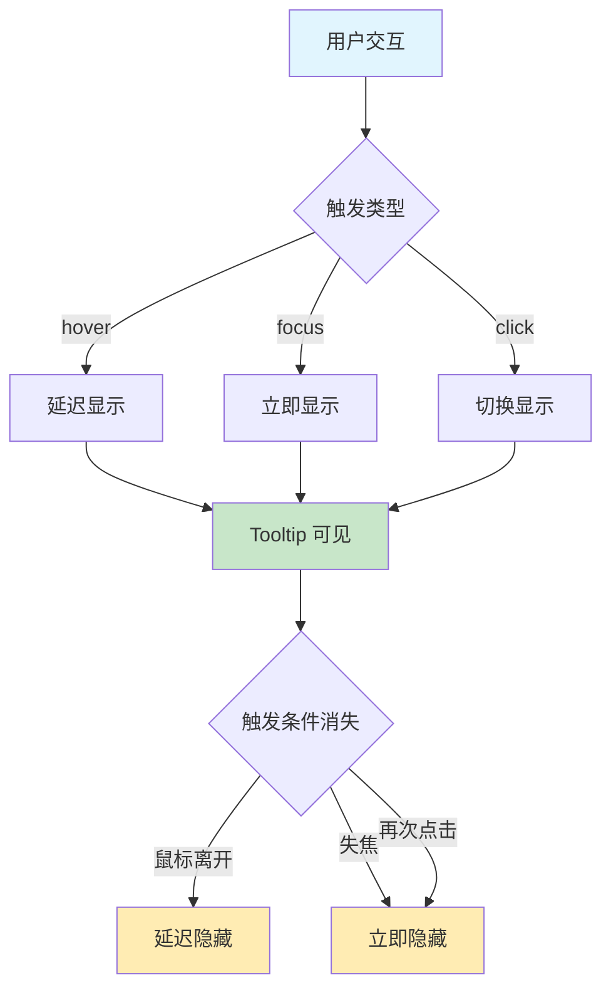
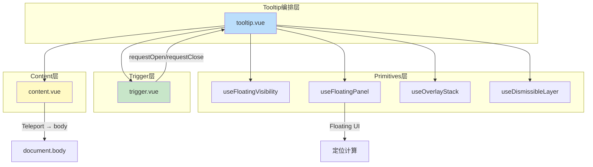
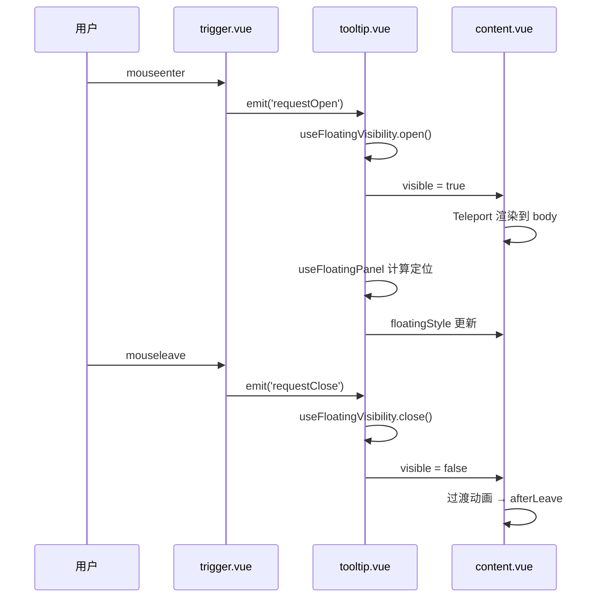

# 61 Tooltip 文字提示

> 导读：基于 Floating UI 的轻量级浮层原语，为交互元素提供即时的上下文信息，是所有弹出类组件的定位基石。

## 设计哲学

Tooltip 解决的核心问题是：在用户悬停或聚焦于某个元素时，以最小视觉干扰呈现补充信息。它的设计遵循三个原则：

- **零侵入**：Tooltip 不改变触发元素的布局和尺寸，浮层通过 Teleport 挂载到 body
- **即时响应**：延迟应尽可能短，信息在用户产生疑问的瞬间出现
- **语义明确**：Tooltip 只承载只读信息，不包含交互操作（交互弹出由 Popover 承担）



**与其他组件的差异化**：

| 特性 | Tooltip | Popover | Popconfirm |
|------|---------|---------|------------|
| 内容类型 | 纯文本/简单 HTML | 富内容/自定义渲染 | 确认操作 |
| 交互能力 | 无 | 有 | 有限 |
| 触发方式 | hover/focus/click/contextmenu | hover/click/focus | click |
| 复杂度 | 低 | 中 | 中 |

## 源码架构

```
tooltip/
├── src/
│   ├── tooltip.vue       # 主组件：编排 trigger + content
│   ├── tooltip.ts        # 类型定义与 props 声明
│   ├── content.vue       # 浮层内容：Teleport + 定位 + 过渡动画
│   ├── trigger.vue       # 触发器：捕获事件并转发请求
│   └── utils.ts          # 工具函数：触发类型标准化、键盘匹配
└── index.ts              # 导出入口 + withInstall
```



### 核心 Type 定义

```ts
type TooltipEffect = 'dark' | 'light'
type TooltipTrigger = 'hover' | 'click' | 'focus' | 'contextmenu' | 'manual'

interface TooltipPopperOptions {
  strategy?: Strategy
  zIndex?: number
  arrowPadding?: number
  shiftPadding?: number
  flip?: boolean
  fallbackPlacements?: Placement[]
}

interface TooltipProps {
  modelValue?: boolean
  content?: string
  placement?: Placement
  disabled?: boolean
  trigger?: TooltipTrigger | TooltipTrigger[]
  offset?: number
  showArrow?: boolean
  maxWidth?: number | string
  teleported?: boolean
  appendTo?: string | HTMLElement
  effect?: TooltipEffect
  virtualRef?: ReferenceElement | null
  virtualTriggering?: boolean
  popperOptions?: TooltipPopperOptions
  // ... 更多属性见 API 参考
}

interface TooltipExposed {
  triggerRef: Ref<HTMLElement | null>
  contentRef: Ref<HTMLElement | null>
  show: () => void
  hide: () => void
  updatePopper: () => Promise<void>
  isFocusInsideContent: (event?: FocusEvent) => boolean
}
```

## 核心实现

### 1. Trigger/Content 分离架构

Tooltip 采用 Trigger + Content 的分离架构。trigger.vue 只负责捕获 DOM 事件并转发请求，content.vue 只负责浮层渲染和定位，tooltip.vue 作为编排层协调两者。

**WHY**：分离后 trigger 和 content 可以独立演进。虚拟触发模式下不需要 trigger.vue 渲染，命令式调用时不需要关心 trigger 实现。这种分离也让 Popconfirm 可以直接复用 Tooltip 作为底层浮层引擎。

```ts
// tooltip.vue 核心编排逻辑
const { visible, rendered, open, close, toggle, clearTimers } =
  useFloatingVisibility({
    modelValue: () => props.modelValue,
    disabled: () => props.disabled,
    openDelay: () => props.showAfter ?? props.openDelay,
    closeDelay: () => props.hideAfter ?? props.closeDelay,
    onOpen: () => { emit('open'); openLayer() },
    onClose: () => { emit('close'); closeLayer(); stopAutoUpdate() }
  })

const { actualPlacement, floatingStyle, updatePosition, startAutoUpdate } =
  useFloatingPanel(referenceRef, contentRef, {
    placement: () => props.placement,
    offset: () => props.offset,
    arrowRef: props.showArrow ? arrowRef : undefined,
    flip: () => normalizedPopperOptions.value.flip,
    zIndex: () => normalizedPopperOptions.value.zIndex
  })
```



### 2. 触发器事件路由

trigger.vue 根据不同的 trigger 类型注册不同的 DOM 事件，通过 computed 判断是否应响应：

```ts
// trigger.vue — 触发类型路由
const hasHoverTrigger = computed(() => includesTooltipTrigger(props.trigger, 'hover'))
const hasClickTrigger = computed(() => includesTooltipTrigger(props.trigger, 'click'))

function handleMouseenter(event: MouseEvent) {
  if (!canHandleEvents() || !hasHoverTrigger.value) return
  emit('requestOpen', event)
}

function handleClick(event: MouseEvent) {
  if (!canHandleEvents() || !hasClickTrigger.value || event.button !== 0) return
  emit('requestToggle', event)
}
```

**WHY**：使用 computed 判断而非条件分支，新增触发类型只需扩展判断逻辑和事件绑定，符合开闭原则。同时 `canHandleEvents()` 统一拦截 disabled 和 manual 模式，避免在每个处理函数中重复判断。

### 3. Floating UI 定位系统

Tooltip 使用 primitives 层的 `useFloatingPanel` composable，底层依赖 Floating UI（原 Popper.js）：

```ts
// tooltip.vue — 定位系统接入
const { actualPlacement, arrowStyle, floatingStyle, updatePosition, startAutoUpdate, stopAutoUpdate } =
  useFloatingPanel(referenceRef, contentRef, {
    placement: () => props.placement,
    strategy: () => normalizedPopperOptions.value.strategy as Strategy,
    offset: () => props.offset,
    arrowRef: props.showArrow ? arrowRef : undefined,
    arrowPadding: normalizedPopperOptions.value.arrowPadding,
    shiftPadding: () => normalizedPopperOptions.value.shiftPadding,
    flip: () => normalizedPopperOptions.value.flip,
    fallbackPlacements: () => normalizedPopperOptions.value.fallbackPlacements,
    zIndex: () => normalizedPopperOptions.value.zIndex
  })

watch([visible, referenceRef], async ([value]) => {
  stopAutoUpdate()
  if (!value) return
  await nextTick()
  await updatePosition()
  startAutoUpdate()
})
```

**WHY 选择 Floating UI**：Floating UI 提供了完善的翻转（flip）、溢出检测和自动定位能力，比纯 CSS 定位方案更健壮。`startAutoUpdate` 在浮层可见期间持续监听参考元素的位置变化（scroll、resize），确保浮层始终与触发元素对齐。

### 4. Overlay Stack 与 Dismissible Layer

Tooltip 通过两个 primitives composable 管理层级和关闭行为：

```ts
const { zIndex, isTopMost, openLayer, closeLayer } = useOverlayStack()

useDismissibleLayer({
  enabled: () => visible.value && !isManualTrigger.value,
  refs: [triggerRef, contentRef],
  closeOnEscape: props.closeOnEsc,
  closeOnOutside: closeOnOutsideEnabled,
  isTopMost: () => isTopMost(),
  onDismiss: () => { hide() }
})
```

**WHY**：Overlay Stack 确保多个弹出层按打开顺序叠加 z-index，最顶层优先响应 Escape 和外部点击。Dismissible Layer 则统一管理 Escape 关闭和外部点击关闭的逻辑，避免每个组件重复实现。

### 5. 虚拟触发

Tooltip 支持虚拟触发模式，触发元素不由 trigger.vue 渲染，而是由外部指定：

```ts
// tooltip.vue — 虚拟触发计算
const referenceRef = computed<ReferenceElement | null>(() =>
  props.virtualTriggering && props.virtualRef
    ? props.virtualRef
    : triggerRef.value
)
```

```ts
// trigger.vue — 虚拟触发时的事件绑定
function addVirtualListeners(element: HTMLElement | null) {
  if (!props.virtualTriggering || !element) return
  element.addEventListener('mouseenter', handleMouseenter)
  element.addEventListener('mouseleave', handleMouseleave)
  // ... 更多事件
}
```

**WHY**：虚拟触发让 Tooltip 可以绑定到任何 DOM 元素或虚拟节点上（如 SVG 元素、Canvas 区域），突破了默认插槽只能包裹一个子元素的限制。这也是 Popconfirm 实现右键菜单触发的基础能力。

## API 参考

### Props

| 属性 | 类型 | 默认值 | 说明 |
|------|------|--------|------|
| model-value | `boolean` | `false` | 受控显示状态 |
| content | `string` | `''` | 提示文本内容 |
| placement | `Placement` | `'top'` | 浮层出现位置 |
| disabled | `boolean` | `false` | 是否禁用 |
| trigger | `TooltipTrigger \| TooltipTrigger[]` | `'hover'` | 触发方式 |
| trigger-keys | `string[]` | `['Enter','NumpadEnter','Space',' ']` | 键盘触发键 |
| open-delay | `number` | `80` | 打开延迟(ms) |
| close-delay | `number` | `60` | 关闭延迟(ms) |
| show-after | `number` | — | 打开延迟别名，优先级高于 open-delay |
| hide-after | `number` | — | 关闭延迟别名，优先级高于 close-delay |
| enterable | `boolean` | `true` | 鼠标是否可进入浮层 |
| offset | `number` | `10` | 浮层偏移量 |
| show-arrow | `boolean` | `true` | 是否显示箭头 |
| max-width | `number \| string` | `240` | 提示最大宽度 |
| teleported | `boolean` | `true` | 是否传送至 body |
| append-to | `string \| HTMLElement` | `'body'` | 挂载容器 |
| persistent | `boolean` | `false` | 关闭后是否保留 DOM |
| popper-class | `string` | `''` | 浮层自定义类名 |
| popper-style | `StyleValue` | — | 浮层自定义样式 |
| close-on-esc | `boolean` | `true` | Escape 是否关闭 |
| close-on-outside | `boolean` | `true` | 点击外部是否关闭 |
| aria-label | `string` | — | 自定义辅助说明 |
| effect | `'dark' \| 'light'` | `'dark'` | 主题风格 |
| raw-content | `boolean` | `false` | 是否把 content 当 HTML 渲染 |
| transition | `string` | `'xy-fade'` | 过渡动画名 |
| virtual-ref | `ReferenceElement \| null` | `null` | 虚拟触发引用 |
| virtual-triggering | `boolean` | `false` | 是否虚拟触发 |
| popper-options | `TooltipPopperOptions` | — | 高级定位参数 |

### Emits

| 事件 | 参数 | 说明 |
|------|------|------|
| update:model-value | `(value: boolean)` | 开关状态变化 |
| before-show | — | 打开前触发 |
| show | — | 进入过渡结束后触发 |
| before-hide | — | 关闭前触发 |
| hide | — | 离场过渡结束后触发 |
| open | — | 浮层逻辑打开时触发 |
| close | — | 浮层逻辑关闭时触发 |

### Slots

| 插槽 | 说明 |
|------|------|
| default | 触发区域 |
| content | 自定义浮层内容 |

### Exposes

| 名称 | 类型 | 说明 |
|------|------|------|
| triggerRef | `Ref<HTMLElement \| null>` | 触发节点引用 |
| contentRef | `Ref<HTMLElement \| null>` | 内容节点引用 |
| show | `() => void` | 立即打开 |
| hide | `() => void` | 立即关闭 |
| updatePopper | `() => Promise<void>` | 重新计算定位 |
| isFocusInsideContent | `(event?: FocusEvent) => boolean` | 焦点是否在内容区 |

## 样式系统

### BEM 类名

| 类名 | 说明 |
|------|------|
| `.xy-tooltip` | 触发器根容器 |
| `.xy-tooltip__content` | 浮层容器 |
| `.xy-tooltip__content--dark` | 深色主题 |
| `.xy-tooltip__content--light` | 浅色主题 |
| `.xy-tooltip__content--top/bottom/left/right` | 方向修饰 |
| `.xy-tooltip__arrow` | 箭头元素 |
| `.xy-popper__arrow` | 箭头通用类（跨组件共享） |

### CSS 变量

```css
/* 浮层背景与文字 — 三级回退链 */
--xy-tooltip-bg-resolved: var(--xy-tooltip-bg, var(--xy-popper-bg, var(--xy-dialog-bg, ...)))
--xy-tooltip-text-resolved: var(--xy-tooltip-text, var(--xy-popper-text-color, ...))
--xy-tooltip-border-resolved: var(--xy-tooltip-border, var(--xy-popper-border-color, ...))
--xy-tooltip-shadow-resolved: var(--xy-tooltip-shadow, var(--xy-popper-shadow, ...))

/* Dark 主题覆盖 */
.xy-tooltip__content--dark {
  --xy-tooltip-bg: color-mix(in srgb, var(--xy-bg-color-floating) 78%, var(--xy-text-color-heading));
  --xy-tooltip-text: color-mix(in srgb, var(--xy-bg-color-floating) 82%, var(--xy-mix-light));
  --xy-tooltip-border: color-mix(in srgb, var(--xy-bg-color-floating) 12%, transparent);
}

/* Light 主题覆盖 */
.xy-tooltip__content--light {
  --xy-tooltip-bg: color-mix(in srgb, var(--xy-bg-color-floating) 96%, var(--xy-bg-color-subtle));
  --xy-tooltip-text: var(--xy-text-color-secondary);
  --xy-tooltip-border: color-mix(in srgb, var(--xy-border-color-subtle) 84%, var(--xy-border-color));
}

/* 过渡动画 */
.xy-fade-enter-from / .xy-fade-leave-to {
  opacity: 0;
  transform: translateY(4px);
}
```

### 主题定制

```css
/* 全局覆盖 */
:root {
  --xy-tooltip-bg: #1a1a2e;
}

/* 实例级覆盖 — 通过 popperClass */
.custom-tooltip.xy-tooltip__content {
  --xy-tooltip-bg: #6c5ce7;
}
```

## 小结

1. **Trigger/Content 分离架构**：将事件捕获与浮层渲染解耦，支持虚拟触发和 Popconfirm 复用
2. **Primitives composable 复用**：useFloatingVisibility / useFloatingPanel / useOverlayStack / useDismissibleLayer 四层抽象，让 Tooltip 只负责编排不重复实现基础设施
3. **三级 CSS 变量回退链**：组件变量 → Popper 通用变量 → Dialog 通用变量 → 设计令牌，确保单一变量修改能在正确层级生效