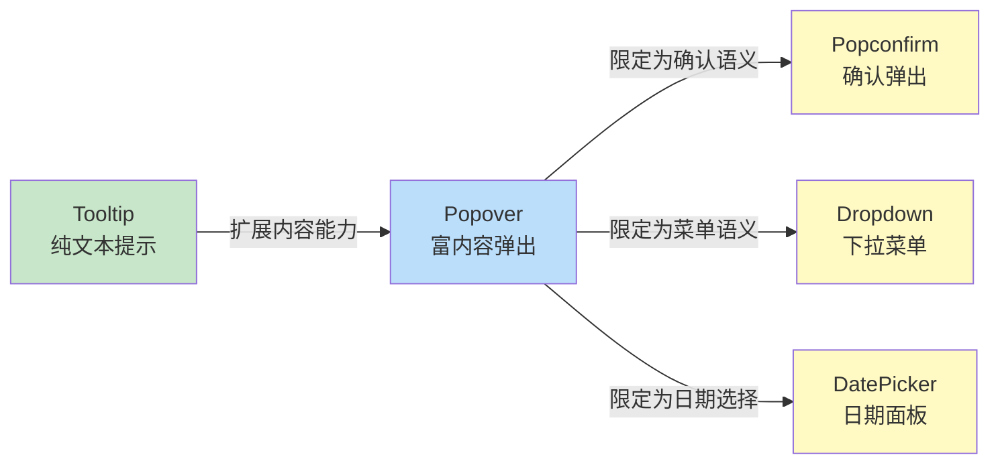
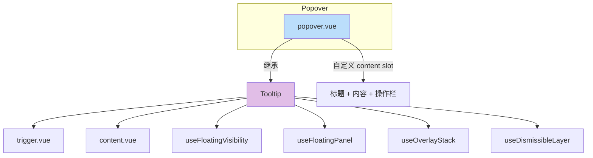
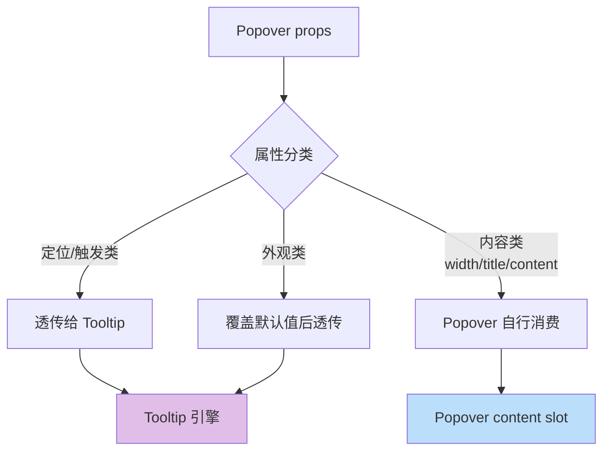

# 62 Popover 弹出框

> 导读：在 Tooltip 的基础上扩展富内容渲染能力，支持嵌套交互，是 Popconfirm、Dropdown 等复合组件的宿主容器。

## 设计哲学

Popover 解决的核心问题是：在触发元素附近展示一段富内容，且这段内容可以包含交互操作。它延续了 Tooltip 的定位能力，但在内容层面实现了质的飞跃——从纯文本到任意 Vue 组件。

- **富内容承载**：Popover 不限制内容形式，插槽可渲染表单、按钮、图表等任意组件
- **交互安全**：浮层内的点击不会关闭自身，Escape / 外部点击才触发关闭
- **语义分层**：Popover 负责「弹出」，具体语义（确认、菜单）由子组件定义



**与 Tooltip 的本质差异**：

| 维度 | Tooltip | Popover |
|------|---------|---------|
| 内容复杂度 | 文本 / 简单 HTML | 任意 Vue 渲染内容 |
| 交互能力 | 无 | 有（按钮、表单等） |
| 典型触发 | hover | click |
| 语义层级 | 信息补充 | 操作承载 |
| 布局能力 | 单行文本流 | 标题 + 内容 + 底部操作栏 |

## 源码架构

```
popover/
├── src/
│   ├── popover.vue       # 主组件：复用 Tooltip + 自定义内容区
│   └── popover.ts        # 类型定义与 props 声明
└── index.ts              # 导出入口 + withInstall
```



### 核心 Type 定义

```ts
type PopoverTrigger = 'click' | 'focus' | 'hover' | 'contextmenu' | 'manual'

interface PopoverProps {
  modelValue?: boolean
  width?: number | string
  placement?: Placement
  disabled?: boolean
  trigger?: PopoverTrigger | PopoverTrigger[]
  title?: string
  content?: string
  offset?: number
  showArrow?: boolean
  maxWidth?: number | string
  teleported?: boolean
  appendTo?: string | HTMLElement
  persistent?: boolean
  closeOnEsc?: boolean
  closeOnOutside?: boolean
  popperClass?: string
  popperStyle?: StyleValue
  transition?: string
  showAfter?: number
  hideAfter?: number
  enterable?: boolean
  virtualRef?: ReferenceElement | null
  virtualTriggering?: boolean
}
```

## 核心实现

### 1. 基于 Tooltip 的继承式复用

Popover 没有重新实现浮层逻辑，而是直接将 Tooltip 作为底层引擎，通过 props 透传和插槽覆盖实现差异化：

```ts
// popover.vue — 继承 Tooltip 的核心结构
<xy-tooltip
  ref="tooltipRef"
  v-bind="tooltipProps"
  :model-value="modelValue"
  @update:model-value="$emit('update:modelValue', $event)"
>
  <template #default>
    <slot />
  </template>
  <template #content>
    <!-- Popover 专属内容区 -->
    <div :class="[ns.e('content'), ...]">
      <div v-if="title || $slots.title" :class="ns.e('title')">
        <slot name="title">{{ title }}</slot>
      </div>
      <div :class="ns.e('body')">
        <slot name="content">{{ content }}</slot>
      </div>
    </div>
  </template>
</xy-tooltip>
```

```ts
// tooltipProps 计算属性 — 屏蔽 Tooltip 独有属性
const tooltipProps = computed(() => {
  const { width, title, content: _, ...rest } = props
  return {
    ...rest,
    content: '',
    trigger: rest.trigger ?? 'click',
    effect: 'light',
    transition: rest.transition ?? 'xy-popover-fade',
  }
})
```

**WHY 继承而非组合**：Tooltip 已经封装了 Trigger/Content 分离、Floating UI 定位、Overlay Stack、Dismissible Layer 等完整能力。Popover 的差异仅在内容区的布局（标题 + 内容），重新实现会产生大量重复代码。继承让 Popover 自动获得 Tooltip 的所有能力升级。



### 2. 三段式内容布局

Popover 的内容区采用「标题 + 主体 + 操作栏」的三段式结构，每一段都是可选的：

```ts
// popover.vue — 三段式内容模板
<div :class="ns.e('content')">
  <!-- 标题区 -->
  <div v-if="title || $slots.title" :class="ns.e('title')">
    <slot name="title">{{ title }}</slot>
  </div>
  <!-- 主体区 -->
  <div :class="ns.e('body')">
    <slot name="content">{{ content }}</slot>
  </div>
  <!-- 底部操作栏 — 由消费方通过 slot 自行填充 -->
</div>
```

**WHY 三段式**：企业级场景中，弹出框几乎都需要标题来表明目的、操作区来放置确认/取消按钮。将这个模式固化到组件中，既统一了视觉规范，也减少了每个业务场景的重复布局代码。

### 3. 宽度控制

Popover 的 width 属性同时作用于 Tooltip 的 content 区域：

```ts
const contentStyle = computed(() => ({
  width: typeof props.width === 'number' ? `${props.width}px` : props.width,
}))
```

**WHY**：浮层宽度需要显式控制，否则内容过长会撑开到视口宽度。width 默认值为 `min-content`，让浮层宽度随内容自适应，同时通过 maxWidth 限制上限。

### 4. Expose 代理

Popover 将自身 expose 的方法代理到内部 Tooltip 实例上，保证外部调用者无需感知继承关系：

```ts
// popover.vue — 代理 Tooltip 的所有方法
const tooltipRef = ref<TooltipExposed | null>()

defineExpose({
  get triggerRef() { return tooltipRef.value?.triggerRef },
  get contentRef() { return tooltipRef.value?.contentRef },
  show: () => tooltipRef.value?.show(),
  hide: () => tooltipRef.value?.hide(),
  updatePopper: () => tooltipRef.value?.updatePopper(),
  isFocusInsideContent: (e?: FocusEvent) =>
    tooltipRef.value?.isFocusInsideContent(e) ?? false,
})
```

**WHY**：调用方只与 Popover 交互，不关心底层是 Tooltip 还是其他实现。代理保证了 API 面向未来兼容——即使未来 Popover 不再继承 Tooltip，外部代码也不需要修改。

## API 参考

### Props

| 属性 | 类型 | 默认值 | 说明 |
|------|------|--------|------|
| model-value | `boolean` | `false` | 受控显示状态 |
| width | `number \| string` | `'min-content'` | 弹出框宽度 |
| placement | `Placement` | `'bottom'` | 弹出位置 |
| disabled | `boolean` | `false` | 是否禁用 |
| trigger | `PopoverTrigger \| PopoverTrigger[]` | `'click'` | 触发方式 |
| title | `string` | `''` | 标题文本 |
| content | `string` | `''` | 内容文本 |
| offset | `number` | `10` | 浮层偏移量 |
| show-arrow | `boolean` | `true` | 是否显示箭头 |
| max-width | `number \| string` | `320` | 最大宽度 |
| teleported | `boolean` | `true` | 是否传送至 body |
| append-to | `string \| HTMLElement` | `'body'` | 挂载容器 |
| persistent | `boolean` | `false` | 关闭后是否保留 DOM |
| close-on-esc | `boolean` | `true` | Escape 是否关闭 |
| close-on-outside | `boolean` | `true` | 点击外部是否关闭 |
| popper-class | `string` | `''` | 浮层自定义类名 |
| popper-style | `StyleValue` | — | 浮层自定义样式 |
| transition | `string` | `'xy-popover-fade'` | 过渡动画名 |
| show-after | `number` | `0` | 显示延迟(ms) |
| hide-after | `number` | `200` | 隐藏延迟(ms) |
| enterable | `boolean` | `true` | 鼠标是否可进入浮层 |
| virtual-ref | `ReferenceElement \| null` | `null` | 虚拟触发引用 |
| virtual-triggering | `boolean` | `false` | 是否虚拟触发 |

### Emits

| 事件 | 参数 | 说明 |
|------|------|------|
| update:model-value | `(value: boolean)` | 开关状态变化 |
| before-show | — | 打开前触发 |
| show | — | 进入过渡结束后触发 |
| before-hide | — | 关闭前触发 |
| hide | — | 离场过渡结束后触发 |

### Slots

| 插槽 | 说明 |
|------|------|
| default | 触发区域 |
| title | 自定义标题区 |
| content | 自定义内容区 |

### Exposes

| 名称 | 类型 | 说明 |
|------|------|------|
| triggerRef | `Ref<HTMLElement \| null>` | 触发节点引用 |
| contentRef | `Ref<HTMLElement \| null>` | 内容节点引用 |
| show | `() => void` | 立即打开 |
| hide | `() => void` | 立即关闭 |
| updatePopper | `() => Promise<void>` | 重新计算定位 |
| isFocusInsideContent | `(event?: FocusEvent) => boolean` | 焦点是否在内容区 |

## 样式系统

### BEM 类名

| 类名 | 说明 |
|------|------|
| `.xy-popover` | 触发器根容器（继承自 Tooltip） |
| `.xy-popover__content` | 浮层内容容器 |
| `.xy-popover__title` | 标题区 |
| `.xy-popover__body` | 主体区 |
| `.xy-popper__arrow` | 箭头（跨组件共享） |

### CSS 变量

```css
/* Popover 专属令牌 */
--xy-popover-bg-resolved: var(--xy-popover-bg, var(--xy-popper-bg, ...))
--xy-popover-text-resolved: var(--xy-popover-text, var(--xy-popper-text-color, ...))
--xy-popover-border-resolved: var(--xy-popover-border, var(--xy-popper-border-color, ...))
--xy-popover-shadow-resolved: var(--xy-popover-shadow, var(--xy-popper-shadow, ...))
--xy-popover-header-bg-resolved: var(--xy-popover-header-bg, ...)

/* Light 主题（Popover 默认使用 light 主题） */
.xy-popover__content--light {
  --xy-popover-bg: var(--xy-bg-floating);
  --xy-popover-text: var(--xy-text-secondary);
  --xy-popover-border: var(--xy-border-subtle);
  --xy-popover-shadow: var(--xy-shadow-floating);
  --xy-popover-header-bg: var(--xy-bg-subtle);
}

/* 标题区 */
.xy-popover__title {
  font-weight: 600;
  padding: var(--xy-popover-title-padding, 10px 16px 6px);
  border-bottom: 1px solid var(--xy-popover-border-resolved);
}

/* 主体区 */
.xy-popover__body {
  padding: var(--xy-popover-body-padding, 8px 16px 16px);
}
```

### 主题定制

```css
/* 全局覆盖 */
:root {
  --xy-popover-bg: #ffffff;
  --xy-popover-shadow: 0 4px 16px rgba(0, 0, 0, 0.12);
}

/* 实例级覆盖 — 通过 popperClass */
.my-popover.xy-popover__content {
  --xy-popover-bg: #f8f9fa;
  --xy-popover-body-padding: 16px 20px;
}
```

## 小结

1. **继承式复用**：Popover 直接复用 Tooltip 作为浮层引擎，仅覆盖内容区渲染和默认属性，消除定位/层级/关闭逻辑的重复实现
2. **三段式内容布局**：标题 + 主体 + 操作栏的结构化布局，统一了企业级弹出框的视觉规范
3. **Expose 代理模式**：所有 Tooltip 的方法通过代理暴露，调用方无需感知继承关系，保证了 API 的面向未来兼容