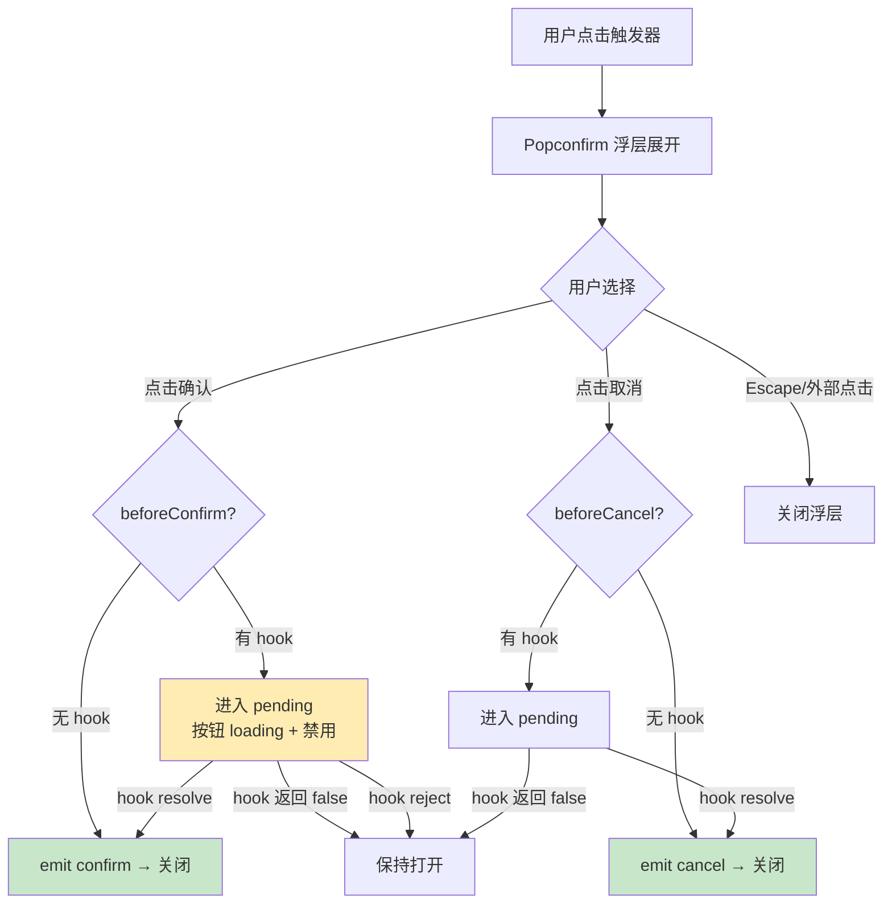
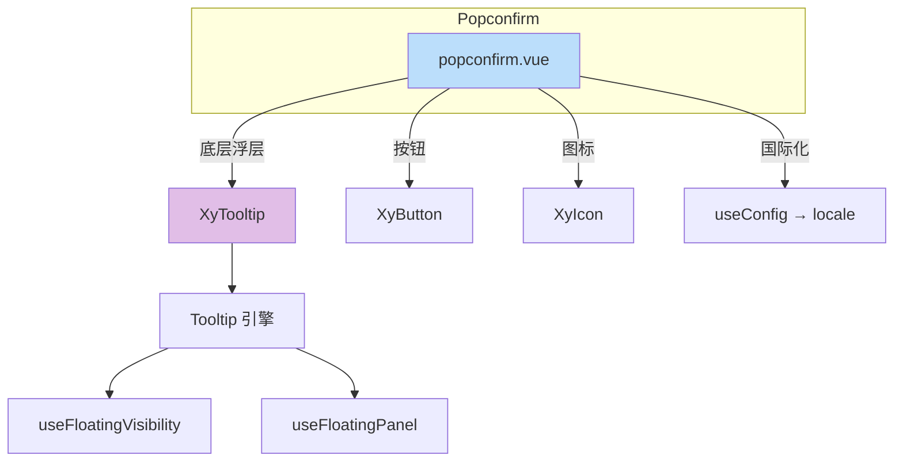
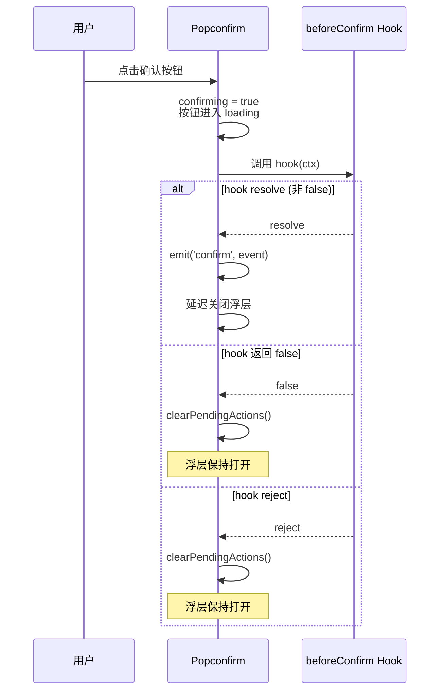

# 63 Popconfirm 确认弹出

> 导读：在 Tooltip 浮层引擎上构建的确认语义组件，内置确认/取消按钮、异步 hook 和 loading 托管，专治"删除前确认"类场景。

## 设计哲学

Popconfirm 解决的核心问题是：将"确认"这个高频交互模式从 Dialog 的重阻断模式降级为轻量的原地确认。用户不需要离开当前上下文，在触发元素附近就能完成确认/取消决策。

- **原地确认**：确认动作在触发元素附近完成，不中断用户的心流
- **异步安全**：beforeConfirm / beforeCancel 支持 Promise，组件自动托管 loading 和禁用状态
- **语义收敛**：只做确认，不做通用弹出——需要通用弹出请用 Popover



**与 Popover / Dialog 的边界**：

| 维度 | Popconfirm | Popover | Dialog |
|------|------------|---------|--------|
| 语义 | 确认/取消 | 通用弹出 | 阻断式交互 |
| 交互模式 | 原地确认 | 原地交互 | 模态阻断 |
| 内容复杂度 | 标题 + 正文 + 按钮 | 任意 | 任意 |
| 默认触发 | click | click | 程序式 |
| 层级 | Popper 层 | Popper 层 | Modal 层 |

## 源码架构

```
popconfirm/
├── src/
│   ├── popconfirm.vue   # 主组件：基于 Tooltip + 确认内容
│   └── popconfirm.ts    # 类型定义：Props / Hook / SlotProps
└── index.ts             # 导出入口 + withInstall
```



### 核心 Type 定义

```ts
type PopconfirmAction = 'confirm' | 'cancel'
type PopconfirmButtonType = ButtonType | 'text'

interface PopconfirmActionContext {
  action: PopconfirmAction
  event: MouseEvent
  close: () => void
  hide: () => void
}

type PopconfirmHook = (
  ctx: PopconfirmActionContext
) => boolean | void | Promise<boolean | void>

interface PopconfirmSlotProps {
  confirm: (event: MouseEvent) => Promise<void>
  cancel: (event: MouseEvent) => Promise<void>
  close: () => void
  confirming: boolean
  cancelling: boolean
}

interface PopconfirmProps {
  modelValue?: boolean
  title?: string
  content?: string
  width?: string | number
  icon?: string
  iconColor?: string
  hideIcon?: boolean
  confirmButtonText?: string
  cancelButtonText?: string
  confirmButtonType?: PopconfirmButtonType
  cancelButtonType?: PopconfirmButtonType
  confirmButtonProps?: Partial<ButtonProps>
  cancelButtonProps?: Partial<ButtonProps>
  beforeConfirm?: PopconfirmHook
  beforeCancel?: PopconfirmHook
  // ... 继承自 Tooltip 的浮层属性
}
```

## 核心实现

### 1. 基于 Tooltip 的浮层引擎

Popconfirm 与 Popover 一样，将 Tooltip 作为底层浮层引擎。但 Popconfirm 的触发方式固定为 click，且内容区完全自定义：

```ts
// popconfirm.vue — Tooltip 接入
<XyTooltip
  ref="tooltipRef"
  :model-value="innerVisible"
  trigger="click"
  :placement="props.placement"
  :disabled="props.disabled"
  :effect="props.effect"
  :popper-class="tooltipPanelClass"
  :popper-style="tooltipPanelStyle"
  :close-on-esc="props.closeOnEsc && !isActionPending"
  :close-on-outside="props.closeOnOutside && !isActionPending"
  @update:model-value="handleTooltipModelValueChange"
>
  <template #default>
    <slot name="reference" />
  </template>
  <template #content>
    <!-- 确认内容区 -->
  </template>
</XyTooltip>
```

**WHY 固定 click 触发**：确认操作需要用户主动发起，hover 触发会导致误触。同时 click 触发让 Popconfirm 的交互语义与 Dialog 保持一致——都是"点击打开 → 确认/取消"。

### 2. 异步 Hook 与 Loading 托管

Popconfirm 最核心的差异化能力是 beforeConfirm / beforeCancel 的异步 hook 机制：

```ts
// popconfirm.vue — 异步 hook 执行
async function runAction(
  action: PopconfirmAction,
  event: MouseEvent,
  hook: PopconfirmProps['beforeConfirm'] | PopconfirmProps['beforeCancel'],
  done: (event: MouseEvent) => void
) {
  if (isActionPending.value) return  // 防重复提交

  if (action === 'confirm') {
    confirming.value = true
  } else {
    cancelling.value = true
  }

  try {
    const result = await hook?.(createActionContext(action, event))
    if (result === false) {         // hook 返回 false → 取消动作
      clearPendingActions()
      return
    }
    done(event)                     // hook resolve → 派发事件
    closePanel(false)               // 延迟关闭（遵循 hideAfter）
  } catch {
    clearPendingActions()           // hook reject → 保持打开
  }
}
```



**WHY 自动托管 loading**：异步确认最常见的 bug 是重复提交。Popconfirm 在 pending 期间自动禁用两个按钮，hook resolve/reject 后自动恢复，业务代码无需手动管理 loading 状态。

### 3. 按钮属性合并策略

确认/取消按钮的属性需要同时满足内部逻辑（loading、disabled）和外部配置（confirmButtonProps）：

```ts
function resolveActionButtonProps(
  buttonType: PopconfirmButtonType,
  externalProps: Partial<ButtonProps> | undefined,
  loading: boolean
): Partial<ButtonProps> {
  const { type: _, text: __, loading: ___, disabled: externalDisabled, ...restProps } = externalProps ?? {}

  const baseProps: Partial<ButtonProps> =
    buttonType === 'text'
      ? { size: 'sm', text: true }
      : { size: 'sm', type: buttonType }

  return {
    ...restProps,
    ...baseProps,
    loading,                                    // 内部 loading 优先
    disabled: Boolean(externalDisabled) || isActionPending.value  // pending 期间禁用
  }
}
```

**WHY 解构排除 type/text/loading**：这三个属性由 Popconfirm 内部控制——confirmButtonType 决定按钮类型，loading 由 hook 执行状态决定。外部 confirmButtonProps 中的同名属性会被忽略，防止业务配置覆盖内部状态管理。

### 4. 国际化文案兜底

确认/取消按钮的文案支持三级回退：显式 prop → ConfigProvider locale → 内置默认值：

```ts
const resolvedConfirmButtonText = computed(
  () => props.confirmButtonText ?? locale.value.popconfirmConfirmButtonText ?? '确定'
)
const resolvedCancelButtonText = computed(
  () => props.cancelButtonText ?? locale.value.popconfirmCancelButtonText ?? '取消'
)
```

**WHY**：企业级应用通常需要中英文切换，将文案抽取到 ConfigProvider 统一管理，避免每个 Popconfirm 实例都硬编码按钮文案。

### 5. pending 期间 Escape/外部点击保护

异步确认期间，Escape 和外部点击不应关闭浮层：

```ts
// popconfirm.vue — pending 保护
const isActionPending = computed(() => confirming.value || cancelling.value)

// 传入 Tooltip 时动态禁用关闭
<XyTooltip
  :close-on-esc="props.closeOnEsc && !isActionPending"
  :close-on-outside="props.closeOnOutside && !isActionPending"
/>
```

**WHY**：异步确认期间用户正在等待结果，此时 Escape 或误点外部导致浮层关闭会让用户丢失操作上下文。pending 保护确保异步流程完整执行。

## API 参考

### Props

| 属性 | 类型 | 默认值 | 说明 |
|------|------|--------|------|
| model-value | `boolean` | `false` | 受控显示状态 |
| title | `string` | `''` | 标题文案 |
| content | `string` | `''` | 正文文案 |
| width | `string \| number` | `150` | 面板宽度（最小 150px） |
| placement | `Placement` | `'bottom'` | 浮层位置 |
| disabled | `boolean` | `false` | 是否禁用 |
| effect | `'dark' \| 'light'` | `'light'` | 主题风格 |
| icon | `string` | `'mdi:help-circle-outline'` | 前置图标 |
| icon-color | `string` | `'var(--xy-color-warning)'` | 图标颜色 |
| hide-icon | `boolean` | `false` | 是否隐藏图标 |
| confirm-button-text | `string` | — | 确认按钮文案（回退到 locale） |
| cancel-button-text | `string` | — | 取消按钮文案（回退到 locale） |
| confirm-button-type | `PopconfirmButtonType` | `'primary'` | 确认按钮类型 |
| cancel-button-type | `PopconfirmButtonType` | `'text'` | 取消按钮类型 |
| confirm-button-props | `Partial<ButtonProps>` | — | 确认按钮透传配置 |
| cancel-button-props | `Partial<ButtonProps>` | — | 取消按钮透传配置 |
| before-confirm | `PopconfirmHook` | — | 确认前置 hook |
| before-cancel | `PopconfirmHook` | — | 取消前置 hook |
| show-arrow | `boolean` | `true` | 是否显示箭头 |
| offset | `number` | `10` | 浮层偏移量 |
| teleported | `boolean` | `true` | 是否传送至 body |
| append-to | `string \| HTMLElement` | `'body'` | 挂载容器 |
| persistent | `boolean` | `false` | 关闭后是否保留 DOM |
| close-on-esc | `boolean` | `true` | Escape 是否关闭 |
| close-on-outside | `boolean` | `true` | 点击外部是否关闭 |
| popper-class | `string` | `''` | 浮层自定义类名 |
| popper-style | `StyleValue` | — | 浮层自定义样式 |
| transition | `string` | `'xy-fade'` | 过渡动画名 |
| virtual-ref | `ReferenceElement \| null` | `null` | 虚拟触发引用 |
| virtual-triggering | `boolean` | `false` | 是否虚拟触发 |

### Emits

| 事件 | 参数 | 说明 |
|------|------|------|
| update:model-value | `(value: boolean)` | 开关状态变化 |
| confirm | `(event: MouseEvent)` | 确认动作完成 |
| cancel | `(event: MouseEvent)` | 取消动作完成 |
| before-show | — | 面板即将打开 |
| show | — | 面板完成进入 |
| before-hide | — | 面板即将关闭 |
| hide | — | 面板完成离开 |
| open | — | 浮层逻辑打开 |
| close | — | 浮层逻辑关闭 |

### Slots

| 插槽 | 作用域 | 说明 |
|------|--------|------|
| reference | — | 触发区域 |
| default | `PopconfirmSlotProps` | 正文区 |
| actions | `PopconfirmSlotProps` | 自定义操作区 |

### Exposes

| 名称 | 类型 | 说明 |
|------|------|------|
| hide | `() => void` | 立即关闭确认框 |
| popperRef | `Ref<HTMLElement \| null>` | 面板根节点引用 |

## 样式系统

### BEM 类名

| 类名 | 说明 |
|------|------|
| `.xy-popconfirm` | 面板根容器 |
| `.xy-popconfirm.is-confirming` | 确认中状态 |
| `.xy-popconfirm.is-cancelling` | 取消中状态 |
| `.xy-popconfirm__trigger` | 触发器包裹 |
| `.xy-popconfirm__panel` | 浮层面板 |
| `.xy-popconfirm__panel--dark` | 深色主题 |
| `.xy-popconfirm__header` | 标题区 |
| `.xy-popconfirm__icon` | 前置图标 |
| `.xy-popconfirm__title` | 标题文本 |
| `.xy-popconfirm__body` | 正文区 |
| `.xy-popconfirm__actions` | 操作按钮区 |

### CSS 变量

```css
/* Popconfirm 专属令牌 */
--xy-popconfirm-bg-resolved: var(--xy-popconfirm-bg, var(--xy-popper-bg, ...))
--xy-popconfirm-border-resolved: var(--xy-popconfirm-border, var(--xy-popper-border-color, ...))
--xy-popconfirm-title-resolved: var(--xy-popconfirm-title, var(--xy-popper-title-color, ...))
--xy-popconfirm-text-resolved: var(--xy-popconfirm-text, var(--xy-popper-text-color, ...))
--xy-popconfirm-shadow-resolved: var(--xy-popconfirm-shadow, var(--xy-popper-shadow, ...))
--xy-popconfirm-actions-border: color-mix(in srgb, var(--xy-popconfirm-border-resolved) 82%, transparent)

/* Dark 主题覆盖 */
.xy-popconfirm__panel--dark {
  --xy-popconfirm-bg: color-mix(in srgb, var(--xy-bg-color-floating) 78%, var(--xy-text-color-heading));
  --xy-popconfirm-border: color-mix(in srgb, var(--xy-bg-color-floating) 12%, transparent);
  --xy-popconfirm-title: color-mix(in srgb, var(--xy-bg-color-floating) 88%, var(--xy-mix-light));
  --xy-popconfirm-text: color-mix(in srgb, var(--xy-bg-color-floating) 80%, var(--xy-mix-light));
}

/* Pending 状态 */
.xy-popconfirm.is-confirming .xy-popconfirm__body,
.xy-popconfirm.is-cancelling .xy-popconfirm__body {
  opacity: 0.88;
}
```

### 主题定制

```css
/* 全局覆盖 */
:root {
  --xy-popconfirm-bg: #ffffff;
}

/* 实例级覆盖 — 通过 popperClass */
.my-confirm.xy-popconfirm__panel {
  --xy-popconfirm-bg: #fef3f2;
  --xy-popconfirm-actions-border: var(--xy-color-danger-light-5);
}
```

## 小结

1. **异步 Hook 托管**：beforeConfirm / beforeCancel 支持 Promise，组件自动管理按钮 loading、禁用和浮层关闭时序，消除重复提交风险
2. **Pending 保护机制**：异步确认期间禁用 Escape/外部点击关闭，确保操作流程完整执行
3. **按钮属性合并策略**：内部状态（loading、disabled、type）优先于外部 confirmButtonProps，防止业务配置覆盖内部状态管理