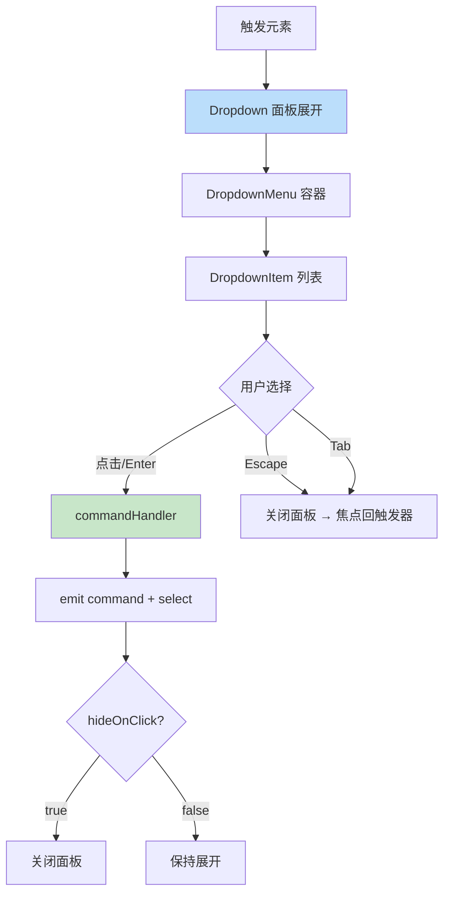
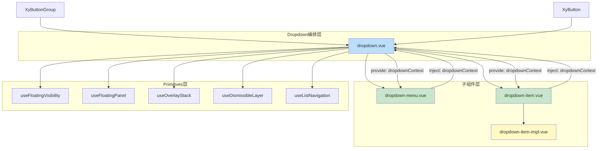
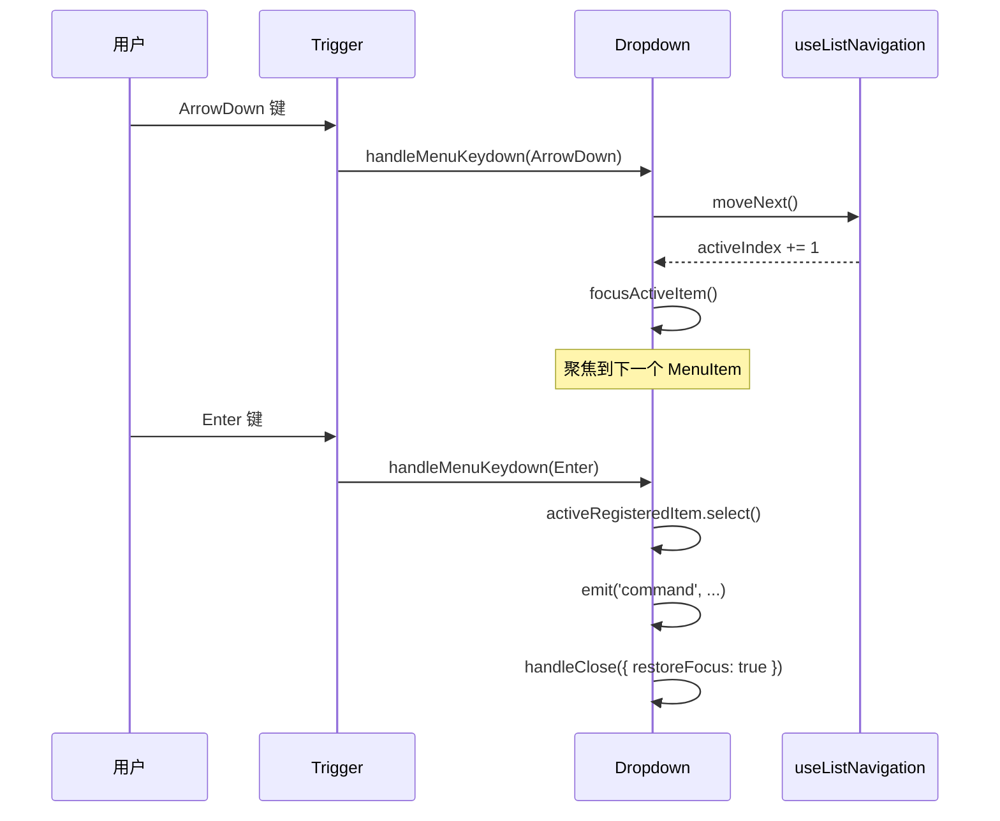

# 64 Dropdown 下拉菜单

> 导读：基于 Floating UI 的操作菜单组件，内置键盘导航（Roving Tabindex）、命令派发和 Split Button 模式，是"操作菜单"而非"值选择器"。

## 设计哲学

Dropdown 解决的核心问题是：在触发元素附近展示一组操作选项，用户选择后执行对应命令。它的设计定位是"操作菜单"而非"值选择器"——产出的是命令（command），不是值（value）。

- **命令语义**：Dropdown 每个选项都映射到一个 command，选择即执行动作
- **键盘导航**：通过 Roving Tabindex 实现完整的 Arrow/Home/End/Enter 键盘路径
- **复合组件结构**：Dropdown + DropdownMenu + DropdownItem 三层组合，同时兼容 items 数组的简单模式



**与 Select / Popconfirm 的边界**：

| 维度 | Dropdown | Select | Popconfirm |
|------|----------|--------|------------|
| 语义 | 命令派发 | 值选择 | 确认/取消 |
| 产出 | command | modelValue | confirm/cancel |
| 内容结构 | MenuItem 列表 | Option 列表 | 标题+按钮 |
| 键盘路径 | Roving Tabindex | Type-ahead 搜索 | 无 |
| 复用 | 操作菜单场景 | 表单字段 | 删除确认 |

## 源码架构

```
dropdown/
├── src/
│   ├── dropdown.vue         # 主组件：编排触发器 + 浮层 + 键盘导航
│   ├── dropdown.ts          # 类型定义：Props / Item / Command
│   ├── dropdown-menu.vue    # 菜单容器：ul + role + aria
│   ├── dropdown-menu.ts     # 菜单容器类型
│   ├── dropdown-item.vue    # 菜单项外壳：注册/选择/命令派发
│   ├── dropdown-item.ts     # 菜单项类型
│   ├── dropdown-item-impl.vue # 菜单项渲染：button + icon + label
│   ├── tokens.ts            # Provide/Inject 上下文
│   └── use-dropdown.ts      # Inject 辅助函数
└── index.ts                 # 导出入口 + 子组件挂载
```



### 核心 Type 定义

```ts
type DropdownRole = 'menu' | 'navigation'
type DropdownTrigger = 'hover' | 'click' | 'contextmenu'
type DropdownCommand = string | number | Record<string, unknown>

interface DropdownItem {
  key: string
  label: string
  disabled?: boolean
  danger?: boolean
  description?: string
  command?: DropdownCommand
  divided?: boolean
  icon?: string
}

interface DropdownContext {
  role: ComputedRef<DropdownRole>
  itemRole: ComputedRef<'menuitem' | 'link'>
  hideOnClick: ComputedRef<boolean>
  isUsingKeyboard: Ref<boolean>
  loop: ComputedRef<boolean>
  menuRef: Ref<HTMLElement | null>
  registerItem: (item: DropdownRegisteredItem) => void
  unregisterItem: (uid: number) => void
  commandHandler: (command, item) => void
  handleClose: (options?) => void
  // ... 更多方法
}
```

## 核心实现

### 1. 复合组件 Provide/Inject 通信

Dropdown 采用 Provide/Inject 模式在父子组件间共享上下文。dropdown.vue 通过 `dropdownContextKey` 注入上下文，dropdown-item.vue 通过 `useDropdown()` 读取：

```ts
// dropdown.vue — Provide 上下文
provide(dropdownContextKey, {
  role: computed(() => props.role as DropdownRole),
  itemRole,
  hideOnClick,
  isUsingKeyboard,
  loop: computed(() => props.loop),
  menuRef,
  registerItem,
  unregisterItem,
  getItemIndex,
  getItemTabIndex,
  isItemActive,
  setActiveByUid,
  focusActiveItem,
  handleMenuKeydown,
  handleItemPointerMove,
  handleItemPointerLeave,
  commandHandler,
  handleClose
})

// dropdown-item.vue — Inject 上下文
const dropdown = useDropdown()  // inject(dropdownContextKey, null)
```

**WHY Provide/Inject 而非 Props 逐级传递**：DropdownMenu 和 DropdownItem 不是直接子组件——中间可能存在 DropdownMenu 的 slot 内容。Props 逐级传递需要 DropdownMenu 作为中继转发所有属性，增加不必要的复杂度。Provide/Inject 让所有后代组件直接访问上下文。

### 2. Roving Tabindex 键盘导航

Dropdown 实现了完整的 Roving Tabindex 模式——当前活跃项 tabindex 为 0，其余项为 -1，通过 Arrow 键移动活跃焦点：

```ts
// dropdown.vue — 键盘导航接入
const navigation = useListNavigation(() => navigationItems.value, {
  loop: props.loop
})

function handleMenuKeydown(event: KeyboardEvent) {
  switch (event.key) {
    case 'ArrowDown':
      event.preventDefault()
      if (!visible.value) {
        openMenu({ focusMenu: true, keyboard: true })
      } else {
        navigation.moveNext()
        focusActiveItem()
      }
      break
    case 'ArrowUp':
      navigation.movePrev()
      focusActiveItem()
      break
    case 'Home':
      navigation.activateFirst()
      focusActiveItem()
      break
    case 'End':
      navigation.activateLast()
      focusActiveItem()
      break
    case 'Enter':
      if (isLegacyMode.value) {
        handleLegacySelect(props.items[navigation.activeIndex.value])
      } else {
        activeRegisteredItem.value?.select(event)
      }
      break
    case 'Escape':
      handleClose({ restoreFocus: true })
      break
  }
}
```



**WHY Roving Tabindex 而非 tabindex=0 全部可达**：当菜单项全部 tabindex=0 时，Tab 键会逐项遍历，在长菜单中极其低效。Roving Tabindex 只让当前活跃项可达，Arrow 键在菜单内移动焦点，Tab 键直接跳出菜单。

### 3. 菜单项注册机制

DropdownItem 在 onMounted 时将自己注册到 Dropdown 的 registeredItems 数组中，unmount 时注销：

```ts
// dropdown-item.vue — 注册机制
onMounted(() => {
  dropdown?.registerItem({
    uid,
    isDisabled: () => props.disabled,
    getTextValue: () => buildPayload().textValue,
    getEl: () => itemRef.value?.itemRef ?? null,
    select: handleSelect
  })
})

onBeforeUnmount(() => {
  dropdown?.unregisterItem(uid)
})
```

**WHY 动态注册**：菜单项可能通过 v-if/v-for 动态变化，注册机制让 Dropdown 在任何时候都能获取当前有效的菜单项列表。useListNavigation 根据这个列表计算 activeIndex 和 roving tabindex。

### 4. Split Button 模式

Dropdown 支持 Split Button 模式——左侧主按钮执行主操作，右侧 caret 按钮打开菜单：

```ts
// dropdown.vue — Split Button 的 referenceRef 计算
const referenceRef = computed<ReferenceElement | null>(() => {
  if (props.virtualTriggering && props.virtualRef) return props.virtualRef
  if (internalVirtualRef.value) return internalVirtualRef.value
  if (props.splitButton) return caretButtonRef.value  // caret 按钮作为定位参考
  return triggerRef.value
})
```

**WHY referenceRef 动态选择**：Split Button 模式下菜单应定位在 caret 按钮下方，而不是整个按钮组。contextmenu 模式下菜单应定位在鼠标点击位置（internalVirtualRef），而非触发元素。动态计算 referenceRef 让每种模式都有正确的定位参考。

### 5. Items 兼容模式与 Slot 模式双路径

Dropdown 支持两种使用路径——items 数组（简单）和 DropdownMenu + DropdownItem 组合（灵活）：

```ts
// dropdown.vue — 双路径判断
const isLegacyMode = computed(() => !slots.dropdown && props.items.length > 0)
const hasMenuContent = computed(() => isLegacyMode.value || Boolean(slots.dropdown))

// 模板中的分支渲染
<template v-if="slots.dropdown">
  <slot name="dropdown" />
</template>
<template v-else>
  <XyDropdownMenu>
    <XyDropdownItemImpl
      v-for="(item, index) in props.items"
      :active="navigation.activeIndex.value === index"
      @click="handleLegacySelect(item)"
    />
  </XyDropdownMenu>
</template>
```

**WHY 双路径共存**：items 数组模式适合简单场景（几个扁平操作项），复合组件模式适合需要 icon/description/divided/自定义插槽的复杂场景。双路径共用 command 派发机制，业务可以渐进迁移而不破坏现有代码。

## API 参考

### Props

| 属性 | 类型 | 默认值 | 说明 |
|------|------|--------|------|
| model-value | `boolean` | `false` | 受控显示状态 |
| items | `DropdownItem[]` | `[]` | 兼容模式菜单项列表 |
| placement | `Placement` | `'bottom-start'` | 菜单位置 |
| disabled | `boolean` | `false` | 是否禁用 |
| hide-on-click | `boolean` | — | 选择后是否关闭（优先级高于 close-on-select） |
| close-on-select | `boolean` | `true` | hide-on-click 的兼容别名 |
| role | `DropdownRole` | `'menu'` | 菜单语义角色 |
| trigger | `DropdownTrigger \| DropdownTrigger[]` | `'hover'` | 触发方式 |
| trigger-keys | `string[]` | `['Enter',' ','ArrowDown']` | 触发区键盘打开键 |
| open-delay | `number` | `80` | hover 打开延迟(ms) |
| close-delay | `number` | `120` | hover 关闭延迟(ms) |
| show-after | `number` | — | 打开延迟别名 |
| hide-after | `number` | — | 关闭延迟别名 |
| max-height | `string \| number` | `''` | 菜单最大高度 |
| teleported | `boolean` | `true` | 是否传送至 body |
| append-to | `string \| HTMLElement` | `'body'` | 挂载容器 |
| persistent | `boolean` | `false` | 关闭后是否保留 DOM |
| popper-class | `string` | `''` | 面板自定义类名 |
| popper-style | `StyleValue` | — | 面板自定义样式 |
| show-arrow | `boolean` | `true` | 是否显示箭头 |
| split-button | `boolean` | `false` | 是否使用分裂按钮模式 |
| button-props | `Partial<ButtonProps>` | — | Split Button 按钮透传配置 |
| tabindex | `string \| number` | `0` | 触发区 tabindex |
| loop | `boolean` | `true` | 键盘导航是否循环 |
| popper-options | `DropdownPopperOptions` | `{}` | 定位配置子集 |
| virtual-ref | `ReferenceElement \| null` | `null` | 虚拟触发引用 |
| virtual-triggering | `boolean` | `false` | 是否虚拟触发 |

### Emits

| 事件 | 参数 | 说明 |
|------|------|------|
| update:model-value | `(value: boolean)` | 开关状态变化 |
| select | `(item: DropdownSelectItem)` | 选择菜单项 |
| command | `(command, item)` | 命令派发 |
| visible-change | `(value: boolean)` | 菜单开关状态变化 |
| click | `(event: MouseEvent)` | Split Button 主按钮点击 |

### Slots

| 插槽 | 说明 |
|------|------|
| default | 触发区域或 Split Button 主按钮内容 |
| dropdown | 菜单内容（推荐使用 DropdownMenu + DropdownItem） |

### DropdownItem Props

| 属性 | 类型 | 默认值 | 说明 |
|------|------|--------|------|
| command | `DropdownCommand` | — | 命令值 |
| disabled | `boolean` | `false` | 是否禁用 |
| divided | `boolean` | `false` | 是否显示分割线 |
| icon | `string` | `''` | 前置图标 |
| danger | `boolean` | `false` | 是否危险操作样式 |
| description | `string` | `''` | 次级描述 |

### DropdownItem Slots

| 插槽 | 说明 |
|------|------|
| default | 主内容 |
| icon | 自定义图标 |
| description | 自定义描述 |

## 样式系统

### BEM 类名

| 类名 | 说明 |
|------|------|
| `.xy-dropdown` | 根容器 |
| `.xy-dropdown.is-disabled` | 禁用状态 |
| `.xy-dropdown.is-split-button` | Split Button 模式 |
| `.xy-dropdown__trigger` | 触发器 |
| `.xy-dropdown__panel` | 菜单面板浮层 |
| `.xy-dropdown__menu` | ul 菜单容器 |
| `.xy-dropdown__item-wrapper` | li 项外壳 |
| `.xy-dropdown__item-wrapper.is-divided` | 分割线项 |
| `.xy-dropdown__item` | button 菜单项 |
| `.xy-dropdown__item.is-active` | 键盘活跃项 |
| `.xy-dropdown__item.is-disabled` | 禁用项 |
| `.xy-dropdown__item.is-danger` | 危险操作项 |
| `.xy-dropdown__item-icon` | 图标区 |
| `.xy-dropdown__item-content` | 内容区 |
| `.xy-dropdown__item-label` | 标签 |
| `.xy-dropdown__item-description` | 描述 |
| `.xy-dropdown__split` | Split Button 按钮组 |
| `.xy-dropdown__split-main` | 主按钮 |
| `.xy-dropdown__caret-button` | caret 按钮 |

### CSS 变量

```css
/* Dropdown 面板令牌 */
--xy-dropdown-panel-bg-resolved: var(--xy-dropdown-panel-bg, var(--xy-popper-bg, ...))
--xy-dropdown-panel-border-resolved: var(--xy-dropdown-panel-border, var(--xy-popper-border-color, ...))
--xy-dropdown-panel-shadow-resolved: var(--xy-dropdown-panel-shadow, var(--xy-popper-shadow, ...))

/* 菜单项 hover 活跃 */
.xy-dropdown__item.is-active,
.xy-dropdown__item:hover {
  background: color-mix(in srgb, var(--xy-bg-color-subtle) 82%, var(--xy-dropdown-panel-bg-resolved));
}

/* Focus-visible */
.xy-dropdown__item:focus-visible {
  outline: 2px solid color-mix(in srgb, var(--xy-color-primary) 58%, var(--xy-mix-light));
}

/* Danger 项 */
.xy-dropdown__item.is-danger {
  color: var(--xy-color-danger);
}

/* Split Button 圆角衔接 */
.xy-dropdown__split-main {
  border-top-right-radius: 0;
  border-bottom-right-radius: 0;
}
.xy-dropdown__caret-button {
  border-top-left-radius: 0;
  border-bottom-left-radius: 0;
}
```

### 主题定制

```css
/* 实例级覆盖 — 通过 popperClass */
.my-dropdown.xy-dropdown__panel {
  --xy-dropdown-panel-bg: #f8f9fa;
  min-width: 240px;
}
```

## 小结

1. **Provide/Inject 通信模式**：DropdownMenu 和 DropdownItem 通过 Inject 直接访问上下文，避免 Props 逐级传递的中间层耦合
2. **Roving Tabindex 键盘导航**：useListNavigation 实现完整的 Arrow/Home/End/Enter/Escape 键盘路径，Tab 键直接跳出菜单，不逐项遍历
3. **双路径兼容**：items 数组模式和 DropdownMenu + DropdownItem 复合模式共存，共用 command 昒发机制，支持业务渐进迁移