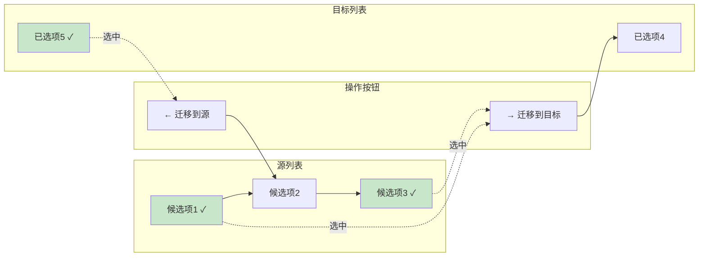
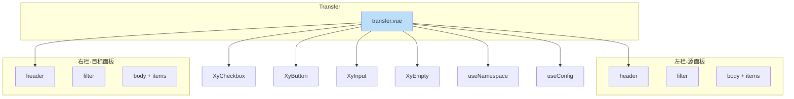
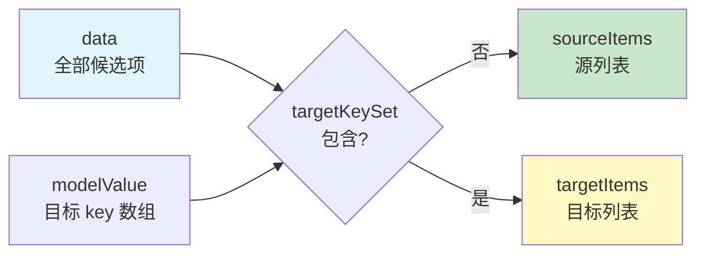

# 65 Transfer 穿梭框

> 导读：双栏列表式数据迁移组件，通过 Checkbox 选中 + 按钮迁移完成成员、权限等双栏分配场景，是表单领域最经典的选择形态之一。

## 设计哲学

Transfer 解决的核心问题是：在一组候选项中，将部分项迁移到目标列表。它的交互模型是"选中 → 迁移"，天然适合权限分配、成员管理这类双向映射场景。

- **选中-迁移模型**：先勾选候选项，再点击方向按钮完成迁移，操作路径明确
- **纯数据驱动**：通过 modelValue（目标 key 数组）和 data（全部候选项）两个 props 描述完整状态
- **对称布局**：左右两栏结构完全对称，共享相同的搜索/禁用/空态逻辑



**与 Select / TreeSelect 的边界**：

| 维度 | Transfer | Select / TreeSelect |
|------|----------|---------------------|
| 布局 | 双栏并列 | 单栏下拉 |
| 可见性 | 候选与目标始终可见 | 目标可见，候选需展开 |
| 操作模型 | 选中 → 迁移 | 搜索 → 点击 |
| 适用规模 | 10-100 项 | 5-50 项 |
| 场景 | 权限分配、成员管理 | 简单枚举选择 |

## 源码架构

```
transfer/
├── src/
│   ├── transfer.vue      # 主组件：双栏布局 + 选中/迁移逻辑
│   └── transfer.ts        # 类型定义：Item / Key / Props
└── index.ts               # 导出入口 + withInstall
```



### 核心 Type 定义

```ts
type TransferKey = string | number

interface TransferItem {
  key: TransferKey
  label: string
  disabled?: boolean
  description?: string
}

interface TransferProps {
  modelValue?: TransferKey[]
  data?: TransferItem[]
  titles?: [string, string]
  disabled?: boolean
  filterable?: boolean
  filterPlaceholder?: string
  size?: ComponentSize
}
```

## 核心实现

### 1. 双向分离计算

Transfer 的核心数据结构是 `modelValue`（目标 key 集合）和 `data`（全部候选项）。通过 computed 将 data 拆分为源列表和目标列表：

```ts
// transfer.vue — 核心数据拆分
const targetKeySet = computed(() => new Set(props.modelValue))

const sourceItems = computed(() =>
  props.data.filter((item) => !targetKeySet.value.has(item.key))
)

const targetItems = computed(() =>
  props.data.filter((item) => targetKeySet.value.has(item.key))
)
```



**WHY 使用 Set**：每次过滤都需要对 data 中的每一项检查 key 是否在 modelValue 中。数组 `includes` 是 O(n) 查找，data 有 100 项、modelValue 有 50 项时就是 O(100*50)。使用 Set 后查找降为 O(1)，总复杂度 O(100)。

### 2. 选中状态管理

Transfer 为左右两栏分别维护选中列表，Checkbox 的勾选状态由这两个列表驱动：

```ts
// transfer.vue — 选中状态管理
const leftChecked = ref<TransferKey[]>([])
const rightChecked = ref<TransferKey[]>([])

function isChecked(side: 'left' | 'right', key: TransferKey) {
  return (side === 'left' ? leftChecked : rightChecked).value.includes(key)
}

function toggleChecked(side: 'left' | 'right', key: TransferKey, checked: boolean) {
  const target = side === 'left' ? leftChecked : rightChecked
  if (checked) {
    if (!target.value.includes(key)) target.value = target.value.concat(key)
  } else {
    target.value = target.value.filter((item) => item !== key)
  }
}
```

**WHY 两栏分离而非统一数组**：迁移操作需要知道"哪些源项被选中"和"哪些目标项被选中"，这是两个独立的集合。统一数组需要额外标记每项属于哪一栏，增加过滤开销。

### 3. 迁移逻辑与禁用过滤

迁移按钮的 enabled 状态只看"有效选中"——排除掉 disabled 的项：

```ts
// transfer.vue — 迁移可用性计算
const enabledLeftChecked = computed(() =>
  leftChecked.value.filter((key) =>
    sourceItems.value.some((item) => item.key === key && !item.disabled)
  )
)

function moveToRight() {
  if (props.disabled || !enabledLeftChecked.value.length) return

  const nextValue = Array.from(new Set([...props.modelValue, ...enabledLeftChecked.value]))
  emit('update:modelValue', nextValue)
  emit('change', nextValue)
  leftChecked.value = []
}

function moveToLeft() {
  if (props.disabled || !enabledRightChecked.value.length) return

  const removedKeys = new Set(enabledRightChecked.value)
  const nextValue = props.modelValue.filter((key) => !removedKeys.has(key))
  emit('update:modelValue', nextValue)
  emit('change', nextValue)
  rightChecked.value = []
}
```

**WHY 迁移后清空选中**：迁移完成后，已迁走的项不再出现在当前栏，选中它们没有意义。清空选中避免用户误以为"迁移了但还选中着"。

### 4. 本地搜索过滤

Transfer 的搜索是基于 label + description 的本地模糊匹配：

```ts
function filterItems(items: TransferItem[], keyword: string) {
  const normalized = keyword.trim().toLowerCase()
  if (!normalized) return items

  return items.filter((item) =>
    `${item.label} ${item.description ?? ''}`.toLowerCase().includes(normalized)
  )
}

const visibleSourceItems = computed(() =>
  filterItems(sourceItems.value, sourceKeyword.value)
)
const visibleTargetItems = computed(() =>
  filterItems(targetItems.value, targetKeyword.value)
)
```

**WHY 本地过滤而非远程搜索**：Transfer 的数据量通常在 10-100 项之间，本地过滤即时响应。如果数据量超过 500 项，应该改用 Select + 远程搜索方案。

### 5. modelValue 变化时的选中状态清理

当外部修改 modelValue 后，已迁走的项可能还留在选中列表中，需要清理：

```ts
watch(
  () => props.modelValue,
  () => {
    leftChecked.value = leftChecked.value.filter((key) =>
      sourceItems.value.some((item) => item.key === key)
    )
    rightChecked.value = rightChecked.value.filter((key) =>
      targetItems.value.some((item) => item.key === key)
    )
  }
)
```

**WHY**：外部可能通过 v-model 修改目标列表（如"全选"按钮批量设置），此时选中列表中可能包含已不存在的 key，不清理会导致按钮状态和实际行为不一致。

## API 参考

### Props

| 属性 | 类型 | 默认值 | 说明 |
|------|------|--------|------|
| model-value | `TransferKey[]` | `[]` | 目标列表的 key 数组 |
| data | `TransferItem[]` | `[]` | 全部候选项数据 |
| titles | `[string, string]` | `['源列表', '目标列表']` | 左右面板标题 |
| disabled | `boolean` | `false` | 是否全局禁用 |
| filterable | `boolean` | `false` | 是否可搜索 |
| filter-placeholder | `string` | `'搜索条目'` | 搜索框占位文本 |
| size | `ComponentSize` | — | 尺寸（继承 ConfigProvider） |

### Emits

| 事件 | 参数 | 说明 |
|------|------|------|
| update:model-value | `(value: TransferKey[])` | 目标列表变化 |
| change | `(value: TransferKey[])` | 迁移操作完成后触发 |

### Slots

| 插槽 | 作用域 | 说明 |
|------|--------|------|
| default | `{ item, checked, side }` | 自定义渲染每一项 |

## 样式系统

### BEM 类名

| 类名 | 说明 |
|------|------|
| `.xy-transfer` | 根容器（CSS Grid 三列布局） |
| `.xy-transfer--sm / --md / --lg` | 尺寸修饰 |
| `.xy-transfer.is-disabled` | 全局禁用 |
| `.xy-transfer__panel` | 左右面板容器 |
| `.xy-transfer__panel-header` | 面板头部 |
| `.xy-transfer__panel-filter` | 搜索区域 |
| `.xy-transfer__panel-body` | 列表滚动区 |
| `.xy-transfer__item` | 单项容器 |
| `.xy-transfer__item.is-disabled` | 禁用项 |
| `.xy-transfer__item-content` | 项内容区 |
| `.xy-transfer__item-label` | 项标签 |
| `.xy-transfer__item-description` | 项描述 |
| `.xy-transfer__actions` | 迁移按钮区 |

### CSS 变量

```css
/* 布局 */
.xy-transfer {
  display: grid;
  grid-template-columns: minmax(0, 1fr) auto minmax(0, 1fr);
  gap: 16px;
  align-items: stretch;
}

/* 面板 */
.xy-transfer__panel {
  min-height: 280px;
  border: 1px solid var(--xy-border-color-subtle);
  border-radius: var(--xy-radius-lg);
  background: var(--xy-surface-raised);
  box-shadow: var(--xy-shadow-xs);
}

/* 项 */
.xy-transfer__item.is-disabled {
  color: var(--xy-text-color-muted);
}

.xy-transfer__item-description {
  color: var(--xy-text-color-subtle);
}

/* 操作按钮 */
.xy-transfer__actions {
  display: flex;
  flex-direction: column;
  justify-content: center;
  gap: 8px;
}
```

### 主题定制

```css
/* 全局覆盖 */
:root {
  --xy-transfer-panel-min-height: 320px;
}

/* 实例级覆盖 — 通过 class */
.my-transfer.xy-transfer {
  gap: 24px;
}
```

## 小结

1. **双向分离计算**：用 Set 加速 modelValue 查找，computed 驱动源/目标列表拆分，保证 O(n) 而非 O(n*m) 的过滤性能
2. **迁移安全**：enabledLeftChecked 排除 disabled 项，迁移后清空选中状态，modelValue 变化时清理无效 key
3. **对称布局架构**：左右面板共享完全相同的 DOM 结构和逻辑，通过参数化区分栏位，减少代码对称性冗余