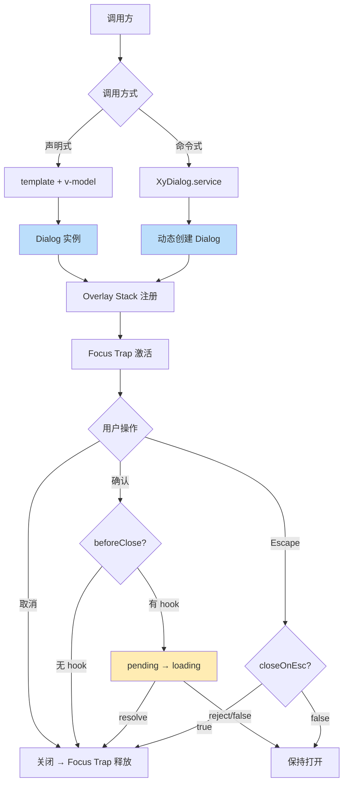
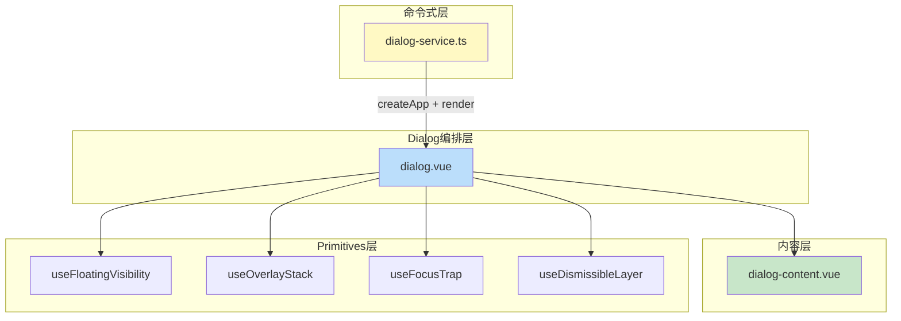
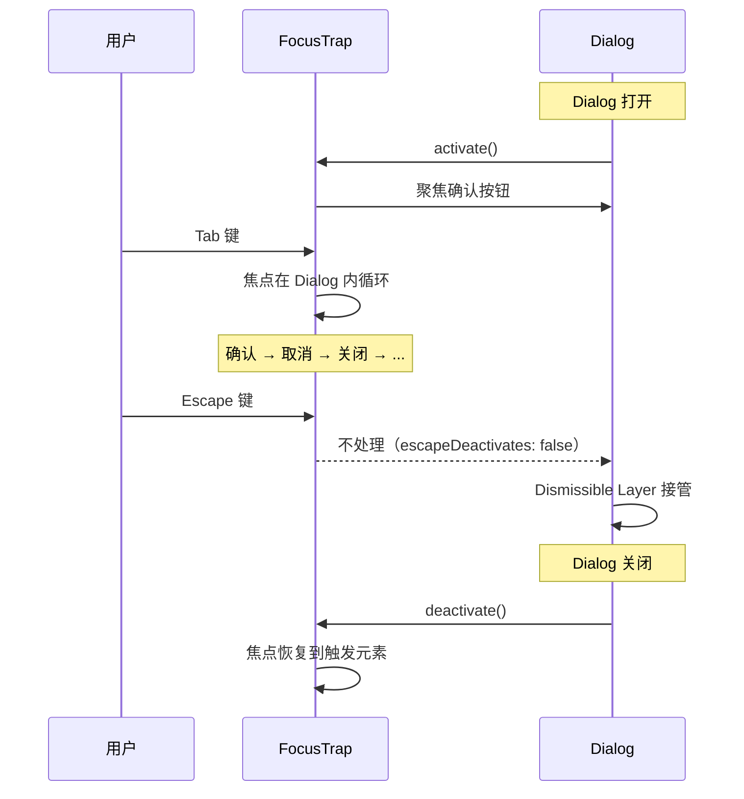

# 66 Dialog 对话框

> 导读：模态层浮层组件，支持声明式和命令式双路径调用，内置 Overlay Stack 层级管理、Focus Trap 焦点锁定和异步关闭钩子。

## 设计哲学

Dialog 解决的核心问题是：在需要用户明确响应的场景下，以模态方式中断当前流程，强制用户做出决策后才能继续。

- **模态阻断**：Dialog 打开后用户无法操作底层内容，必须先处理对话框
- **双路径调用**：声明式（template）适合复杂表单，命令式（service）适合全局提示和确认
- **异步安全**：beforeClose 支持 Promise，loading 状态自动托管



**与 Drawer / Popconfirm 的边界**：

| 维度 | Dialog | Drawer | Popconfirm |
|------|--------|--------|------------|
| 阻断性 | 模态 | 可配置 | 非模态 |
| 布局 | 居中浮层 | 侧边滑入 | 触发元素附近 |
| 交互模式 | 确认/填写表单 | 详情/筛选 | 原地确认 |
| 调用方式 | 声明式+命令式 | 声明式 | 声明式 |
| Focus Trap | 有 | 有 | 无 |

## 源码架构

```
dialog/
├── src/
│   ├── dialog.vue          # 主组件：Overlay + 过渡 + Focus Trap
│   ├── dialog.ts           # 类型定义：Props / Emits / SlotProps
│   ├── dialog-content.vue  # 内容壳：头部+主体+底部+关闭按钮
│   ├── dialog-content.ts   # 内容壳类型
│   └── dialog-service.ts   # 命令式调用：createDialogService
└── index.ts                # 导出入口 + withInstall
```



### 核心 Type 定义

```ts
type DialogBeforeCloseFn = (
  action: 'confirm' | 'cancel' | 'close'
) => boolean | void | Promise<boolean | void>

interface DialogSlotProps {
  visible: boolean
  close: () => void
  confirm: () => void
  cancel: () => void
  isConfirming: boolean
  isCancelling: boolean
}

interface DialogProps {
  modelValue?: boolean
  title?: string
  width?: string | number
  fullscreen?: boolean
  top?: string
  modal?: boolean
  appendToBody?: boolean
  lockScroll?: boolean
  closeOnEsc?: boolean
  closeOnOverlay?: boolean
  showClose?: boolean
  center?: boolean
  alignCenter?: boolean
  destroyOnClose?: boolean
  beforeClose?: DialogBeforeCloseFn
  confirmButtonText?: string
  cancelButtonText?: string
  confirmButtonType?: ButtonType
  cancelButtonType?: ButtonType
  // ... 更多属性
}

interface DialogServiceOptions extends Partial<DialogProps> {
  beforeConfirm?: DialogBeforeCloseFn
  beforeCancel?: DialogBeforeCloseFn
}
```

## 核心实现

### 1. Overlay Stack 层级管理

Dialog 通过 useOverlayStack 注册到全局栈中，确保多个 Dialog 按 open 顺序叠加 z-index，最顶层 Dialog 优先响应 Escape：

```ts
// dialog.vue — Overlay Stack 接入
const { zIndex, isTopMost, openLayer, closeLayer } = useOverlayStack()

watch(visible, (val) => {
  if (val) {
    openLayer()
  } else {
    closeLayer()
  }
})

// Escape 只在最顶层 Dialog 生效
useDismissibleLayer({
  enabled: () => visible.value && props.closeOnEsc,
  onEscape: () => {
    if (isTopMost()) handleClose('close')
  }
})
```

**WHY 全局栈而非独立 z-index**：多个 Dialog 嵌套时，独立 z-index 无法保证层级正确（后开的可能被先开的遮挡）。全局栈按 open 顺序递增 z-index，后开的永远在前开的上方。

### 2. Focus Trap 焦点锁定

Dialog 打开后激活 Focus Trap，将焦点限制在 Dialog 内部循环：

```ts
// dialog.vue — Focus Trap 接入
const { activate, deactivate } = useFocusTrap(dialogRef, {
  initialFocus: () => {
    // 优先聚焦确认按钮（符合用户预期）
    const confirmBtn = dialogRef.value?.querySelector('[data-dialog-confirm]')
    return confirmBtn ?? dialogRef.value
  },
  fallbackFocus: () => dialogRef.value,
  escapeDeactivates: false  // Escape 由 Dismissible Layer 管理
})

watch(visible, (val) => {
  if (val) {
    nextTick(() => activate())
  } else {
    deactivate()
  }
})
```



**WHY escapeDeactivates: false**：Focus Trap 默认在 Escape 时解除锁定，但我们希望 Escape 的语义是"关闭 Dialog"而非"解除焦点锁定"。将 Escape 交给 Dismissible Layer 处理，确保关闭前可以执行 beforeClose hook。

### 3. 异步关闭钩子

Dialog 的 beforeClose 支持三种关闭动作：confirm / cancel / close（关闭按钮/Escape/Overlay点击），每种都可以返回 Promise：

```ts
// dialog.vue — 异步关闭流程
async function handleClose(action: 'confirm' | 'cancel' | 'close') {
  // 执行对应的 hook
  const hook =
    action === 'confirm' ? props.beforeConfirm ?? props.beforeClose :
    action === 'cancel'  ? props.beforeCancel  ?? props.beforeClose :
                           props.beforeClose

  if (hook) {
    setPending(action, true)
    try {
      const result = await hook(action)
      if (result === false) {
        setPending(action, false)
        return  // 取消关闭
      }
    } catch {
      setPending(action, false)
      return  // 异常也取消关闭
    }
  }

  // 确认关闭
  setPending(action, false)
  emit('update:modelValue', false)
  emit(action, action)
}
```

**WHY 三种 action 区分**：confirm 和 cancel 是用户主动选择，close 是被动关闭。业务经常需要在确认时做校验（reject 关闭）、取消时做清理（放行关闭），区分 action 让 beforeClose 可以精确拦截。

### 4. 命令式调用 Service

dialog-service.ts 提供了命令式调用路径，通过 createApp + render 动态创建 Dialog 实例：

```ts
// dialog-service.ts 核心
function createDialogService(options: DialogServiceOptions) {
  const container = document.createElement('div')
  const vnode = h(XyDialog, {
    ...normalizeOptions(options),
    modelValue: true,
    'onUpdate:modelValue': (val: boolean) => {
      if (!val) {
        close()
      }
    },
    onConfirm: (action) => {
      resolve({ action })
      close()
    },
    onCancel: (action) => {
      resolve({ action })
      close()
    }
  })

  const app = createApp({ render: () => vnode })
  const mountNode = document.body
  app.mount(container)
  mountNode.appendChild(container.firstElementChild!)

  function close() {
    render(null, container)
    app.unmount()
  }

  return { close }
}
```

**WHY createApp 而非 Teleport**：命令式调用时没有 template 上下文，需要在运行时动态创建 Vue 应用实例。createApp 保证 Dialog 拥有独立的组件树和 provide/inject 作用域，不受调用方的上下文限制。

### 5. 内容壳的头部/底部可选渲染

dialog-content.vue 提供了头部 + 主体 + 底部的三段式布局，各段都有条件渲染：

```ts
// dialog-content.vue — 三段式条件渲染
<header v-if="showHeader">
  <slot name="header">
    <span>{{ title }}</span>
  </slot>
  <button v-if="showClose" @click="handleClose">×</button>
</header>

<div :class="ns.e('body')">
  <slot :close="handleClose" :confirm="handleConfirm" />
</div>

<footer v-if="showFooter">
  <slot name="footer">
    <XyButton @click="handleCancel">{{ cancelButtonText }}</XyButton>
    <XyButton :type="confirmButtonType" @click="handleConfirm">
      {{ confirmButtonText }}
    </XyButton>
  </slot>
</footer>
```

**WHY v-if 而非 v-show**：当 header 或 footer 不需要时，不渲染 DOM 节点可以让 body 获得更大的可用空间。特别是 fullscreen 模式下，不渲染 header 可以让内容区占满整个视口。

## API 参考

### Props

| 属性 | 类型 | 默认值 | 说明 |
|------|------|--------|------|
| model-value | `boolean` | `false` | 受控显示状态 |
| title | `string` | `''` | 标题 |
| width | `string \| number` | `'520px'` | 对话框宽度 |
| fullscreen | `boolean` | `false` | 是否全屏 |
| top | `string` | `'15vh'` | 距顶部距离 |
| modal | `boolean` | `true` | 是否显示遮罩 |
| append-to-body | `boolean` | `true` | 是否挂载到 body |
| lock-scroll | `boolean` | `true` | 打开时是否锁定滚动 |
| close-on-esc | `boolean` | `true` | Escape 是否关闭 |
| close-on-overlay | `boolean` | `true` | 点击遮罩是否关闭 |
| show-close | `boolean` | `true` | 是否显示关闭按钮 |
| center | `boolean` | `false` | 是否水平居中内容 |
| align-center | `boolean` | `false` | 是否垂直居中对话框 |
| destroy-on-close | `boolean` | `false` | 关闭时是否销毁子组件 |
| before-close | `DialogBeforeCloseFn` | — | 关闭前置钩子 |
| before-confirm | `DialogBeforeCloseFn` | — | 确认前置钩子 |
| before-cancel | `DialogBeforeCloseFn` | — | 取消前置钩子 |
| confirm-button-text | `string` | — | 确认按钮文案 |
| cancel-button-text | `string` | — | 取消按钮文案 |
| confirm-button-type | `ButtonType` | `'primary'` | 确认按钮类型 |
| cancel-button-type | `ButtonType` | `'default'` | 取消按钮类型 |
| header-class | `string` | — | 头部自定义类名 |
| body-class | `string` | — | 主体自定义类名 |
| footer-class | `string` | — | 底部自定义类名 |
| transition | `string` | `'xy-dialog-fade'` | 过渡动画名 |

### Emits

| 事件 | 参数 | 说明 |
|------|------|------|
| update:model-value | `(value: boolean)` | 开关状态变化 |
| confirm | `(action: 'confirm')` | 确认动作 |
| cancel | `(action: 'cancel')` | 取消动作 |
| close | `(action: 'close')` | 关闭动作 |
| before-show | — | 打开前 |
| show | — | 打开后 |
| before-hide | — | 关闭前 |
| hide | — | 关闭后 |
| open | — | 逻辑打开 |
| opened | — | 进入过渡完成 |

### Slots

| 插槽 | 作用域 | 说明 |
|------|--------|------|
| default | `DialogSlotProps` | 主体内容 |
| header | — | 自定义头部 |
| footer | — | 自定义底部 |

### Exposes

| 名称 | 类型 | 说明 |
|------|------|------|
| visible | `Ref<boolean>` | 当前可见状态 |
| close | `() => void` | 立即关闭 |
| confirm | `() => void` | 确认并关闭 |

## 样式系统

### BEM 类名

| 类名 | 说明 |
|------|------|
| `.xy-dialog` | 遮罩层 |
| `.xy-dialog.is-open` | 打开状态 |
| `.xy-dialog__wrapper` | 布局容器（居中定位） |
| `.xy-dialog__panel` | 对话框面板 |
| `.xy-dialog__panel.is-fullscreen` | 全屏模式 |
| `.xy-dialog__panel.is-draggable` | 可拖拽 |
| `.xy-dialog__header` | 头部区 |
| `.xy-dialog__title` | 标题 |
| `.xy-dialog__close` | 关闭按钮 |
| `.xy-dialog__body` | 主体区 |
| `.xy-dialog__footer` | 底部区 |

### CSS 变量

```css
/* Dialog 面板令牌 */
.xy-dialog__panel {
  --xy-dialog-bg: var(--xy-bg-color-floating);
  --xy-dialog-border-color: var(--xy-border-color-subtle);
  --xy-dialog-border-radius: var(--xy-radius-xl);
  --xy-dialog-shadow: var(--xy-shadow-floating-lg);
  --xy-dialog-header-padding: 16px 24px;
  --xy-dialog-body-padding: 24px;
  --xy-dialog-footer-padding: 12px 24px;
}

/* 遮罩 */
.xy-dialog {
  --xy-dialog-overlay-bg: var(--xy-overlay-color);
}

/* 过渡动画 */
.xy-dialog-fade-enter-active / .xy-dialog-fade-leave-active {
  transition: opacity 0.25s ease;
}
.xy-dialog-fade-enter-from / .xy-dialog-fade-leave-to {
  opacity: 0;
}

/* 面板进入 */
.xy-dialog-fade-enter-active .xy-dialog__panel {
  transition: transform 0.25s ease, opacity 0.25s ease;
}
.xy-dialog-fade-enter-from .xy-dialog__panel {
  transform: scale(0.95);
  opacity: 0;
}
```

### 主题定制

```css
/* 全局覆盖 */
:root {
  --xy-dialog-border-radius: 12px;
}

/* 实例级覆盖 — 通过 class */
.my-dialog .xy-dialog__panel {
  --xy-dialog-bg: #fafbfc;
}
```

## 小结

1. **Overlay Stack 层级管理**：全局栈按 open 顺序递增 z-index，Escape 只在最顶层 Dialog 生效，解决多 Dialog 嵌套的层级冲突
2. **Focus Trap + escapeDeactivates: false**：焦点锁定在 Dialog 内循环，Escape 交给 Dismissible Layer 触发 beforeClose 而非直接解除锁定
3. **声明式 + 命令式双路径**：template v-model 适合复杂表单场景，XyDialog.service 适合全局确认/通知，两种路径共享 Overlay Stack 和 Focus Trap 基础设施