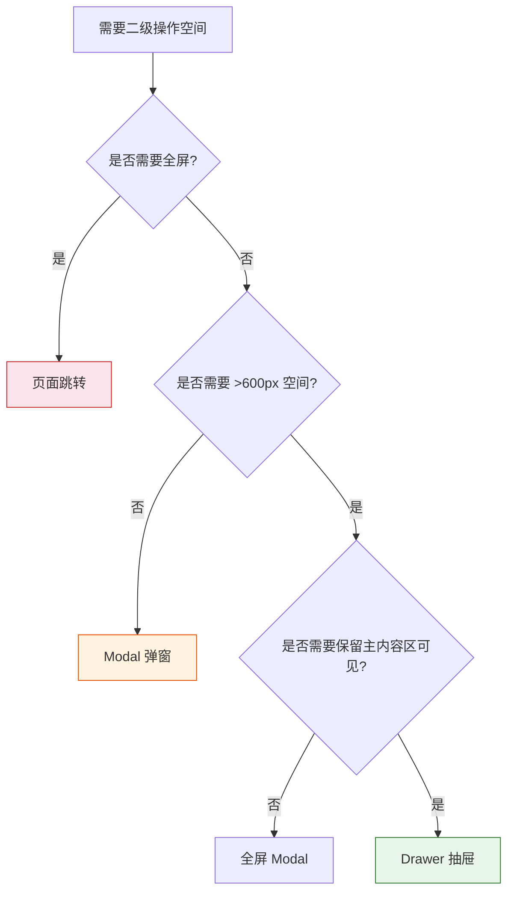
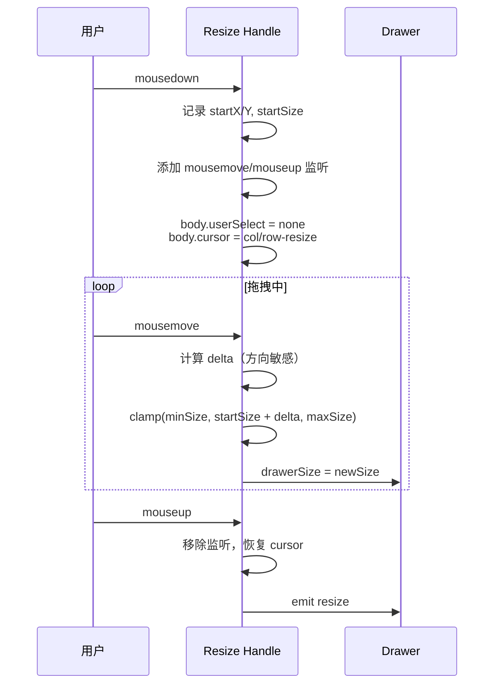
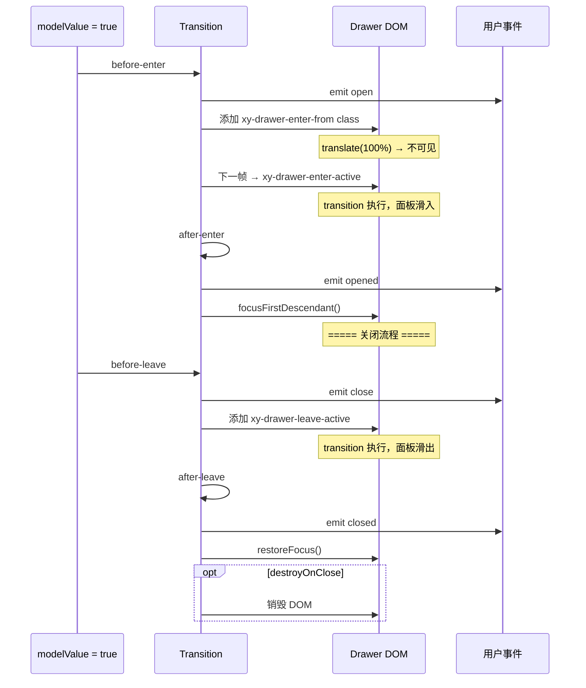

# 67 Drawer 抽屉

> 导读：Drawer 是从屏幕边缘滑入的面板容器，承载需要更大空间但不需要全页跳转的二级操作——表单填写、详情查看、筛选配置，是弹窗与页面之间的折中方案。

## 设计哲学

- **解决的问题**：Modal 弹窗的空间有限（通常 < 600px），且层级感强——用户必须处理弹窗才能继续操作。页面跳转则过重——上下文完全切换，用户需要返回才能恢复。Drawer 介于两者之间：从侧边滑入、占据屏幕一部分、主内容区仍可见（至少部分可见），是"需要更多空间但不希望打断主流程"的最佳方案。
- **设计决策**：四方向滑入（`ltr`/`rtl`/`ttb`/`btt`）覆盖主流布局需求。`size` 统一控制宽度/高度（百分比/px/auto），避免同时维护 width 和 height。`resizable` 支持拖拽调整面板大小，`minSize`/`maxSize` 约束调整范围。Overlay 和 Drawer body 的过渡动画解耦——先播放遮罩淡入，再播放面板滑入，形成视觉上的层次感。
- **差异化**：`resizable` 拖拽调整是核心差异化功能——使用 `useResizable` composable 封装拖拽逻辑，支持最小/最大尺寸约束，拖拽过程中实时更新面板尺寸，松手后触发 `resize` 事件。`zIndex` 由全局 PopupManager 管理，确保多个 Drawer 堆叠时层级正确。



## 源码架构

### 文件结构

```
packages/components/drawer/
├── index.ts             # 导出入口
├── src/
│   ├── drawer.vue       # 主组件
│   ├── drawer.ts        # Props / Emits / 常量
│   └── use-resizable.ts # 拖拽调整 composable
└── __tests__/
```

### 组件关系图

```mermaid
graph TB
  D[drawer.vue] --> DT[drawer.ts]
  D --> UR[use-resizable.ts]
  D --> PRIM["@xiaoye/primitives<br>useNamespace / useConfig / PopupManager]
  D --> OVERLAY[XyOverlay]
  D --> CLOSE[XyCloseButton]

  UR --> |拖拽边界计算| D

  subgraph 外部依赖
    PRIM
    OVERLAY
    CLOSE
  end

  style D fill:#e1f5fe,stroke:#01579b
  style UR fill:#fff3e0,stroke:#e65100
```

### 核心 type 定义

```ts
type DrawerDirection = "ltr" | "rtl" | "ttb" | "btt"

interface DrawerProps {
  modelValue?: boolean
  title?: string
  size?: string | number
  direction?: DrawerDirection
  withHeader?: boolean
  withFooter?: boolean
  closable?: boolean
  closeOnClickOverlay?: boolean
  closeOnPressEscape?: boolean
  showOverlay?: boolean
  overlayClass?: string
  zIndex?: number
  lockScroll?: boolean
  appendTo?: HTMLElement | string
  appendToBody?: boolean
  destroyOnClose?: boolean
  resizable?: boolean
  minSize?: string | number
  maxSize?: string | number
  beforeClose?: () => Promise<boolean> | boolean
  ariaLabel?: string
}

type DrawerEmits = {
  "update:modelValue": [value: boolean]
  open: []
  opened: []
  close: []
  closed: []
  "open-auto-focus": [event: Event]
  "close-auto-focus": [event: Event]
  resize: [size: { width: number; height: number }]
}
```

## 核心实现

### 1. 四方向布局的 CSS 映射

Drawer 的方向通过 CSS 自定义属性映射到 transform 方向，而非在 JS 中计算位移：

```ts
const isHorizontal = computed(() => ["ltr", "rtl"].includes(props.direction))

const translateValue = computed(() => {
  if (props.direction === "rtl") return "translateX(100%)"
  if (props.direction === "ltr") return "translateX(-100%)"
  if (props.direction === "ttb") return "translateY(100%)"
  return "translateY(-100%)" // btt
})
```

```html
<Transition
  name="xy-drawer"
  @before-enter="onBeforeEnter"
  @after-enter="onAfterEnter"
  @before-leave="onBeforeLeave"
  @after-leave="onAfterLeave"
>
  <div
    v-if="shouldRender"
    v-show="props.modelValue"
    class="xy-drawer"
    :style="{
      [isHorizontal ? 'width' : 'height']: drawerSize,
      '--xy-drawer-translate': translateValue,
    }"
  >
```

```mermaid
flowchart TD
  DIR[direction prop] --> CSS{方向判断}
  CSS -->|ltr| L[左→右<br>translateX(-100%)]
  CSS -->|rtl| R[右→左<br>translateX(100%)]
  CSS -->|ttb| T[上→下<br>translateY(100%)]
  CSS -->|btt| B[下→上<br>translateY(-100%)]

  L --> W[width: drawerSize]
  R --> W
  T --> H[height: drawerSize]
  B --> H

  style CSS fill:#e1f5fe,stroke:#01579b
```

**WHY**：用 CSS 自定义属性 `--xy-drawer-translate` 传递位移值，而非在 JS 中直接设置 transform，是因为 Vue 的 Transition 组件会在 enter/leave 钩子中操作 class 来触发 CSS transition。如果 transform 完全由 JS 控制，会与 Transition 的 class 机制冲突。通过 CSS 变量传递，过渡动画完全由 CSS transition 驱动，JS 只负责设置初始值。

### 2. useResizable 拖拽调整

`useResizable.ts` 封装了拖拽调整 Drawer 尺寸的完整逻辑：

```ts
export function useResizable(options: UseResizableOptions) {
  const { drawerRef, direction, minSize, maxSize, drawerSize } = options

  let startX = 0
  let startY = 0
  let startSize = 0

  function onDragStart(event: MouseEvent) {
    event.preventDefault()
    startX = event.clientX
    startY = event.clientY
    startSize = drawerRef.value?.getBoundingClientRect()[isHorizontal ? "width" : "height"] ?? 0

    document.addEventListener("mousemove", onDragging)
    document.addEventListener("mouseup", onDragEnd)
    document.body.style.userSelect = "none"
    document.body.style.cursor = isHorizontal ? "col-resize" : "row-resize"
  }

  function onDragging(event: MouseEvent) {
    const isHorizontal = ["ltr", "rtl"].includes(direction.value)
    const delta = isHorizontal
      ? direction.value === "ltr" ? event.clientX - startX : startX - event.clientX
      : direction.value === "ttb" ? event.clientY - startY : startY - event.clientY

    const newSize = Math.min(
      maxSizeValue.value,
      Math.max(minSizeValue.value, startSize + delta)
    )
    drawerSize.value = newSize
  }

  function onDragEnd() {
    document.removeEventListener("mousemove", onDragging)
    document.removeEventListener("mouseup", onDragEnd)
    document.body.style.userSelect = ""
    document.body.style.cursor = ""
    emit("resize", { width, height })
  }

  return { onDragStart, resizeHandleStyle }
}
```



**WHY**：delta 的计算是方向敏感的——`ltr` 时鼠标右移增大面板，`rtl` 时鼠标左移增大面板，`ttb` 时鼠标下移增大面板，`btt` 时鼠标上移增大面板。这四个方向的 delta 计算逻辑不同，但都是"鼠标向面板内部移动 = 增大"的统一语义。`body.userSelect = "none"` 防止拖拽时选中文本，`body.cursor` 提供视觉反馈。

### 3. 过渡动画的时序控制

```ts
async function onBeforeEnter() {
  await nextTick()
  emit("open")
}

function onAfterEnter() {
  emit("opened")
  // 焦点陷阱：聚焦到 Drawer 内第一个可聚焦元素
  focusFirstDescendant()
}

function onBeforeLeave() {
  emit("close")
}

async function onAfterLeave() {
  emit("closed")
  // 焦点还原：将焦点恢复到触发器
  restoreFocus()
  if (props.destroyOnClose) {
    shouldRender.value = false
    await nextTick()
    shouldRender.value = true
  }
}
```



**WHY**：四个生命周期钩子（`open`/`opened`/`close`/`closed`）对应 CSS Transition 的四个阶段——`open` 在 DOM 创建后、动画开始前触发（适合设置初始化状态），`opened` 在动画完成后触发（适合执行需要面板可见后的操作），`close`/`closed` 同理。`focusFirstDescendant` 在面板完全展开后聚焦第一个可交互元素，符合 WAI-ARIA 对话框焦点管理规范。

### 4. beforeClose 拦截与 Escape 关闭

```ts
async function handleClose() {
  if (props.beforeClose) {
    const result = await props.beforeClose()
    if (result === false) return
  }
  emit("update:modelValue", false)
}

function onEscapePress() {
  if (!props.closeOnPressEscape) return
  handleClose()
}
```

**WHY**：`beforeClose` 返回 `false` 阻止关闭而非抛出错误，是因为"阻止关闭"是合法的业务逻辑（如表单有未保存修改），不应视为异常。Escape 键和 Overlay 点击都通过 `handleClose` 统一入口，确保 `beforeClose` 拦截对所有关闭触发方式生效。

### 5. destroyOnClose 的 DOM 重建

```ts
// after-leave 钩子中
if (props.destroyOnClose) {
  shouldRender.value = false
  await nextTick()
  shouldRender.value = true
}
```

**WHY**：`destroyOnClose` 在关闭动画完成后（`after-leave`）才销毁 DOM，而非在 `before-leave` 时立即销毁——如果在动画开始前就销毁，面板会瞬间消失，看不到滑出动画。`await nextTick()` 确保 DOM 完全卸载后再重新创建空壳，为下次打开做准备。

## API 参考

### Props

| 属性 | 类型 | 默认值 | 说明 |
|------|------|--------|------|
| modelValue | `boolean` | `false` | 双向绑定，控制显示/隐藏 |
| title | `string` | `""` | 面板标题 |
| size | `string \| number` | `"30%"` | 面板宽度（水平方向）或高度（垂直方向） |
| direction | `DrawerDirection` | `"rtl"` | 滑入方向 |
| withHeader | `boolean` | `true` | 是否显示头部 |
| withFooter | `boolean` | `true` | 是否显示底部 |
| closable | `boolean` | `true` | 是否显示关闭按钮 |
| closeOnClickOverlay | `boolean` | `true` | 点击遮罩层是否关闭 |
| closeOnPressEscape | `boolean` | `true` | 按 Escape 是否关闭 |
| showOverlay | `boolean` | `true` | 是否显示遮罩层 |
| overlayClass | `string` | — | 遮罩层自定义类名 |
| zIndex | `number` | — | 层级，默认由 PopupManager 分配 |
| lockScroll | `boolean` | `true` | 是否锁定滚动 |
| appendTo | `HTMLElement \| string` | — | 挂载目标 |
| appendToBody | `boolean` | `false` | 是否挂载到 body |
| destroyOnClose | `boolean` | `false` | 关闭时销毁 DOM |
| resizable | `boolean` | `false` | 是否支持拖拽调整大小 |
| minSize | `string \| number` | — | 拖拽最小尺寸 |
| maxSize | `string \| number` | — | 拖拽最大尺寸 |
| beforeClose | `() => boolean \| Promise<boolean>` | — | 关闭前拦截钩子 |
| ariaLabel | `string` | — | 无障碍标签 |

### Emits

| 事件 | 参数 | 说明 |
|------|------|------|
| update:modelValue | `(value: boolean)` | 值变化时触发 |
| open | — | 打开动画开始前 |
| opened | — | 打开动画完成后 |
| close | — | 关闭动画开始前 |
| closed | — | 关闭动画完成后 |
| open-auto-focus | `(event: Event)` | 自动聚焦触发 |
| close-auto-focus | `(event: Event)` | 自动聚焦还原 |
| resize | `({ width: number, height: number })` | 拖拽调整大小完成 |

### Slots

| 名称 | 说明 |
|------|------|
| default | 面板主体内容 |
| header | 自定义头部内容 |
| footer | 自定义底部内容 |
| title | 自定义标题区域 |

### Exposes

| 属性/方法 | 类型 | 说明 |
|-----------|------|------|
| focus | `() => void` | 聚焦到面板内第一个可聚焦元素 |
| close | `() => void` | 关闭面板（经过 beforeClose 拦截） |

## 样式系统

### BEM 类名

| 类名 | 说明 |
|------|------|
| `.xy-drawer` | 面板根 |
| `.xy-drawer--ltr` | 从左滑入 |
| `.xy-drawer--rtl` | 从右滑入 |
| `.xy-drawer--ttb` | 从上滑入 |
| `.xy-drawer--btt` | 从下滑入 |
| `.xy-drawer.is-open` | 打开态 |
| `.xy-drawer.is-resizing` | 拖拽调整中 |
| `.xy-drawer__header` | 头部区域 |
| `.xy-drawer__title` | 标题 |
| `.xy-drawer__close` | 关闭按钮 |
| `.xy-drawer__body` | 主体内容 |
| `.xy-drawer__footer` | 底部区域 |
| `.xy-drawer__resize-handle` | 拖拽手柄 |

### 过渡类名

| 类名 | 说明 |
|------|------|
| `.xy-drawer-enter-from` | 进入动画起始 |
| `.xy-drawer-enter-active` | 进入动画执行中 |
| `.xy-drawer-enter-to` | 进入动画结束 |
| `.xy-drawer-leave-from` | 离开动画起始 |
| `.xy-drawer-leave-active` | 离开动画执行中 |
| `.xy-drawer-leave-to` | 离开动画结束 |

### CSS 变量

| 变量 | 默认值 | 说明 |
|------|--------|------|
| `--xy-drawer-bg-color` | `var(--xy-bg-color-floating)` | 面板背景色 |
| `--xy-drawer-padding` | `var(--xy-space-6)` | 面板内边距 |
| `--xy-drawer-title-font-size` | `var(--xy-font-size-lg)` | 标题字号 |
| `--xy-drawer-title-color` | `var(--xy-text-color-heading)` | 标题颜色 |
| `--xy-drawer-header-border-bottom` | `1px solid var(--xy-border-color-subtle)` | 头部分割线 |
| `--xy-drawer-footer-border-top` | `1px solid var(--xy-border-color-subtle)` | 底部分割线 |
| `--xy-drawer-translate` | JS 动态设置 | 位移值（CSS 变量桥接） |
| `--xy-drawer-shadow` | `var(--xy-shadow-lg)` | 面板阴影 |

### 主题定制方式

通过 CSS 变量覆盖即可全局修改 Drawer 主题：

```css
:root {
  --xy-drawer-bg-color: #ffffff;
  --xy-drawer-padding: 24px;
}
```

Drawer 的过渡动画时长和缓动曲线引用全局变量 `--xy-transition-duration` 和 `--xy-transition-timing`，可通过 ConfigProvider 统一调整。

拖拽手柄的视觉样式（颜色、粗细、hover 效果）通过 `.xy-drawer__resize-handle` 及其 `::before` 伪元素控制，CSS 变量引用 `--xy-border-color` 系列。

## 小结

1. **四方向 + CSS 变量桥接**：`ltr`/`rtl`/`ttb`/`btt` 四个方向通过 JS 计算位移值、CSS 变量 `--xy-drawer-translate` 桥接到 CSS transition，实现方向无关的滑入动画——JS 只负责设置初始值，动画完全由 CSS 驱动。
2. **useResizable 拖拽调整**：方向敏感的 delta 计算 + `minSize`/`maxSize` 约束 + `body.userSelect` 防文本选中 + `body.cursor` 视觉反馈，完整封装了拖拽调整面板大小的全部逻辑。
3. **beforeClose 统一拦截 + destroyOnClose 延迟销毁**：所有关闭方式（Escape/Overlay 点击/关闭按钮）都经过 `beforeClose` 统一拦截；`destroyOnClose` 在关闭动画完成后才销毁 DOM，确保用户能看到完整的滑出动画。