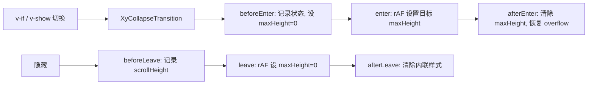
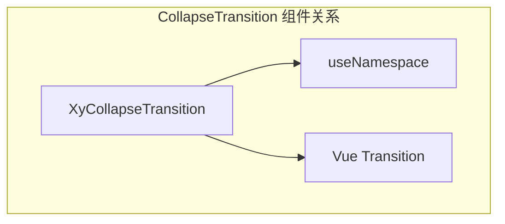
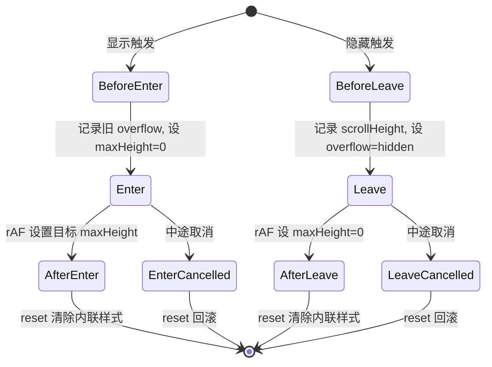

# 68 CollapseTransition 折叠过渡

> 导读：CollapseTransition 提供基于 maxHeight 的展开/收起动画，让隐藏与显示之间的状态切换平滑自然

## 设计哲学

折叠过渡是 UI 中最常见的微交互之一——手风琴面板、下拉菜单、可折叠区域都需要它。CollapseTransition 的设计核心是**用最简 API 解决最泛需求**：

- **零配置即用**：包裹任意内容，自动测量 scrollHeight 生成过渡，无需手动指定高度
- **maxHeight 策略**：使用 `max-height` 而非 `height`，避免内容溢出和固定高度维护成本
- **双向过渡**：enter 和 leave 各四个钩子完整覆盖，包括取消场景的回滚



## 源码架构

```
packages/components/collapse-transition/
├── index.ts                        # withInstall 导出
├── src/
│   └── collapse-transition.vue     # 完整实现（单文件）
└── __tests__/
    └── collapse-transition.spec.ts
```



### 核心 type 定义

CollapseTransition 没有自定义 Props——它完全依赖 Vue 原生 `<transition>` 的机制，通过 `v-on` 注入钩子实现动画逻辑。这种设计让组件 API 为零，使用方式与原生 `<transition>` 完全一致。

## 核心实现

### 动画钩子全生命周期

CollapseTransition 注册了 Vue Transition 的全部 8 个钩子，形成完整的生命周期：



### enter 钩子：从 0 到目标高度

```ts
beforeEnter(el) {
  el.dataset.oldOverflow = el.style.overflow;
  if (el.style.maxHeight) {
    el.dataset.oldMaxHeight = el.style.maxHeight;
  }
  el.style.maxHeight = "0px";
  el.style.overflow = "hidden";
},

enter(el) {
  requestAnimationFrame(() => {
    if (el.dataset.oldMaxHeight) {
      el.style.maxHeight = el.dataset.oldMaxHeight;
    } else if (el.scrollHeight > 0) {
      el.style.maxHeight = `${el.scrollHeight}px`;
    } else {
      el.style.maxHeight = "0px";
    }
  });
},

afterEnter(el) { reset(el); },
enterCancelled(el) { reset(el); }
```

**WHY**：
- `beforeEnter` 中缓存 `oldMaxHeight`，因为元素可能已有外设的 maxHeight（如 CSS 变量），展开时应恢复原值而非无限大
- `requestAnimationFrame` 确保浏览器已渲染 `maxHeight: 0` 的初始帧，过渡才能正确触发
- `scrollHeight > 0` 的检查防止空内容元素产生 0px 过渡

### leave 钩子：从当前高度到 0

```ts
beforeLeave(el) {
  el.dataset.oldOverflow = el.style.overflow;
  el.style.maxHeight = `${el.scrollHeight}px`;
  el.style.overflow = "hidden";
},

leave(el) {
  requestAnimationFrame(() => {
    el.style.maxHeight = "0px";
  });
},

afterLeave(el) { reset(el); },
leaveCancelled(el) { reset(el); }
```

**WHY**：
- `beforeLeave` 先将 maxHeight 设为当前 scrollHeight，这是过渡的起始帧
- 如果元素处于展开态但 maxHeight 为空（afterEnter 已 reset），必须显式设置起始值，否则 CSS transition 无起点
- `overflow: hidden` 在折叠过程中裁剪溢出内容，避免视觉闪烁

### reset 函数：状态清理

```ts
function reset(el) {
  el.style.maxHeight = "";
  el.style.overflow = el.dataset.oldOverflow ?? "";
}
```

**WHY**：将 `maxHeight` 清空而非设为具体值，让元素回归 CSS 规则控制。这意味着外部的 `max-height` 样式或 CSS 变量可以正常生效，不会被内联样式覆盖。

### CSS 过渡声明

```css
.xy-collapse-transition-enter-active,
.xy-collapse-transition-leave-active {
  transition:
    max-height var(--xy-transition-duration-normal) cubic-bezier(0.22, 1, 0.36, 1),
    opacity var(--xy-transition-duration-fast) var(--xy-transition-timing),
    transform var(--xy-transition-duration-normal) cubic-bezier(0.22, 1, 0.36, 1);
}

.xy-collapse-transition-enter-from,
.xy-collapse-transition-leave-to {
  opacity: 0;
  transform: translateY(-4px);
}
```

**WHY**：三属性协同过渡——maxHeight 控制高度、opacity 控制淡入淡出、transform: translateY(-4px) 提供微妙的纵向位移，让折叠动画既有高度变化又有方向感。

## API 参考

### Props

无（纯行为组件，通过包裹 `<transition>` 工作）

### Slots

| 名称 | 说明 |
|------|------|
| default | 需要折叠过渡的内容 |

### 使用方式

```html
<XyCollapseTransition>
  <div v-show="visible">可折叠内容</div>
</XyCollapseTransition>
```

### Exposes

无

## 样式系统

### BEM 类名

| 类名 | 说明 |
|------|------|
| `.xy-collapse-transition-enter-active` | 进入过渡态 |
| `.xy-collapse-transition-leave-active` | 离开过渡态 |
| `.xy-collapse-transition-enter-from` | 进入起始帧 |
| `.xy-collapse-transition-leave-to` | 离开终止帧 |

### CSS 变量

| 变量 | 说明 |
|------|------|
| `--xy-transition-duration-normal` | 高度/位移过渡时长 |
| `--xy-transition-duration-fast` | 透明度过渡时长 |
| `--xy-transition-timing` | 默认缓动函数 |

### 缓动曲线

`cubic-bezier(0.22, 1, 0.36, 1)` 是一条减速曲线（ease-out 的加强版），让展开时快速启动、缓慢停止，收起同理。这种曲线在高度动画中比 ease-in-out 更自然，因为用户期望内容「快速出现、平稳就位」。

## 小结

1. **零 API 设计**：无 Props / Emits / Exposes，通过 Vue Transition 钩子注入行为，使用方式与原生 `<transition>` 一致
2. **maxHeight + rAF 双保险**：maxHeight 策略避免内容溢出，requestAnimationFrame 确保过渡帧正确触发
3. **完整生命周期覆盖**：8 个钩子含 cancel 场景，reset 函数统一清理内联样式，避免样式残留
