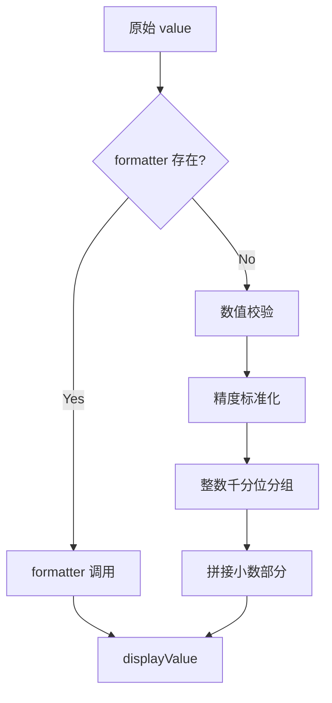
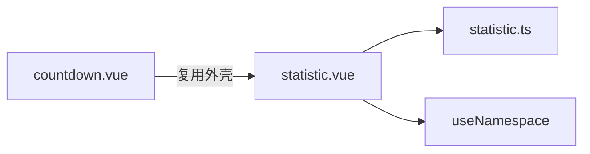
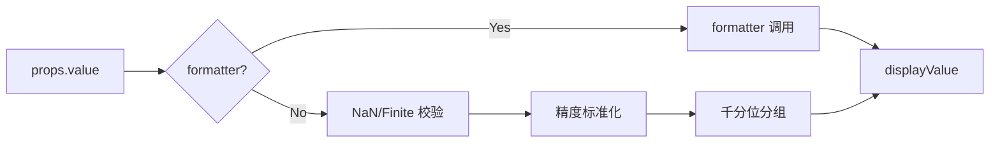

# 69 Statistic 统计数值

> 导读：Statistic 是面向数据展示场景的数值渲染组件，核心价值在于将原始数值自动格式化为易读的分组、精度呈现，同时保留完全的自定义扩展能力

## 设计哲学

Statistic 的存在理由是消除"原始数值 -> 用户可读展示"之间的格式化鸿沟。在仪表盘、报表、KPI 卡片等场景中，开发者频繁手写千分位分组、小数精度截断、货币符号拼接——这些重复逻辑正是 Statistic 要收敛的。

设计决策上，我们选择"内置格式化 + formatter 覆盖"的双层策略，而非纯粹透传。原因在于：绝大多数场景只需要千分位 + 小数精度，内置逻辑即可覆盖；而 formatter 回调为金融、科研等特殊场景保留了完全控制权。这比"全部交给 formatter"减少了 90% 场景的接入成本。

与同类组件库的差异点：
- `precision` 支持 0 值（完全隐藏小数），而非强制保留两位
- `groupSeparator` 和 `decimalSeparator` 双参数独立配置，覆盖欧洲/印度数字格式
- `formatter` 返回 `string | number`，内部会对 number 做二次格式化，避免 formatter 输出未经分组的裸数值



## 源码架构

### 文件结构

```
packages/components/statistic/
├── src/
│   ├── statistic.ts      # 类型定义
│   └── statistic.vue     # 组件实现
├── __tests__/
│   └── statistic.spec.ts
└── index.ts
```

### 组件关系图



### 核心 type 定义

```ts
export type StatisticFormatter = (value: number | string) => string | number;

export interface StatisticProps {
  value?: number | string;
  title?: string;
  prefix?: string;
  suffix?: string;
  precision?: number;
  decimalSeparator?: string;
  groupSeparator?: string;
  formatter?: StatisticFormatter;
  valueStyle?: StyleValue;
}
```

## 核心实现

### 数值格式化引擎

格式化流程分为四步：校验 -> 精度标准化 -> 整数分组 -> 小数拼接。

**精度标准化**确保 `precision` 输入 NaN / 负数 / 非整数时仍能降级到 0，而非崩溃：

```ts
function normalizePrecision(value: number | undefined) {
  if (typeof value !== "number" || Number.isNaN(value) || !Number.isFinite(value)) {
    return 0;
  }
  return Math.max(0, Math.floor(value));
}
```

**整数千分位分组**使用正则 `/\B(?=(\d{3})+(?!\d))/g` 实现。WHY：这是最紧凑的千分位插入实现，比 `Intl.NumberFormat` 更轻量且不引入 locale 依赖；同时兼容任意 `groupSeparator` 配置：

```ts
const groupedInteger = integerPart.replace(/\B(?=(\d{3})+(?!\d))/g, props.groupSeparator);
```

### formatter 双层策略

当 `formatter` 存在时，其输出直接成为 `displayValue`；否则走内置格式化。这个"短路优先"设计意味着：formatter 可以完全绕过内置逻辑，但如果 formatter 返回的是 number，后续的 Countdown 等消费者仍可拿到原始数值进行二次处理。



### slots 透传设计

`hasTitle`、`hasPrefix`、`hasSuffix` 三个 computed 同时检查 slot 存在性与 props 非空，确保开发者可以混用 slot 自定义与 props 快捷配置。这比"slot 存在就忽略 props"更实用——在大多数场景下，prefix/suffix 就是个文字符号，不需要 slot；但 title 区域可能需要图标 + 文字的组合，这时 slot 就派上用场了。

## API 参考

### Props

| 属性 | 类型 | 默认值 | 说明 |
|------|------|--------|------|
| value | `number \| string` | `0` | 数值内容，string 类型时跳过格式化 |
| title | `string` | `""` | 标题文字 |
| prefix | `string` | `""` | 前缀文字（如货币符号） |
| suffix | `string` | `""` | 后缀文字（如单位） |
| precision | `number` | `0` | 小数精度，0 表示不显示小数 |
| decimalSeparator | `string` | `"."` | 小数分隔符 |
| groupSeparator | `string` | `","` | 千分位分隔符 |
| formatter | `StatisticFormatter` | — | 自定义格式化函数 |
| valueStyle | `StyleValue` | — | 数值区域的自定义样式 |

### Slots

| 名称 | 说明 |
|------|------|
| title | 自定义标题区域 |
| prefix | 自定义前缀区域 |
| suffix | 自定义后缀区域 |

### Exposes

| 名称 | 类型 | 说明 |
|------|------|------|
| displayValue | `ComputedRef<string \| number>` | 格式化后的展示值 |

## 样式系统

### BEM 类名

| 类名 | 说明 |
|------|------|
| `xy-statistic` | 根容器 |
| `xy-statistic__head` | 标题区域 |
| `xy-statistic__content` | 数值内容区域 |
| `xy-statistic__prefix` | 前缀 |
| `xy-statistic__value` | 数值文本 |
| `xy-statistic__suffix` | 后缀 |

### CSS 变量

| 变量 | 说明 | 默认值 |
|------|------|--------|
| `--xy-statistic-gap` | 标题和数值间距 | `10px` |
| `--xy-statistic-head-font-size` | 标题字号 | `13px` |
| `--xy-statistic-head-color` | 标题颜色 | `var(--xy-text-secondary)` |
| `--xy-statistic-number-font-size` | 数值字号 | `30px` |
| `--xy-statistic-number-font-weight` | 数值字重 | `700` |
| `--xy-statistic-number-color` | 数值颜色 | `var(--xy-text-primary)` |
| `--xy-statistic-affix-font-size` | 前后缀字号 | `15px` |
| `--xy-statistic-affix-color` | 前后缀颜色 | `color-mix(in srgb, var(--xy-text-secondary) 86%, white)` |
| `--xy-statistic-affix-gap` | 前后缀和数值间距 | `8px` |

### 主题定制

通过 CSS 变量覆盖即可定制主题。`valueStyle` prop 可直接控制数值区域的样式，适合金融场景中红涨绿跌的动态色彩需求。

## 小结

1. **内置格式化 + formatter 覆盖**：90% 场景零配置可用，特殊场景完全可控
2. **groupSeparator / decimalSeparator 双参数**：一行配置覆盖全球数字格式
3. **slot 与 props 混用**：prefix/suffix 走 props，title 走 slot，各取所需