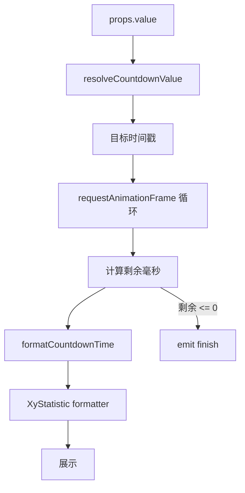
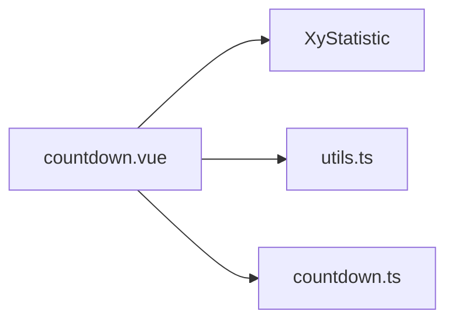
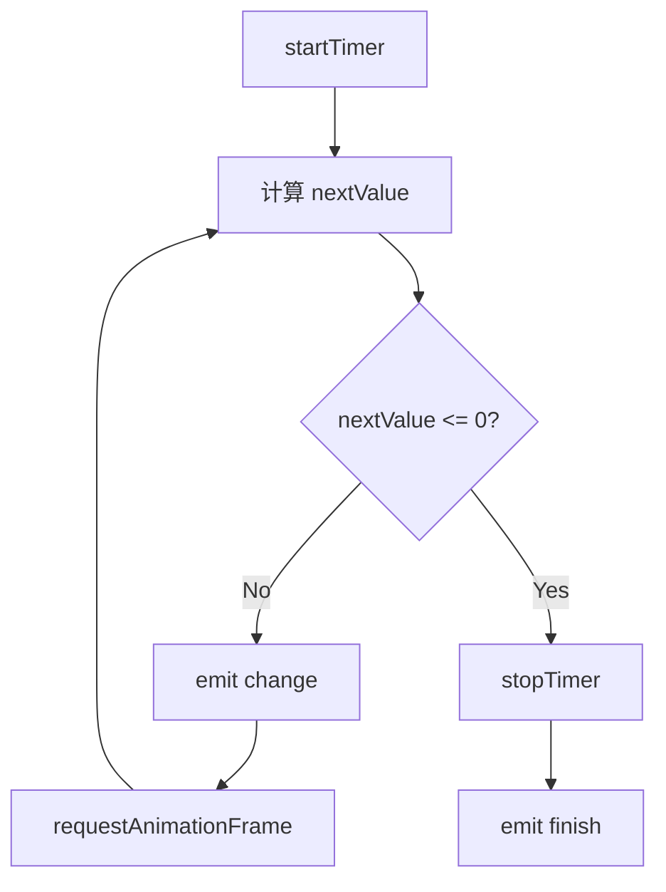

# 70 Countdown 倒计时

> 导读：Countdown 复用 Statistic 外壳，叠加 requestAnimationFrame 驱动的高精度倒计时引擎，核心价值在于将"目标时间戳 -> 每帧刷新的格式化展示"这一链路封装为开箱即用的组件

## 设计哲学

Countdown 存在的理由是：业务中频繁出现"距离截止时间还剩多久"的展示需求，而手动管理定时器、格式化时间差、处理结束状态容易出错且重复。Countdown 将这些逻辑收敛到一个复用 Statistic 展示外壳的独立组件中。

关键设计决策：
- **复用 Statistic 而非独立渲染**：Countdown 不重复实现 title/prefix/suffix/valueStyle 等展示逻辑，而是将自身作为 Statistic 的"时间计算中间层"，通过 `formatter` 回调注入格式化结果。WHY：避免展示逻辑分歧，Statistic 的样式定制能力天然可用。
- **requestAnimationFrame 优于 setInterval**：使用 rAF 驱动倒计时更新，保证每帧只计算一次，且在页面不可见时自动暂停。降级方案为 `setTimeout(..., 16)`。
- **value 接受 number / Date / dayjs**：`resolveCountdownValue` 统一将三种输入归一化为时间戳，业务层无需关心类型转换。



## 源码架构

### 文件结构

```
packages/components/countdown/
├── src/
│   ├── countdown.ts      # 类型定义
│   ├── countdown.vue     # 组件实现
│   └── utils.ts          # 时间解析与格式化工具
├── __tests__/
└── index.ts
```

### 组件关系图



### 核心 type 定义

```ts
export type CountdownValue = number | Date | Dayjs;
export type CountdownChangeHandler = (remainingMs: number) => void;
export type CountdownFinishHandler = () => void;

export interface CountdownProps {
  value?: CountdownValue;
  format?: string;
  title?: string;
  prefix?: string;
  suffix?: string;
  valueStyle?: StyleValue;
}
```

## 核心实现

### 时间值归一化

`resolveCountdownValue` 将 number / Date / dayjs 三种输入统一转为毫秒时间戳，对非法值降级为 0：

```ts
export function resolveCountdownValue(value: number | Date | Dayjs) {
  if (typeof value === "number") {
    return Number.isFinite(value) ? value : 0;
  }
  if (value instanceof Date) {
    const timestamp = value.getTime();
    return Number.isFinite(timestamp) ? timestamp : 0;
  }
  const timestamp = Number(value?.valueOf?.());
  return Number.isFinite(timestamp) ? timestamp : 0;
}
```

### formatCountdownTime 格式化引擎

格式化逻辑定义了 7 个时间单元（Y/M/D/H/m/s/S），通过正则匹配 format 字符串中的连续字符，逐级消耗剩余时间：

```ts
const TIME_UNITS = [
  ["Y", 1000 * 60 * 60 * 24 * 365],
  ["M", 1000 * 60 * 60 * 24 * 30],
  ["D", 1000 * 60 * 60 * 24],
  ["H", 1000 * 60 * 60],
  ["m", 1000 * 60],
  ["s", 1000],
  ["S", 1]
] as const;
```

WHY 用 `TIME_UNITS` 数组而非 switch-case：使得时间单元的扩展（如增加季度 Q）只需追加一行，且 `reduce` 保证处理顺序从大到小。

中括号转义 `\[...\]` 支持 `DD [days] HH:mm:ss` 这类混合格式，避免占位符与自然语言冲突。

### requestAnimationFrame 驱动循环



关键设计点：
- `finished` 标志位防止 `finish` 事件重复触发
- `stopTimer` 在组件卸载时调用，避免内存泄漏
- rAF 降级为 setTimeout，兼容 SSR 场景

### Statistic formatter 桥接

Countdown 通过 `formatValue` 函数将 `rawValue`（剩余毫秒）格式化为字符串，再作为 Statistic 的 `formatter` 传入：

```ts
<XYStatistic
  :value="rawValue"
  :formatter="formatValue"
/>
```

WHY 用 formatter 而非直接传格式化后的字符串：保持 Statistic 的 `value` 为数值类型，使外部可以通过 `displayValue` 拿到原始剩余毫秒数做二次计算。

## API 参考

### Props

| 属性 | 类型 | 默认值 | 说明 |
|------|------|--------|------|
| value | `number \| Date \| Dayjs` | `0` | 目标时间，number 为毫秒时间戳 |
| format | `string` | `"HH:mm:ss"` | 展示格式串，支持 Y/M/D/H/m/s/S |
| title | `string` | `""` | 标题文字，透传给 Statistic |
| prefix | `string` | `""` | 前缀文字，透传给 Statistic |
| suffix | `string` | `""` | 后缀文字，透传给 Statistic |
| valueStyle | `StyleValue` | — | 数值区域样式，透传给 Statistic |

### Emits

| 事件 | 参数 | 说明 |
|------|------|------|
| change | `(remainingMs: number)` | 每帧更新时触发，参数为剩余毫秒数 |
| finish | — | 倒计时结束时触发，仅触发一次 |

### Slots

| 名称 | 说明 |
|------|------|
| title | 自定义标题区域，透传给 Statistic |
| prefix | 自定义前缀区域，透传给 Statistic |
| suffix | 自定义后缀区域，透传给 Statistic |

### Exposes

| 名称 | 类型 | 说明 |
|------|------|------|
| displayValue | `ComputedRef<string>` | 当前格式化后的展示文本 |

## 样式系统

Countdown 自身不增加额外样式，完全复用 Statistic 的 BEM 类名和 CSS 变量体系。根元素额外附加 `xy-countdown` 类名，便于业务层做场景化覆盖。

### 可用 CSS 变量

| 变量 | 说明 |
|------|------|
| `--xy-statistic-number-font-size` | 数值字号 |
| `--xy-statistic-number-color` | 数值颜色 |
| `--xy-statistic-number-font-weight` | 数值字重 |
| `--xy-statistic-gap` | 标题与数值间距 |

## 小结

1. **Statistic 复用架构**：Countdown 只负责时间计算，展示层完全委托 Statistic，零样式分歧
2. **requestAnimationFrame 驱动**：每帧精确计算，页面不可见时自动暂停，SSR 降级为 setTimeout
3. **7 级时间单元 + 中括号转义**：Y/M/D/H/m/s/S 全覆盖，`DD [days] HH:mm:ss` 混合格式无冲突