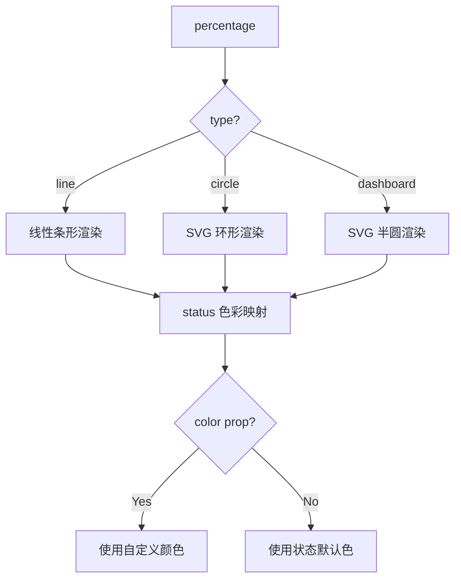
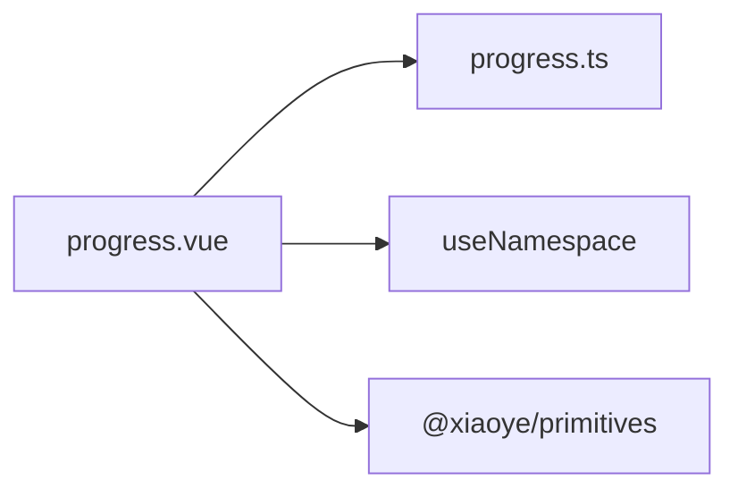
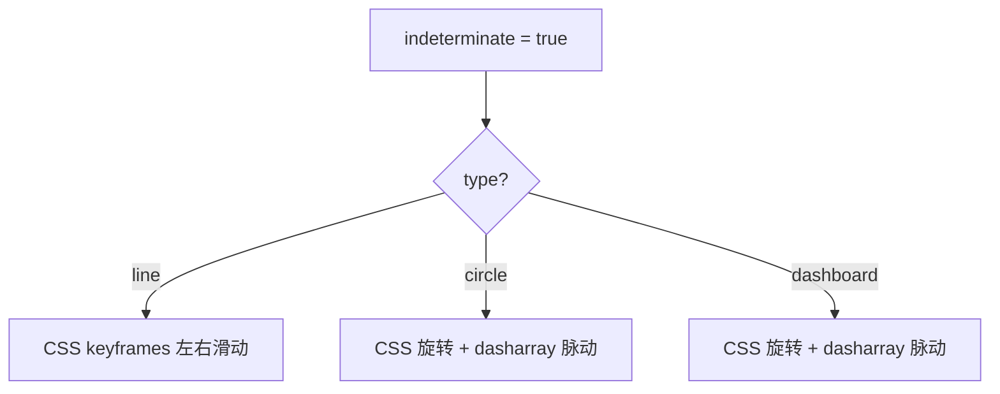

# 71 Progress 进度条

> 导读：Progress 是一个多形态的进度指示组件，核心价值在于以线性 / 环形 / 仪表盘三种视觉形态统一"当前占比"的展示逻辑，同时内置状态色彩与动画驱动

## 设计哲学

Progress 解决的核心问题是：业务中"完成百分比"的展示需求散落在上传、下载、表单填写、任务推进等场景中，而每个场景的视觉形态不同。Progress 通过 `type` prop 将三种视觉形态（line / circle / dashboard）收敛到同一个 API 下，避免"同一数据三套组件"的维护负担。

关键设计决策：
- **三种形态共享 percentage 语义**：无论线形、环形还是仪表盘，核心数据模型都是 0-100 的百分比。WHY：业务层只需关心"完成了多少"，视觉切换只是 `type` 的变化，不涉及数据结构迁移。
- **status 色彩自动映射**：`success` / `warning` / `error` 三种状态自动映射到主题色，无需手动设置颜色。`color` prop 作为覆盖层，支持渐变等高级配置。
- **动画由 CSS transition 驱动**：百分比变化时的过渡效果通过 `transition: width 0.6s` / `stroke-dashoffset 0.6s` 实现，不引入 JS 动画库。WHY：进度条是"低频更新"组件，CSS transition 的性能和代码量都优于 requestAnimationFrame 方案。



## 源码架构

### 文件结构

```
packages/components/progress/
├── src/
│   ├── progress.ts       # 类型定义
│   └── progress.vue      # 组件实现（含三种形态模板）
├── __tests__/
└── index.ts
```

### 组件关系图



### 核心 type 定义

```ts
export type ProgressType = "line" | "circle" | "dashboard";
export type ProgressStatus = "success" | "warning" | "error";

export interface ProgressProps {
  percentage?: number;
  type?: ProgressType;
  status?: ProgressStatus;
  color?: string | Array<Record<string, string>>;
  width?: number;
  strokeWidth?: number;
  textInside?: boolean;
  showText?: boolean;
  strokeLinecap?: CanvasLineCap;
  format?: (percentage: number) => string;
  indeterminate?: boolean;
  duration?: number;
}
```

## 核心实现

### 状态色彩优先级链

色彩计算遵循三层优先级：`color` prop > `status` 映射色 > 默认主题色。`color` 支持 string（纯色）和 Array（渐变），渐变通过 `linear-gradient` / SVG `linearGradient` 双路径实现：

```ts
const currentColor = computed(() => {
  if (props.color) return resolveColor(props.color);
  if (props.status) return statusColorMap[props.status];
  return "var(--xy-color-primary)";
});
```

### SVG 环形与仪表盘的 stroke-dasharray 计算

circle 和 dashboard 形态基于 SVG `stroke-dasharray` / `stroke-dashoffset` 实现弧形进度。核心公式：

```ts
const radius = (width - strokeWidth) / 2;
const circumference = 2 * Math.PI * radius;
const relativeStrokeWidth = (strokeWidth / width) * 100;

// circle: 完整圆
const trailPath = `M ${width / 2} ${width / 2} m 0 ${-radius} a ${radius} ${radius} 0 1 1 0 ${2 * radius} a ${radius} ${radius} 0 1 1 0 ${-2 * radius}`;

// dashboard: 半圆
const perimeter = Math.PI * radius;
const rate = (percentage - 50) * 0.01; // 偏移修正
```

WHY 手写 SVG path 而非用 `circle` 元素：dashboard 形态需要半圆弧，`circle` 元素无法表达起点偏移，path 更灵活。

### indeterminate 动画

当 `indeterminate` 为 true 时，百分比不显示，进度条进入"未知进度"的往复动画模式。line 形态通过 CSS `@keyframes indeterminate` 实现条形左右滑动；circle 形态通过旋转 + 长度脉动实现。



### 渐变支持

`color` 为数组时，line 形态生成 CSS `linear-gradient`，circle/dashboard 形态在 SVG 内动态创建 `<linearGradient>` 定义，通过 `url(#gradient-id)` 引用：

```ts
const gradientId = useId();
// SVG 内:
// <defs><linearGradient :id="gradientId">...</linearGradient></defs>
// <path :stroke="`url(#${gradientId})`" />
```

## API 参考

### Props

| 属性 | 类型 | 默认值 | 说明 |
|------|------|--------|------|
| percentage | `number` | `0` | 进度百分比，0-100 |
| type | `"line" \| "circle" \| "dashboard"` | `"line"` | 进度条形态 |
| status | `"success" \| "warning" \| "error"` | — | 状态，自动映射色彩 |
| color | `string \| Array<{color: string; percentage: number}>` | — | 自定义颜色/渐变 |
| width | `number` | `126` | circle/dashboard 画布宽度 |
| strokeWidth | `number` | `6` | 进度条粗细 |
| textInside | `boolean` | `false` | 百分比文字是否内嵌（仅 line） |
| showText | `boolean` | `true` | 是否显示百分比文字 |
| strokeLinecap | `"butt" \| "round" \| "square"` | `"round"` | 进度条端点形状 |
| format | `(percentage: number) => string` | — | 自定义百分比文字 |
| indeterminate | `boolean` | `false` | 是否为不确定进度 |
| duration | `number` | `3` | indeterminate 动画周期（秒） |

### Slots

| 名称 | 说明 |
|------|------|
| default | 自定义百分比文字内容 |

### Exposes

| 名称 | 类型 | 说明 |
|------|------|------|
| currentColor | `ComputedRef<string>` | 当前生效的颜色值 |

## 样式系统

### BEM 类名

| 类名 | 说明 |
|------|------|
| `xy-progress` | 根容器 |
| `xy-progress--line` | 线性形态修饰符 |
| `xy-progress--circle` | 环形形态修饰符 |
| `xy-progress--dashboard` | 仪表盘形态修饰符 |
| `xy-progress-bar__outer` | 线性轨道 |
| `xy-progress-bar__inner` | 线性填充 |
| `xy-progress-circle` | 环形 SVG 容器 |

### CSS 变量

| 变量 | 说明 | 默认值 |
|------|------|--------|
| `--xy-progress-color` | 进度条默认颜色 | `var(--xy-color-primary)` |
| `--xy-progress-success-color` | 成功状态色 | `var(--xy-color-success)` |
| `--xy-progress-warning-color` | 警告状态色 | `var(--xy-color-warning)` |
| `--xy-progress-error-color` | 错误状态色 | `var(--xy-color-danger)` |
| `--xy-progress-bg` | 轨道背景色 | `var(--xy-fill-color-light)` |
| `--xy-progress-bar-height` | 线性条高度 | `8px` |
| `--xy-progress-text-font-size` | 百分比文字字号 | `14px` |

### 主题定制

通过覆盖 CSS 变量即可全局定制。`color` prop 支持单场景覆盖，渐变色通过数组配置实现多色过渡。

## 小结

1. **三种形态统一 API**：percentage 语义不变，视觉切换只需改 type
2. **CSS transition 驱动动画**：零 JS 动画依赖，低频更新场景性能最优
3. **渐变双路径**：line 用 CSS linear-gradient，circle/dashboard 用 SVG linearGradient，同一 color 配置跨形态生效