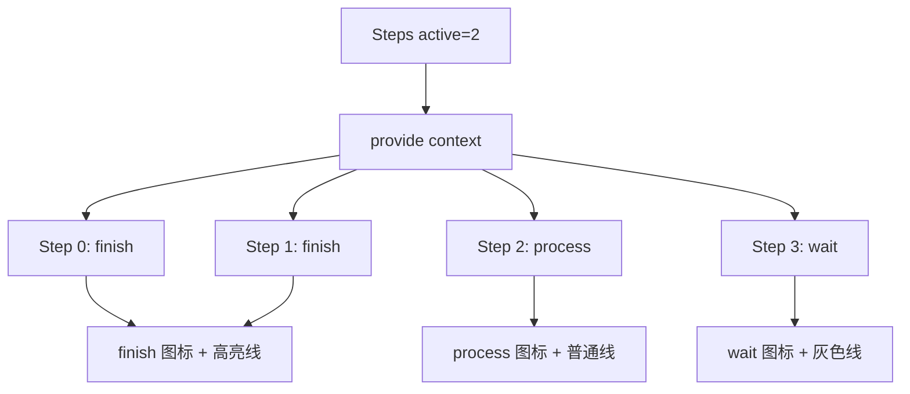
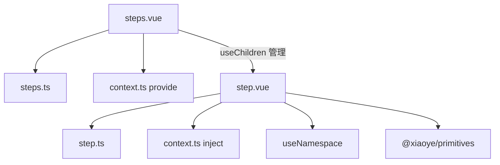
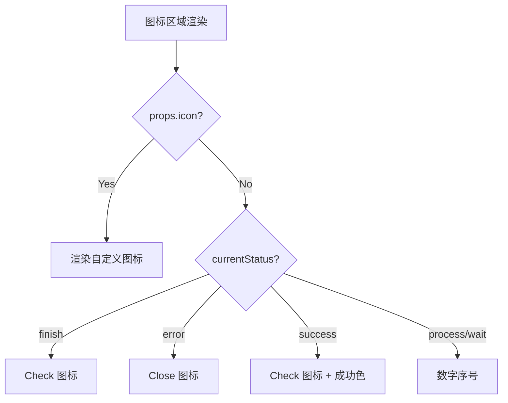

# 72 Steps 步骤条

> 导读：Steps 是一个多步骤导航组件，核心价值在于通过"状态注入 + 条件渲染"的模式，将步骤编号、图标、描述文字的协同逻辑从业务层收敛到组件内部

## 设计哲学

Steps 解决的核心问题是：多步骤流程（注册流程、审批链、向导表单）中，每个步骤的"编号 / 图标 / 状态"需要根据全局进度自动联动。如果让业务层手动管理每个步骤的样式和状态，代码会变成一堆 `if-else` 的样式绑定。Steps 通过"父组件注入状态 + 子组件条件渲染"将这个逻辑封装起来。

关键设计决策：
- **provide/inject 而非 props 逐级传递**：`XySteps` 将 `active` / `processStatus` / `finishStatus` / `direction` / `alignCenter` 等上下文注入到 `XyStep`，子步骤无需逐个接收这些 props。WHY：步骤数量可变，逐级传递在动态步骤场景中难以维护。
- **index 自动分配**：`XyStep` 通过 `useChildren` 注册自身，父组件自动分配 index。业务层不需要手动指定"第几步"。
- **状态优先级**：当前步骤的 `status` 优先于父组件推断的状态。如果一个步骤明确设置了 `status="error"`，即使它处于 finish 位置，也显示为 error。



## 源码架构

### 文件结构

```
packages/components/steps/
├── src/
│   ├── steps.ts          # Steps 父组件类型
│   ├── steps.vue         # Steps 父组件实现
│   ├── step.ts           # Step 子组件类型
│   ├── step.vue          # Step 子组件实现
│   └── context.ts        # provide/inject 上下文
├── __tests__/
└── index.ts
```

### 组件关系图



### 核心 type 定义

```ts
export type StepsDirection = "horizontal" | "vertical";
export type StepStatus = "wait" | "process" | "finish" | "error" | "success";

export interface StepsProps {
  active?: number;
  processStatus?: StepStatus;
  finishStatus?: StepStatus;
  direction?: StepsDirection;
  alignCenter?: boolean;
  simple?: boolean;
}

export interface StepProps {
  title?: string;
  description?: string;
  icon?: Component | string;
  status?: StepStatus;
}

export interface StepsContext {
  active: number;
  processStatus: StepStatus;
  finishStatus: StepStatus;
  direction: StepsDirection;
  alignCenter: boolean;
  simple: boolean;
}
```

## 核心实现

### 状态推断引擎

每个 Step 的最终显示状态由三因素决定：自身 `status` prop > 父组件 `active` 推断 > 默认 `wait`。

```ts
const currentStatus = computed(() => {
  if (props.status) return props.status;
  const { active, processStatus, finishStatus } = stepsContext;
  if (index.value < active) return finishStatus;
  if (index.value === active) return processStatus;
  return "wait";
});
```

WHY 这样的优先级设计：业务中经常出现"整体进度到第 3 步，但第 2 步有错误需要标红"的场景，此时只需给第 2 步设置 `status="error"`，无需改动父组件的 active 值。

### index 自动分配

Step 通过 `useChildren` 注册到 Steps 中，Steps 在渲染时遍历子组件并分配 `index`：

```ts
// steps.vue
const { children } = useChildren("XySteps");

// step.vue
const index = computed(() => {
  return stepsContext.children.indexOf(instance);
});
```

WHY 用 `useChildren` 而非手动 props：步骤数量可变，手动指定 index 在动态增减步骤时容易出错。

### 图标条件渲染

图标区域按状态优先级渲染：自定义 icon > status icon > 数字序号。



### 连接线状态

水平步骤条中，连接线的颜色取决于前一步的状态。`isLast` 计算属性决定是否渲染连接线：

```ts
const isLast = computed(() => {
  return index.value === stepsContext.children.length - 1;
});
```

## API 参考

### Steps Props

| 属性 | 类型 | 默认值 | 说明 |
|------|------|--------|------|
| active | `number` | `0` | 当前激活步骤索引 |
| processStatus | `StepStatus` | `"process"` | 当前步骤的状态 |
| finishStatus | `StepStatus` | `"finish"` | 已完成步骤的状态 |
| direction | `"horizontal" \| "vertical"` | `"horizontal"` | 展示方向 |
| alignCenter | `boolean` | `false` | 是否居中对齐（仅 horizontal） |
| simple | `boolean` | `false` | 是否使用简洁模式 |

### Step Props

| 属性 | 类型 | 默认值 | 说明 |
|------|------|--------|------|
| title | `string` | `""` | 步骤标题 |
| description | `string` | `""` | 步骤描述 |
| icon | `Component \| string` | — | 自定义图标 |
| status | `StepStatus` | — | 步骤状态，优先于父组件推断 |

### Step Slots

| 名称 | 说明 |
|------|------|
| icon | 自定义图标区域 |
| title | 自定义标题区域 |
| description | 自定义描述区域 |

### Step Exposes

| 名称 | 类型 | 说明 |
|------|------|------|
| currentStatus | `ComputedRef<StepStatus>` | 当前步骤的最终状态 |
| index | `ComputedRef<number>` | 步骤索引 |

## 样式系统

### BEM 类名

| 类名 | 说明 |
|------|------|
| `xy-steps` | 父容器 |
| `xy-steps--horizontal` | 水平方向修饰符 |
| `xy-steps--vertical` | 垂直方向修饰符 |
| `xy-step` | 步骤项 |
| `xy-step__head` | 图标区域 |
| `xy-step__icon` | 图标 |
| `xy-step__title` | 标题 |
| `xy-step__description` | 描述 |
| `xy-step__line` | 连接线 |

### CSS 变量

| 变量 | 说明 | 默认值 |
|------|------|--------|
| `--xy-step-active-color` | 激活步骤颜色 | `var(--xy-brand)` |
| `--xy-step-wait-color` | 等待步骤颜色 | `var(--xy-text-primary-placeholder)` |
| `--xy-step-finish-color` | 完成步骤颜色 | `var(--xy-brand)` |
| `--xy-step-error-color` | 错误步骤颜色 | `var(--xy-danger)` |
| `--xy-step-line-color` | 连接线颜色 | `var(--xy-border)` |
| `--xy-step-icon-size` | 图标尺寸 | `24px` |
| `--xy-step-title-font-size` | 标题字号 | `14px` |
| `--xy-step-description-font-size` | 描述字号 | `12px` |

## 小结

1. **provide/inject 状态注入**：步骤状态联动由父组件统一管理，子组件零配置即可响应
2. **自身 status 优先**：局部错误/跳过等场景可覆盖全局推断，灵活且不破坏默认流程
3. **index 自动分配**：动态步骤场景下无需手动指定序号，增减步骤自动重排