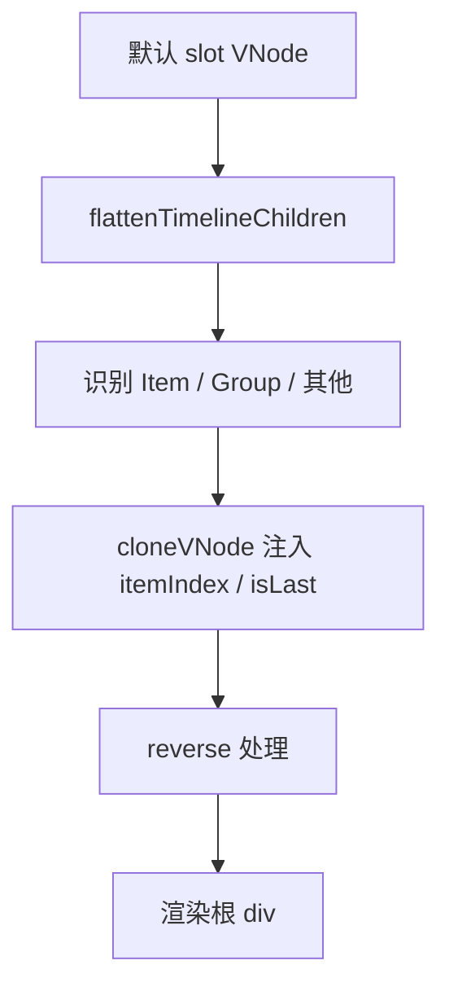
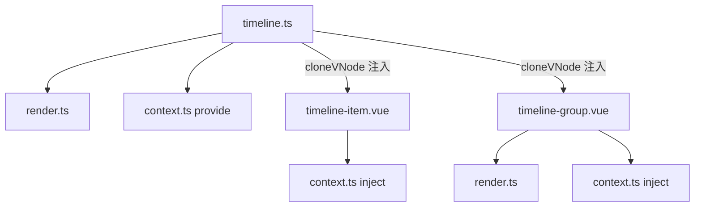

# 73 Timeline 时间线

> 导读：Timeline 是一个面向审计流、里程碑和活动记录的时间线组件，核心价值在于通过"扁平化 VNode + cloneVNode 注入元信息"的模式，将 itemIndex / isLast 等布局信息从业务层剥离

## 设计哲学

Timeline 解决的核心问题是：时间线节点的布局（左右交替、是否末尾、分组内索引）依赖于全局位置信息，而 Vue 的 slot 机制天然不具备"子组件知道自己在父组件中的位置"的能力。Timeline 通过"渲染函数扁平化 + cloneVNode 注入"解决了这个信息不对称。

关键设计决策：
- **渲染函数而非模板**：`XyTimeline` 使用 `defineComponent` + `render` 函数而非 SFC 模板。WHY：需要在渲染阶段遍历子 VNode、注入 `itemIndex` / `isLast` 等内部 props，模板语法无法实现这种"父改子"的操作。
- **flattenTimelineChildren**：将 Fragment / 文本节点 / 嵌套数组统一扁平化为一维 VNode 数组，再按类型（Item / Group / 其他）分别处理。
- **Group 内 itemIndex 连续**：`itemIndexBase` 确保跨 Group 的 itemIndex 全局连续，使 alternate 模式下左右交替逻辑不因分组而错乱。



## 源码架构

### 文件结构

```
packages/components/timeline/
├── src/
│   ├── timeline.ts         # Timeline 类型与渲染函数
│   ├── timeline-item.ts    # TimelineItem 类型
│   ├── timeline-item.vue   # TimelineItem 组件
│   ├── timeline-group.ts   # TimelineGroup 类型
│   ├── timeline-group.vue  # TimelineGroup 组件（渲染函数）
│   ├── context.ts          # provide/inject 上下文
│   └── render.ts           # VNode 扁平化与识别工具
├── __tests__/
└── index.ts
```

### 组件关系图



### 核心 type 定义

```ts
export type TimelineMode = "start" | "alternate" | "alternate-reverse" | "end";
export type TimelineDensity = "default" | "compact";
export type TimelineItemState = "default" | "done" | "current" | "pending" | "blocked";

export interface TimelineProps {
  mode?: TimelineMode;
  reverse?: boolean;
  density?: TimelineDensity;
}

export interface TimelineItemProps {
  timestamp?: string;
  hideTimestamp?: boolean;
  center?: boolean;
  placement?: "top" | "bottom";
  type?: "" | "primary" | "success" | "warning" | "danger";
  state?: TimelineItemState;
  color?: string;
  size?: "normal" | "large";
  icon?: string;
  hollow?: boolean;
}
```

## 核心实现

### VNode 扁平化与识别

`flattenTimelineChildren` 递归展开 Fragment、文本节点和嵌套数组，返回一维 VNode 数组。`isTimelineItemVNode` / `isTimelineGroupVNode` 通过组件 `name` 属性识别类型：

```ts
export function isTimelineItemVNode(node: VNode) {
  return getComponentName(node) === "XyTimelineItem";
}

export function countTimelineItemsInNode(node: VNode): number {
  if (isTimelineItemVNode(node)) return 1;
  if (isTimelineGroupVNode(node)) {
    return resolveTimelineGroupSlot(node)
      .reduce((count, child) => count + countTimelineItemsInNode(child), 0);
  }
  return 0;
}
```

WHY 用组件名识别而非 `instanceof`：VNode 阶段组件实例尚未创建，只能通过静态属性判断类型。

### cloneVNode 注入元信息

Timeline 在渲染时通过 `cloneVNode` 向子组件注入 `itemIndex` 和 `isLast`：

```ts
const children = orderedChildren.map((node, nodeIndex) => {
  if (isTimelineItemVNode(node)) {
    return cloneVNode(node, {
      itemIndex: currentItemIndex,
      isLast: currentItemIndex === totalItemCount - 1,
      key: node.key ?? `timeline-item-${currentItemIndex}`
    });
  }
  // Group 类似处理...
});
```

WHY 用 `cloneVNode` 而非 provide：`itemIndex` 是每个 Item 独有的值，provide/inject 的"一对多"语义不匹配。

### alternate 模式的 side 计算

`side` 决定节点在 alternate 布局中的左右位置：

```ts
const side = computed(() => {
  switch (currentMode.value) {
    case "alternate":
      return props.itemIndex % 2 === 0 ? "start" : "end";
    case "alternate-reverse":
      return props.itemIndex % 2 === 0 ? "end" : "start";
    case "end": return "end";
    default: return "start";
  }
});
```

### state 与 type 双维度

`type` 控制视觉语义色（primary / success / warning / danger），`state` 控制流程语义（done / current / pending / blocked）。两者可并存：一个节点可以同时是 `type="success"` + `state="done"`。

## API 参考

### Timeline Props

| 属性 | 类型 | 默认值 | 说明 |
|------|------|--------|------|
| mode | `"start" \| "end" \| "alternate" \| "alternate-reverse"` | `"start"` | 布局模式 |
| reverse | `boolean` | `false` | 是否反转顺序 |
| density | `"default" \| "compact"` | `"default"` | 信息密度 |

### TimelineItem Props

| 属性 | 类型 | 默认值 | 说明 |
|------|------|--------|------|
| timestamp | `string` | `""` | 时间戳文案 |
| hideTimestamp | `boolean` | `false` | 是否隐藏时间戳 |
| center | `boolean` | `false` | 时间戳居中（仅 alternate） |
| placement | `"top" \| "bottom"` | `"bottom"` | 时间戳位置 |
| type | `"" \| "primary" \| "success" \| "warning" \| "danger"` | `""` | 语义色 |
| state | `"default" \| "done" \| "current" \| "pending" \| "blocked"` | `"default"` | 流程态 |
| color | `string` | `""` | 自定义节点颜色 |
| size | `"normal" \| "large"` | `"normal"` | 节点尺寸 |
| icon | `string` | `""` | 节点图标名 |
| hollow | `boolean` | `false` | 是否空心节点 |

### TimelineItem Slots

| 名称 | 说明 |
|------|------|
| title | 主标题区 |
| meta | 辅助信息区 |
| actions | 右侧操作区 |
| default | 正文区 |
| extra | 扩展区 |
| dot | 自定义节点 |

### TimelineGroup Props

| 属性 | 类型 | 默认值 | 说明 |
|------|------|--------|------|
| title | `string` | `""` | 分组标题 |
| description | `string` | `""` | 分组描述 |
| divider | `boolean` | `true` | 是否显示分隔线 |

## 样式系统

### BEM 类名

| 类名 | 说明 |
|------|------|
| `xy-timeline` | 根容器 |
| `xy-timeline--start` | 左侧布局 |
| `xy-timeline--alternate` | 交替布局 |
| `xy-timeline-item` | 节点项 |
| `xy-timeline-item__node` | 节点圆点 |
| `xy-timeline-item__tail` | 连接尾线 |
| `xy-timeline-item__wrapper` | 内容包装器 |
| `xy-timeline-item__main` | 主内容区 |
| `xy-timeline-group` | 分组容器 |

### CSS 变量

| 变量 | 说明 |
|------|------|
| `--xy-timeline-node-color` | 节点颜色（可通过 item 的 color prop 动态设置） |
| `--xy-timeline-node-size` | 节点尺寸 |
| `--xy-timeline-tail-color` | 尾线颜色 |

## 小结

1. **渲染函数 + cloneVNode 注入**：突破 slot 信息不对称，子组件自动获得全局位置信息
2. **type + state 双维度**：视觉语义与流程语义独立控制，可并存不冲突
3. **Group 内 itemIndex 全局连续**：alternate 模式下跨分组交替不错乱