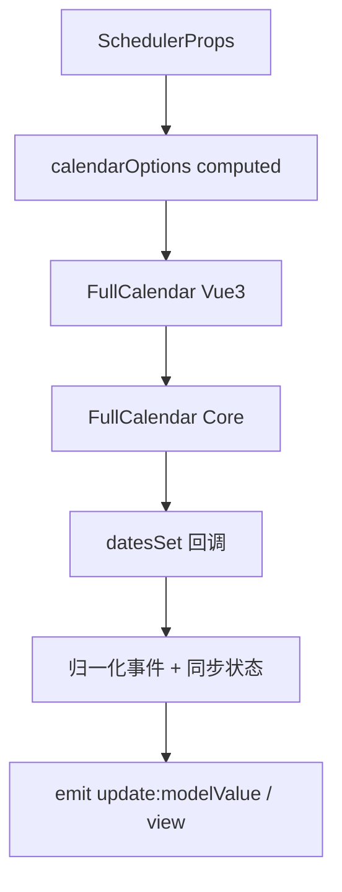
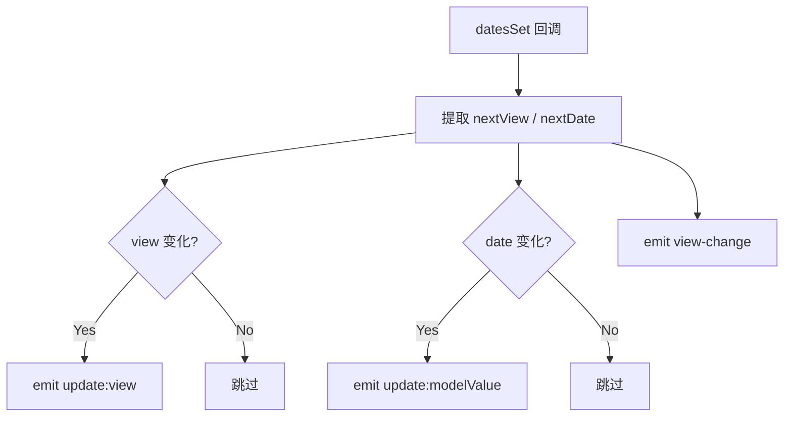

# 74 Scheduler 日程

> 导读：Scheduler 是一个面向排期、会议和活动管理的日历组件，核心价值在于以 FullCalendar 为底层引擎，通过"双层封装 + 事件归一化"的模式，将 FullCalendar 的命令式 API 收敛为声明式 Vue 组件，同时内置 RRule 重复事件引擎

## 设计哲学

Scheduler 解决的核心问题是：日历/排期场景中，FullCalendar 虽功能完备但 API 偏命令式，与 Vue 的声明式范式存在阻抗。直接使用 FullCalendar 的 Vue3 封装，业务层需要处理大量 `CalendarApi` 调用来同步状态。Scheduler 通过"props 驱动 + 事件归一化"将这个过程封装起来，开发者只需关注数据流，无需手动调用 API。

关键设计决策：
- **隐藏 headerToolbar，自建工具栏**：Scheduler 不使用 FullCalendar 的内置工具栏，而是在组件内自建导航栏（前一页/今天/下一页 + 视图切换）。WHY：FullCalendar 的 headerToolbar 是字符串配置式，难以嵌入自定义 UI（如中文按钮文案、自定义视图标签），自建工具栏获得完全控制权。
- **事件归一化层**：`SchedulerEvent` 与 FullCalendar 的 `EventInput` 之间存在映射（如 `rrule` 字段需展开为多个 `EventInput`），所有 FullCalendar 回调的 `EventApi` 对象也需反向归一化为 `SchedulerEvent`。WHY：业务层不应感知 FullCalendar 的数据结构，`SchedulerEvent` 是稳定的公共契约。
- **RRule 内置展开引擎**：组件内置了 `expandRecurringEvent` 函数，根据当前可见范围展开重复事件实例。WHY：FullCalendar 的 RRule 插件需要额外引入且配置复杂，内置引擎覆盖 DAILY / WEEKLY / MONTHLY / YEARLY 四种频率，零依赖。



## 源码架构

### 文件结构

```
packages/components/scheduler/
├── src/
│   ├── scheduler.ts        # 类型定义 + 工具函数（约 900 行）
│   └── scheduler.vue       # 组件实现
├── __tests__/
└── index.ts
```

### 组件关系图

```mermaid
graph LR
    SchedulerVue[scheduler.vue] ├── FullCalendar["@fullcalendar/vue3"]
    SchedulerVue ├── SchedulerTs[scheduler.ts 工具层]
    SchedulerVue └── NS[useNamespace]
    SchedulerTs └── Expand[expandRecurringEvent]
```

### 核心 type 定义

```ts
export type SchedulerView = "month" | "week" | "day";
export type SchedulerDateInput = string | Date;

export interface SchedulerEvent {
  id: string;
  title: string;
  start: SchedulerDateInput;
  end?: SchedulerDateInput;
  allDay?: boolean;
  rrule?: SchedulerRRuleInput;
  duration?: string;
  editable?: boolean;
  className?: string | string[];
  sourceId?: string;
  occurrenceStart?: string;
  extendedProps?: Record<string, unknown>;
}

export interface SchedulerProps {
  modelValue?: string;
  view?: SchedulerView;
  views?: SchedulerView[];
  events?: SchedulerEvent[];
  locale?: string;
  editable?: boolean;
  droppable?: boolean;
  selectable?: boolean;
  selectMirror?: boolean;
  weekStart?: 0 | 1 | 2 | 3 | 4 | 5 | 6;
  height?: string | number;
  showNowIndicator?: boolean;
}
```

## 核心实现

### 双层封装：props -> calendarOptions

Scheduler 将所有业务 props 编译为 FullCalendar 的 `CalendarOptions`，通过 computed 响应式驱动：

```ts
const calendarOptions = computed<CalendarOptions>(() => ({
  plugins: [dayGridPlugin, timeGridPlugin, interactionPlugin],
  initialView: toFullCalendarView(resolvedView.value),
  initialDate: props.modelValue,
  headerToolbar: false,
  editable: hasEditableInteractions.value,
  events: mappedEvents.value,
  dateClick: handleDateClick,
  eventClick: handleEventClick,
  datesSet: handleDatesSet,
  // ...
}));
```

WHY 用 computed 而非 watch + setOption：FullCalendar 的 Vue3 封装会在 options 变化时自动重新渲染，无需手动调用 `setOption`。computed 天然支持响应式追踪。

### RRule 展开引擎

重复事件的核心在 `expandRecurringEvent` 函数中。它接收一个带 `rrule` 字段的 `SchedulerEvent`，解析 RRule 参数后按频率分支展开：

```ts
function expandRecurringEvent(event, options): EventInput[] {
  const rule = parseSchedulerRRule(event.rrule, ...);
  if (!rule) return [];
  const { start, end } = getVisibleRange(options.anchorDate, options.view, options.weekStart);
  const occurrences =
    rule.freq === "DAILY"   ? expandDailyOccurrences(rule, start, end) :
    rule.freq === "WEEKLY"  ? expandWeeklyOccurrences(rule, start, end) :
    rule.freq === "MONTHLY" ? expandMonthlyOccurrences(rule, start, end) :
                              expandYearlyOccurrences(rule, start, end);
  return occurrences.map((occurrence, index) => ({
    ...event,
    id: `${event.id}__${occurrence.getTime()}__${index}`,
    rrule: undefined,
    extendedProps: { ...event.extendedProps, schedulerSourceId: event.id }
  }));
}
```

WHY 按频率分支而非统一递推：不同频率的 byweekday / bymonthday / bymonth 约束逻辑差异大，分支展开更清晰、更易测试。

### 事件归一化

FullCalendar 的回调参数是 `EventApi` 等内部对象，Scheduler 通过 `build*Payload` 函数将其归一化为业务层的 `SchedulerEvent` 等类型：

```ts
export function normalizeSchedulerEvent(eventApi): SchedulerEvent {
  const extendedProps = { ...(eventApi.extendedProps ?? {}) };
  const sourceId = typeof extendedProps.schedulerSourceId === "string"
    ? extendedProps.schedulerSourceId : undefined;
  delete extendedProps.schedulerSourceId;
  delete extendedProps.schedulerOccurrenceStart;
  return { id: eventApi.id, title: eventApi.title, start: ..., sourceId, ... };
}
```

WHY 删除 `schedulerSourceId` / `schedulerOccurrenceStart`：这些是内部展开引擎注入的追踪字段，业务层不应看到。

### datesSet 双向同步

`datesSet` 是 FullCalendar 在视图范围变化时触发的回调，Scheduler 借此实现双向绑定：



关键设计点：`initialized` 标志位跳过首次回调（首次由 `initialView` / `initialDate` 触发，不应 emit 变更）。

### Slot 透传

Scheduler 支持 `event-content` 和 `day-cell-content` 两个插槽，内部将 FullCalendar 的 slot props 转换为业务层类型：

```ts
function getEventContentSlotProps(arg: EventContentArg) {
  return buildSchedulerEventContentSlotProps(arg);
}
```

WHY 不直接暴露 FullCalendar 的 slot props：避免业务层依赖 `@fullcalendar/core` 的类型定义。

## API 参考

### Props

| 属性 | 类型 | 默认值 | 说明 |
|------|------|--------|------|
| modelValue | `string` | — | 当前锚点日期，支持 v-model |
| view | `SchedulerView` | `"month"` | 当前视图模式 |
| views | `SchedulerView[]` | `["month","week","day"]` | 可用视图列表 |
| events | `SchedulerEvent[]` | `[]` | 事件列表 |
| locale | `string` | `"zh-cn"` | 语言环境 |
| editable | `boolean` | `false` | 是否可拖拽/缩放事件 |
| droppable | `boolean` | `false` | 是否接受外部拖入 |
| selectable | `boolean` | `false` | 是否可框选日期范围 |
| selectMirror | `boolean` | `true` | 框选时是否显示镜像 |
| weekStart | `0-6` | `1` | 周起始日（1=周一） |
| height | `string \| number` | `"auto"` | 日历高度 |
| showNowIndicator | `boolean` | `true` | 是否显示当前时间指示线 |

### Events

| 事件 | 参数 | 说明 |
|------|------|------|
| update:modelValue | `(value: string)` | 锚点日期变化 |
| update:view | `(value: SchedulerView)` | 视图模式变化 |
| date-click | `(payload: SchedulerDateClickPayload)` | 日期点击 |
| date-select | `(payload: SchedulerDateSelectPayload)` | 日期范围选择 |
| event-click | `(payload: SchedulerEventClickPayload)` | 事件点击 |
| event-change | `(payload: SchedulerEventChangePayload)` | 事件拖拽/缩放变更 |
| event-receive | `(payload: SchedulerEventReceivePayload)` | 外部拖入事件 |
| drop | `(payload: SchedulerDropPayload)` | 外部元素放置 |
| view-change | `(payload: SchedulerViewChangePayload)` | 视图/日期综合变更 |

### Slots

| 名称 | 参数 | 说明 |
|------|------|------|
| event-content | `SchedulerEventContentSlotProps` | 自定义事件内容 |
| day-cell-content | `SchedulerDayCellContentSlotProps` | 自定义日期单元格内容 |

### Exposes

| 名称 | 类型 | 说明 |
|------|------|------|
| getApi | `() => CalendarApi \| null` | 获取 FullCalendar 原始 API |

## 样式系统

Scheduler 自建工具栏样式，FullCalendar 渲染区域仅做最小化覆盖。

### BEM 类名

| 类名 | 说明 |
|------|------|
| `xy-scheduler` | 根容器 |
| `xy-scheduler__toolbar` | 工具栏 |
| `xy-scheduler__nav-group` | 导航按钮组 |
| `xy-scheduler__nav-button` | 导航按钮 |
| `xy-scheduler__title` | 当前标题 |
| `xy-scheduler__view-group` | 视图切换按钮组 |
| `xy-scheduler__view-button` | 视图切换按钮 |
| `xy-scheduler__surface` | FullCalendar 渲染容器 |
| `xy-scheduler__calendar` | FullCalendar 组件 |

### CSS 变量

| 变量 | 说明 |
|------|------|
| `--xy-scheduler-toolbar-height` | 工具栏高度 |
| `--xy-scheduler-toolbar-gap` | 工具栏元素间距 |

## 小结

1. **双层封装**：隐藏 FullCalendar 命令式 API，暴露声明式 props + 事件，业务层零 API 调用
2. **RRule 内置引擎**：DAILY / WEEKLY / MONTHLY / YEARLY 四频率展开，按可见范围裁剪，零外部依赖
3. **事件归一化**：`SchedulerEvent` 是业务层的稳定契约，FullCalendar 的 `EventApi` / `EventInput` 对业务层完全透明