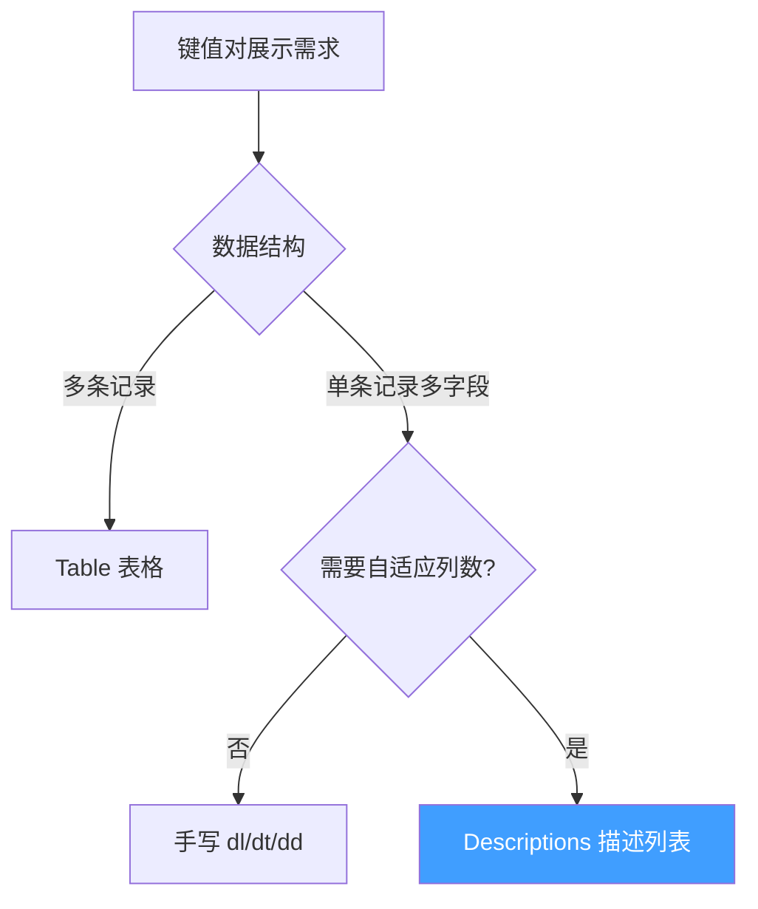
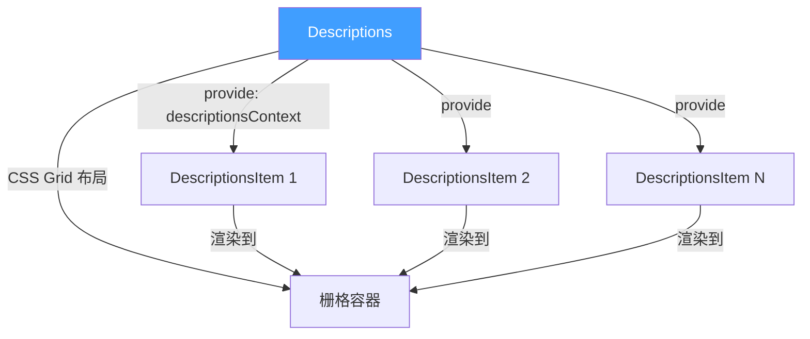
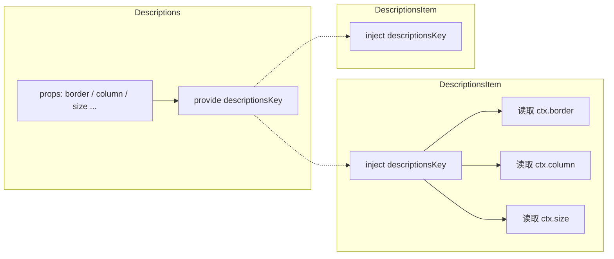
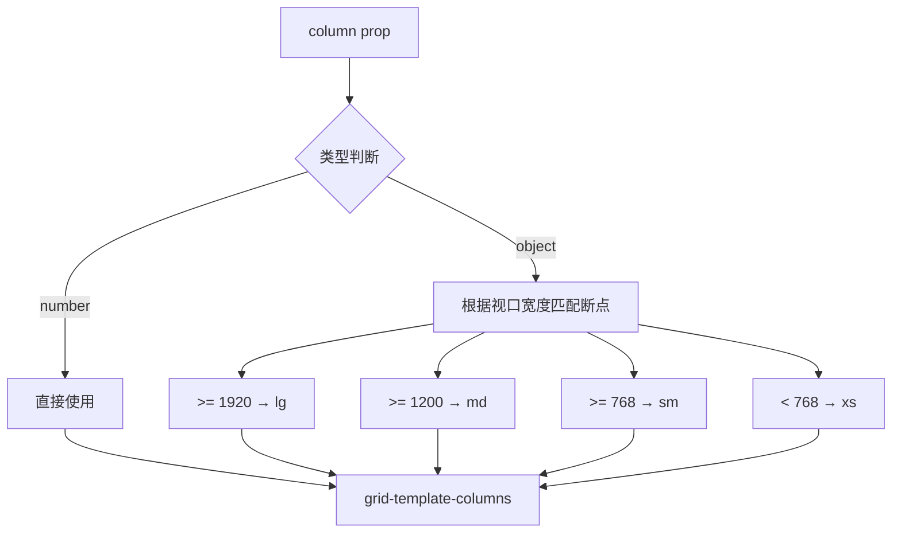
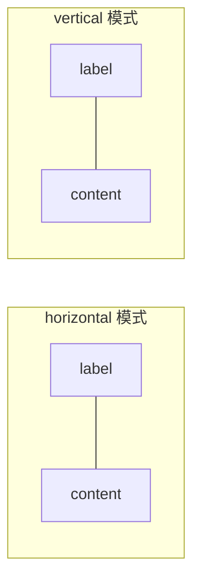

# 75 Descriptions 描述列表

> 导读：基于栅格布局的键值对描述组件，通过 Descriptions + DescriptionsItem 的组合模式实现列表信息的结构化展示，支持自适应列数与响应式布局

## 设计哲学

### 为什么需要 Descriptions

在后台系统中，"详情页"是最常见的页面类型 — 一组键值对以表格或列表的形式呈现。原生方案有两个选择：

1. **表格（Table）** — 语义偏数据，每行一条记录，不适合"一条记录多个字段"的展示
2. **手写 HTML** — `<dl>/<dt>/<dd>` 或 flex 布局，无法自适应列数，重复代码多

Descriptions 的核心价值是 **"用声明式组件解决键值对布局"** — 业务只需关注数据（label + value），列数分配、边框绘制、响应式断点全部由组件处理。

### 设计决策



| 决策点 | 选择 | 理由 |
|--------|------|------|
| 组件模式 | 父子组合（Descriptions + Item） | 与 Table + TableColumn 心智一致，字段定义灵活 |
| 布局引擎 | CSS Grid | 天然支持列数控制与响应式，无需 JS 计算宽度 |
| 状态共享 | provide/inject | 父组件的 column/border/size 等配置需透传给子 Item |
| 渲染策略 | 全量渲染 + CSS 分列 | 比 JS 分组更稳定，避免 children 顺序依赖 |

## 源码架构

### 文件结构

```
packages/components/descriptions/
├── index.ts                        # 模块导出入口
└── src/
    ├── descriptions.ts             # Descriptions 类型 & props
    ├── descriptions.vue            # Descriptions 父组件
    ├── descriptions-item.vue       # DescriptionsItem 子组件
    └── context.ts                  # provide/inject 上下文定义
```

### 组件关系图



### 核心 Type 定义

```ts
/** 布局模式 */
type DescriptionsLayout = 'horizontal' | 'vertical'

/** 尺寸 */
type DescriptionsSize = 'large' | 'default' | 'small'

/** 列配置 */
type DescriptionsColumn = number | Record<number, number>

/** Descriptions Props */
interface DescriptionsProps {
  border?: boolean
  column?: DescriptionsColumn
  direction?: DescriptionsLayout
  size?: DescriptionsSize
  title?: string
  extra?: string
  colon?: boolean
  labelWidth?: string | number
  labelAlign?: 'left' | 'center' | 'right'
  contentAlign?: 'left' | 'center' | 'right'
}

/** DescriptionsItem Props */
interface DescriptionsItemProps {
  label?: string
  span?: number
  labelWidth?: string | number
  labelAlign?: 'left' | 'center' | 'right'
  contentAlign?: 'left' | 'center' | 'right'
  class?: string | Record<string, boolean>
}

/** provide/inject 上下文 */
interface DescriptionsContext {
  border: boolean
  direction: DescriptionsLayout
  size: DescriptionsSize
  column: DescriptionsColumn
  colon: boolean
  labelWidth: string | number | undefined
  labelAlign: 'left' | 'center' | 'right'
  contentAlign: 'left' | 'center' | 'right'
}
```

## 核心实现

### 1. provide/inject 上下文共享

**WHY** — DescriptionsItem 需要读取父组件的 border/direction/size 等配置来决定自身渲染方式（是否显示边框、label 位置等），但不应通过 props 逐层传递。

```ts
// context.ts — 上下文键与类型
import type { InjectionKey } from 'vue'

export interface DescriptionsContext {
  border: boolean
  direction: DescriptionsLayout
  size: DescriptionsSize
  column: DescriptionsColumn
  colon: boolean
  labelWidth: string | number | undefined
  labelAlign: 'left' | 'center' | 'right'
  contentAlign: 'left' | 'center' | 'right'
}

export const descriptionsKey: InjectionKey<DescriptionsContext> =
  Symbol('descriptions')

// descriptions.vue — provide
provide(descriptionsKey, {
  border: props.border,
  direction: props.direction,
  size: props.size,
  column: props.column,
  colon: props.colon,
  labelWidth: props.labelWidth,
  labelAlign: props.labelAlign,
  contentAlign: props.contentAlign,
})

// descriptions-item.vue — inject
const ctx = inject(descriptionsKey)!
```



### 2. CSS Grid 响应式布局

**WHY** — Descriptions 的核心能力是"指定列数，自动换行"。CSS Grid 的 `grid-template-columns` 天然支持此需求，且配合媒体查询可实现响应式。

```ts
// 计算 grid-template-columns
const gridStyle = computed(() => {
  const col = resolveColumn(props.column)  // 解析响应式列数
  const labelW = normalizeWidth(ctx.labelWidth)
  return {
    'grid-template-columns':
      `repeat(${col}, ${labelW ? `${labelW} 1fr` : 'minmax(120px, 1fr) 2fr'})`,
  }
})

// 响应式列数解析
function resolveColumn(column: DescriptionsColumn): number {
  if (typeof column === 'number') return column
  // column 为 { xs: 1, sm: 2, md: 3, lg: 4 } 形式
  const width = window.innerWidth
  if (width >= 1920) return column.lg ?? column.md ?? 3
  if (width >= 1200) return column.md ?? 3
  if (width >= 768)  return column.sm ?? column.md ?? 2
  return column.xs ?? 1
}
```



### 3. DescriptionsItem 渲染策略

**WHY** — 每个 Item 渲染为一个"label + content"的格子对。horizontal 模式下 label 和 content 左右排列，vertical 模式下上下排列。

```vue
<!-- descriptions-item.vue 核心模板 -->
<template>
  <div
    :class="[
      'xy-descriptions-item',
      `xy-descriptions-item--${ctx.direction}`,
      `xy-descriptions-item--${ctx.size}`,
      { 'xy-descriptions-item--border': ctx.border }
    ]"
    :style="itemStyle"
  >
    <label
      class="xy-descriptions-item__label"
      :style="labelStyle"
    >
      {{ label }}
      <span v-if="ctx.colon">:</span>
    </label>
    <div
      class="xy-descriptions-item__content"
      :style="contentStyle"
    >
      <slot />
    </div>
  </div>
</template>
```

```ts
// label 样式：支持单独覆盖宽度与对齐
const labelStyle = computed(() => ({
  width: normalizeWidth(props.labelWidth ?? ctx.labelWidth),
  textAlign: props.labelAlign ?? ctx.labelAlign,
}))

// content 样式
const contentStyle = computed(() => ({
  textAlign: props.contentAlign ?? ctx.contentAlign,
}))

// span 支持：跨多列
const itemStyle = computed(() => {
  if (!props.span || props.span <= 1) return {}
  return { gridColumn: `span ${props.span * 2}` }  // 每列占2个grid轨道（label+content）
})
```



### 4. 标题与操作区

**WHY** — 详情页通常需要标题和操作区（如编辑按钮），Descriptions 内置 title/extra 插槽避免业务额外布局。

```vue
<!-- descriptions.vue 标题区 -->
<div v-if="title || $slots.title || extra || $slots.extra"
     class="xy-descriptions__header">
  <div class="xy-descriptions__title">
    <slot name="title">{{ title }}</slot>
  </div>
  <div class="xy-descriptions__extra">
    <slot name="extra">{{ extra }}</slot>
  </div>
</div>
```

## API 参考

### Descriptions Props

| 属性 | 类型 | 默认值 | 说明 |
|------|------|--------|------|
| border | `boolean` | `false` | 是否显示边框 |
| column | `number \| Record<number, number>` | `3` | 列数或响应式列数配置 |
| direction | `'horizontal' \| 'vertical'` | `'horizontal'` | 排列方向 |
| size | `'large' \| 'default' \| 'small'` | `'default'` | 尺寸 |
| title | `string` | `''` | 标题文本 |
| extra | `string` | `''` | 操作区文本 |
| colon | `boolean` | `true` | label 后是否显示冒号 |
| labelWidth | `string \| number` | — | label 宽度 |
| labelAlign | `'left' \| 'center' \| 'right'` | `'right'` | label 对齐方式 |
| contentAlign | `'left' \| 'center' \| 'right'` | `'left'` | content 对齐方式 |

### DescriptionsItem Props

| 属性 | 类型 | 默认值 | 说明 |
|------|------|--------|------|
| label | `string` | `''` | 字段标签 |
| span | `number` | `1` | 占据列数 |
| labelWidth | `string \| number` | — | 覆盖父级 label 宽度 |
| labelAlign | `'left' \| 'center' \| 'right'` | — | 覆盖父级 label 对齐 |
| contentAlign | `'left' \| 'center' \| 'right'` | — | 覆盖父级 content 对齐 |

### Descriptions Slots

| 插槽名 | 作用域参数 | 说明 |
|--------|-----------|------|
| default | — | DescriptionsItem 子组件 |
| title | — | 标题区自定义内容 |
| extra | — | 操作区自定义内容 |

### DescriptionsItem Slots

| 插槽名 | 作用域参数 | 说明 |
|--------|-----------|------|
| default | — | 字段值内容 |

## 样式系统

### BEM 类名

| 类名 | 说明 |
|------|------|
| `xy-descriptions` | 根容器 |
| `xy-descriptions__header` | 标题栏容器 |
| `xy-descriptions__title` | 标题文本 |
| `xy-descriptions__extra` | 操作区 |
| `xy-descriptions__body` | 内容栅格容器 |
| `xy-descriptions-item` | 单个字段行 |
| `xy-descriptions-item--horizontal` | 水平布局修饰 |
| `xy-descriptions-item--vertical` | 垂直布局修饰 |
| `xy-descriptions-item--border` | 带边框修饰 |
| `xy-descriptions-item--large` | 大尺寸修饰 |
| `xy-descriptions-item--small` | 小尺寸修饰 |
| `xy-descriptions-item__label` | 字段标签 |
| `xy-descriptions-item__content` | 字段内容 |

### CSS 变量

| 变量名 | 默认值 | 说明 |
|--------|--------|------|
| `--xy-descriptions-bg` | `#fff` | 背景色 |
| `--xy-descriptions-border-color` | `#ebeef5` | 边框颜色 |
| `--xy-descriptions-label-color` | `#909399` | label 文字颜色 |
| `--xy-descriptions-label-bg` | `#fafafa` | label 背景色（带边框模式） |
| `--xy-descriptions-content-color` | `#303133` | content 文字颜色 |
| `--xy-descriptions-font-size` | `14px` | 字号 |
| `--xy-descriptions-item-gap` | `16px 0` | 字段间距 |
| `--xy-descriptions-label-padding` | `0 12px` | label 内边距 |

## 小结

1. **provide/inject 上下文驱动** — 父组件的 border/size/column 等配置通过 inject 透传给所有子 Item，避免 props 层层传递
2. **CSS Grid 原生响应式** — 用 `grid-template-columns` 控制列数，`span` 通过 `grid-column` 跨列，零 JS 计算、性能最优
3. **父子组合模式** — Descriptions + DescriptionsItem 与 Table + TableColumn 同构，降低学习成本
