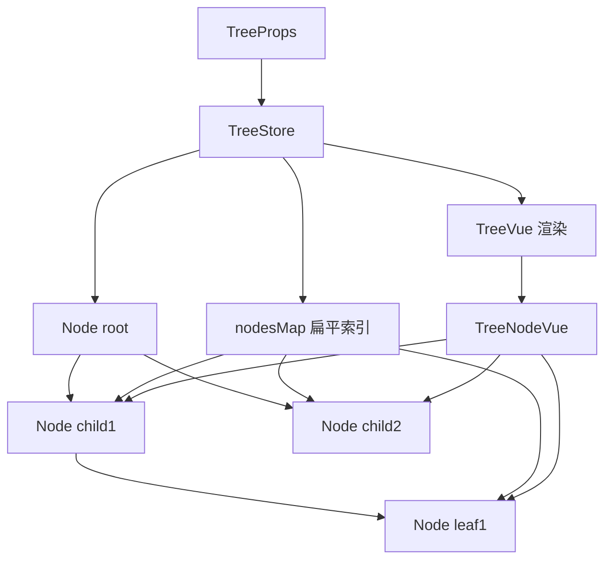
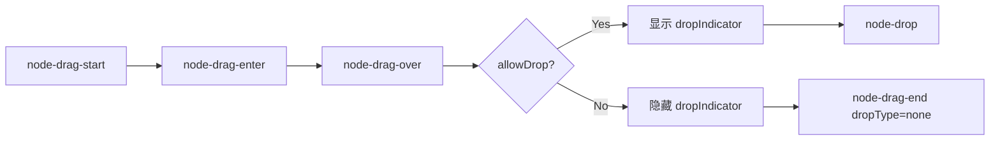

# 76 Tree 树形控件

> 导读：Tree 是一个面向层级数据展示和操作的树形组件，核心价值在于通过"TreeStore + Node 双层模型"的模式，将树的状态管理（勾选联动、展开折叠、过滤、懒加载）从视图层完全剥离，Vue 组件只负责渲染和事件转发

## 设计哲学

Tree 解决的核心问题是：树形数据的状态管理远比展示复杂。勾选联动需要向上冒泡到祖先（半选状态）和向下传播到后代，过滤需要保持祖先链路的可见性，懒加载需要管理节点的加载/失败/重试状态，拖拽需要验证落点合法性。如果把这些逻辑写在 Vue 组件的 setup 中，代码会变成一团耦合的 computed 和 watch。Tree 通过"TreeStore + Node 双层模型"将状态管理完全剥离到纯 JavaScript 类中。

关键设计决策：
- **TreeStore + Node 双层模型**：`TreeStore` 管理全局状态（nodesMap、currentNode、默认展开/勾选），`Node` 管理单节点状态（checked、indeterminate、expanded、visible、loading）。WHY：状态逻辑与渲染逻辑分离，TreeStore/Node 可独立测试，Vue 组件只负责"读状态 -> 渲染 -> 转发事件"。
- **nodesMap 扁平索引**：TreeStore 维护 `nodesMap: Record<string, Node>` 的扁平索引，`getNode(key)` 的查询复杂度为 O(1)。WHY：树操作（勾选、展开、定位）频繁需要按 key 查找节点，递归遍历的 O(n) 复杂度在大规模树下不可接受。
- **reactive 包裹 Node 实例**：`insertChild` 中使用 `reactive(new Node(...))` 包裹新节点，使 Node 的属性变化能触发 Vue 的响应式更新。WHY：Node 是纯 JS 类，本身不具备响应性；reactive 包裹后 Vue 模板中访问 `node.checked` 等属性才能自动更新。



## 源码架构

### 文件结构

```
packages/components/tree/
├── src/
│   ├── tree.ts              # Tree 类型定义与 props/emits 声明
│   ├── tree.vue             # Tree 主组件（provide + 状态同步 + 方法暴露）
│   ├── tree-node.vue        # TreeNode 渲染组件
│   ├── tree-node.ts         # TreeNode 类型定义
│   ├── tree.type.ts         # 公共类型定义
│   ├── model/
│   │   ├── tree-store.ts    # TreeStore 全局状态管理
│   │   ├── node.ts          # Node 单节点状态管理
│   │   ├── use-drag-node.ts # 拖拽逻辑
│   │   └── util.ts          # 工具函数
│   └── tokens.ts            # provide/inject key
├── __tests__/
└── index.ts
```

### 组件关系图

```mermaid
graph TD
    TreeVue[tree.vue] ├── TreeStore[model/tree-store.ts]
    TreeVue ├── Node[model/node.ts]
    TreeVue ├── TreeNodeVue[tree-node.vue]
    TreeVue ├── DragHandler[use-drag-node.ts]
    TreeVue └── Tokens[tokens.ts provide]
    TreeNodeVue └── Tokens2[tokens.ts inject]
    TreeStore └── Node
    Node └── Node["递归 childNodes"]
```

### 核心 type 定义

```ts
export interface TreeProps {
  data?: TreeData;
  nodeKey?: string;
  checkStrictly?: boolean;
  checkDescendants?: boolean;
  defaultExpandAll?: boolean;
  expandOnClickNode?: boolean;
  showCheckbox?: boolean;
  lazy?: boolean;
  draggable?: boolean;
  highlightCurrent?: boolean;
  load?: LoadFunction;
  filterNodeMethod?: FilterNodeMethodFunction;
  accordion?: boolean;
  indent?: number;
  icon?: string | Component;
  props?: TreeOptionProps;
  defaultCheckedKeys?: TreeKey[];
  defaultExpandedKeys?: TreeKey[];
  currentNodeKey?: TreeKey | null;
}
```

## 核心实现

### Node 的勾选联动算法

Node 的 `setChecked` 方法是 Tree 中最复杂的逻辑，处理四种场景：叶子节点、分支节点、懒加载未加载节点、checkStrictly 模式。

```ts
setChecked(value, deep = false, recursion = false, passValue = false) {
  this.indeterminate = value === "half";
  this.checked = value === true;

  if (this.store.checkStrictly) return; // 严格模式跳过联动

  // 向下传播
  if (!(this.shouldLoadData() && !this.store.checkDescendants)) {
    this.childNodes.forEach((child) => {
      const nextChecked = child.disabled && child.isLeaf ? child.checked : passValue;
      child.setChecked(nextChecked, deep, true, passValue);
    });
  }

  // 向上冒泡
  if (!this.parent || this.parent.level === 0 || recursion) return;
  reInitChecked(this.parent);
}
```

向上冒泡的 `reInitChecked` 通过 `getChildState` 汇总子节点状态：

```ts
function getChildState(nodes: Node[]): TreeNodeChildState {
  let all = true, none = true;
  nodes.forEach((node) => {
    if (node.checked !== true || node.indeterminate) all = false;
    if (node.checked !== false || node.indeterminate) none = false;
  });
  return { all, none, half: !all && !none };
}
```

WHY 不用 Set 简化：三态逻辑（全选/半选/无选）需要同时判断 all 和 none，Set 的去重特性会丢失中间态信息。

### 过滤与祖先链路保留

TreeStore 的 `filter` 方法递归遍历节点树，关键逻辑是"子节点可见则父节点也可见"：

```ts
filter(value: FilterValue): void {
  const traverse = (node) => {
    const childNodes = node instanceof TreeStore ? node.root.childNodes : node.childNodes;
    childNodes.forEach((child) => {
      child.visible = !value
        ? true
        : Boolean(this.filterNodeMethod?.call(child, value, child.data, child));
      traverse(child);
    });
    // 祖先链路保留：子节点可见 -> 父节点可见
    if (!(node instanceof TreeStore) && !node.visible && childNodes.length > 0) {
      node.visible = childNodes.some((child) => child.visible);
    }
    // 过滤命中的非叶子节点自动展开
    if (!value && !(node instanceof TreeStore) && node.visible && !node.isLeaf) {
      if (!this.lazy || node.loaded) node.expand();
    }
  };
  traverse(this);
}
```

WHY 两遍遍历而非一遍：先自顶向下标记 visible，再通过 `some` 向上冒泡保留祖先。单遍遍历无法保证祖先在子节点之前被处理。

### 懒加载与失败重试

Node 的 `loadData` 方法实现懒加载，关键点是 resolve/reject 双回调：

```ts
loadData(callback, defaultProps = {}) {
  if (!this.store.lazy || !this.store.load || this.loaded || this.loading) {
    callback?.(); return;
  }
  this.loading = true;
  this.loadFailed = false;
  const resolve = (children) => {
    this.childNodes = [];
    this.doCreateChildren(children, defaultProps);
    this.loaded = true;
    this.loading = false;
    this.loadFailed = false;
    this.updateLeafState();
    callback?.(children);
  };
  const reject = () => {
    this.loading = false;
    this.loadFailed = true;
  };
  this.store.load(this, resolve, reject);
}
```

WHY `this.loaded` 和 `this.loading` 双标志：`loaded` 表示数据已加载（无论成功失败），`loading` 表示正在加载中。`loadFailed` 独立于 `loaded`，用于 UI 展示"加载失败，点击重试"提示。

### 键盘导航

Tree 组件实现了完整的键盘导航（方向键、Enter、Space），通过 `handleKeydown` 方法处理：

```ts
function handleKeydown(event: KeyboardEvent) {
  const visibleNodes = focusableNodes.value;
  // ArrowDown/Up: 在可见节点间移动
  // ArrowRight: 展开当前节点 / 进入第一个子节点
  // ArrowLeft: 折叠当前节点 / 返回父节点
  // Enter/Space: 切换勾选 / 点击节点
}
```

WHY 独立的 `focusableNodes` 而非 `visibleNodes`：focusableNodes 排除了 disabled 节点，保证键盘导航不会聚焦到不可操作节点。

### 拖拽编排

拖拽逻辑封装在 `useDragNodeHandler` composable 中，支持 `before / inner / after` 三种落点类型。`allowDrag` / `allowDrop` 提供约束回调，`dropIndicator` 渲染落点指示线。



## API 参考

### Tree Props

| 属性 | 类型 | 默认值 | 说明 |
|------|------|--------|------|
| data | `TreeData` | `[]` | 树节点数据 |
| nodeKey | `string` | — | 节点唯一 key 字段名 |
| props | `TreeOptionProps` | `{children,label,disabled}` | 节点字段映射 |
| showCheckbox | `boolean` | `false` | 是否显示勾选框 |
| checkStrictly | `boolean` | `false` | 勾选时是否取消父子联动 |
| checkDescendants | `boolean` | `false` | 懒加载节点勾选是否传播到后代 |
| defaultExpandAll | `boolean` | `false` | 是否默认展开全部 |
| expandOnClickNode | `boolean` | `true` | 点击节点内容是否触发展开 |
| highlightCurrent | `boolean` | `false` | 是否高亮当前节点 |
| lazy | `boolean` | `false` | 是否启用懒加载 |
| load | `LoadFunction` | — | 懒加载回调 |
| draggable | `boolean` | `false` | 是否启用拖拽 |
| accordion | `boolean` | `false` | 是否手风琴模式 |
| indent | `number` | `18` | 层级缩进宽度 |
| icon | `string \| Component` | `"mdi:chevron-right"` | 展开图标 |
| defaultCheckedKeys | `TreeKey[]` | — | 默认勾选 key 列表 |
| defaultExpandedKeys | `TreeKey[]` | — | 默认展开 key 列表 |
| currentNodeKey | `TreeKey \| null` | — | 当前节点 key |
| filterNodeMethod | `FilterNodeMethodFunction` | — | 节点过滤函数 |
| allowDrag | `AllowDragFunction` | — | 控制节点是否允许拖动 |
| allowDrop | `AllowDropFunction` | — | 控制落点是否允许放置 |
| emptyText | `string` | `"暂无数据"` | 空态文案 |

### Events

| 事件 | 参数 | 说明 |
|------|------|------|
| node-click | `(data, node, instance, event)` | 节点点击 |
| node-contextmenu | `(event, data, node, instance)` | 节点右键 |
| current-change | `(data, node)` | 当前节点变化 |
| node-expand | `(data, node, instance)` | 节点展开 |
| node-collapse | `(data, node, instance)` | 节点折叠 |
| check-change | `(data, checked, indeterminate)` | 勾选状态变化 |
| check | `(data, checkedInfo)` | 点击勾选框 |
| node-drag-start | `(node, event)` | 开始拖拽 |
| node-drag-end | `(node, dropNode, dropType, event, detail)` | 拖拽结束 |
| node-drop | `(node, dropNode, dropType, event, detail)` | 成功放置 |

### Slots

| 名称 | 说明 |
|------|------|
| default | 自定义节点内容 |
| empty | 自定义空态 |

### Exposes（实例方法）

| 名称 | 说明 |
|------|------|
| filter | 过滤全部节点 |
| getNode | 按 key 获取节点实例 |
| getNodePath | 获取节点从根到当前的路径 |
| getCheckedNodes | 获取勾选节点数据 |
| setCheckedNodes | 按节点数据设置勾选 |
| getCheckedKeys | 获取勾选 key 列表 |
| setCheckedKeys | 按 key 列表设置勾选 |
| setChecked | 设置单个节点勾选 |
| getHalfCheckedNodes | 获取半选节点 |
| getHalfCheckedKeys | 获取半选 key |
| getCurrentNode | 获取当前节点数据 |
| getCurrentKey | 获取当前节点 key |
| setCurrentKey | 按 key 设置当前节点 |
| setCurrentNode | 按数据设置当前节点 |
| remove | 删除节点 |
| append | 追加子节点 |
| insertBefore | 在指定节点前插入 |
| insertAfter | 在指定节点后插入 |
| updateKeyChildren | 替换节点子树 |

## 样式系统

### BEM 类名

| 类名 | 说明 |
|------|------|
| `xy-tree` | 根容器 |
| `xy-tree--highlight-current` | 高亮当前节点修饰符 |
| `xy-tree-node` | 节点容器 |
| `xy-tree-node__content` | 节点内容区 |
| `xy-tree-node__expand-icon` | 展开图标 |
| `xy-tree-node__label` | 节点文本 |
| `xy-tree-node__checkbox` | 勾选框 |
| `xy-tree-node__loading` | 加载指示器 |
| `xy-tree__empty-block` | 空态区域 |
| `xy-tree__drop-indicator` | 拖拽落点指示线 |

### CSS 变量

| 变量 | 说明 | 默认值 |
|------|------|--------|
| `--xy-tree-node-content-height` | 节点内容区高度 | `26px` |
| `--xy-tree-indent` | 层级缩进宽度 | `18px` |
| `--xy-tree-text-color` | 节点文本颜色 | `var(--xy-text-color)` |
| `--xy-tree-node-hover-background` | 节点 hover 背景 | `var(--xy-fill-color-light)` |
| `--xy-tree-node-current-background` | 当前节点背景 | `var(--xy-color-primary-light-9)` |

## 小结

1. **TreeStore + Node 双层模型**：状态管理完全剥离到纯 JS 类，Vue 组件只负责渲染和事件转发，逻辑可独立测试
2. **勾选联动三态算法**：`getChildState` 汇总子节点 all/none/half，向上冒泡 + 向下传播，checkStrictly 模式跳过联动
3. **nodesMap 扁平索引**：O(1) 查询任意节点，大规模树下性能有保障
4. **过滤保留祖先链路**：子节点可见时父节点强制可见，过滤命中的非叶子节点自动展开