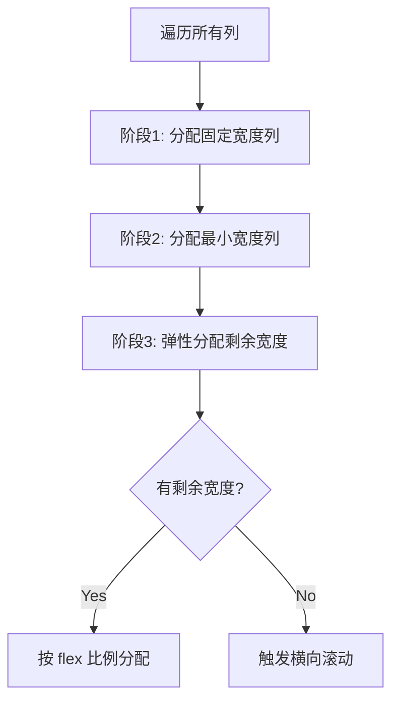

# 77 Table 表格

> 导读：Table 是一个面向结构化数据展示和操作的高级表格组件，核心价值在于通过"Store 模式 + Column 配置化 + Layout 计算层"的三层架构，将表格的状态管理、列定义和布局计算从视图层完全解耦

## 设计哲学

Table 解决的核心问题是：企业级表格需要支持排序、筛选、固定列、固定表头、树形展开、合并单元格、虚拟滚动等能力，而这些能力的状态（排序状态、筛选条件、列宽、滚动偏移）之间相互关联。如果把这些逻辑写在 Vue 组件中，代码会变成一团 computed + watch 的耦合网。Table 通过"Store 管理状态 + Layout 计算布局 + Vue 组件只做渲染"的三层架构来解耦。

关键设计决策：
- **Store 模式而非 Pinia**：Table 使用自建的 `TableStore` 类管理排序/筛选/当前行/展开行等状态，而非 Pinia 等全局状态管理。WHY：Table 的状态是实例级的（一个页面可能有多个独立表格），Store 实例由 Table 组件创建并 provide，子组件 inject 获取。全局状态管理无法支持多实例隔离。
- **Column 配置化而非模板声明**：Table 支持两种列定义方式——`columns` 数组（配置式）和 `XyTableColumn` 子组件（模板式）。两种方式最终都转化为 `TableColumnCtx` 对象存入 Store。WHY：配置式适合动态列场景（接口返回 schema），模板式适合静态列场景（开发者更熟悉），两种方式等价且可混用。
- **Layout 计算层独立于渲染**：`TableLayout` 类负责计算列宽分配、表头高度、表体高度、固定列偏移等布局参数，Vue 组件直接读取 Layout 的计算结果渲染。WHY：布局计算涉及复杂的列宽弹性分配算法（固定宽度 -> 最小宽度 -> 弹性宽度），独立为类便于测试和调试。

```mermaid
graph TD
    A[TableProps] --> B[TableStore]
    B --> C[TableLayout]
    C --> D[TableVue]
    D --> E[TableHeaderVue]
    D --> F[TableBodyVue]
    B --> G[columns: TableColumnCtx[]]
    G --> E
    G --> F
    B --> H[sort / filter / currentRow]
    H --> F
```

## 源码架构

### 文件结构

```
packages/components/table/
├── src/
│   ├── table.ts              # Table 类型定义
│   ├── table.vue             # Table 主组件
│   ├── table-column.ts       # Column 类型定义
│   ├── table-column.vue      # Column 配置组件（模板式）
│   ├── table-header.ts       # Header 类型定义
│   ├── table-header.vue      # 表头渲染
│   ├── table-body.ts         # Body 类型定义
│   ├── table-body.vue        # 表体渲染
│   ├── table-row.ts          # Row 类型定义
│   ├── table-row.vue         # 行渲染
│   ├── store/
│   │   └── index.ts          # TableStore 类
│   ├── table-layout.ts       # TableLayout 布局计算
│   ├── tokens.ts             # provide/inject key
│   └── util.ts               # 工具函数
├── __tests__/
└── index.ts
```

### 组件关系图

```mermaid
graph TD
    TableVue[table.vue] ├── Store[TableStore]
    TableVue ├── Layout[TableLayout]
    TableVue ├── HeaderVue[table-header.vue]
    TableVue ├── BodyVue[table-body.vue]
    TableVue ├── ColumnVue[table-column.vue]
    TableVue └── Tokens[tokens.ts provide]
    HeaderVue └── Tokens2[tokens.ts inject]
    BodyVue └── Tokens3[tokens.ts inject]
    BodyVue └── RowVue[table-row.vue]
    Store └── Columns[TableColumnCtx 数组]
    ColumnVue └──|注册到| Store
    Layout └── Store
```

### 核心 type 定义

```ts
export interface TableProps {
  data?: Record<string, unknown>[];
  columns?: TableColumnCtx[];
  height?: string | number;
  maxHeight?: string | number;
  rowKey?: string | ((row) => string);
  border?: boolean;
  stripe?: boolean;
  size?: ComponentSize;
  showHeader?: boolean;
  showSummary?: boolean;
  sumText?: string;
  summaryMethod?: SummaryMethod;
  rowClassName?: RowClassName;
  rowStyle?: RowStyle;
  highlightCurrentRow?: boolean;
  currentRowKey?: string | number;
  defaultSort?: Sort;
  spanMethod?: SpanMethod;
  lazy?: boolean;
  load?: LoadFunction;
  treeProps?: TreePropsConfig;
  indent?: number;
  rowRef?: string;
}

export interface TableColumnCtx {
  key?: string;
  prop?: string;
  label?: string;
  width?: string | number;
  minWidth?: string | number;
  fixed?: "left" | "right" | boolean;
  sortable?: boolean | "custom";
  filters?: Filter[];
  filterMethod?: FilterMethod;
  filterMultiple?: boolean;
  align?: "left" | "center" | "right";
  headerAlign?: "left" | "center" | "right";
  showOverflowTooltip?: boolean;
  formatter?: Formatter;
  children?: TableColumnCtx[];
}
```

## 核心实现

### TableStore 状态管理

TableStore 是 Table 的核心，管理所有可变状态。关键数据结构：

```ts
class TableStore {
  state: {
    data: Record<string, unknown>[];
    currentRow: Record<string, unknown> | null;
    sortProp: string | null;
    sortOrder: SortOrder;
    expandingRows: Set<string>;
    selectedRows: Set<string>;
    filters: Record<string, Filter[]>;
    _columns: TableColumnCtx[];  // 原始列定义
    fixedColumns: TableColumnCtx[];  // 左固定列
    rightFixedColumns: TableColumnCtx[];  // 右固定列
    leafColumns: TableColumnCtx[];  // 叶子列（多层表头展开后）
  };

  commit(name: string, ...args): void { ... }
  assertRowKey(): void { ... }
}
```

WHY 用 `commit` 模式而非直接修改：集中管理状态变更点，便于添加日志、断言和副作用处理。与 Pinia 的 `$patch` 思路类似，但更轻量。

### 数据管道：排序 -> 筛选 -> 渲染

Store 维护的数据管道按序执行：原始数据 -> 筛选 -> 排序 -> 渲染数据。

```ts
get visibleData() {
  let result = this.state.data;
  // 1. 筛选
  for (const [prop, filters] of Object.entries(this.state.filters)) {
    result = result.filter((row) =>
      filters.some((f) => this.getColumn(prop)?.filterMethod?.(f.value, row, f))
    );
  }
  // 2. 排序
  if (this.state.sortProp) {
    const column = this.getColumn(this.state.sortProp);
    result = [...result].sort((a, b) =>
      column?.sortMethod?.(a, b, this.state.sortOrder)
      ?? defaultCompare(a, b, this.state.sortProp, this.state.sortOrder)
    );
  }
  return result;
}
```

WHY 先筛选后排序：筛选减少数据量，排序在更小的集合上执行，性能更优。如果排序结果为 `custom`（远程排序），跳过本地排序，由业务层提供排序后数据。

### TableLayout 列宽分配

列宽分配是 Table 最复杂的布局算法，分三个阶段：



```ts
updateColumnWidth(tableWidth: number) {
  const columns = this.store.leafColumns;
  let usedWidth = 0;
  const flexColumns: TableColumnCtx[] = [];

  // 阶段1: 固定宽度列
  columns.forEach((col) => {
    if (col.width && typeof col.width === "number") {
      col._realWidth = col.width;
      usedWidth += col.width;
    } else {
      flexColumns.push(col);
    }
  });

  // 阶段2: 最小宽度列
  flexColumns.forEach((col) => {
    if (col.minWidth) {
      col._realWidth = col.minWidth;
      usedWidth += col.minWidth;
    }
  });

  // 阶段3: 弹性分配
  const remaining = tableWidth - usedWidth;
  if (remaining > 0 && flexColumns.length > 0) {
    const avgWidth = remaining / flexColumns.length;
    flexColumns.forEach((col) => {
      col._realWidth = (col.minWidth ?? 0) + avgWidth;
    });
  }
}
```

WHY 三阶段分配：保证固定宽度列不受影响，最小宽度列满足下限，弹性列均分剩余空间。这是与 `table-layout: auto` 的本质区别——后者由浏览器决定列宽，无法保证自定义宽度约束。

### 固定列的阴影与偏移

固定列通过 `position: sticky` + `left/right` 偏移实现，阴影通过 CSS `box-shadow` 在滚动时显示：

```ts
const fixedLeftStyle = computed(() => ({
  position: "sticky",
  left: `${column._offset}px`,
  zIndex: 2,
}));
```

滚动阴影通过监听 `scrollLeft` 动态添加 class：

```ts
function handleScroll(event) {
  const { scrollLeft, scrollWidth, clientWidth } = event.target;
  isScrollAtLeft.value = scrollLeft === 0;
  isScrollAtRight.value = scrollLeft + clientWidth >= scrollWidth - 1;
}
```

### 树形展开与懒加载

Table 支持树形数据展示，通过 `treeProps` 配置子节点字段名，`lazy + load` 实现懒加载：

```ts
const treeProps = computed(() => ({
  hasChildren: props.treeProps?.hasChildren ?? "hasChildren",
  children: props.treeProps?.children ?? "children",
  checkStrictly: props.treeProps?.checkStrictly ?? false,
}));
```

树形行的缩进通过 `indent` prop 和 `_level` 属性计算：

```ts
const indentStyle = computed(() => ({
  paddingLeft: `${(row._level ?? 0) * (props.indent ?? 18)}px`,
}));
```

## API 参考

### Table Props

| 属性 | 类型 | 默认值 | 说明 |
|------|------|--------|------|
| data | `Record<string, unknown>[]` | `[]` | 表格数据 |
| columns | `TableColumnCtx[]` | — | 列配置数组 |
| height | `string \| number` | — | 固定高度 |
| maxHeight | `string \| number` | — | 最大高度 |
| rowKey | `string \| Function` | — | 行数据 key 字段 |
| border | `boolean` | `false` | 是否显示纵向边框 |
| stripe | `boolean` | `false` | 是否斑马纹 |
| size | `ComponentSize` | 跟随全局 | 尺寸 |
| showHeader | `boolean` | `true` | 是否显示表头 |
| showSummary | `boolean` | `false` | 是否显示合计行 |
| sumText | `string` | `"合计"` | 合计行首列文本 |
| summaryMethod | `SummaryMethod` | — | 自定义合计计算方法 |
| rowClassName | `RowClassName` | — | 行类名 |
| rowStyle | `RowStyle` | — | 行样式 |
| highlightCurrentRow | `boolean` | `false` | 是否高亮当前行 |
| defaultSort | `Sort` | — | 默认排序 |
| spanMethod | `SpanMethod` | — | 合并单元格方法 |
| lazy | `boolean` | `false` | 是否懒加载 |
| load | `LoadFunction` | — | 懒加载回调 |
| treeProps | `TreePropsConfig` | — | 树形数据字段映射 |
| indent | `number` | `16` | 树形缩进宽度 |
| emptyText | `string` | `"暂无数据"` | 空态文案 |

### TableColumn 配置

| 属性 | 类型 | 默认值 | 说明 |
|------|------|--------|------|
| key | `string` | — | 列唯一 key |
| prop | `string` | — | 数据字段名 |
| label | `string` | — | 表头文本 |
| width | `string \| number` | — | 固定列宽 |
| minWidth | `string \| number` | — | 最小列宽 |
| fixed | `"left" \| "right" \| boolean` | `false` | 固定列 |
| sortable | `boolean \| "custom"` | `false` | 排序，custom 为远程排序 |
| filters | `Filter[]` | — | 筛选选项 |
| filterMethod | `FilterMethod` | — | 筛选函数 |
| filterMultiple | `boolean` | `true` | 是否多选筛选 |
| align | `"left" \| "center" \| "right"` | `"left"` | 对齐方式 |
| headerAlign | `"left" \| "center" \| "right"` | 跟随 align | 表头对齐 |
| showOverflowTooltip | `boolean` | `false` | 内容溢出是否显示 tooltip |
| formatter | `Formatter` | — | 单元格格式化 |
| children | `TableColumnCtx[]` | — | 多级表头子列 |

### Events

| 事件 | 参数 | 说明 |
|------|------|------|
| current-change | `(currentRow, oldRow)` | 当前行变化 |
| sort-change | `{ column, prop, order }` | 排序变化 |
| filter-change | `(filters)` | 筛选变化 |
| row-click | `(row, column, event)` | 行点击 |
| row-dblclick | `(row, column, event)` | 行双击 |
| row-contextmenu | `(row, column, event)` | 行右键 |
| cell-click | `(row, column, cell, event)` | 单元格点击 |
| select | `(selection, row)` | 勾选行 |
| select-all | `(selection)` | 全选 |
| selection-change | `(selection)` | 勾选变化 |

### Slots

| 名称 | 说明 |
|------|------|
| default | 放置 XyTableColumn（模板式列定义） |
| empty | 自定义空态 |
| append | 追加行区域 |

### Exposes

| 名称 | 说明 |
|------|------|
| clearSelection | 清空勾选 |
| toggleRowSelection | 切换行勾选 |
| toggleAllSelection | 切换全选 |
| toggleRowExpansion | 切换行展开 |
| setCurrentRow | 设置当前行 |
| clearSort | 清空排序 |
| clearFilter | 清空筛选 |
| doLayout | 强制重新布局 |
| sort | 手动排序 |

## 样式系统

### BEM 类名

| 类名 | 说明 |
|------|------|
| `xy-table` | 根容器 |
| `xy-table--border` | 带边框修饰符 |
| `xy-table--stripe` | 斑马纹修饰符 |
| `xy-table__header` | 表头区域 |
| `xy-table__body` | 表体区域 |
| `xy-table__row` | 数据行 |
| `xy-table__row--striped` | 斑马纹行 |
| `xy-table__cell` | 单元格 |
| `xy-table__fixed` | 固定列容器 |
| `xy-table__empty-block` | 空态区域 |
| `xy-table__summary` | 合计行 |

### CSS 变量

| 变量 | 说明 | 默认值 |
|------|------|--------|
| `--xy-table-border-color` | 边框颜色 | `var(--xy-border-lighter)` |
| `--xy-table-header-background` | 表头背景 | `var(--xy-fill-lighter)` |
| `--xy-table-header-text-color` | 表头文字色 | `var(--xy-text-secondary)` |
| `--xy-table-row-hover-background` | 行 hover 背景 | `var(--xy-fill-light)` |
| `--xy-table-current-row-background` | 当前行背景 | `var(--xy-brand-light-9)` |
| `--xy-table-cell-padding` | 单元格内边距 | `8px 12px` |
| `--xy-table-font-size` | 表格字号 | `14px` |

## 小结

1. **Store + Layout + Vue 三层架构**：状态管理、布局计算、视图渲染三层解耦，各层可独立测试
2. **列宽三阶段分配算法**：固定宽度 -> 最小宽度 -> 弹性均分，保证宽度约束优先级
3. **数据管道排序**：筛选 -> 排序 -> 渲染，减少排序数据量，custom 排序支持远程排序
4. **配置式 + 模板式双列定义**：`columns` 数组和 `XyTableColumn` 子组件等价可混用