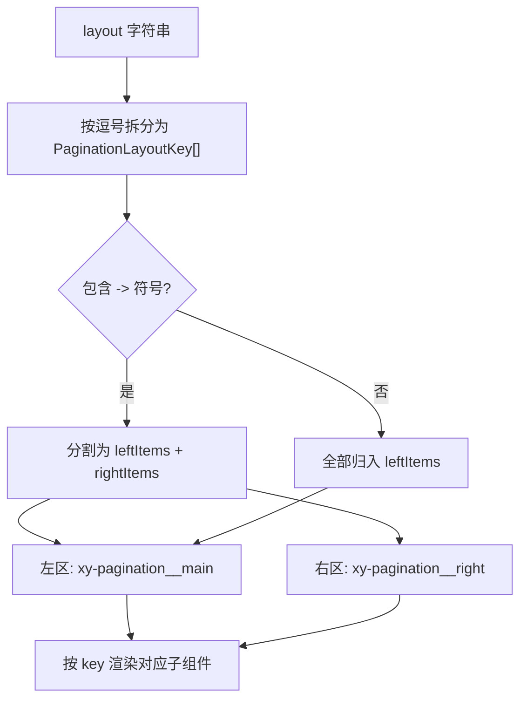
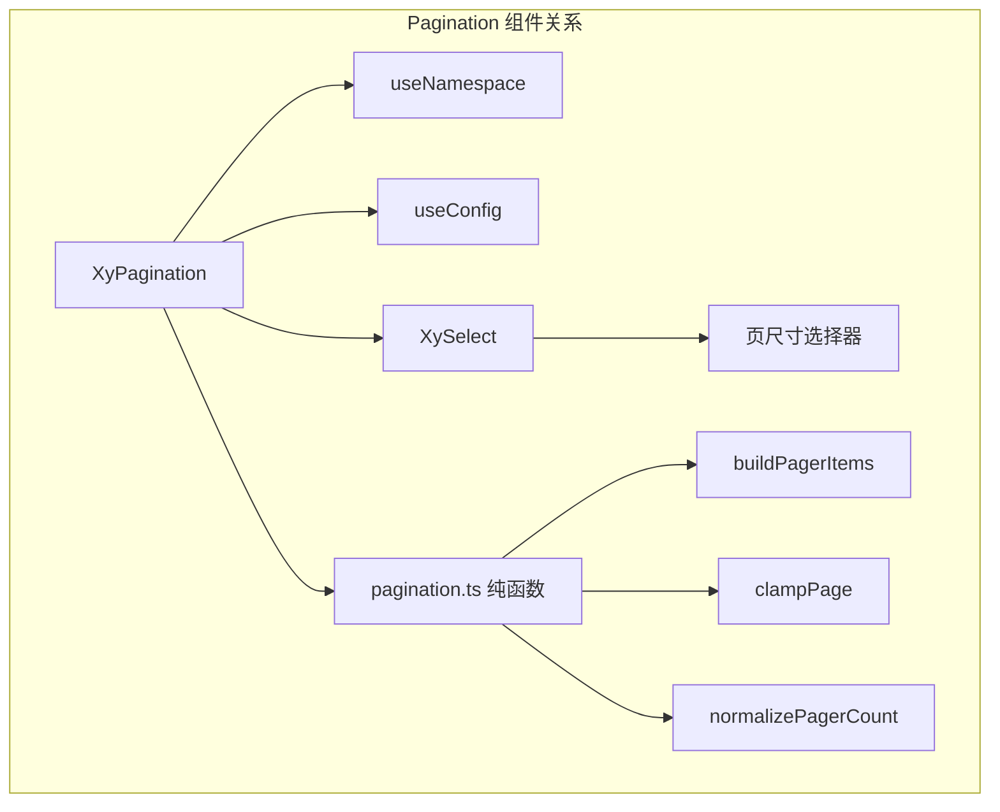
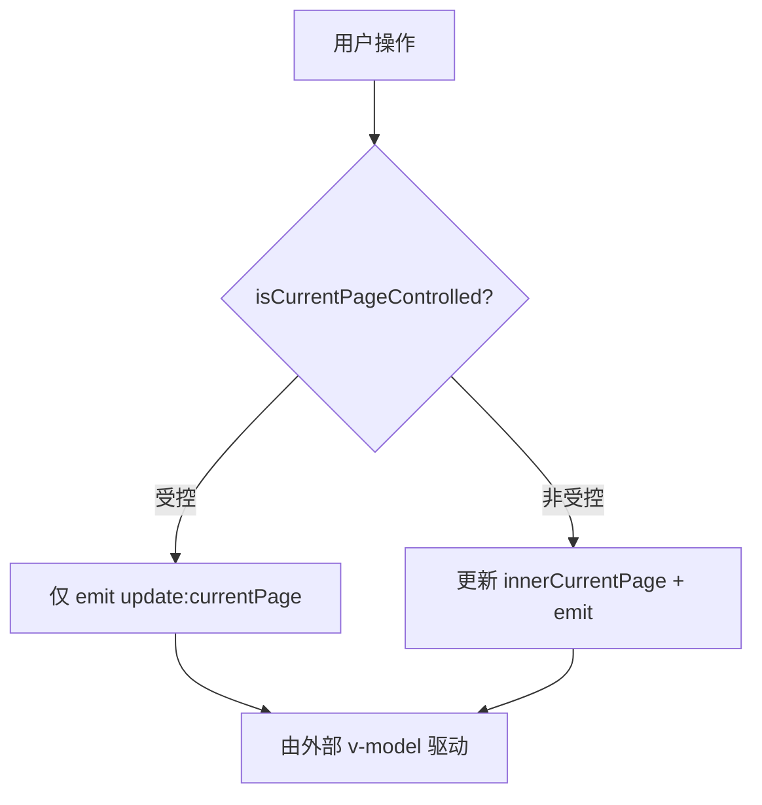
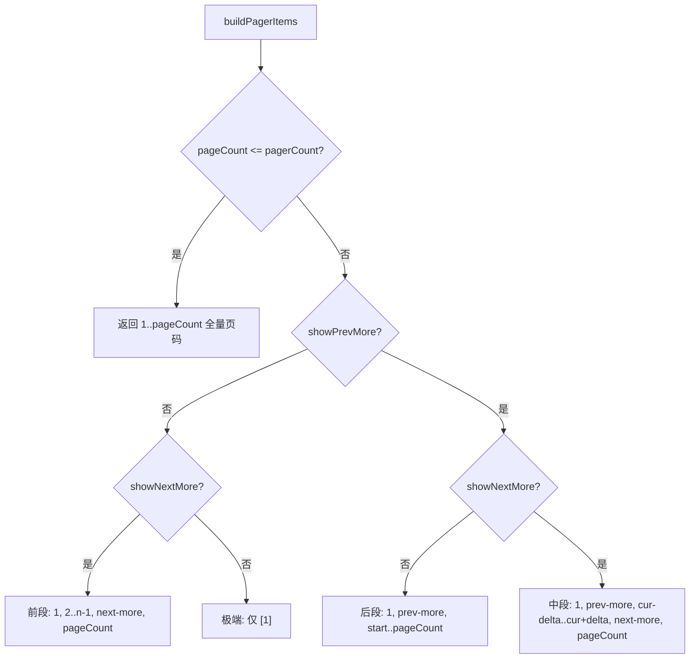

# 78 Pagination 分页

> 导读：Pagination 为大量数据提供标准化的分页导航，将页码跳转、页尺寸切换、总数展示整合为可组合的布局系统

## 设计哲学

分页器是数据表格的「方向盘」——用户通过它控制数据视图的范围。Pagination 的设计围绕**可组合布局**和**受控/非受控双模式**展开：

- **字符串布局 DSL**：`layout` prop 用逗号分隔的键值定义子元素排列，`->` 符号实现左右分区
- **受控/非受控自动检测**：`currentPage` / `pageSize` 存在即为受控模式，否则使用内部状态，无需 mode 切换
- **页码算法内聚**：`buildPagerItems` 将省略号逻辑封装为纯函数，输入当前页/总页数/可见数，输出完整页码序列



## 源码架构

```
packages/components/pagination/
├── index.ts                # withInstall 导出
├── src/
│   ├── pagination.vue      # 主组件
│   └── pagination.ts       # 类型 + 纯函数
└── __tests__/
    └── pagination.spec.ts
```



### 核心 type 定义

```ts
type PaginationLayoutKey =
  | "prev" | "pager" | "next"
  | "jumper" | "->" | "total"
  | "sizes" | "slot";

type PaginationPageHandler = (value: number) => void;
type PaginationChangeHandler = (page: number, pageSize: number) => void;

interface PaginationProps {
  currentPage?: number;
  defaultCurrentPage?: number;
  pageSize?: number;
  defaultPageSize?: number;
  total?: number;
  pageCount?: number;
  pagerCount?: number;
  layout?: string;
  pageSizes?: number[];
  prevText?: string;
  nextText?: string;
  size?: ComponentSize;
  small?: boolean;
  teleported?: boolean;
  appendSizeTo?: string | HTMLElement;
  popperClass?: string;
  popperStyle?: StyleValue;
  disabled?: boolean;
  background?: boolean;
  hideOnSinglePage?: boolean;
}
```

## 核心实现

### 受控 / 非受控双模式

Pagination 通过「是否存在 v-model 对应的 prop」自动判断模式：

```ts
const isCurrentPageControlled = computed(() => typeof props.currentPage === "number");
const isPageSizeControlled = computed(() => typeof props.pageSize === "number");

const currentPageBridge = computed(() => props.currentPage ?? innerCurrentPage.value);
const pageSizeBridge = computed(() => props.pageSize ?? innerPageSize.value);
```



**WHY**：`typeof props.currentPage === "number"` 比 `props.currentPage !== undefined` 更精确——`undefined` 表示未传，而 `0` 是合法页码（虽然会被 clamp 到 1）。

### 页码构建算法：buildPagerItems

这是 Pagination 最核心的纯函数，负责生成包含省略号的页码序列：

```ts
function buildPagerItems(
  currentPage: number,
  pageCount: number,
  pagerCount: number
): Array<number | "prev-more" | "next-more"> {
  if (pageCount <= pagerCount) {
    return Array.from({ length: pageCount }, (_, i) => i + 1);
  }

  const halfPagerCount = (pagerCount - 1) / 2;
  const showPrevMore = currentPage > pagerCount - halfPagerCount;
  const showNextMore = currentPage < pageCount - halfPagerCount;

  // 四种情况的分支处理...
}
```



**WHY**：四种分支覆盖了页码分布的所有情况——前段、中段、后段和极端情况。`halfPagerCount` 的计算保证省略号只在「当前页距离边界足够远」时出现。

### pagerCount 安全化

```ts
function normalizePagerCount(value: number | undefined) {
  const fallback = 7;
  const input = Number.isInteger(value) ? Number(value) : fallback;
  const limited = Math.min(21, Math.max(5, input));
  return limited % 2 === 0 ? limited - 1 : limited;  // 保证奇数
}
```

**WHY**：pagerCount 必须是奇数——偶数会导致当前页左右页码数不对称，视觉上不居中。上下限 5-21 防止极端值导致页码区溢出。

### 页尺寸变更联动

切换 pageSize 可能导致总页数变化，此时当前页需要 clamp：

```ts
function updatePageSize(value: number | null) {
  // ...
  const nextPageCount = typeof props.total === "number"
    ? Math.max(1, Math.ceil(props.total / value))
    : pageCountBridge.value;
  const nextPage = clampPage(currentPageBridge.value, nextPageCount);
  // ...
  emitCombinedChange(nextPage, value);
}
```

**WHY**：如果当前在第 10 页、每页 10 条，切到每页 50 条后总页数可能只有 2，必须将当前页修正到有效范围，否则显示空白页。

### layout DSL 解析

```ts
const layoutItems = computed(() =>
  props.layout.split(",").map(item => item.trim()).filter(Boolean) as PaginationLayoutKey[]
);
const rightWrapperIndex = computed(() => layoutItems.value.indexOf("->"));
const leftLayoutItems = computed(() =>
  rightWrapperIndex.value >= 0
    ? layoutItems.value.slice(0, rightWrapperIndex.value)
    : layoutItems.value
);
const rightLayoutItems = computed(() =>
  rightWrapperIndex.value >= 0 ? layoutItems.value.slice(rightWrapperIndex.value + 1) : []
);
```

**WHY**：`->` 作为分隔符将布局分为左右两区，右区自动 `margin-left: auto`，实现经典的总条数靠右对齐。

## API 参考

### Props

| 属性 | 类型 | 默认值 | 说明 |
|------|------|--------|------|
| currentPage | `number` | - | 受控当前页 |
| defaultCurrentPage | `number` | `1` | 非受控初始页 |
| pageSize | `number` | - | 受控每页条数 |
| defaultPageSize | `number` | `10` | 非受控初始条数 |
| total | `number` | - | 数据总条数 |
| pageCount | `number` | - | 总页数（与 total 二选一） |
| pagerCount | `number` | `7` | 页码按钮数（5-21 奇数） |
| layout | `string` | `"prev, pager, next, jumper, ->, total"` | 布局 DSL |
| pageSizes | `number[]` | `[10,20,30,40,50,100]` | 每页条数选项 |
| prevText | `string` | `""` | 上一页文案 |
| nextText | `string` | `""` | 下一页文案 |
| size | `ComponentSize` | - | 尺寸 |
| small | `boolean` | `false` | 小型模式（等同于 size="sm"） |
| teleported | `boolean` | `true` | sizes 下拉是否 teleport |
| appendSizeTo | `string \| HTMLElement` | `"body"` | sizes 下拉挂载点 |
| popperClass | `string` | `""` | sizes 下拉 popper 类名 |
| popperStyle | `StyleValue` | - | sizes 下拉 popper 样式 |
| disabled | `boolean` | `false` | 禁用 |
| background | `boolean` | `false` | 按钮背景填充 |
| hideOnSinglePage | `boolean` | `false` | 单页时隐藏 |

### Emits

| 事件 | 参数 | 说明 |
|------|------|------|
| update:currentPage | `(value: number)` | v-model:currentPage |
| update:pageSize | `(value: number)` | v-model:pageSize |
| current-change | `(value: number)` | 页码变化 |
| size-change | `(value: number)` | 每页条数变化 |
| prev-click | `(value: number)` | 点击上一页 |
| next-click | `(value: number)` | 点击下一页 |
| change | `(page: number, pageSize: number)` | 页码或条数变化 |

### Slots

| 名称 | 说明 |
|------|------|
| default | layout 中 `slot` 键对应的自定义内容 |

### Exposes

无

## 样式系统

### BEM 类名

| 类名 | 说明 |
|------|------|
| `.xy-pagination` | 根容器 |
| `.xy-pagination--sm` / `--lg` | 尺寸变体 |
| `.xy-pagination__main` | 左区容器 |
| `.xy-pagination__right` | 右区容器 |
| `.xy-pagination__button` | 前/后翻页按钮 |
| `.xy-pagination__button--prev` | 上一页 |
| `.xy-pagination__button--next` | 下一页 |
| `.xy-pagination__pager` | 页码列表 |
| `.xy-pagination__pager-item` | 页码按钮 |
| `.xy-pagination__total` | 总条数 |
| `.xy-pagination__sizes` | 每页条数选择器 |
| `.xy-pagination__jumper` | 跳转输入框 |
| `.xy-pagination__slot` | 自定义插槽区 |

### 状态修饰

| 类名 | 说明 |
|------|------|
| `.is-active` | 当前页码 |
| `.is-more` | 省略号按钮 |
| `.is-background` | 背景填充模式 |
| `.is-disabled` | 禁用态 |

### CSS 变量（主题层）

| 变量 | 说明 |
|------|------|
| `--xyu-pagination-pager-bg` | 页码背景 |
| `--xyu-pagination-pager-color` | 页码文字色 |
| `--xyu-pagination-pager-hover-bg` | 页码悬停背景 |
| `--xyu-pagination-pager-active-bg` | 活动页码背景 |
| `--xyu-pagination-btn-bg` | 按钮背景 |
| `--xyu-pagination-btn-color` | 按钮文字色 |
| `--xyu-pagination-disabled-color` | 禁用色 |
| `--xyu-pagination-jumper-bg` | 跳转框背景 |
| `--xyu-pagination-jumper-color` | 跳转框文字色 |
| `--xyu-pagination-jumper-border` | 跳转框边框 |
| `--xyu-pagination-total-color` | 总数文字色 |
| `--xyu-pagination-size` | 按钮尺寸 |
| `--xyu-pagination-font-size` | 字号 |

## 小结

1. **layout DSL**：逗号分隔 + `->` 分区，一行字符串定义完整布局，避免复杂的子组件组合
2. **受控/非受控自动检测**：`typeof prop === "number"` 判断模式，无需额外 mode 配置
3. **buildPagerItems 纯函数**：页码省略号算法封装为无副作用函数，四种分支覆盖前段/中段/后段/极端情况
