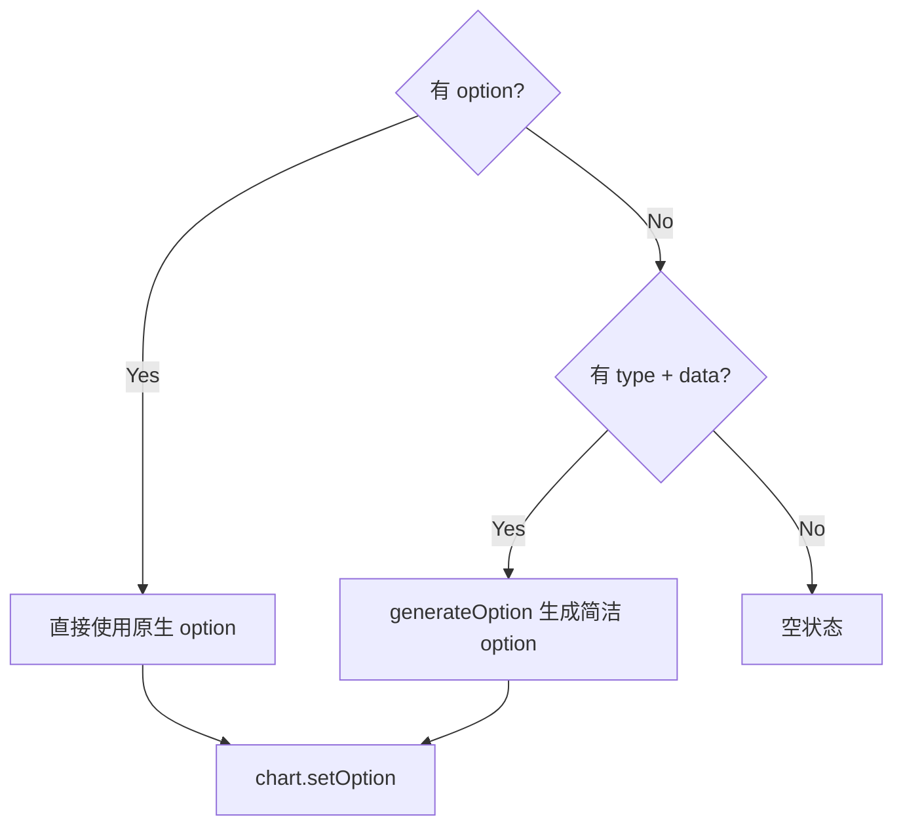

# 79 Charts 图表

> 导读：Charts 是一个基于 ECharts 的统一图表容器组件，核心价值在于通过"实例生命周期管理 + 自适应 resize + 主题集成"的模式，将 ECharts 的命令式初始化/销毁/更新 API 封装为声明式 Vue 组件，同时提供简洁模式和原生 ECharts 模式的双路径接入

## 设计哲学

Charts 解决的核心问题是：ECharts 是命令式 API（`init -> setOption -> resize -> dispose`），与 Vue 的声明式范式存在阻抗。业务层直接使用 ECharts 需要手动管理实例生命周期（创建、销毁、尺寸同步），代码既冗余又容易遗漏 cleanup。Charts 通过"props 驱动 + 自动 resize + onBeforeUnmount 清理"将这个过程封装起来。

关键设计决策：
- **简洁模式 + 原生模式双路径**：`type` + `data` + `xKey` + `yKeys` 组合提供简洁模式（自动生成 option），`option` prop 提供原生 ECharts 模式（直接传入完整配置）。WHY：90% 的业务场景只需要折线/柱状/饼图，简洁模式的 prop 数量远少于完整 ECharts 配置；但金融/科研等特殊场景需要 ECharts 的全部能力，原生模式保留完全控制权。
- **shallowRef 而非 ref 包裹 chart 实例**：`chartRef` 使用 `shallowRef` 存储 ECharts 实例。WHY：ECharts 实例包含大量内部属性和 DOM 引用，如果用 `ref` 包裹，Vue 会尝试深度代理这些属性，导致性能问题和 ECharts 内部逻辑异常。shallowRef 只追踪引用变化，不代理内部属性。
- **ResizeObserver + 首次跳过**：自动 resize 使用 `ResizeObserver` 监听容器尺寸变化，但首次触发时跳过（`isFirstObservation = true`）。WHY：组件挂载时容器尺寸可能尚未稳定，首次 resize 会触发不必要的 ECharts 重绘，影响首屏性能。



## 源码架构

### 文件结构

```
packages/components/charts/
├── src/
│   ├── charts.ts            # 类型定义
│   ├── charts.vue           # 组件实现
│   ├── echarts.ts           # ECharts 模块按需注册
│   └── use-charts.ts        # 图表初始化逻辑 composable（可选）
├── __tests__/
└── index.ts
```

### 组件关系图

```mermaid
graph LR
    ChartsVue[charts.vue] ├── EChartsTs[echarts.ts 模块注册]
    ChartsVue ├── ChartsTs[charts.ts 类型]
    ChartsVue └── NS[useNamespace]
    EChartsTs └── ECharts["@xiaoye/primitives 内置"]
```

### 核心 type 定义

```ts
export type ChartsType = "line" | "bar" | "pie" | "area" | "radar";

export interface ChartsProps {
  option?: EChartsCoreOption;
  theme?: string | object;
  width?: string | number;
  height?: string | number;
  initOptions?: ChartsInitOptions;
  loading?: boolean;
  loadingOptions?: ChartsLoadingOptions;
  autoresize?: boolean;
  setOptionOptions?: ChartsSetOptionOptions;
  type?: ChartsType;
  data?: Record<string, unknown>[];
  xKey?: string;
  yKeys?: string[];
  nameKey?: string;
  valueKey?: string;
}

export interface ChartsInstance {
  chart: ChartsECharts | null;
  resize: () => void;
  setOption: (option: EChartsCoreOption, opts?: ChartsSetOptionOptions) => void;
  showLoading: (opts?: ChartsLoadingOptions) => void;
  hideLoading: () => void;
}
```

## 核心实现

### 双路径 option 计算

Charts 通过 `computedOption` computed 属性实现简洁模式和原生模式的自动切换：

```ts
const computedOption = computed(() => {
  if (props.option) return props.option;  // 原生模式优先
  if (!props.type || !props.data.length) return undefined;  // 无数据空状态
  return generateOption(props.type, props.data, props.xKey, props.yKeys, ...);
});
```

简洁模式的 `generateOption` 按 type 分支生成配置：

```ts
function generateOption(type, data, xKey, yKeys, nameKey, valueKey) {
  const option = { tooltip: { trigger: "axis" }, legend: { data: yKeys } };
  switch (type) {
    case "line":
      option.xAxis = { type: "category", data: data.map(item => item[xKey]) };
      option.yAxis = { type: "value" };
      option.series = yKeys.map(key => ({ name: key, type: "line", data: data.map(item => item[key]) }));
      break;
    case "pie":
      option.series = [{ type: "pie", data: data.map(item => ({ name: item[nameKey], value: item[valueKey] })) }];
      break;
    case "area":
      option.series = yKeys.map(key => ({ name: key, type: "line", areaStyle: {}, data: data.map(item => item[key]) }));
      break;
    // ...
  }
  return option;
}
```

WHY 原生模式优先而非 type 优先：原生 ECharts 配置可以覆盖所有细节（双 Y 轴、组合图、markLine 等），简洁模式只是快捷入口。当业务层同时传入 `option` 和 `type`，原生配置胜出。

### 实例生命周期管理

Charts 的实例生命周期分为三个阶段：创建 -> 更新 -> 销毁。

**创建阶段**：

```ts
function createChart() {
  if (!rootRef.value) return;
  chartRef.value?.dispose();
  chartRef.value = init(rootRef.value, props.theme, props.initOptions);
  if (computedOption.value) {
    chartRef.value.setOption(computedOption.value, props.setOptionOptions);
  }
  if (props.loading) {
    chartRef.value.showLoading(props.loadingOptions);
  }
  emit("init", chartRef.value);
  emit("ready", chartRef.value);
}
```

WHY `chartRef.value?.dispose()` 在 createChart 开头：当 theme 或 initOptions 变化时，需要销毁旧实例并重建。直接 `setOption` 无法切换主题。

**更新阶段**（通过 watch）：

```ts
watch(computedOption, (option) => {
  if (!chartRef.value || !option) return;
  chartRef.value.setOption(option, props.setOptionOptions);
}, { deep: true });
```

WHY `deep: true`：ECharts option 中嵌套的 series.data 变化时，浅层 watch 无法检测到。

**销毁阶段**：

```ts
onBeforeUnmount(() => {
  resizeObserver?.disconnect();
  chartRef.value?.dispose();
  chartRef.value = null;
});
```

WHY 在 onBeforeUnmount 而非 onUnmounted：onUnmounted 时 DOM 已移除，dispose 可能访问已移除的 DOM 元素导致异常。

### 自适应 resize

ResizeObserver 监听容器尺寸变化，首次触发跳过：

```ts
function syncResizeListener() {
  resizeObserver?.disconnect();
  if (!props.autoresize) return;
  if (typeof ResizeObserver !== "undefined" && rootRef.value) {
    let isFirstObservation = true;
    resizeObserver = new ResizeObserver(() => {
      if (isFirstObservation) { isFirstObservation = false; return; }
      resize();
    });
    resizeObserver.observe(rootRef.value);
    return;
  }
  // fallback: window resize
  window.addEventListener("resize", resize);
}
```

WHY 首次跳过：组件挂载时容器从 0 尺寸变为实际尺寸，ResizeObserver 的首次触发是尺寸初始化而非真正的 resize，ECharts 的 `init` 已经按初始化尺寸渲染，无需再次 resize。

### ECharts 模块按需注册

Charts 内置了常用 ECharts 模块的按需注册，避免全量引入：

```ts
// echarts.ts
import * as echarts from "echarts/core";
import { BarChart, LineChart, PieChart, ... } from "echarts/charts";
import { GridComponent, TooltipComponent, ... } from "echarts/components";
import { CanvasRenderer } from "echarts/renderers";

echarts.use([BarChart, LineChart, PieChart, CanvasRenderer, GridComponent, ...]);
export const init = echarts.init;
```

业务层可通过 `useChartsModules` 补注册冷门模块：

```ts
import { GraphicComponent } from "echarts/components";
import { useChartsModules } from "xiaoye-components";
useChartsModules([GraphicComponent]);
```

WHY 按需注册而非全量：ECharts 全量包约 800KB，按需注册后核心图表模块约 200KB，对打包体积影响显著。

## API 参考

### Props

| 属性 | 类型 | 默认值 | 说明 |
|------|------|--------|------|
| option | `EChartsCoreOption` | — | ECharts 配置对象（原生模式） |
| type | `ChartsType` | — | 图表类型（简洁模式） |
| data | `Record<string, unknown>[]` | `[]` | 图表数据（简洁模式） |
| xKey | `string` | `""` | X 轴字段名（简洁模式） |
| yKeys | `string[]` | `[]` | Y 轴字段名列表（简洁模式） |
| nameKey | `string` | `""` | 名称字段（饼图） |
| valueKey | `string` | `""` | 数值字段（饼图） |
| theme | `string \| object` | — | 图表主题 |
| width | `string \| number` | `"100%"` | 容器宽度 |
| height | `string \| number` | `360` | 容器高度 |
| initOptions | `ChartsInitOptions` | — | 初始化参数 |
| loading | `boolean` | `false` | 是否显示加载态 |
| loadingOptions | `ChartsLoadingOptions` | — | 加载态配置 |
| autoresize | `boolean` | `true` | 是否自动 resize |
| setOptionOptions | `ChartsSetOptionOptions` | — | setOption 第二参数 |

### Events

| 事件 | 参数 | 说明 |
|------|------|------|
| init | `(chart: EChartsType)` | 图表实例创建后触发 |
| ready | `(chart: EChartsType)` | 图表实例可用后触发 |
| click | `(params: unknown)` | 图表元素点击 |

### Exposes

| 名称 | 类型 | 说明 |
|------|------|------|
| chart | `ChartsECharts \| null` | ECharts 实例引用 |
| resize | `() => void` | 手动触发 resize |
| setOption | `(option, opts?) => void` | 手动更新配置 |
| showLoading | `(opts?) => void` | 显示加载态 |
| hideLoading | `() => void` | 隐藏加载态 |

## 样式系统

### BEM 类名

| 类名 | 说明 |
|------|------|
| `xy-charts` | 根容器 |
| `xy-charts__surface` | ECharts 渲染画布 |

### CSS 变量

Charts 自身不定义额外的 CSS 变量，尺寸完全由 `width` / `height` props 控制。ECharts 的主题色通过 `theme` prop 传入，与组件库的 CSS 变量体系不耦合。

## 小结

1. **简洁模式 + 原生模式双路径**：90% 场景用 type + data 快捷接入，特殊场景用 option 完全控制
2. **shallowRef 实例管理**：避免 Vue 深度代理 ECharts 内部属性，保证实例行为不受响应式干扰
3. **ResizeObserver + 首次跳过**：自动 resize 且不触发初始化时的无效重绘
4. **按需注册 + useChartsModules 补注册**：核心模块预注册，冷门模块按需补入，打包体积可控