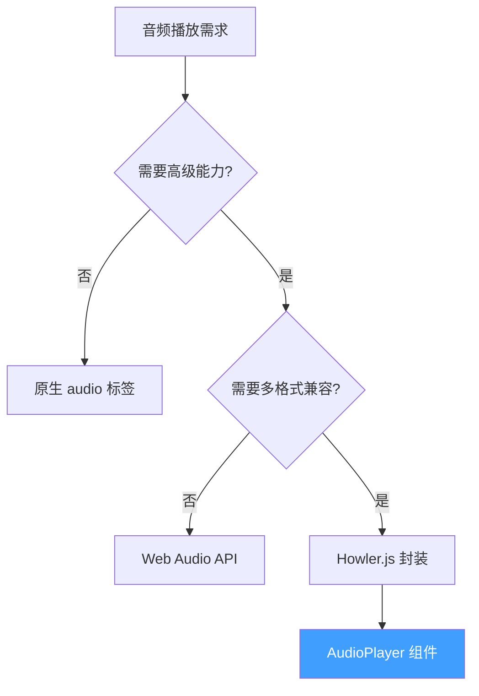
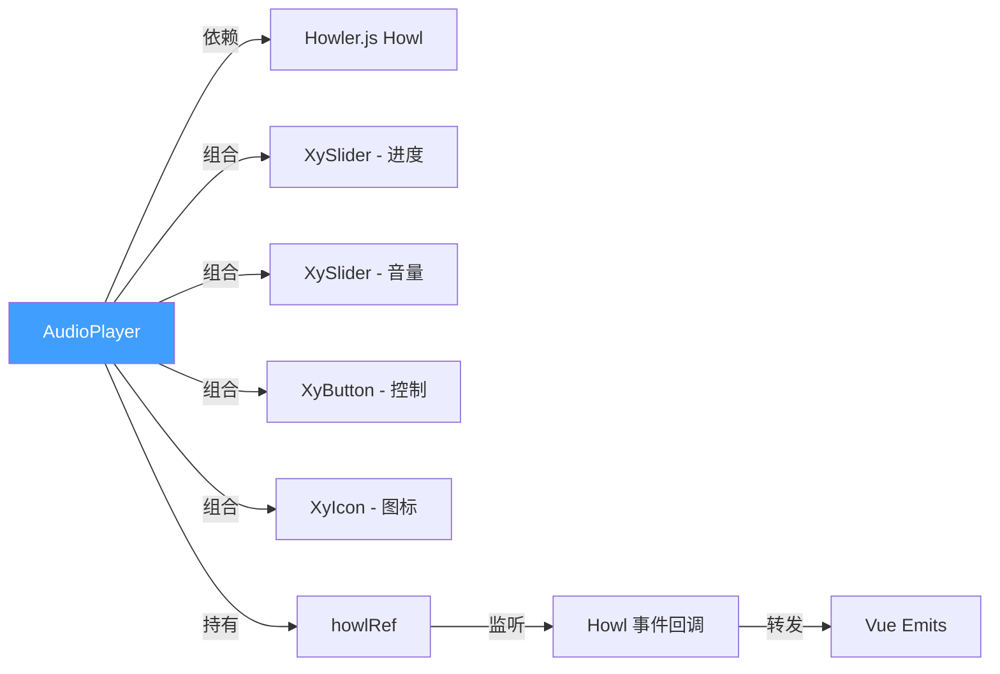
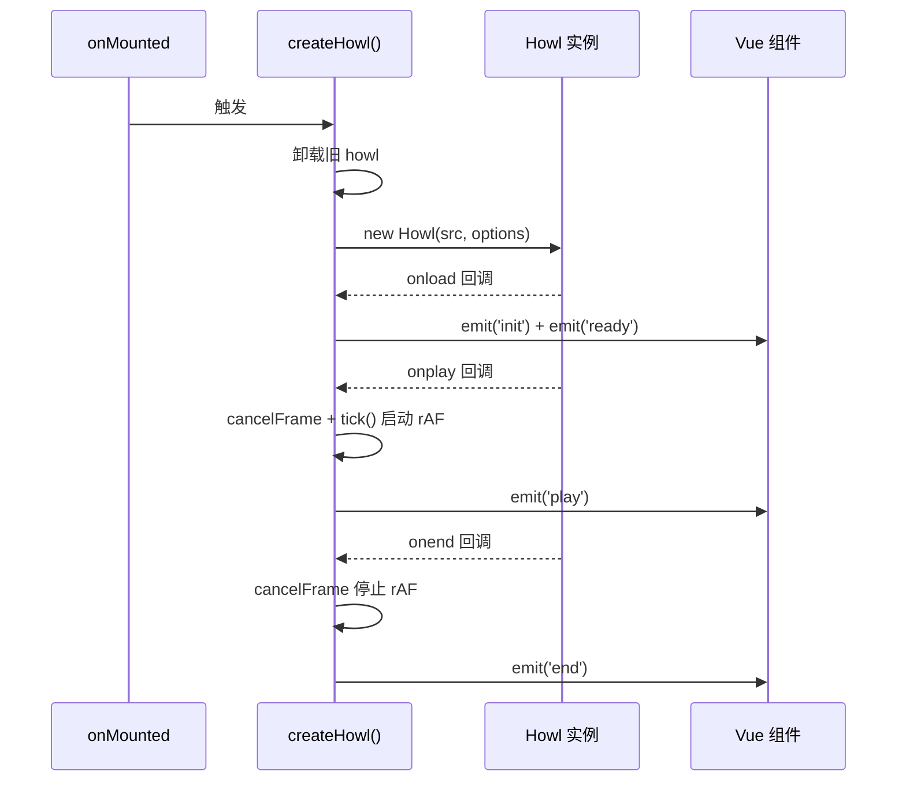

# 80 AudioPlayer 音频播放

> 导读：基于 Howler.js 封装的企业级音频播放组件，通过声明式 API 代理 Howl 实例的完整生命周期，提供播放/暂停/跳转/倍速/音量等控制能力，业务无需直接操作 Howler.js

## 设计哲学

### 为什么封装 Howler.js

原生 `<audio>` 元素的核心痛点：

1. **API 命令式** — 原生 Audio 对象需手动调用 `play()`/`pause()`，与 Vue 响应式体系割裂
2. **格式兼容差** — 不同浏览器对 MP3/OGG/WAV/FLAC 支持不一，需手动嗅探与降级
3. **高级能力缺失** — 精确 seek、倍速切换、多格式源等场景，原生 API 无法直接满足

AudioPlayer 的设计定位是 **"声明式 Howler"** — 把 Howler.js 的命令式能力映射为 Vue 的 props / events / exposes 三件套，业务只需关注"播放什么"和"播放状态"。

### 设计决策



| 决策点 | 选择 | 理由 |
|--------|------|------|
| 底层引擎 | Howler.js | 社区最成熟跨浏览器音频库，覆盖 Web Audio + HTML5 Audio 双降级 |
| 进度驱动 | requestAnimationFrame | 实时更新进度条，比 setInterval 更精确、更节能 |
| track prop | 结构化元数据 | 统一 src/title/artist/cover，避免业务拼凑多个 props |
| 倍速切换 | cycleRate 循环模式 | 按 playbackRates 数组循环切换，UI 一键操作 |

## 源码架构

### 文件结构

```
packages/components/audio-player/
├── index.ts                    # 模块导出入口（withInstall 注册）
└── src/
    ├── audio-player.ts         # 类型定义（Props / Track / Instance）
    └── audio-player.vue        # 组件实现（SFC 单文件）
```

### 组件关系图



### 核心 Type 定义

```ts
/** 音频轨道元数据 */
export interface AudioPlayerTrack {
  src: string | string[]
  title?: string
  artist?: string
  cover?: string
}

/** 组件 Props */
export interface AudioPlayerProps {
  src?: string | string[]
  track?: AudioPlayerTrack
  title?: string
  artist?: string
  autoplay?: boolean
  loop?: boolean
  muted?: boolean
  volume?: number
  playbackRates?: number[]
}

/** Expose 实例 */
export interface AudioPlayerInstance {
  howl: Howl | null
  play: () => void
  pause: () => void
  stop: () => void
  seek: (seconds: number) => void
  setVolume: (value: number) => void
}
```

## 核心实现

### 1. Howl 实例的创建与生命周期

**WHY** — Howl 是重量级对象（解码缓冲区、绑定 Web Audio 节点），必须在合适时机创建与销毁。AudioPlayer 在 `onMounted` 创建、watch src 变化时重建、`onBeforeUnmount` 时卸载。

```ts
const howlRef = ref<Howl | null>(null)

function createHowl() {
  // 标准化源数据：string → [string], string[] → 原样
  const source = Array.isArray(resolvedSrc.value)
    ? resolvedSrc.value
    : resolvedSrc.value ? [resolvedSrc.value] : []

  // 卸载旧实例
  howlRef.value?.unload()

  // 无源数据 → 清空状态
  if (!source.length) {
    howlRef.value = null
    currentTime.value = 0; duration.value = 0
    progress.value = 0; playing.value = false
    return
  }

  // 创建新 Howl 实例
  let instance: Howl | null = null
  const handleLoaded = () => {
    const current = instance ?? howlRef.value
    if (!current) { queueMicrotask(handleLoaded); return }
    duration.value = current.duration()
    emit('init', current)
    emit('ready', current)
  }

  instance = new Howl({
    src: source,
    autoplay: props.autoplay,
    loop: props.loop,
    mute: props.muted,
    volume: currentVolume.value,
    rate: rate.value,
    html5: true,  // 强制 HTML5 Audio 模式，避免大文件内存溢出
    onload: handleLoaded,
    onplay: () => { playing.value = true; cancelFrame(); tick(); emit('play') },
    onpause: () => { playing.value = false; cancelFrame(); emit('pause') },
    onstop: () => { playing.value = false; currentTime.value = 0; progress.value = 0; cancelFrame() },
    onend: () => { playing.value = false; progress.value = 1; cancelFrame(); emit('end') },
  })

  howlRef.value = instance
}

onMounted(() => createHowl())
onBeforeUnmount(() => { cancelFrame(); howlRef.value?.unload(); howlRef.value = null })
```



### 2. rAF 进度驱动

**WHY** — Howler.js 没有提供"currentTime 变化"的事件回调。AudioPlayer 通过 `requestAnimationFrame` 循环读取 `howl.seek()`，实现进度条的实时更新。

```ts
let rafId: number | null = null

function tick() {
  if (!howlRef.value || !playing.value) return

  const nextTime = Number(howlRef.value.seek() || 0)
  currentTime.value = nextTime
  progress.value = duration.value > 0
    ? Math.min(nextTime / duration.value, 1) : 0
  emit('time-update', currentTime.value, duration.value)

  if (typeof window !== 'undefined') {
    rafId = window.requestAnimationFrame(tick)
  }
}

function cancelFrame() {
  if (typeof window === 'undefined' || rafId === null) return
  window.cancelAnimationFrame(rafId)
  rafId = null
}
```

```mermaid
flowchart TD
    A[playing = true] --> B[启动 tick 循环]
    B --> C[howl.seek() → currentTime]
    C --> D[currentTime / duration → progress]
    D --> E[emit time-update]
    E --> F[requestAnimationFrame tick]
    F --> C
    G[playing = false] --> H[cancelAnimationFrame]
    I[onstop / onpause / onend] --> H
```

### 3. track 元数据优先级解析

**WHY** — AudioPlayer 支持两种数据传入方式：① 简单场景用 `src` + `title` + `artist` 分散 props ② 结构化场景用 `track` 统一传入。通过 computed 实现优先级：track 字段优先，props 兜底。

```ts
const resolvedSrc = computed(() => props.track?.src ?? props.src ?? [])
const resolvedTitle = computed(() => props.track?.title ?? props.title)
const resolvedArtist = computed(() => props.track?.artist ?? props.artist)
const resolvedCover = computed(() => props.track?.cover ?? "")
```

### 4. 倍速循环切换

**WHY** — 音频倍速是有限集合（如 [0.75, 1, 1.25, 1.5, 2]），用"循环切换"比下拉选择更轻量。

```ts
const currentRateIndex = ref(
  Math.max(props.playbackRates.findIndex((r) => r === 1), 0)
)
const rate = computed(() => props.playbackRates[currentRateIndex.value] ?? 1)

function cycleRate() {
  if (!props.playbackRates.length) return
  currentRateIndex.value = (currentRateIndex.value + 1) % props.playbackRates.length
  howlRef.value?.rate(rate.value)
}
```

初始索引定位到 1x（正常速度），每次点击循环前进一位，同时通过 `howl.rate()` 实时生效。

### 5. Slider 进度跳转

**WHY** — 进度条（XySlider）绑定 progress 值，用户拖动时需要反向计算 seek 位置。但 rAF 驱动的 tick 每帧都在更新 progress，会造成"拖动-跳回"的冲突。解决方案：watch progress 时检测 diff >= 0.25s 才执行 seek，忽略 tick 造成的微小更新。

```ts
watch(progress, (value) => {
  if (!duration.value || !howlRef.value) return
  const nextTime = Number((value * duration.value).toFixed(2))
  const diff = Math.abs(nextTime - currentTime.value)
  if (diff < 0.25) return  // 忽略 tick 造成的微小变化
  seek(nextTime)
})
```

### 6. 播放控制与 stepSeek

```ts
function play() { howlRef.value?.play() }
function pause() { howlRef.value?.pause() }
function stop() { howlRef.value?.stop() }

function togglePlay() {
  if (!howlRef.value) return
  playing.value ? pause() : play()
}

function seek(seconds: number) {
  if (!howlRef.value) return
  howlRef.value.seek(seconds)
  currentTime.value = seconds
  progress.value = duration.value > 0 ? Math.min(seconds / duration.value, 1) : 0
}

function stepSeek(delta: number) {
  seek(Math.max(0, Math.min(duration.value, currentTime.value + delta)))
}
```

## API 参考

### Props

| 属性 | 类型 | 默认值 | 说明 |
|------|------|--------|------|
| src | `string \| string[]` | `undefined` | 音频源 URL |
| track | `AudioPlayerTrack` | `undefined` | 结构化轨道数据（优先级高于 src/title/artist） |
| title | `string` | `''` | 音频标题 |
| artist | `string` | `''` | 艺人名 |
| autoplay | `boolean` | `false` | 是否自动播放 |
| loop | `boolean` | `false` | 是否循环播放 |
| muted | `boolean` | `false` | 是否静音 |
| volume | `number` | `1` | 音量（0-1） |
| playbackRates | `number[]` | `[0.75, 1, 1.25, 1.5, 2]` | 可选倍速列表 |

### Emits

| 事件名 | 回调参数 | 说明 |
|--------|----------|------|
| init | `(howl: Howl)` | Howl 实例创建完成 |
| ready | `(howl: Howl)` | 音频加载就绪 |
| play | — | 开始播放 |
| pause | — | 暂停 |
| end | — | 播放结束 |
| update:volume | `(value: number)` | 音量变化 |
| time-update | `(currentTime: number, duration: number)` | 播放进度实时更新 |

### Slots

| 插槽名 | 作用域参数 | 说明 |
|--------|-----------|------|
| default | — | 整体内容自定义（不常用） |

### Exposes

| 方法 / 属性 | 签名 | 说明 |
|-------------|------|------|
| howl | `Ref<Howl \| null>` | Howler.js 原始实例（逃生舱口） |
| play | `() => void` | 播放 |
| pause | `() => void` | 暂停 |
| stop | `() => void` | 停止 |
| seek | `(seconds: number) => void` | 跳转到指定秒数 |
| setVolume | `(value: number) => void` | 设置音量 |

## 样式系统

### BEM 类名

| 类名 | 说明 |
|------|------|
| `xy-audio-player` | 根容器 |
| `xy-audio-player__cover` | 封面图区域 |
| `xy-audio-player__body` | 内容主体区 |
| `xy-audio-player__meta` | 标题/艺人/倍速元数据行 |
| `xy-audio-player__title` | 音频标题 |
| `xy-audio-player__artist` | 艺人名 |
| `xy-audio-player__rate` | 倍速切换按钮 |
| `xy-audio-player__progress` | 进度条区域 |
| `xy-audio-player__actions` | 播放/暂停/快进快退按钮组 |
| `xy-audio-player__volume` | 音量控制区域 |

### CSS 变量

| 变量名 | 默认值 | 说明 |
|--------|--------|------|
| `--xy-audio-player-bg` | `#fff` | 播放器背景色 |
| `--xy-audio-player-radius` | `4px` | 圆角大小 |

## 小结

1. **声明式封装 Howler.js** — 把 Howl 的命令式 API 映射为 Vue props + events + exposes，业务零 Howler 代码
2. **rAF 进度驱动 + diff 过滤** — 用 requestAnimationFrame 循环读取 seek() 实现进度实时更新，watch progress 时用 diff >= 0.25s 过滤避免拖动冲突
3. **track 优先级解析** — 支持 `src` + `title` 分散 props 和 `track` 结构化数据两种方式，computed 自动取 track 优先