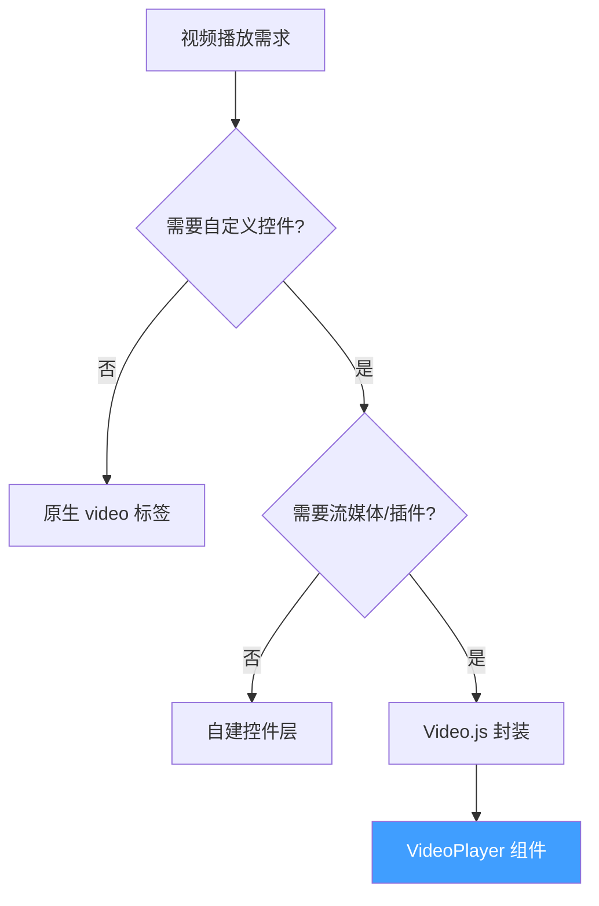
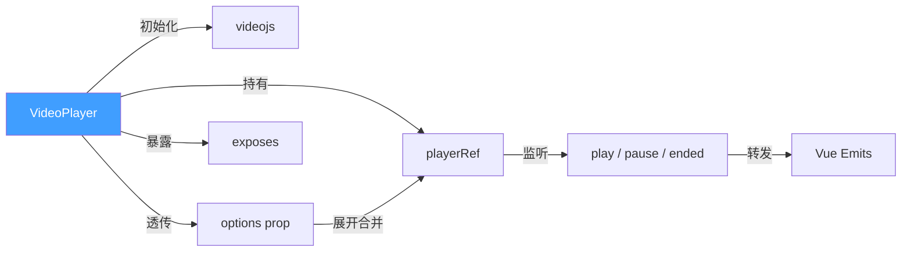
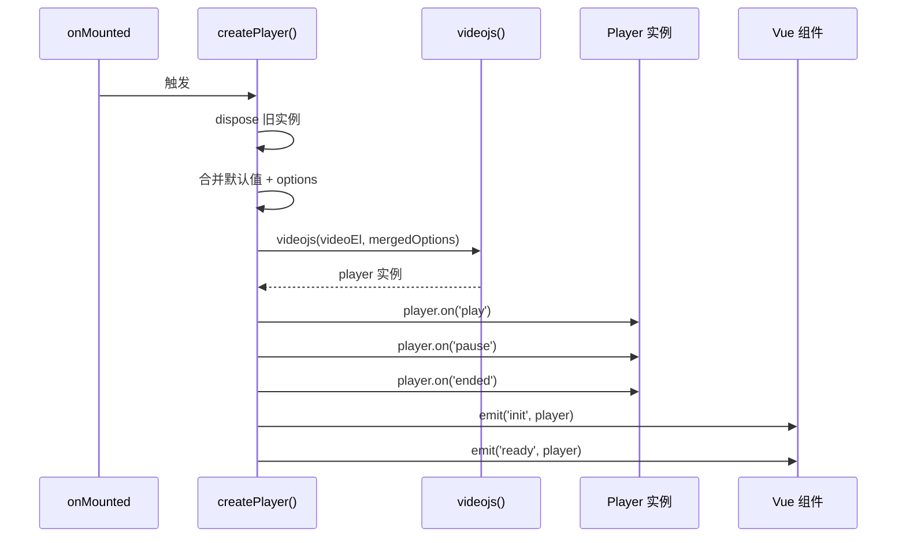
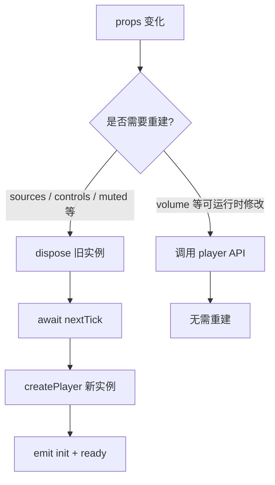
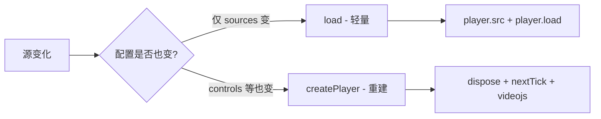

# 81 VideoPlayer 视频播放

> 导读：基于 Video.js 封装的企业级视频播放组件，通过声明式 API 代理 Video.js Player 实例的完整生命周期，提供播放/暂停/加载/销毁等控制能力，业务无需直接操作 Video.js

## 设计哲学

### 为什么封装 Video.js

原生 `<video>` 元素的核心痛点：

1. **控件不可定制** — 浏览器内置控件样式各异，无法统一品牌视觉
2. **格式/协议兼容** — HLS、DASH、FLV 等流媒体协议需 Source Plugin，原生不支持
3. **高级功能缺失** — 画中画、倍速切换、清晰度切换、字幕轨道管理需大量底层代码

Video.js 是社区最成熟的跨浏览器视频播放框架，拥有 800+ 插件生态。VideoPlayer 的定位是 **"声明式 Video.js"** — 把 Video.js 的命令式初始化、事件监听、实例方法映射为 Vue 组件的 props / events / exposes。

### 架构决策



| 决策点 | 选择 | 理由 |
|--------|------|------|
| 底层引擎 | Video.js | 社区最成熟的视频播放框架，插件生态丰富 |
| 实例创建 | onMounted + ref | 确保 `<video>` DOM 就绪后再初始化播放器 |
| 配置透传 | options prop 展开 | Video.js 配置项 40+，逐一定义 props 不现实 |
| 重建策略 | watch → dispose + nextTick + 重建 | Video.js 不支持运行时修改部分配置（如 controls），只能重建 |
| 销毁时机 | onBeforeUnmount | 调用 player.dispose() 释放 DOM 事件监听与内部定时器 |

## 源码架构

### 文件结构

```
packages/components/video-player/
├── index.ts                    # 模块导出入口（withInstall 注册）
└── src/
    ├── video-player.ts         # 类型定义（Props / Source / Instance）
    └── video-player.vue        # 组件实现（SFC 单文件）
```

### 组件关系图



### 核心 Type 定义

```ts
/** 视频源格式 */
export interface VideoPlayerSource {
  src: string
  type?: string
}

/** Video.js 原生配置透传 */
export interface VideoPlayerOptions {
  [key: string]: unknown
}

/** 组件 Props */
export interface VideoPlayerProps {
  sources?: VideoPlayerSource[]
  poster?: string
  autoplay?: boolean
  controls?: boolean
  loop?: boolean
  muted?: boolean
  preload?: 'auto' | 'metadata' | 'none'
  width?: string | number
  height?: string | number
  options?: VideoPlayerOptions
}

/** 组件 Expose 实例 */
export interface VideoPlayerInstance {
  player: unknown
  play: () => Promise<void> | void
  pause: () => void
  load: (sources?: VideoPlayerSource[]) => void
}
```

## 核心实现

### 1. Player 实例的创建与销毁

**WHY** — Video.js 的 `videojs()` 函数需要已挂载的 `<video>` DOM 元素。组件必须在 `onMounted` 后创建实例，在 `onBeforeUnmount` 时调用 `dispose()` 释放资源（包括 DOM 事件监听、内部定时器、MediaSource 等）。

```ts
const videoRef = ref<HTMLVideoElement | null>(null)
const playerRef = ref<any>(null)

function createPlayer() {
  if (!videoRef.value) return

  // 销毁旧实例，释放 DOM 事件与内部资源
  playerRef.value?.dispose()

  // 构建配置：默认值 + options 展开
  const mergedOptions = {
    autoplay: props.autoplay,
    controls: props.controls,
    loop: props.loop,
    muted: props.muted,
    preload: props.preload,
    poster: props.poster,
    fluid: false,
    sources: normalizeSources(props.sources),
    ...props.options
  }

  // 创建新实例
  playerRef.value = videojs(videoRef.value, mergedOptions)

  // 绑定核心事件 → 转发为 Vue emits
  playerRef.value.on('play',  () => emit('play'))
  playerRef.value.on('pause', () => emit('pause'))
  playerRef.value.on('ended', () => emit('ended'))

  // 生命周期事件
  emit('init', playerRef.value)
  emit('ready', playerRef.value)
}

onMounted(() => createPlayer())

onBeforeUnmount(() => {
  playerRef.value?.dispose()
  playerRef.value = null
})
```



### 2. Source 标准化

**WHY** — Video.js 要求 sources 为 `{ src, type }[]` 格式，但业务可能只传 src 不带 type。`normalizeSources` 确保数据格式一致，同时过滤掉无关字段避免 Video.js 解析异常。

```ts
function normalizeSources(sources: VideoPlayerSource[] = []) {
  return sources.map((item) => ({
    src: item.src,
    type: item.type
  }))
}
```

业务使用示例：

```vue
<!-- 带 type — 推荐用于流媒体 -->
<xy-video-player :sources="[{ src: '/stream.m3u8', type: 'application/x-mpegURL' }]" />

<!-- 不带 type — Video.js 会根据文件后缀自动推断 -->
<xy-video-player :sources="[{ src: '/video.mp4' }]" />
```

### 3. 响应式重建策略

**WHY** — Video.js 的部分配置（如 `controls`、`muted`、`autoplay`）在实例创建后无法通过 API 动态修改。当这些 props 变化时，唯一安全的方式是 dispose 旧实例并重建。重建前需 `await nextTick()` 确保 DOM 已更新。

```ts
watch(
  () => [
    props.sources, props.poster, props.autoplay,
    props.controls, props.loop, props.muted
  ] as const,
  async () => {
    await nextTick()
    createPlayer()
  },
  { deep: true }
)

watch(
  () => props.options,
  async () => {
    await nextTick()
    createPlayer()
  },
  { deep: true }
)
```



**WHY nextTick** — `player.dispose()` 会从 DOM 中移除 `<video>` 元素并重建。`nextTick` 确保新的 `<video>` 元素已挂载后再调用 `videojs()`，否则会抛出 "The element or ID supplied is not valid" 错误。

### 4. 动态加载新源

**WHY** — 清晰度切换、视频切换等场景需要在**不重建实例**的情况下更换播放源。`load()` 方法调用 `player.src()` + `player.load()` 实现。

```ts
function load(sources = props.sources) {
  if (!playerRef.value) return
  playerRef.value.src(normalizeSources(sources))
  playerRef.value.load()
}
```

与 `createPlayer()` 的区别：

| 方法 | 场景 | 重建实例 | 保留播放器状态 |
|------|------|----------|---------------|
| load() | 仅切换源（如清晰度） | 否 | 是 |
| createPlayer() | 配置变化（如控件开关） | 是 | 否 |



### 5. 模板结构

**WHY** — VideoPlayer 的模板只需一个 `<video>` 元素供 Video.js 挂载。组件本身不渲染任何控件，所有 UI 由 Video.js 内部管理。

```vue
<template>
  <div class="xy-video-player">
    <video
      ref="videoRef"
      class="video-js xy-video-player__surface"
    />
  </div>
</template>
```

关键点：`video-js` 类名是 Video.js 识别宿主元素的必要条件，`xy-video-player__surface` 用于样式覆盖。

### 6. Expose 方法代理

**WHY** — 80% 场景通过 props 驱动即可，但 play / pause / load 等命令式操作需要 expose 暴露。同时暴露原始 `player` 实例作为逃生舱口。

```ts
defineExpose({
  player: playerRef,
  play: () => playerRef.value?.play(),
  pause: () => playerRef.value?.pause(),
  load
})
```

## API 参考

### Props

| 属性 | 类型 | 默认值 | 说明 |
|------|------|--------|------|
| sources | `VideoPlayerSource[]` | `[]` | 视频源列表 |
| poster | `string` | `''` | 封面图 URL |
| autoplay | `boolean` | `false` | 是否自动播放 |
| controls | `boolean` | `true` | 是否显示控件 |
| loop | `boolean` | `false` | 是否循环播放 |
| muted | `boolean` | `false` | 是否静音 |
| preload | `'auto' \| 'metadata' \| 'none'` | `'metadata'` | 预加载策略 |
| width | `string \| number` | `'100%'` | 播放器宽度 |
| height | `string \| number` | `360` | 播放器高度 |
| options | `VideoPlayerOptions` | `{}` | Video.js 原生配置透传 |

### Emits

| 事件名 | 回调参数 | 说明 |
|--------|----------|------|
| init | `(player: unknown)` | 播放器实例创建完成（此时可能未加载完） |
| ready | `(player: unknown)` | 播放器就绪 |
| play | — | 视频开始播放 |
| pause | — | 视频暂停 |
| ended | — | 视频播放结束 |

### Slots

| 插槽名 | 作用域参数 | 说明 |
|--------|-----------|------|
| default | — | 默认插槽（通常不使用，Video.js 控件由内部管理） |

### Exposes

| 方法 / 属性 | 签名 | 说明 |
|-------------|------|------|
| player | `Ref<unknown>` | Video.js Player 原始实例（逃生舱口） |
| play | `() => Promise<void> \| void` | 播放 |
| pause | `() => void` | 暂停 |
| load | `(sources?: VideoPlayerSource[]) => void` | 加载新源（不重建实例） |

## 样式系统

### BEM 类名

| 类名 | 说明 |
|------|------|
| `xy-video-player` | 根容器 |
| `xy-video-player__surface` | video 元素（附加 video-js 类名） |

### CSS 变量

| 变量名 | 默认值 | 说明 |
|--------|--------|------|
| `--xy-video-player-bg` | `#000` | 播放器背景色 |
| `--xy-video-player-radius` | `4px` | 圆角大小 |

### 样式覆盖指南

Video.js 的控件样式通过其自身 CSS 类名管理。如需自定义，推荐两种方式：

1. **CSS 变量覆盖** — 修改 `--xy-video-player-*` 变量影响容器层样式
2. **深度选择器** — 用 `:deep(.vjs-*)` 覆盖 Video.js 内部控件样式

```css
/* 示例：修改播放按钮颜色 */
.xy-video-player :deep(.vjs-big-play-button) {
  background-color: var(--xy-video-player-bg, #000);
  border-radius: 50%;
}
```

## 小结

1. **声明式代理 Video.js** — 将 Video.js 的命令式初始化和事件监听映射为 Vue props / events / exposes，业务无需导入 video.js
2. **全量配置透传** — 通过 `options` prop 展开合并，既提供常用 props 的类型安全，又保留 Video.js 完整配置能力
3. **dispose-then-recreate 重建策略** — 针对 Video.js 不支持运行时修改的配置项，采用 dispose + nextTick + recreate 的安全重建模式；仅切源时用 `load()` 轻量替换