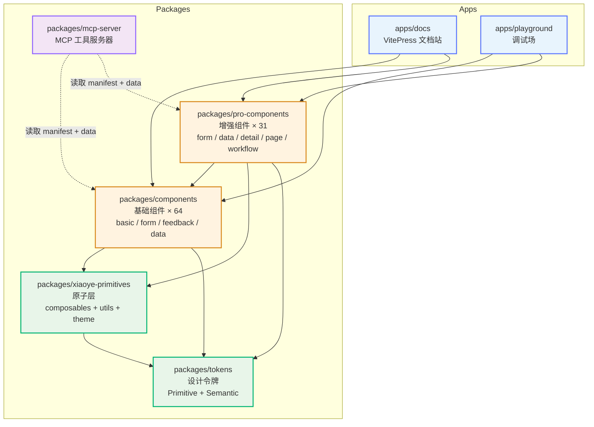
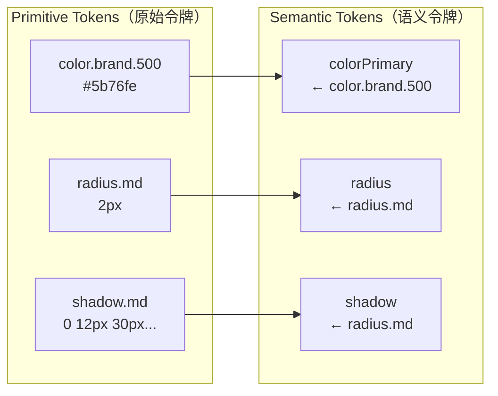
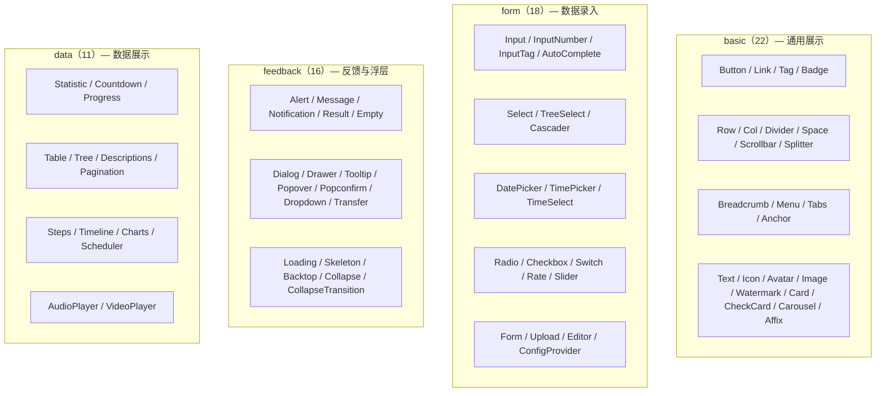
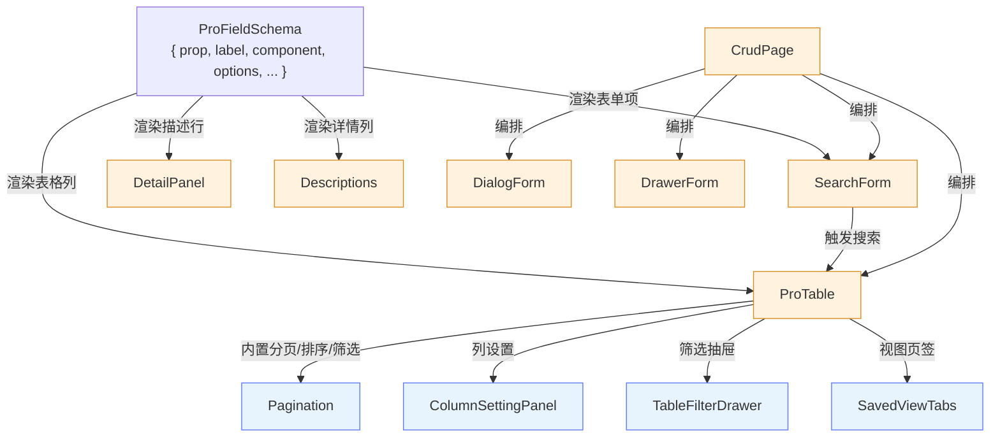
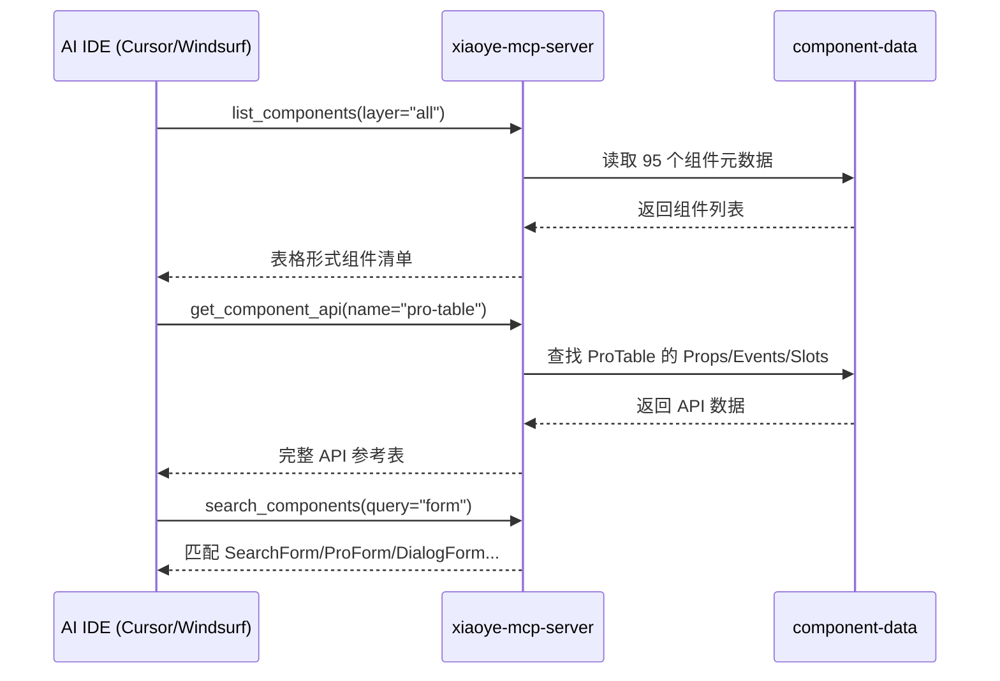
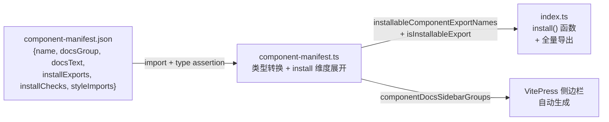
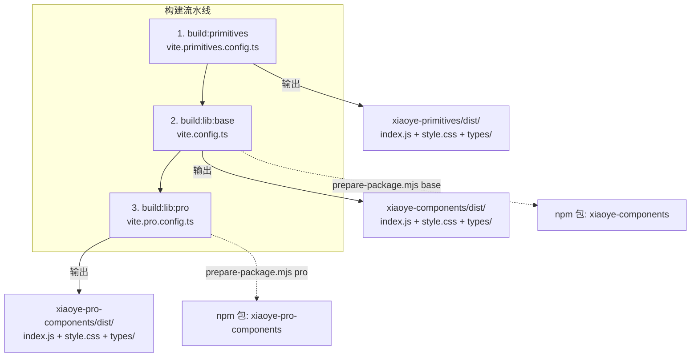
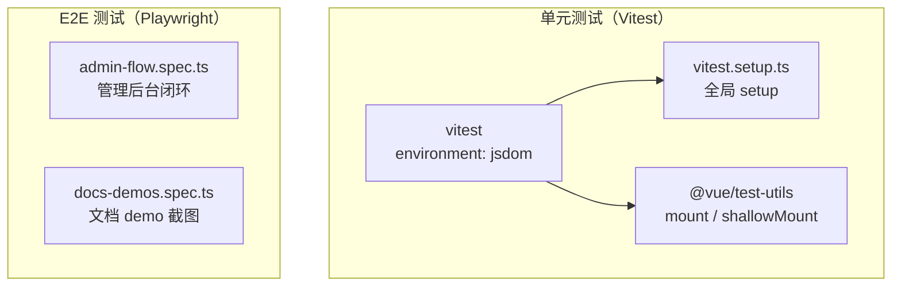

# 01 项目总览与架构全景

> 导读：本文从全局视角拆解 xiaoye-components 的 Monorepo 分层架构——Primitives 原子层提供跨包共享的注入机制与 composable，Tokens 层定义 Primitive → Semantic 双层令牌体系，Components 层承载 64 个基础组件，Pro-Components 层通过 field-schema 配置化驱动组合出 31 个业务增强组件，MCP Server 则让 AI IDE 自动感知组件 API。理解这个分层模型，是阅读后续所有架构篇与组件篇的前提。

## 为什么需要另一个组件库

市面上的 Vue 3 组件库（Element Plus、Ant Design Vue、Naive UI）已经足够成熟，xiaoye-components 并非要替代它们，而是解决一个特定问题：**中后台场景的组件组合爆炸**。

一个典型的中后台列表页需要 Table + Pagination + SearchForm + Dialog + Notification 五个以上组件协作，而现有的库把它们留给使用者自行编排。xiaoye-components 的核心差异在于：

- **Pro-Components 层**：通过 `ProFieldSchema` 配置化驱动，让一个 `CrudPage` 组件即可覆盖标准 CRUD 场景
- **Primitives 原子层**：将跨包共享的 `InjectionKey`、类型定义和 composable 抽离为独立包，避免 components 与 pro-components 之间的循环依赖
- **MCP Server**：让 AI IDE（如 Cursor、Windsurf）能直接查询组件 API，实现"用 AI 开发的组件库"被"AI 开发工具"自动感知的闭环

## Monorepo 分层架构

项目采用 pnpm workspace 管理，分为四个物理包和两个应用：



### 包依赖关系的关键约束

依赖方向严格单向：`Pro-Components → Components → Primitives → Tokens`。这个约束不是随意的选择，而是解决了一个实际问题：

如果 Pro-Components 直接引用 Components 内部的 composable（如 `useNamespace`），而不经过 Primitives 包，就会形成 `Pro-Components → Components → Primitives` 和 `Components → Pro-Components`（因为某些基础组件需要引用 Pro 层定义的类型）的双向依赖。将共享部分上提到 Primitives 后，依赖图变成有向无环图（DAG），Vite 构建才能正确进行 tree-shaking 和 chunk 分割。

## 各层职责详解

### Tokens 层：Primitive → Semantic 双层令牌



Tokens 包定义了两层令牌：

- **Primitive Tokens**：原始设计值，直接描述色板、间距、圆角、阴影等。如 `color.brand.500 = #5b76fe`、`radius.md = 2px`
- **Semantic Tokens**：语义化别名，引用 Primitive 值。如 `colorPrimary ← color.brand.500`、`radiusControl ← radius.md`

这种双层设计的好处在于：**换肤只需修改 Semantic 映射，不需要触及 Primitive 色板**。例如，将品牌色从蓝系切换到紫系，只需修改 `colorPrimary` 的指向从 `color.brand.500` 到 `color.lilac.500`，所有消费 `colorPrimary` 的组件样式自动跟随。

### Primitives 层：跨包共享基础设施

Primitives 包导出两大模块：

**composables/** — 12 个 Vue composable：

| composable | 职责 | 消费方 |
|------------|------|--------|
| `useNamespace` | BEM 命名生成 + CSS 变量命名 | 所有组件 |
| `useConfig` | 读取 ConfigProvider 注入的全局配置 | 所有组件 |
| `useZIndex` | 全局自增 z-index 管理 | Dialog / Drawer / Message 等 |
| `useOverlayStack` | 浮层栈管理（打开顺序、ESC 关闭） | Dialog / Drawer / Popover 等 |
| `useOverlayDialog` | Dialog 专用浮层逻辑 | Dialog |
| `useFocusTrap` | 焦点陷阱 | Dialog / Drawer |
| `useFloatingPanel` | 浮层定位（基于 Floating UI） | Popover / Tooltip / Select 下拉 |
| `useFloatingVisibility` | 浮层显隐控制 | Popover / Tooltip |
| `useDismissibleLayer` | 点击外部关闭 | Popover / Dropdown |
| `useListNavigation` | 键盘列表导航 | Select / Dropdown / Menu |
| `useThrottleRender` | 渲染节流 | 性能敏感组件 |
| `useControlled` | 受控/非受控值统一处理 | 所有支持 v-model 的组件 |

**utils/** — 5 个工具模块：

| 模块 | 职责 |
|------|------|
| `with-install` | 为组件添加 `install` 方法，使其可被 `app.use()` 注册 |
| `dev` | 开发环境警告工具 |
| `click-outside` | 点击外部检测 |
| `focus` | 焦点管理 |
| `scroll-lock` | 滚动锁定（Dialog/Drawer 打开时） |

**核心注入机制**：`configProviderKey` 是整个组件库的神经中枢。ConfigProvider 通过 `provide(configProviderKey, context)` 向子树注入全局配置（namespace、locale、zIndex、size 等），任何组件通过 `useConfig()` 即可消费。这个 key 定义在 Primitives 而非 Components 包中，是因为 Pro-Components 也需要读取同一个注入上下文。

### Components 层：64 个基础组件

按 docsGroup 分为四组：



每个组件遵循统一的目录约定：

```
packages/components/{name}/
├── src/
│   ├── {name}.vue          # 主组件模板
│   ├── types.ts            # Props / Emits / Exposes 类型定义
│   └── composables/        # 组件内部 composable（如有）
├── index.ts                # 导出 + withInstall 包装
└── style/                  # 组件级样式
```

### Pro-Components 层：31 个业务增强组件

Pro 层的核心设计理念是 **配置化驱动**——通过 `ProFieldSchema` 描述表单字段/列定义，Pro 组件负责渲染和交互编排：



`ProFieldSchema` 是 Pro 层的类型核心，它统一了表单、表格、详情三种场景的字段描述：

```ts
interface ProFieldSchema {
  prop: string;                              // 字段路径（支持嵌套：a.b.c）
  label: string;                             // 显示标签
  component?: ProFieldSchemaBuiltinComponent; // 渲染组件类型
  valueType?: ProDisplayValueType;           // 展示值类型
  componentProps?: Record<string, unknown>;   // 组件属性透传
  options?: ProFieldSchemaOption[];           // 选项列表
  formatter?: ProDisplayFormatter;            // 展示值格式化
  hidden?: boolean | ((model) => boolean);    // 动态显隐
  disabled?: boolean | ((model) => boolean);  // 动态禁用
  required?: boolean;                        // 必填校验
  // ...
}
```

关键设计决策：`component` 和 `valueType` 是两个正交维度。`component` 决定编辑态用什么组件渲染（input / select / date-picker...），`valueType` 决定展示态如何格式化值（text / tag / avatar / progress...）。一个 `select` 字段在编辑时渲染为下拉选择器，在展示时自动映射为 `tag` 类型显示标签——这正是 `componentDisplayValueTypeMap` 映射表的职责。

### MCP Server：AI 的组件感知层

MCP Server 不是一个"锦上添花"的功能，而是本项目的架构闭环的关键一环：



MCP Server 注册了三个 tool：

1. **`list_components`** — 按层级（base / pro / all）列出所有组件的名称、标签、描述
2. **`get_component_api`** — 返回指定组件的完整 API（Props / Events / Slots / Exposes）
3. **`search_components`** — 按关键词模糊搜索组件

这让 AI IDE 在生成代码时可以直接查询组件 API，而不需要靠"猜测"或查阅文档。在一个"用 AI 开发的组件库"中，让"AI 开发工具"自动理解组件 API——这是一种架构上的自洽。

## 组件注册与安装体系

### Manifest 驱动的自动化管道

组件注册不是手动维护的，而是由 `component-manifest.json` 驱动的自动化管道：



`component-manifest.json` 中每个条目声明了三个维度的安装信息：

- **installExports**：导出名称列表（如 `["XyButton", "XyButtonGroup"]`）
- **installChecks**：安装检查项，区分 `component` / `directive` / `globalProperty` 三种注册方式
- **styleImports**：需要导入的样式文件名列表

`component-manifest.ts` 将原始 JSON 转换为 `ComponentManifestEntry`，自动展开 `install` 维度：

```ts
install: {
  components: entry.installChecks.filter(c => c.kind === "component").map(c => c.name),
  directives: entry.installChecks.filter(c => c.kind === "directive").map(c => c.name),
  globals: entry.installChecks.filter(c => c.kind === "globalProperty").map(c => c.name)
}
```

`index.ts` 中的 `install()` 函数通过 `installableComponentExportNames` 找出所有带 `install` 方法的导出，逐一调用 `app.use(component)` 完成注册，同时用 `Symbol.for` 防止重复安装。

### 按需导入 vs 全量注册

全量注册通过 `app.use(xiaoyeComponents)` 一键完成。按需导入则直接引用具体导出：

```ts
// 全量
import XiaoyeComponents from "xiaoye-components"
app.use(XiaoyeComponents)

// 按需
import { XyButton, XyInput } from "xiaoye-components"
app.use(XyButton)
app.use(XyInput)
```

Vite 原生支持 ES Module tree-shaking，未使用的组件导出会被自动移除。`sideEffects: ["*.css", "**/*.css"]` 确保 CSS 文件不被 tree-shake 掉。

## 构建体系

### 三包独立打包策略

构建分为三个独立产物，各自有自己的 Vite 配置：



关键构建配置通过 `createLibraryConfig` 工厂函数统一：

- **entry**：各包的 `index.ts`
- **formats**：仅输出 ES Module（`formats: ["es"]`），不做 UMD 兼容
- **external**：`vue` 和所有运行时依赖（echarts、fullcalendar、video.js 等）均作为 external，不打包进产物
- **dts**：通过 `vite-plugin-dts` 生成 `.d.ts` 类型声明，`dtsInclude` 覆盖源码中所有需要包含的类型文件路径
- **CSS**：Vite 自动提取所有 `import "./style.css"` 为独立的 `style.css`

### Workspace Alias 体系

由于 Monorepo 中包之间通过 `@xiaoye/components`、`@xiaoye/primitives` 等包名互相引用，但实际构建时需要解析到源码路径，`aliases.ts` 定义了完整的路径映射：

```ts
// 精确匹配（优先级高）
{ find: "@xiaoye/components/icon", replacement: "packages/components/icon/index.ts" }
// 正则匹配（兜底）
{ find: /^@xiaoye\/components\/(.*)$/, replacement: "packages/components/$1" }
// CSS 必须在通用别名之前
{ find: "@xiaoye/primitives/style.css", replacement: "packages/xiaoye-primitives/style.css" }
```

**CSS 别名必须在通用别名之前**——这是实际踩过的坑。如果 `@xiaoye/primitives/style.css` 被通用正则 `@xiaoye/primitives/(.*)` 先匹配到，Vite 会把 CSS 文件当作 TS 模块处理，构建直接报错。

## 测试体系



- **Vitest**：jsdom 环境运行单元测试，`@vue/test-utils` 提供组件挂载能力，排除 `tests/e2e/` 和 `dist/` 目录
- **Playwright**：E2E 测试覆盖管理后台完整业务流程和文档站 demo 截图回归
- **TypeCheck**：`vue-tsc` 分别对 `packages` 和 `apps` 执行类型检查，同时通过 `tests/types/` 校验导出类型对下游项目的正确性

## 文档站架构

VitePress 文档站通过四类自定义插件扩展能力：

1. **demoMdPlugin** — 识别 Markdown 中的 demo 代码块，渲染为可交互示例
2. **demoSourcePlugin** — 提取 demo 源码，供"查看源码"折叠面板使用
3. **markdownTransform** — 对 Markdown AST 进行预处理（如自动注入组件导入语句）
4. **tableWrapperMdPlugin** — 为表格添加响应式滚动容器

侧边栏完全由 Manifest 自动生成，`componentDocsSidebarGroups` 按 docsGroup 分组排列，无需手动维护导航结构。

## 发布与变更管理

采用 Changesets 管理版本和发布：

```bash
pnpm changeset          # 记录变更
pnpm version-packages   # 根据 changeset 消费版本号
pnpm release            # 发布到 npm
```

`xiaoye-primitives` 和 `xiaoye-components` / `xiaoye-pro-components` 的版本号独立管理，互不影响。`xiaoye-mcp-server` 作为独立 npm 包发布，通过 `npx xiaoye-mcp-server` 即可启动。

## 架构决策回顾

| 决策 | 选择 | 原因 |
|------|------|------|
| Monorepo 工具 | pnpm workspace | 原生 workspace 协议，无需额外工具 |
| 组件包拆分 | 三包（primitives / components / pro-components） | 避免循环依赖，按需加载粒度更细 |
| 令牌体系 | Primitive → Semantic 双层 | 换肤只需改映射层，不动色板 |
| 构建工具 | Vite（ES-only） | 中后台场景无需 UMD 兼容 |
| 类型声明 | vite-plugin-dts | 构建与类型声明一步完成 |
| 变更管理 | Changesets | 多包独立版本 + 自动 changelog |
| AI 集成 | MCP Server (Stdio) | AI IDE 原生支持 MCP 协议 |
| 测试框架 | Vitest + Playwright | 单元测试速度 + E2E 真实浏览器 |

## 小结

xiaoye-components 的架构可以浓缩为三个核心设计：

1. **分层隔离**：Primitives → Components → Pro-Components 的单向依赖，确保了构建的正确性和包的独立发布能力
2. **配置驱动**：`ProFieldSchema` 统一了表单/表格/详情三种场景的字段描述，让 Pro 组件从"组件"升级为"方案"
3. **AI 闭环**：MCP Server 让组件库成为 AI 工具的一等公民，实现"AI 开发的库"被"AI 工具"自动理解

接下来的架构篇将分别深入每个层次的设计细节。如果你关注组件内部实现，可以直接跳转到 [[primitives-design]] 了解 Primitives 层的 composable 设计，或到 [[theme-tokens]] 理解双层令牌体系的具体实现。