# 02 Primitives 原子层设计

> 导读：xiaoye-primitives 是整个组件库的地基——它定义了跨包共享的 InjectionKey、12 个 composable、5 组 DOM 工具、兼容层以及共享主题样式。本文逐个拆解这些模块的设计动机与实现细节，重点讲清楚：为什么这些代码必须从 Components 包中剥离出来，以及它们如何在 Pro-Components 层被复用。

## 为什么需要独立的 Primitives 包

最直觉的做法是把所有共享代码放在 `@xiaoye/components` 内部导出。但这种方式在引入 Pro-Components 后会立即遇到两个问题：

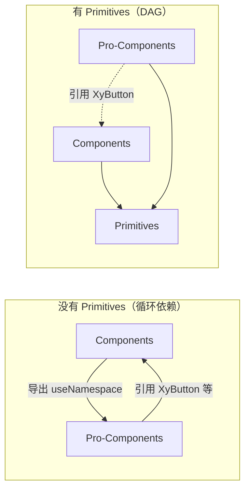

1. **循环依赖**：如果 Pro-Components 从 Components 导入 `useNamespace`，同时 Components 又需要引用 Pro 层定义的某些类型（如 `ProFieldSchema`），就形成 `Components ↔ Pro-Components` 的双向依赖。Vite 无法对循环依赖的模块进行正确的 tree-shaking。
2. **产物膨胀**：如果 Pro-Components 的使用者只想用 Pro 层的 composable（如 `useOverlayStack`），却不得不引入整个 Components 包，则产物中会包含所有基础组件的代码。

将共享代码上提到 Primitives 后，依赖图变成 DAG，三个包可以独立构建和发布。

## 包结构总览

```
packages/xiaoye-primitives/
├── index.ts                    # 主入口：统一导出 composables + utils + theme + data
├── style.css                   # 构建产物入口：引入 base.css + tokens.css
├── src/
│   ├── composables/            # 12 个 Vue composable
│   │   ├── use-namespace.ts    # BEM 命名 + CSS 变量命名
│   │   ├── use-config.ts       # ConfigProvider 注入消费
│   │   ├── use-z-index.ts      # 全局自增 z-index
│   │   ├── use-overlay-stack.ts        # 浮层栈管理
│   │   ├── use-overlay-dialog.ts       # Dialog 专用浮层逻辑
│   │   ├── use-focus-trap.ts           # 焦点陷阱
│   │   ├── use-floating-panel.ts       # 浮层定位
│   │   ├── use-floating-visibility.ts  # 浮层显隐
│   │   ├── use-dismissible-layer.ts    # 点击外部关闭
│   │   ├── use-list-navigation.ts      # 键盘列表导航
│   │   ├── use-throttle-render.ts      # 渲染节流
│   │   └── use-controlled.ts          # 受控/非受控值
│   ├── utils/
│   │   ├── vue/                # Vue 相关工具
│   │   │   ├── with-install.ts # install 方法注入
│   │   │   └── dev.ts          # 开发警告
│   │   ├── dom/                # DOM 工具
│   │   │   ├── click-outside.ts
│   │   │   ├── focus.ts
│   │   │   └── scroll-lock.ts
│   │   ├── types/              # 共享类型
│   │   │   └── common.ts
│   │   └── compat/             # 版本兼容层
│   │       └── index.ts
│   ├── theme/                  # 共享样式
│   │   ├── index.ts
│   │   ├── base.css            # CSS Reset + 基础变量
│   │   ├── tokens.css          # Primitive Token 定义
│   │   └── shared/             # 跨组件共享样式片段
│   │       ├── popper.css
│   │       ├── overlay.css
│   │       ├── transition.css
│   │       ├── resize-observer.css
│   │       ├── scrollbar.css
│   │       └── display-value.css
│   └── data/                   # 静态数据
│       └── index.ts
```

## 核心注入机制：configProviderKey

整个组件库的全局配置通过 `provide / inject` 跨层级传递，而这个机制的"钥匙"——`configProviderKey`——就定义在 Primitives 中：

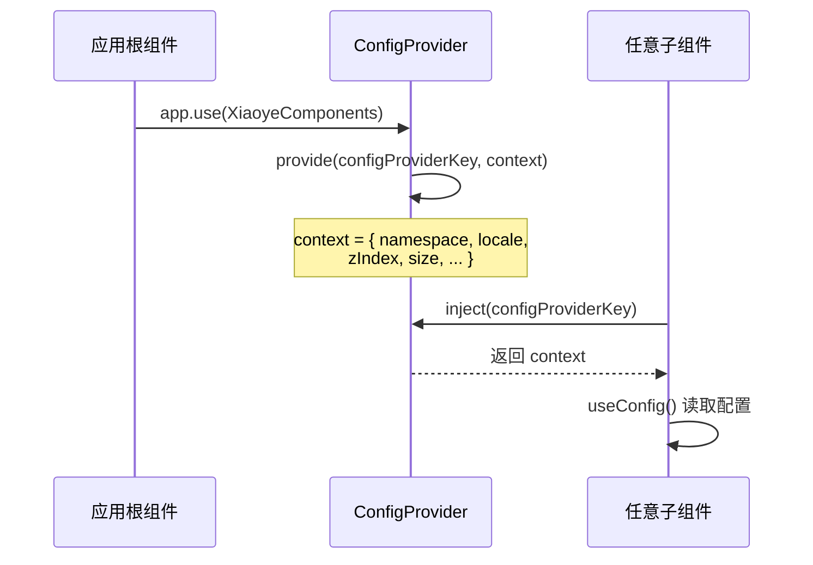

`SharedConfigContext` 接口定义了全局配置的完整形状：

```ts
export interface SharedConfigContext {
  namespace?: string;   // CSS 类名前缀（默认 xy）
  locale?: Record<string, any>;  // 国际化文案
  zIndex?: number;      // z-index 起始值
  size?: string;        // 全局尺寸
  // ... 其他全局配置
}
```

**为什么 key 要定义在 Primitives 而不是 Components？** 因为 `ConfigProvider` 组件在 `@xiaoye/components` 包中，但 `ProForm`、`CrudPage` 等 Pro 组件也需要读取同一个注入上下文。如果 key 定义在 Components 包中，Pro-Components 就必须依赖 Components 包来获取这个 key——而 Pro 层可能只想读取配置而不引入任何基础组件。

## Composable 设计详解

### useNamespace：BEM 命名与 CSS 变量桥接

`useNamespace` 是所有组件的样式基础设施，它生成符合 BEM 规范的类名并桥接 CSS 变量：

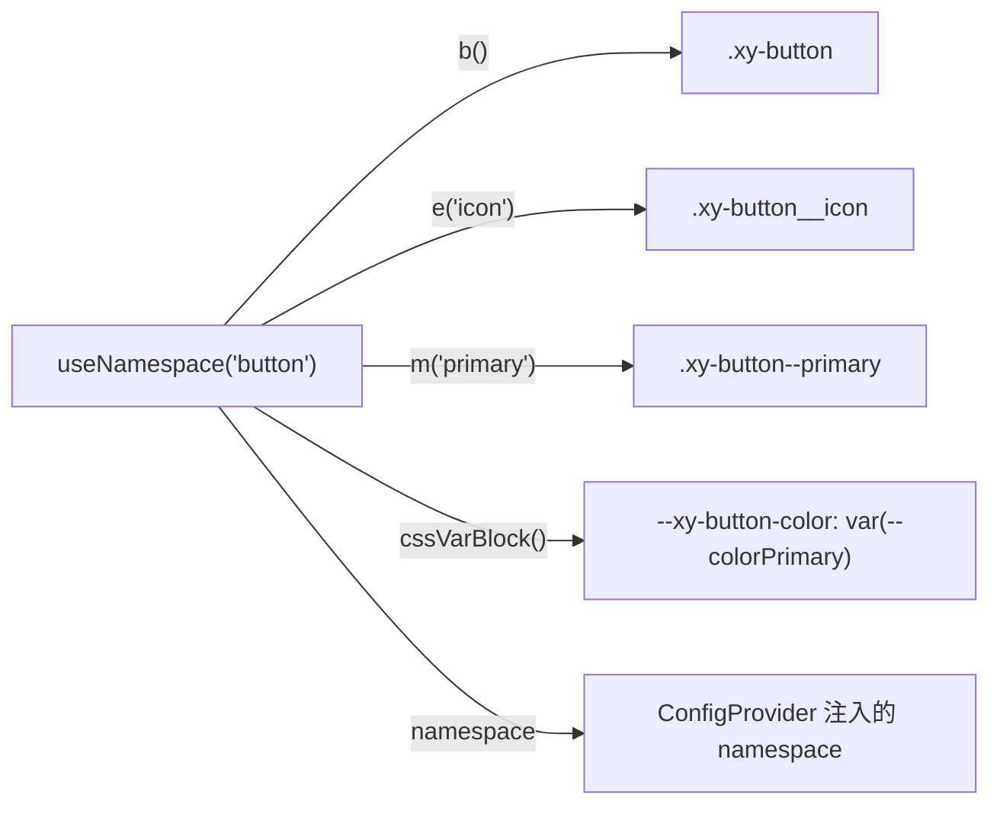

核心实现逻辑：

1. 从 `useConfig()` 读取 `namespace`（默认 `xy`），所有类名前缀动态跟随
2. `b()` 返回块级类名 `.xy-button`
3. `e(name)` 返回元素类名 `.xy-button__icon`
4. `m(name)` 返回修饰符类名 `.xy-button--primary`
5. `cssVarBlock()` 生成组件级 CSS 变量声明，变量名带 namespace 前缀

**动态 namespace 的意义**：当页面中同时存在两个版本的 xiaoye-components（如 v1 和 v2），可以通过不同的 ConfigProvider 设置不同的 namespace，避免样式冲突：

```html
<xy-config-provider namespace="v1">
  <xy-button>版本1按钮</xy-button>
</xy-config-provider>
<xy-config-provider namespace="v2">
  <xy-button>版本2按钮</xy-button>
</xy-config-provider>
```

### useConfig：配置消费的统一入口

`useConfig` 封装了 `inject(configProviderKey)` 的调用，并处理了未提供 ConfigProvider 的边界情况：

```ts
export function useConfig() {
  const config = inject(configProviderKey, undefined);
  const namespace = computed(() => config?.namespace || "xy");
  const locale = computed(() => config?.locale || defaultLocale);
  const zIndex = computed(() => config?.zIndex || 2000);
  // ...
  return { namespace, locale, zIndex, ... };
}
```

关键设计：所有返回值都是 `computed`，这意味着 ConfigProvider 的配置变化会自动触发消费组件的响应式更新。如果直接返回 `config?.namespace`，在 ConfigProvider 动态切换 namespace 时，子组件不会重新渲染。

### useZIndex：全局自增 z-index 管理

多个浮层组件（Dialog、Drawer、Message、Notification）同时出现时，后出现的浮层应该在更上层。`useZIndex` 通过一个模块级计数器实现：

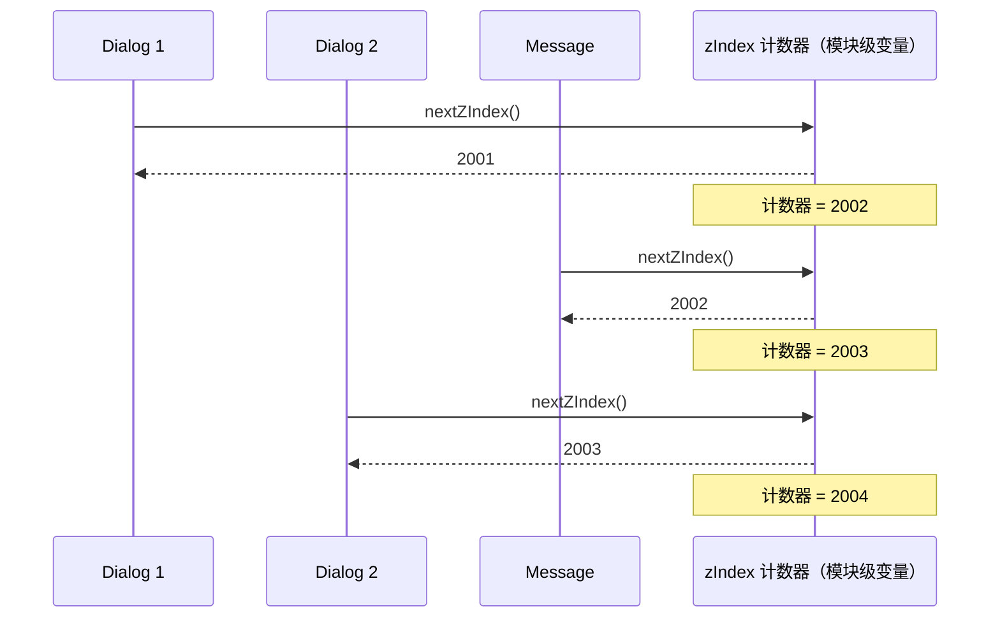

起始值从 `useConfig().zIndex` 读取（默认 2000），后续每次调用 `nextZIndex()` 自增并返回。使用模块级变量而非 `provide/inject` 是因为 z-index 需要跨组件树全局唯一——两个不同 ConfigProvider 下的浮层仍然需要正确的层级关系。

### useOverlayStack：浮层栈管理

浮层组件的打开/关闭不是简单的 `v-if`——它们需要协作管理：

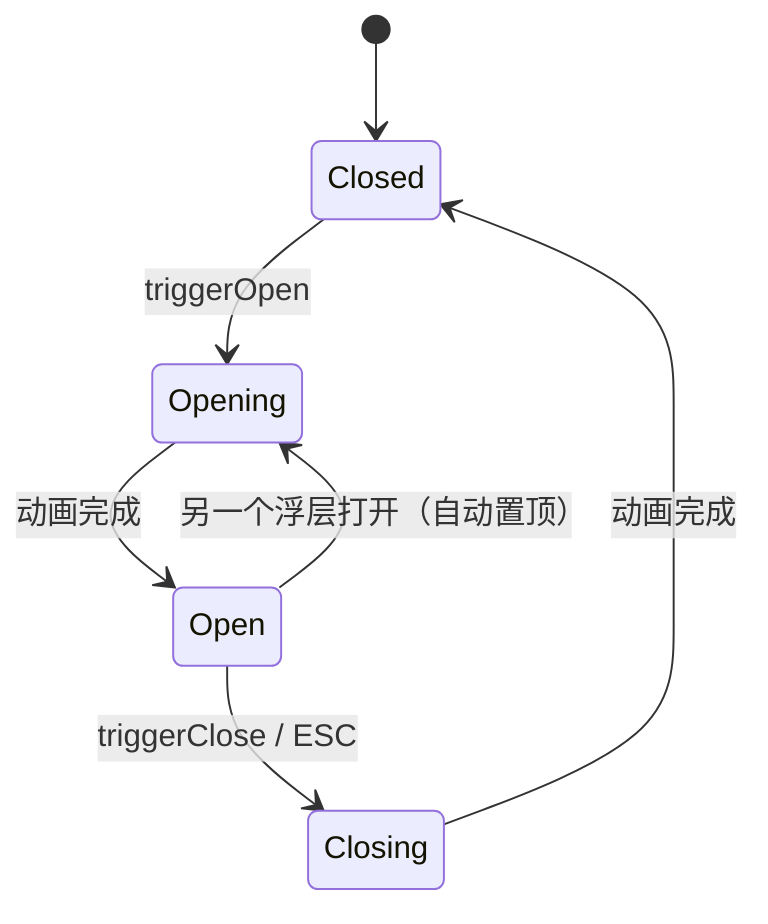

`useOverlayStack` 维护一个全局栈，每个栈项记录浮层 ID、类型（dialog/drawer/popover）和 z-index：

- **打开时**：推入栈顶，分配 z-index
- **关闭时**：从栈中移除，检查是否需要恢复滚动
- **ESC 键**：只关闭栈顶浮层，不会穿透关闭底层的浮层
- **滚动锁定**：栈非空时锁定 body 滚动，栈清空时解锁

这个 composable 被 Dialog、Drawer、Popover 等浮层组件共享，确保它们在同一页面中不会互相干扰。

### useOverlayDialog：Dialog 专用浮层逻辑

Dialog 组件的浮层行为比 Drawer/Popover 更复杂——它需要处理：

1. 打开时锁定 body 滚动（`scroll-lock`）
2. 焦点陷阱（打开后焦点限制在 Dialog 内）
3. 点击遮罩关闭（可配置 `closeOnClickModal`）
4. ESC 键关闭（可配置 `closeOnPressEscape`）
5. 打开/关闭动画期间禁止重复触发

`useOverlayDialog` 组合了 `useOverlayStack`、`useFocusTrap`、`scroll-lock` 等能力，为 Dialog 提供开箱即用的浮层管理。

### useFocusTrap：焦点陷阱

无障碍（a11y）要求 Dialog 打开后，Tab 键的焦点循环必须在 Dialog 内部，不能跳到背景页面：

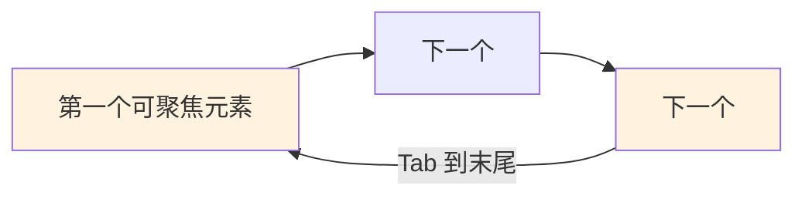

实现要点：
- 打开时记录当前焦点位置，将焦点移入 Dialog
- Tab / Shift+Tab 在 Dialog 内的可聚焦元素间循环
- 关闭时恢复焦点到触发元素

### useFloatingPanel + useFloatingVisibility：浮层定位

这两个 composable 基于 [Floating UI](https://floating-ui.com/) 实现浮层定位和显隐控制，是 Popover、Tooltip、Select 下拉等组件的底层能力：

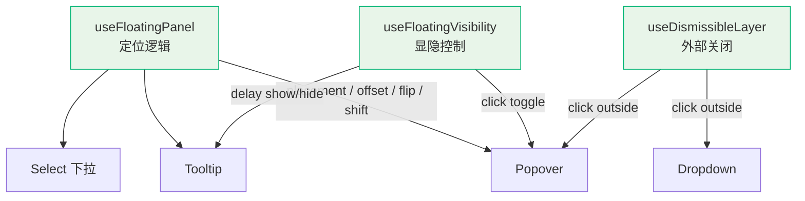

`useFloatingPanel` 的核心配置：

- **placement**：浮层位置（top / bottom / left / right 及其 start/end 变体）
- **middleware**：`offset`（偏移）、`flip`（溢出翻转）、`shift`（边界偏移）、`size`（尺寸自适应）
- **whileElementsMounted**：自动在触发元素和浮层元素挂载时启动定位计算

`useFloatingVisibility` 管理 `open / close` 状态的转换，支持延迟显示/隐藏（Tooltip 的 hover 延迟）。

### useDismissibleLayer：点击外部关闭

当浮层打开时，点击浮层外部区域应关闭浮层。但"外部"的定义取决于组件类型：

- Popover：点击 Popover 内容区以外关闭
- Dropdown：点击菜单项或外部关闭
- Select：点击选中项或外部关闭

`useDismissibleLayer` 接受 `dismiss` 回调和 `exclude` 元素列表，使用 `pointerdown` 事件（而非 `click`）来尽早响应外部点击，避免用户感知到延迟。

### useListNavigation：键盘列表导航

Select、Dropdown、Menu 等组件需要支持键盘在列表项间导航：

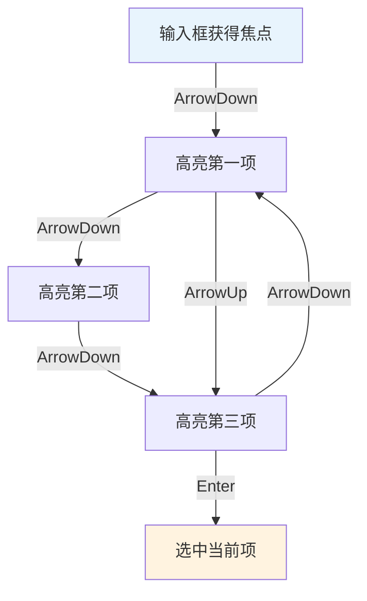

`useListNavigation` 基于 Floating UI 的 `useListNavigation` 封装，处理：
- ArrowUp / ArrowDown 在列表项间循环移动
- Home / End 跳到首尾
- Enter 选中当前高亮项
- 字母键快速定位（输入首字母跳转）

### useThrottleRender：渲染节流

某些组件（如 Dialog、Drawer）在首次渲染时需要创建大量 DOM 节点。如果页面初始就渲染所有浮层组件（只是隐藏），会影响首屏性能。`useThrottleRender` 通过 `requestAnimationFrame` 延迟渲染：

```ts
export function useThrottleRender(delay: number) {
  const show = ref(false);
  if (delay > 0) {
    requestAnimationFrame(() => { show.value = true; });
  } else {
    show.value = true;
  }
  return show;
}
```

看似简单的代码，解决的问题却不简单：如果 Dialog 使用 `v-if` 控制显隐，打开时整个 Dialog DOM 树需要同步创建，这会导致主线程卡顿。`useThrottleRender` 让组件先以空壳挂载，下一帧再填充内容，将创建开销分散到多个帧中。

### useControlled：受控/非受控值统一

Vue 组件的 v-model 存在两种使用方式：

```html
<!-- 非受控：组件内部管理状态 -->
<xy-input />

<!-- 受控：外部完全控制值 -->
<xy-input :model-value="val" @update:model-value="val = $event" />
```

`useControlled` 统一处理这两种模式：

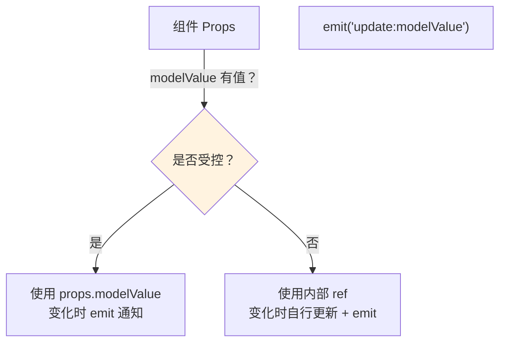

核心逻辑：判断 `modelValue` prop 是否传入（不是 undefined），如果传入则走受控模式（以 props 值为准），否则走非受控模式（以内部 ref 为准）。两种模式的变化都会触发 `emit('update:modelValue')`，确保外部始终能感知值变化。

### usePropDefault：Props 默认值的响应式处理

Vue 的 `withDefaults` 只在组件初始化时生效，如果需要根据 ConfigProvider 的 `size` 动态设置默认尺寸，`withDefaults` 无法响应式更新。`usePropDefault` 解决了这个问题：

```ts
// 使用方式
const { size } = usePropDefault("size", () => config.size || "default");
```

它接受 prop 名和一个动态默认值函数，返回一个 computed：如果 prop 传了值就用传的值，否则调用函数计算默认值。这样 ConfigProvider 的 `size` 变化时，未显式传 size 的组件会自动跟随。

## Utils 工具模块

### with-install：组件注册的标准化

每个组件都需要通过 `app.use()` 注册，但 Vue 3 的 `defineComponent` 并不自带 `install` 方法。`withInstall` 为组件注入标准的 install 行为：

```ts
export function withInstall<T extends Component>(component: T, name?: string) {
  const c = component as SFCWithInstall<T>;
  c.install = (app: App) => {
    app.component(name || c.name!, c);
  };
  return c;
}
```

`SFCWithInstall` 类型在 Vue 的 `DefineComponent` 基础上扩展了 `install` 方法声明，使得 TypeScript 能正确推断 `app.use(component)` 的类型。

### dev：开发环境警告

在开发环境下，某些 API 误用需要给出警告（如 `modelValue` 和 `model-value` 混用）。`dev.ts` 提供了 `warn` 和 `assert` 工具函数，内部通过 `process.env.NODE_ENV !== 'production'` 守卫，确保警告代码不会出现在生产构建中。

### DOM 工具

| 工具 | 职责 | 典型使用场景 |
|------|------|-------------|
| `click-outside` | 检测点击是否发生在元素外部 | Dropdown、Popover 关闭 |
| `focus` | 焦点查询（获取下一个/上一个可聚焦元素） | Dialog 焦点陷阱、useFocusTrap |
| `scroll-lock` | 锁定/解锁 body 滚动 | Dialog、Drawer 打开时 |

### compat：版本兼容层

`compat/index.ts` 导出 Vue 2/3 兼容相关的工具函数，用于组件库在迁移场景下同时支持两个版本。当前项目已完全基于 Vue 3，此模块保留仅为向前兼容。

## 共享主题样式（theme/shared/）

Primitives 包不仅提供逻辑，还提供跨组件共享的样式片段。这些 CSS 不是"公共样式"那么简单，而是解决浮层、过渡等跨组件样式一致性的基础设施：

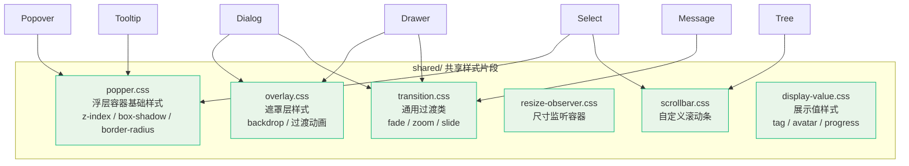

**为什么要提取这些样式？** 以 `popper.css` 为例：Popover、Tooltip、Select 的下拉面板都需要相同的 z-index 层级、阴影和圆角。如果每个组件各自定义，就会出现不一致；如果修改一处的阴影忘记同步其他，视觉差异会非常明显。提取为共享片段后，`@import './popper.css'` 即可保证一致性。

## 数据层（data/）

`data/index.ts` 导出静态数据，主要是：

- 组件名称到中文标签的映射表（用于 MCP Server 和文档侧边栏）
- 国际化文案的默认值
- 组件分组信息

这些数据被 MCP Server 和文档站共同消费，定义在 Primitives 中是为了避免 MCP Server 依赖 Components 包。

## Primitives 与其他层的依赖边界

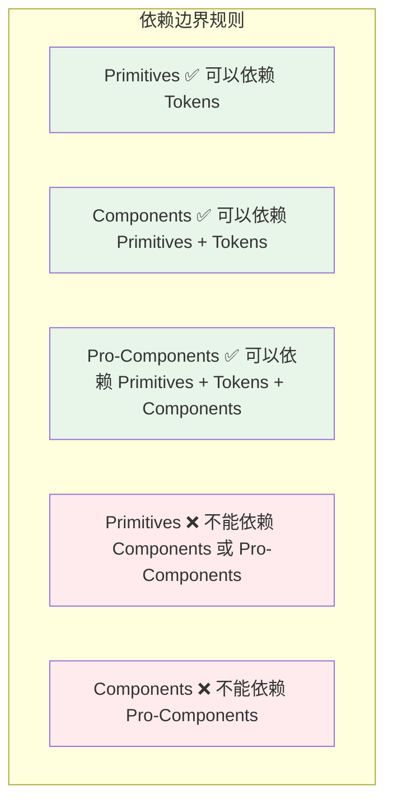

判断一个 composable 或工具函数应该放在哪层的核心原则：

1. **只在 Components 内部使用** → 放在 `packages/components/{name}/src/composables/`
2. **Components 和 Pro-Components 都需要** → 放在 `packages/xiaoye-primitives/src/composables/`
3. **所有层都需要（包括 MCP Server）** → 放在 `packages/xiaoye-primitives/src/data/` 或 `packages/xiaoye-primitives/src/utils/types/`

## 小结

Primitives 层的 12 个 composable 可以按职责分为四组：

| 组别 | composable | 解决的问题 |
|------|-----------|-----------|
| **样式与配置** | useNamespace, useConfig, usePropDefault | BEM 命名、全局配置消费、动态默认值 |
| **浮层管理** | useOverlayStack, useOverlayDialog, useFocusTrap, useFloatingPanel, useFloatingVisibility, useDismissibleLayer | 定位、显隐、焦点、层级、关闭 |
| **交互增强** | useListNavigation, useZIndex, useThrottleRender | 键盘导航、层级分配、渲染节流 |
| **值管理** | useControlled | 受控/非受控统一 |

下一篇 [[theme-tokens]] 将深入 Tokens 包，拆解 Primitive → Semantic 双层令牌体系的具体实现，以及 ConfigProvider 如何通过 namespace 实现运行时主题切换。