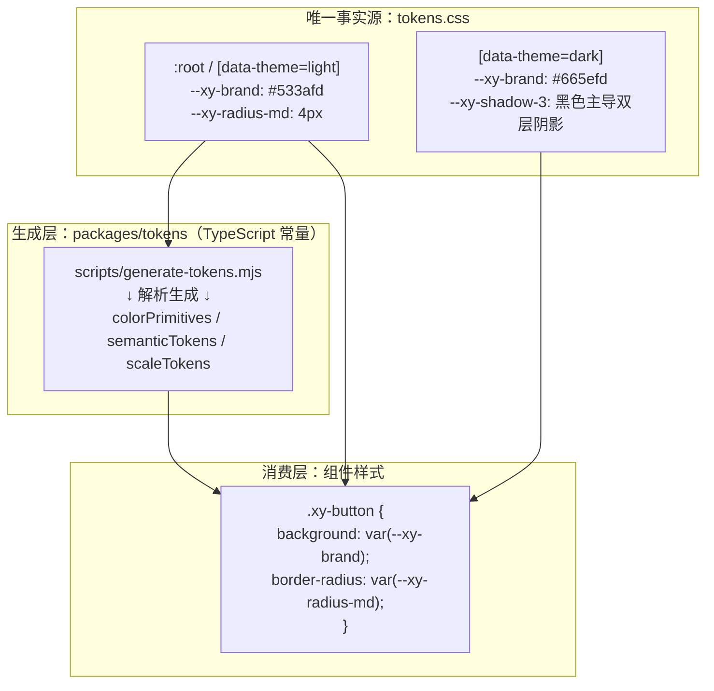
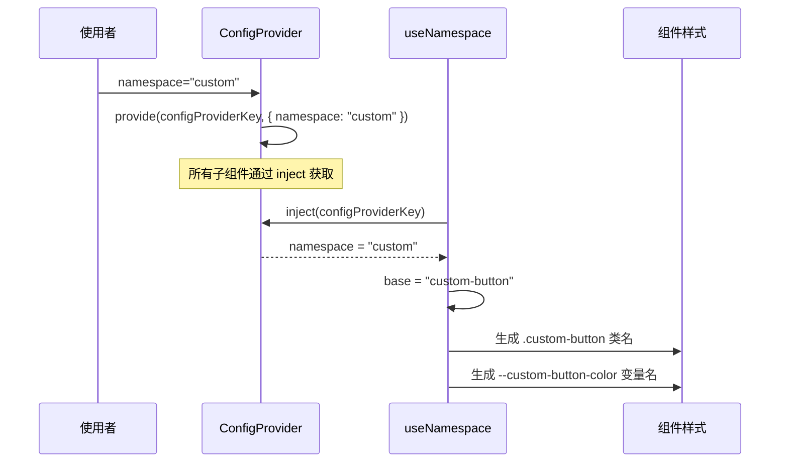
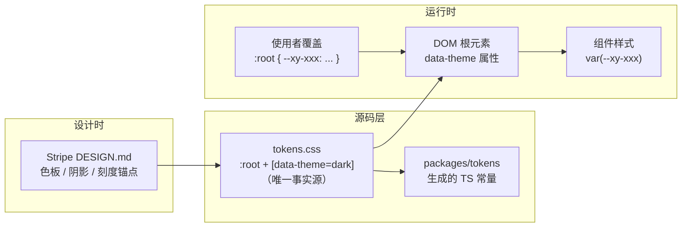

# 03 主题与设计令牌系统

> 导读：xiaoye-components 的主题系统由三层构成——`tokens.css` 定义基元 / 语义 / 刻度三层令牌并区分 Light / Dark 两套值，`packages/tokens` 的 TS 常量层由脚本从 tokens.css 生成，ConfigProvider 通过 namespace 实现运行时样式隔离。本文拆解这三层如何协作，以及如何通过覆盖 CSS 变量实现定制主题。

## 三层主题架构

整套令牌以 **Stripe 设计语言**为蓝本（主色 `#533afd`、深海军蓝标题 `#061b31`、蓝调多层阴影），命名与分层参考了 Stripe 官方 token 目录的组织方式。



数据流是**CSS 优先**的：`tokens.css` 是唯一手工维护的令牌源，TS 常量层通过 `node scripts/generate-tokens.mjs` 从它生成。这样做的理由：

- **CSS 变量是真正的运行时载体**：组件样式消费 `var(--xy-*)`，支持运行时切换，无需重新构建
- **单一事实源**：旧体系曾出现 TS 与 CSS 双份手工维护导致命名漂移（TS 里有 `colorOverlay`，CSS 里却叫 `--xy-overlay-color`）；生成式管道从根上消除了这类漂移
- **TS 常量按需使用**：JS 中计算颜色、生成内联样式时从 `@xiaoye/tokens`（路径别名 `@xiaoye/tokens`）导入即可

## tokens.css 的三层结构

### 基元层（Primitives）

基元层是设计系统的"原子"——六族数字标度色板，只描述颜色本身，不携带用途：

```css
:root, [data-theme="light"] {
  /* 中性灰：海军蓝底色冷调（Stripe neutral） */
  --xy-gray-200: #e5edf5;   /* 官方 border */
  --xy-gray-500: #64748d;   /* 官方正文 slate */
  --xy-gray-700: #273951;   /* 官方标签 dark-slate */
  --xy-gray-950: #061b31;   /* 官方标题 deep navy */

  /* 品牌紫：Stripe purple scale */
  --xy-purple-600: #533afd; /* stripe purple */
  --xy-purple-700: #4434d4; /* CTA hover */
  --xy-purple-950: #1c1e54; /* brand dark */

  /* 另有 green / amber / red / blue 四族 */
}
```

设计决策要点：

1. **数字标度**（50/100/.../950）：遵循 Tailwind / Radix 的色阶约定，阶号越大颜色越深。语义层可以选不同阶表达不同状态（hover 用 700，active 用 900）。
2. **锚点取官方值**：每族色板的若干阶直接使用 Stripe 官方 token 值（在注释中标注），其余阶按色相一致性插值，保证整族协调。
3. **双主题共享**：基元层在暗色下不覆写，暗色差异全部由语义层承担。

### 语义层（Semantic）

语义层为基元值赋予业务含义，是组件唯一消费的层：

```css
:root, [data-theme="light"] {
  /* 文字：五级亮度 + 反衬 */
  --xy-text-heading:   var(--xy-gray-950);
  --xy-text-secondary: var(--xy-gray-700);
  --xy-text-muted:     var(--xy-gray-500);

  /* 背景：严格亮度阶梯 page < subtle < muted < sunken < container */
  --xy-bg-page:      #f3f7fb;
  --xy-bg-container: #ffffff;
  --xy-bg-sunken:    var(--xy-gray-100);

  /* 品牌色与状态色（六件套） */
  --xy-brand: var(--xy-purple-600);
  --xy-brand-soft: rgba(83, 58, 253, 0.07);
  --xy-success: var(--xy-green-500);
  --xy-success-text: var(--xy-green-600);

  /* 海拔：Stripe 五级蓝调阴影 */
  --xy-shadow-1: 0 3px 6px rgba(23, 23, 23, 0.06);
  --xy-shadow-3:
    0 30px 45px -30px rgba(50, 50, 93, 0.25),
    0 18px 36px -18px rgba(0, 0, 0, 0.1);

  /* 层级：单调递增阶梯 */
  --xy-z-dropdown: 1000;
  --xy-z-modal: 1100;
  --xy-z-tooltip: 1300;
}
```

语义命名的几条硬规则：

- **一义一名**：同类角色只用一种前缀形态。旧体系曾同时存在 `--xy-color-*` / `--xy-text-color-*` / `--xy-border-color-*` / `--xy-bg-color-*` / `--xy-surface-*` 九种前缀形态，现已统一为 `text-` / `bg-` / `border-` / `brand-` / 状态色直名。
- **无坍缩刻度**：每一档命名都必须对应独立视觉档位。旧体系 radius xs=sm=md=2px、shadow card/popup/modal 同值，这种"名字比视觉多"的刻度全部收敛（圆角六档实值 2/4/5/6/8/pill，阴影五级实值）。
- **状态色六件套**：`{base, hover, active, soft, soft-hover, text}` 命名完全一致，info 不再像旧体系那样缺 active/soft。

### 刻度层（Scales）

字号、字重、行高、间距、圆角、动效时长——与主题无关，暗色下继承 `:root`：

```css
--xy-font-size-2xs: 11px;  /* 九档无坍缩，最小 11px */
--xy-font-size-md: 14px;   /* 默认正文 */
--xy-font-weight-light: 300;  /* Stripe 双轨制：展示 300 / 控件 400 */
--xy-radius-md: 4px;       /* Stripe 标准：按钮/输入框的主力圆角 */
--xy-space-4: 16px;        /* 8px 基准网格 */
--xy-transition-duration-fast: 0.15s;
```

## Dark 模式的特殊处理

Dark 模式不是简单的"颜色取反"，暗色锚点全部取自 Stripe 官方暗色目录：

1. **页面底是深靛黑**：`#0e0f2e`（不是纯黑也不是中性灰），官方暗色预览的画布色。
2. **品牌色提亮**：`#533afd` → `#665efd`，hover 再提亮到 `#7a73ff`。暗色背景上需要更亮的品牌色。
3. **边框走白色透明度**：`rgba(255,255,255,0.1)` 三档（0.06/0.1/0.18）。半透明边框在暗面上比实色更自然（Linear 同款手法）。
4. **soft 色用品牌/状态色 alpha**：`rgba(102,94,253,0.15)`。半透明在暗背景上产生自然的"染色"。
5. **阴影转黑色主导**：亮色的蓝调阴影在暗面上不可见，五级阴影全部换成更重的黑色系（官方暗色 shadow 值）。
6. **圆角/间距/字号不变**：这些与颜色无关的刻度继承 `:root`。

### 切换 Dark 模式

通过在根元素上设置 `data-theme` 属性切换：

```ts
// 切换到暗色
document.documentElement.setAttribute('data-theme', 'dark');

// 切换回亮色
document.documentElement.setAttribute('data-theme', 'light');

// 或移除属性，回退到 :root 默认值
document.documentElement.removeAttribute('data-theme');
```

由于所有组件样式通过 `var(--xy-xxx)` 消费变量，切换 `data-theme` 后所有组件自动跟随，无需重新渲染。`data-theme` 也可以放在任意容器上，实现页面局部暗色区块。

## 生成的 TS 常量层

`node scripts/generate-tokens.mjs` 解析 tokens.css 亮色块，生成三组常量：

```ts
// packages/tokens/src/primitives.ts（自动生成，勿手改）
export const colorPrimitives = {
  "gray500": "#64748d",
  "purple600": "#533afd",
  // ... 58 项
} as const;

// packages/tokens/src/semantic.ts
export const semanticTokens = {
  "textMuted": "var(--xy-gray-500)",
  "brand": "var(--xy-purple-600)",
  // ... 124 项
} as const;

// packages/tokens/src/scales.ts
export const scaleTokens = {
  "fontSizeMd": "14px",
  "radiusSm": "4px",
  // ... 38 项
} as const;
```

生成物中的 `var(...)` 引用保持 CSS 原文——TS 层的定位是"令牌清单的只读视图"，不参与颜色计算。

## ConfigProvider 与 namespace 动态切换

ConfigProvider 是主题系统的运行时入口——它通过 `namespace` prop 控制所有组件的 CSS 类名前缀和变量前缀：



### namespace 的实际效果

默认 namespace 为 `xy`，生成的类名和变量名：

```css
.xy-button { background: var(--xy-brand); }
.xy-dialog { z-index: var(--xy-z-modal); }
```

修改 namespace 为 `acme`：

```css
.acme-button { background: var(--acme-brand); }
.acme-dialog { z-index: var(--acme-z-modal); }
```

这意味着两件事：
1. **样式隔离**：不同 namespace 的组件不会互相覆盖样式
2. **变量隔离**：不同 namespace 可以使用不同的 CSS 变量值

### 多版本共存场景

```html
<xy-config-provider namespace="v1">
  <!-- 使用 --v1-brand 变量 -->
  <v1-button>版本1</v1-button>
</xy-config-provider>

<xy-config-provider namespace="v2">
  <!-- 使用 --v2-brand 变量 -->
  <v2-button>版本2</v2-button>
</xy-config-provider>
```

## 主题定制的三种方式

### 方式一：覆盖 CSS 变量（推荐）

最轻量的定制方式，只需覆盖对应的 CSS 变量（建议只动语义层）：

```css
:root {
  --xy-brand: #8f63ff;       /* 品牌色改为紫色 */
  --xy-brand-hover: #aa84ff;
  --xy-brand-active: #6b3fd4;
  --xy-brand-soft: rgba(143, 99, 255, 0.12);
  --xy-radius-md: 6px;              /* 圆角增大 */
}
```

优点：无需重新构建组件库，运行时生效，可以按页面/组件粒度覆盖。

### 方式二：通过 ConfigProvider 修改 namespace

适合需要完全隔离样式的场景（如微前端中不同子应用使用不同主题）：

```ts
app.use(XiaoyeComponents, { namespace: 'acme' });
```

然后定义对应的 CSS 变量：

```css
:root {
  --acme-brand: #8f63ff;
  --acme-radius-md: 6px;
  /* ... 所有 --acme- 变量 */
}
```

### 方式三：修改令牌源码（最深度的定制）

如果需要修改基元色板或整套语义映射，直接编辑 `packages/xiaoye-primitives/src/theme/tokens.css`（唯一事实源），然后重新生成 TS 层并构建：

```bash
node scripts/generate-tokens.mjs   # 重新生成 packages/tokens
pnpm build:lib                     # 重新构建组件库
```

这种方式适用于需要完全替换设计系统的场景。

## base.css：CSS Reset 与基础样式

`base.css` 提供了组件库运行所需的基础样式：

```css
html {
  font-family: var(--xy-font-family-base);
  color: var(--xy-text-primary);
  background: var(--xy-bg-container);
}

.xy-focus-visible:focus-visible {
  outline: 2px solid color-mix(in srgb, var(--xy-brand) 58%, white);
  outline-offset: 2px;
  box-shadow: 0 0 0 1px color-mix(in srgb, var(--xy-brand) 16%, transparent);
}
```

- **`html` 基线**：字体族与文字/背景基色全部来自语义令牌
- **`.xy-focus-visible`**：统一的 focus-visible 样式，使用 `color-mix()` 将品牌色与白色混合，产生柔和的聚焦环
- **`.xy-provider` / `.xy-sr-only`**：ConfigProvider 根类与屏幕阅读器工具类

## 令牌体系的完整数据流



设计值以 Stripe 官方 token 目录为锚点写入 tokens.css，TS 常量层由脚本生成，运行时通过 CSS 变量消费——每个环节只有一个写入方，不存在双份维护。

## 小结

xiaoye-components 的主题系统可以总结为三个核心设计：

1. **CSS 优先的三层令牌**：tokens.css 是唯一事实源，基元/语义/刻度三层职责分明；TS 常量层由脚本生成，只读消费。
2. **CSS 变量驱动**：所有组件样式通过 `var(--xy-xxx)` 消费变量，运行时切换 `data-theme` 即可生效。
3. **namespace 隔离**：ConfigProvider 的 namespace 控制类名和变量名前缀，支持多版本/多主题共存。

下一篇 [[component-registration]] 将拆解组件注册与安装体系——Manifest 驱动的自动化管道如何让 72 个基础组件和 31 个 Pro 组件的注册、导出和侧边栏生成完全自动化。
