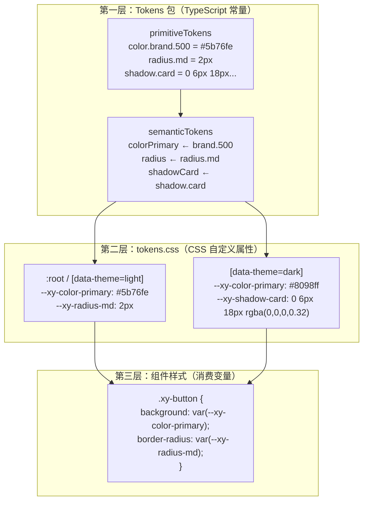
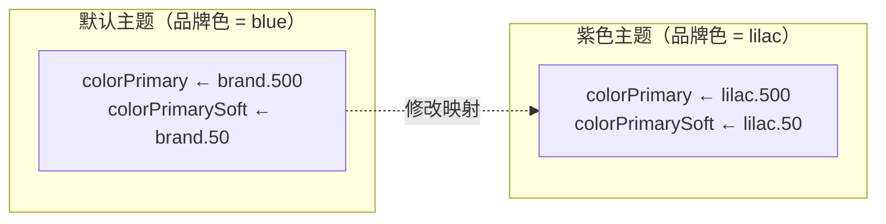
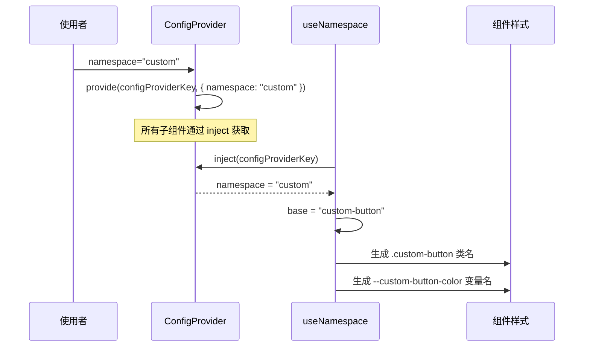
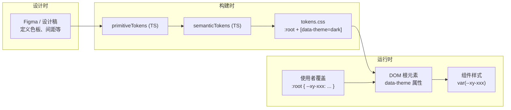

# 03 主题与设计令牌系统

> 导读：xiaoye-components 的主题系统由三层构成——Tokens 包定义 Primitive + Semantic 双层令牌，Primitives 包的 `tokens.css` 将令牌展开为 CSS 自定义属性并区分 Light / Dark 两套值，ConfigProvider 通过 namespace 实现运行时样式隔离。本文拆解这三层如何协作，以及如何通过覆盖 CSS 变量实现定制主题。

## 三层主题架构



为什么需要 TypeScript 常量和 CSS 变量两套定义？因为它们服务于不同的消费者：

- **TypeScript 常量**（`primitiveTokens` / `semanticTokens`）：供 JS 运行时使用，如 JS 中计算颜色值、生成内联样式、MCP Server 返回设计信息
- **CSS 变量**（`--xy-color-primary`）：供组件样式使用，支持运行时切换（修改 CSS 变量立即生效，无需重新构建）

## Primitive Tokens：原始设计值

Primitive Tokens 是设计系统的"原子"——它们直接描述视觉属性的原始值，不包含任何语义信息：

```ts
export const primitiveTokens = {
  color: {
    brand: { "50": "#eef2ff", "100": "#dfe7ff", ..., "500": "#5b76fe", "600": "#4b65ea", "700": "#3d53c9" },
    green: { "50": "#e9fbf2", ..., "500": "#00b473" },
    amber: { "50": "#fff6e8", ..., "500": "#d98a1f" },
    red:   { "50": "#fff0f0", ..., "500": "#e5484d" },
    ink:   { "0": "#ffffff", "25": "#f5f7fa", ..., "900": "#1c1c1e", "950": "#151922" },
    // ... lilac, slate 等
    success: "#00b473",
    warning: "#d98a1f",
    danger:  "#e5484d",
    overlay: "rgba(28, 28, 30, 0.42)",
  },
  radius:  { xs: "2px", sm: "2px", md: "2px", lg: "4px", xl: "6px", pill: "999px" },
  fontSize:{ xs: "12px", sm: "12px", md: "14px", lg: "16px", xl: "20px", "2xl": "28px" },
  space:   { xs: "4px", sm: "8px", md: "12px", lg: "16px", xl: "20px", "2xl": "24px", "3xl": "32px" },
  shadow:  { xs: "...", sm: "...", md: "...", lg: "...", card: "...", popup: "...", modal: "..." },
} as const;
```

设计决策要点：

1. **色板使用数字标度**（50/100/.../900）：遵循 Tailwind / Radix 的色阶约定，50 是最浅色，900 是最深色。这让语义层可以选择不同深浅的色阶来表示不同状态（如 hover 用 600，active 用 700）。
2. **brand 与 blue 同值但独立定义**：当前品牌色恰好是蓝色系，但 `brand` 和 `blue` 是两个独立色板。未来换品牌色只需修改 `brand` 的值，`blue` 保持不变——这是"语义化别名"在 Primitive 层的体现。
3. **`as const` 确保字面量类型**：TypeScript 会将每个值推断为字面量类型（如 `"#5b76fe"` 而非 `string`），让下游代码能获得精确的类型提示。

## Semantic Tokens：语义化别名

Semantic Tokens 是 Primitive 值的语义化映射——它们为原始值赋予业务含义：

```ts
export const semanticTokens = {
  // 品牌色系
  colorPrimary:       primitiveTokens.color.brand["500"],   // #5b76fe
  colorPrimaryHover:  primitiveTokens.color.brand["600"],   // #4b65ea
  colorPrimaryActive: primitiveTokens.color.brand["700"],   // #3d53c9
  colorPrimarySoft:   primitiveTokens.color.brand["50"],    // #eef2ff

  // 语义色系
  colorSuccess:       primitiveTokens.color.success,        // #00b473
  colorWarning:       primitiveTokens.color.warning,        // #d98a1f
  colorDanger:        primitiveTokens.color.danger,         // #e5484d

  // 文字色
  colorText:          primitiveTokens.color.ink["900"],     // #1c1c1e
  colorTextSecondary: primitiveTokens.color.ink["600"],     // #566277
  colorTextSubtle:    primitiveTokens.color.ink["500"],     // #77839a

  // 边框色
  colorBorder:        primitiveTokens.color.ink["200"],     // #e7ebf2
  colorBorderStrong:  primitiveTokens.color.ink["300"],     // #d6dce8

  // 背景色
  colorBg:            primitiveTokens.color.white,          // #ffffff
  colorBgMuted:       primitiveTokens.color.ink["50"],      // #f8f9fc
  colorBgElevated:    primitiveTokens.color.ink["1"],       // #fdfdff

  // 圆角
  radius:             primitiveTokens.radius.md,            // 2px
  radiusControl:      primitiveTokens.radius.md,            // 2px
  radiusContainer:    primitiveTokens.radius.lg,            // 4px
  radiusOverlay:      primitiveTokens.radius.xl,            // 6px
} as const;
```

**双层设计的核心优势**：换肤只需修改 Semantic 映射，不需要触及 Primitive 色板。



注意圆角的语义分层：`radiusControl`（控件圆角）= 2px，`radiusContainer`（容器圆角）= 4px，`radiusOverlay`（浮层圆角）= 6px。这种递增关系确保视觉层级越高（越接近用户），圆角越大，符合"近大远小"的空间隐喻。

## CSS 自定义属性：tokens.css

`tokens.css` 是令牌系统的运行时载体——它将 Semantic Tokens 展开为 CSS 自定义属性，并区分 Light / Dark 两套值：

```css
:root, [data-theme="light"] {
  --xy-color-primary: #5b76fe;
  --xy-color-primary-hover: #4b65ea;
  --xy-text-color: #1c1c1e;
  --xy-bg-color: #ffffff;
  --xy-border-color: #e7ebf2;
  --xy-radius-md: 2px;
  --xy-shadow-card: 0 6px 18px rgba(28, 28, 30, 0.08);
  /* ... 80+ 变量 */
}

[data-theme="dark"] {
  --xy-color-primary: #8098ff;
  --xy-color-primary-hover: #5b76fe;
  --xy-text-color: #f2f4f8;
  --xy-bg-color: #1c1c1e;
  --xy-border-color: #394457;
  --xy-shadow-card: 0 6px 18px rgba(0, 0, 0, 0.32);
  /* ... 同名变量，暗色值 */
}
```

### 命名约定

所有 CSS 变量遵循 `--xy-{category}-{property}-{variant}` 的命名模式：

| 类别 | 示例 | 含义 |
|------|------|------|
| 颜色 | `--xy-color-primary` | 品牌主色 |
| | `--xy-color-primary-soft` | 主色浅底（用于背景） |
| | `--xy-text-color` | 正文文字色 |
| | `--xy-bg-color` | 基础背景色 |
| | `--xy-border-color` | 边框色 |
| 圆角 | `--xy-radius-md` | 中等圆角 |
| 间距 | `--xy-space-4` | 4 级间距（16px） |
| 阴影 | `--xy-shadow-card` | 卡片阴影 |
| 字号 | `--xy-font-size-md` | 中等字号（14px） |
| 过渡 | `--xy-transition-duration-fast` | 快速过渡时长 |
| z-index | `--xy-z-modal` | Modal 层级 |

### Dark 模式的特殊处理

Dark 模式不是简单的"颜色取反"，而是有针对性的调整：

1. **品牌色变亮**：Light 下 `#5b76fe` → Dark 下 `#8098ff`。暗色背景上需要更亮的品牌色才能保持可读性。
2. **Soft 色使用 rgba 透明度**：Light 下 `colorPrimarySoft: #eef2ff`（不透明），Dark 下 `rgba(91, 118, 254, 0.15)`（半透明）。半透明在暗色背景上能产生更自然的"染色"效果。
3. **阴影加深**：Light 下 `rgba(28, 28, 30, 0.08)` → Dark 下 `rgba(0, 0, 0, 0.32)`。暗色背景上浅色阴影不可见，需要更重的阴影才能表达层级。
4. **圆角/间距/字号不变**：这些与颜色无关的变量在 Dark 模式下继承 `:root` 的值。

### 切换 Dark 模式

通过在根元素上设置 `data-theme` 属性切换：

```ts
// 切换到暗色
document.documentElement.setAttribute('data-theme', 'dark');

// 切换回亮色
document.documentElement.setAttribute('data-theme', 'light');

// 或移除属性，回退到 :root 默认值
document.documentElement.removeAttribute('data-theme');
```

由于所有组件样式通过 `var(--xy-xxx)` 消费变量，切换 `data-theme` 后所有组件自动跟随，无需重新渲染。

## ConfigProvider 与 namespace 动态切换

ConfigProvider 是主题系统的运行时入口——它通过 `namespace` prop 控制所有组件的 CSS 类名前缀和变量前缀：



### namespace 的实际效果

默认 namespace 为 `xy`，生成的类名和变量名：

```css
.xy-button { background: var(--xy-color-primary); }
.xy-dialog { z-index: var(--xy-z-modal); }
```

修改 namespace 为 `acme`：

```css
.acme-button { background: var(--acme-color-primary); }
.acme-dialog { z-index: var(--acme-z-modal); }
```

这意味着两件事：
1. **样式隔离**：不同 namespace 的组件不会互相覆盖样式
2. **变量隔离**：不同 namespace 可以使用不同的 CSS 变量值

### 多版本共存场景

```html
<xy-config-provider namespace="v1">
  <!-- 使用 --v1-color-primary 变量 -->
  <v1-button>版本1</v1-button>
</xy-config-provider>

<xy-config-provider namespace="v2">
  <!-- 使用 --v2-color-primary 变量 -->
  <v2-button>版本2</v2-button>
</xy-config-provider>
```

## 主题定制的三种方式

### 方式一：覆盖 CSS 变量（推荐）

最轻量的定制方式，只需覆盖对应的 CSS 变量：

```css
:root {
  --xy-color-primary: #8f63ff;       /* 品牌色改为紫色 */
  --xy-color-primary-hover: #aa84ff;
  --xy-color-primary-active: #8f63ff;
  --xy-color-primary-soft: rgba(143, 99, 255, 0.15);
  --xy-radius-md: 4px;              /* 圆角增大 */
}
```

优点：无需重新构建组件库，运行时生效，可以按页面/组件粒度覆盖。

### 方式二：通过 ConfigProvider 修改 namespace

适合需要完全隔离样式的场景（如微前端中不同子应用使用不同主题）：

```ts
app.use(XiaoyeComponents, { namespace: 'acme' });
```

然后定义对应的 CSS 变量：

```css
:root {
  --acme-color-primary: #8f63ff;
  --acme-radius-md: 4px;
  /* ... 所有 --acme- 变量 */
}
```

### 方式三：修改 Tokens 包源码（最深度的定制）

如果需要修改 Primitive 色板本身（而非仅修改 Semantic 映射），需要修改 `packages/tokens/src/primitives.ts`：

```ts
export const primitiveTokens = {
  color: {
    brand: {
      "500": "#8f63ff",  // 修改 Primitive 色板
      // ...
    }
  }
};
```

然后重新构建组件库。这种方式适用于需要完全替换设计系统的场景。

## base.css：CSS Reset 与基础样式

`base.css` 提供了组件库运行所需的基础样式：

```css
.xy-provider {
  color: var(--xy-text-color);
}

.xy-focus-visible:focus-visible {
  outline: 2px solid color-mix(in srgb, var(--xy-color-primary) 58%, white);
  outline-offset: 2px;
  box-shadow: 0 0 0 1px color-mix(in srgb, var(--xy-color-primary) 16%, transparent);
}

.xy-sr-only {
  position: absolute;
  width: 1px; height: 1px;
  padding: 0; margin: -1px;
  overflow: hidden; clip: rect(0, 0, 0, 0);
  white-space: nowrap; border: 0;
}
```

三个基础类的作用：

- **`.xy-provider`**：ConfigProvider 的根类，设置文字颜色为语义变量
- **`.xy-focus-visible`**：统一的 focus-visible 样式，使用 `color-mix()` 将品牌色与白色混合，产生柔和的聚焦环
- **`.xy-sr-only`**：屏幕阅读器专用类，视觉上隐藏但可被辅助技术读取

## 令牌体系的完整数据流



理想情况下，Figma 中的设计值应与 `primitiveTokens` 保持同步——这是设计-开发一致性的源头。当前项目中这一步是通过 AI 协作完成的：设计值由 AI 从 Figma 规范中提取并写入 TypeScript 常量，再通过构建管道展开为 CSS 变量。

## 小结

xiaoye-components 的主题系统可以总结为三个核心设计：

1. **双层令牌**：Primitive 描述原始值，Semantic 赋予业务含义。换肤改映射，不动色板。
2. **CSS 变量驱动**：所有组件样式通过 `var(--xy-xxx)` 消费变量，运行时切换 `data-theme` 即可生效。
3. **namespace 隔离**：ConfigProvider 的 namespace 控制类名和变量名前缀，支持多版本/多主题共存。

下一篇 [[component-registration]] 将拆解组件注册与安装体系——Manifest 驱动的自动化管道如何让 64 个基础组件和 31 个 Pro 组件的注册、导出和侧边栏生成完全自动化。