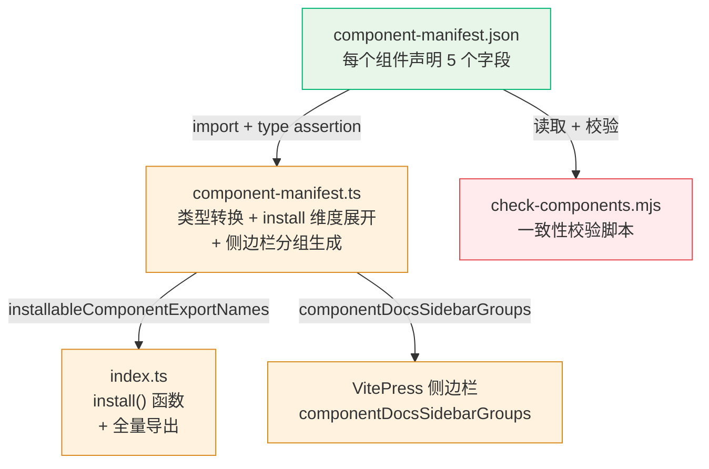
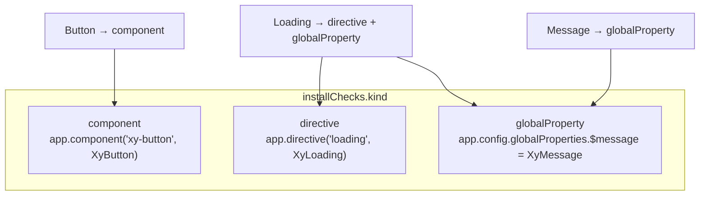
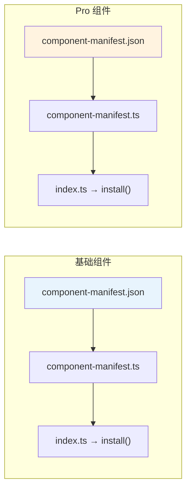
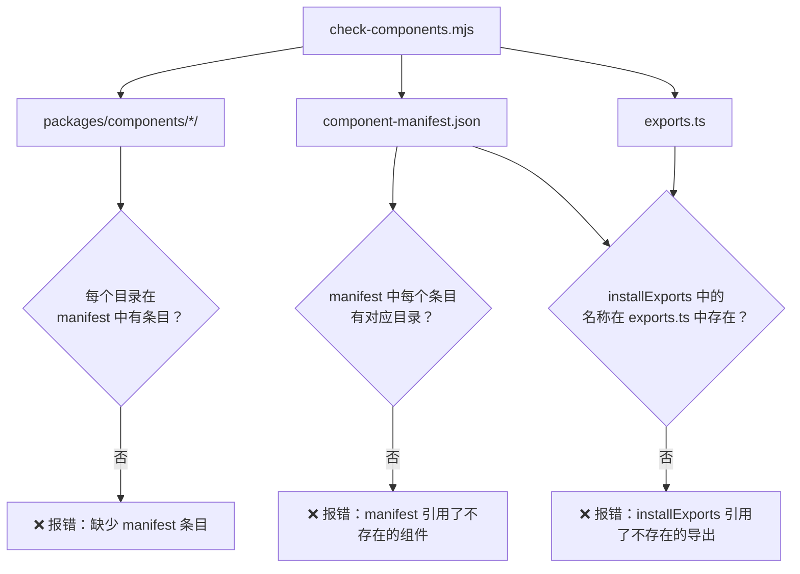
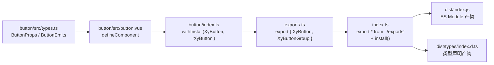

# 04 组件注册与安装体系

> 导读：xiaoye-components 的 64 个基础组件和 31 个 Pro 组件如何注册到 Vue 应用中？答案不是手动维护——而是由 `component-manifest.json` 驱动的自动化管道：JSON 声明安装信息 → TypeScript 转换为强类型 Manifest → index.ts 自动生成 install() 函数和全量导出 → VitePress 侧边栏自动生成。本文拆解这个管道的每一步，以及按需导入 vs 全量注册的实现机制。

## Manifest 驱动的自动化管道



### 第一步：component-manifest.json

每个组件在 JSON 中声明一个条目，包含 5 个字段：

```json
{
  "name": "button",
  "docsGroup": "basic",
  "docsText": "Button 按钮",
  "installExports": ["XyButton", "XyButtonGroup"],
  "installChecks": [
    { "kind": "component", "name": "xy-button" },
    { "kind": "component", "name": "xy-button-group" }
  ],
  "styleImports": ["button"]
}
```

| 字段 | 类型 | 含义 |
|------|------|------|
| `name` | string | 组件标识，对应目录名 `packages/components/{name}/` |
| `docsGroup` | `"basic" \| "form" \| "feedback" \| "data"` | 文档分组，决定侧边栏位置 |
| `docsText` | string | 侧边栏显示文本 |
| `installExports` | string[] | 导出名称列表，用于 `install()` 函数中查找可注册组件 |
| `installChecks` | `{kind, name}[]` | 安装检查项，`kind` 区分三种注册方式 |
| `styleImports` | string[] | 需要导入的样式文件名列表 |

**installChecks 的三种 kind**：



大多数组件只有 `component` 类型的 installCheck。特殊的有：
- **Loading**：同时注册为指令（`v-loading`）和全局属性（`$loading`）
- **Message / Notification**：注册为全局属性（`$message` / `$notify`），因为它们通过函数式调用

### 第二步：component-manifest.ts

TypeScript 文件将原始 JSON 转换为强类型的 `ComponentManifestEntry`，并展开 `install` 维度：

```ts
interface ComponentManifestEntry {
  name: string;
  docsGroup: ComponentDocsGroup;
  docsText: string;
  installExports: string[];
  installChecks: RawComponentInstallCheck[];
  install: {
    components: string[];    // kind=component 的 name 列表
    directives: string[];    // kind=directive 的 name 列表
    globals: string[];       // kind=globalProperty 的 name 列表
  };
  styleImports: string[];
}
```

转换逻辑：

```ts
export const componentManifest = rawManifest.map((entry) => ({
  ...entry,
  install: {
    components: entry.installChecks
      .filter((check) => check.kind === "component")
      .map((check) => check.name),
    directives: entry.installChecks
      .filter((check) => check.kind === "directive")
      .map((check) => check.name),
    globals: entry.installChecks
      .filter((check) => check.kind === "globalProperty")
      .map((check) => check.name)
  }
})) satisfies ComponentManifestEntry[];
```

同时生成多个派生数据：

```ts
// 所有组件名列表
export const publicComponentNames = componentManifest.map((entry) => entry.name);

// 所有可安装的导出名列表
export const installableComponentExportNames = componentManifest.flatMap(
  (entry) => entry.installExports
);

// 所有安装检查项（用于 withInstallFunction 注册）
export const installCheckEntries = componentManifest.flatMap((entry) => entry.installChecks);

// 所有样式导入名
export const themeStyleImportNames = Array.from(
  new Set(componentManifest.flatMap((entry) => entry.styleImports))
);

// VitePress 侧边栏分组
export const componentDocsSidebarGroups = docsGroupOrder.map((group) => ({
  text: docsGroupTextMap[group],
  items: componentManifest
    .filter((entry) => entry.docsGroup === group)
    .map((entry) => ({
      text: entry.docsText,
      link: `/components/${entry.name}`
    }))
}));
```

**docsGroup 的分组约定**：

| 基础组件 | Pro 组件 | |
|----------|----------|-|
| basic → 基础组件 | form → 增强表单 | |
| form → 表单与录入 | data → 增强数据 | |
| feedback → 反馈与浮层 | detail → 增强详情 | |
| data → 数据展示 | page → 增强页面 | |
| | workflow → 增强流程 | |

### 第三步：index.ts — install() 函数与全量导出

`index.ts` 是包的入口文件，它完成三件事：

```ts
// 1. 引入样式
import "./style.css";

// 2. 全量导出所有组件
export * from "./exports";

// 3. 定义 install() 函数
const INSTALL_KEY = Symbol.for("xiaoye-components:installed");

export function install(app: App) {
  // 防止重复安装
  const appWithFlag = app as App & { [INSTALL_KEY]?: boolean };
  if (appWithFlag[INSTALL_KEY]) return;
  appWithFlag[INSTALL_KEY] = true;

  // 找出所有带 install 方法的导出，逐一注册
  installableExports.forEach((component) => {
    app.use(component);
  });
}
```

**防重复安装机制**：使用 `Symbol.for("xiaoye-components:installed")` 在 app 实例上标记安装状态。`Symbol.for` 而非 `Symbol` 确保跨包（components / pro-components）使用同一个 key——如果先安装了 components，再安装 pro-components 时不会重复注册已经注册过的组件。

**installableExports 的筛选逻辑**：

```ts
const installableExports = Array.from(
  new Set(
    installableComponentExportNames
      .map((name) => XiaoyeComponentExports[name])
      .filter(isInstallableExport)
  )
) as Plugin[];

function isInstallableExport(value: unknown): value is Plugin {
  return (
    (typeof value === "function" || typeof value === "object") &&
    value !== null &&
    "install" in value &&
    typeof (value as any).install === "function"
  );
}
```

通过 `installableComponentExportNames`（来自 manifest）找到对应的导出对象，再用 `isInstallableExport` 过滤出真正带 `install` 方法的对象。`new Set()` 去重防止同一组件被多次注册。

## 全量注册 vs 按需导入

### 全量注册

```ts
import XiaoyeComponents from "xiaoye-components";
app.use(XiaoyeComponents);

// 或分别注册
import XiaoyeComponents from "xiaoye-components";
import XiaoyeProComponents from "xiaoye-pro-components";
app.use(XiaoyeComponents);
app.use(XiaoyeProComponents);
```

全量注册后，所有组件、指令和全局属性都可用：

```html
<xy-button>按钮</xy-button>
<xy-dialog v-model="visible">...</xy-dialog>
<div v-loading="loading">...</div>
```

### 按需导入

```ts
import { XyButton, XyInput, XyDialog } from "xiaoye-components";

app.use(XyButton);
app.use(XyInput);
app.use(XyDialog);
```

Vite 原生支持 ES Module tree-shaking，未使用的组件导出会被自动移除。`sideEffects` 配置确保 CSS 文件不被误删：

```json
{
  "sideEffects": ["*.css", "**/*.css"]
}
```

### 样式导入策略

无论全量还是按需，样式都需要显式导入：

```ts
// 全量样式
import "xiaoye-components/style.css";

// Primitives 样式（包含 CSS 变量定义）
import "@xiaoye/primitives/style.css";
```

当前版本采用全量 CSS 打包策略——所有组件的样式打包为一个 `style.css`。这意味着即使按需导入组件，样式仍然是全量的。这是当前的设计取舍：全量 CSS 通常在 50-100KB 以内（gzip 后更小），而按需 CSS 需要每个组件维护独立的样式入口，维护成本较高。

## Pro-Components 的注册体系

Pro-Components 有独立的 manifest 和注册体系，与基础组件完全对称：



Pro-Components 的 `docsGroup` 有 5 个值（`form / data / detail / page / workflow`），对应 5 个侧边栏分组。

Pro-Components 的 `index.ts` 额外导出了大量类型定义（`ProFormProps`、`ProTableColumn` 等），这些类型不参与 install 注册，但需要对外暴露供使用者类型标注：

```ts
export type { ProFormInstance, ProFormProps } from "./pro-form";
export type { ProTableColumn, ProTableInstance, ProTableProps } from "./pro-table";
export type { ProFieldSchema, ProFieldSchemaBuiltinComponent } from "./core";
// ... 30+ 类型导出
```

## 一致性校验：check-components.mjs

`pnpm check:components` 运行校验脚本，确保 manifest 与实际组件目录保持一致：



这个校验在 `pnpm lint` 中自动运行，防止以下问题：
- 新增组件但忘记更新 manifest
- 删除组件但 manifest 中仍有残留
- `installExports` 引用了不存在的导出名

## 组件导出链路

从组件源码到 npm 包的导出链路：



每个组件的 `index.ts` 通过 `withInstall()` 包装，注入 `install` 方法：

```ts
// packages/components/button/index.ts
export const XyButton = withInstall(_Button, "XyButton");
export const XyButtonGroup = withInstall(_ButtonGroup, "XyButtonGroup");
export default XyButton;
```

`withInstall` 的实现（来自 Primitives）：

```ts
function withInstall<T>(component: T, name: string) {
  const installable = component as SFCWithInstall<T>;
  installable.install = (app: App) => {
    // 同时注册 PascalCase 和 kebab-case 两种名称
    const aliases = Array.from(new Set([name, toKebabCase(name)]));
    aliases.forEach((alias) => {
      if (!app.component(alias)) {
        app.component(alias, installable);
      }
    });
  };
  return installable;
}
```

**双名称注册**：`XyButton` 注册时同时注册 `XyButton`（PascalCase）和 `xy-button`（kebab-case），让模板中两种写法都可用：

```html
<XyButton>按钮</XyButton>
<xy-button>按钮</xy-button>
```

## 函数式组件的注册

Message、Notification 等通过函数式调用的组件，使用 `withInstallFunction` 注册：

```ts
export const XyMessage = withInstallFunction(_Message, "$message");
```

`withInstallFunction` 将函数挂载到 `app.config.globalProperties`，同时保留函数上的静态方法（如 `Message.success()`、`Message.error()`）：

```ts
function withInstallFunction<T extends AnyFunction>(fn: T, property: string) {
  const installable = fn as FunctionWithInstall<T>;
  installable.install = (app: App) => {
    installable._context = app._context;
    const bound = (...args) => installable(...args, app._context);
    // 复制静态方法（success / error / warning / info）
    Object.entries(installable).forEach(([key, value]) => {
      if (typeof value === "function" && ["primary", "success", "info", "warning", "error"].includes(key)) {
        bound[key] = (...args) => value(...args, app._context);
      }
    });
    app.config.globalProperties[property] = bound;
  };
  return installable;
}
```

注册后，两种调用方式都可用：

```ts
// 函数式
import { XyMessage } from "xiaoye-components";
XyMessage.success("操作成功");

// 全局属性
import { getCurrentInstance } from "vue";
const { proxy } = getCurrentInstance()!;
proxy.$message.success("操作成功");
```

## 小结

xiaoye-components 的组件注册体系可以总结为三个核心设计：

1. **Manifest 驱动**：`component-manifest.json` 是唯一的"真相源"，install / sidebar / check 全部从它派生，避免手动维护的不一致
2. **三维安装声明**：`installChecks` 区分 component / directive / globalProperty 三种注册方式，覆盖了所有组件的安装需求
3. **防重复 + 双名称**：`Symbol.for` 防重复安装，`withInstall` 同时注册 PascalCase 和 kebab-case 两种名称

下一篇 [[build-and-release]] 将拆解构建与发布工程——Vite 多配置构建、CSS 抽离策略、Changesets 版本管理。