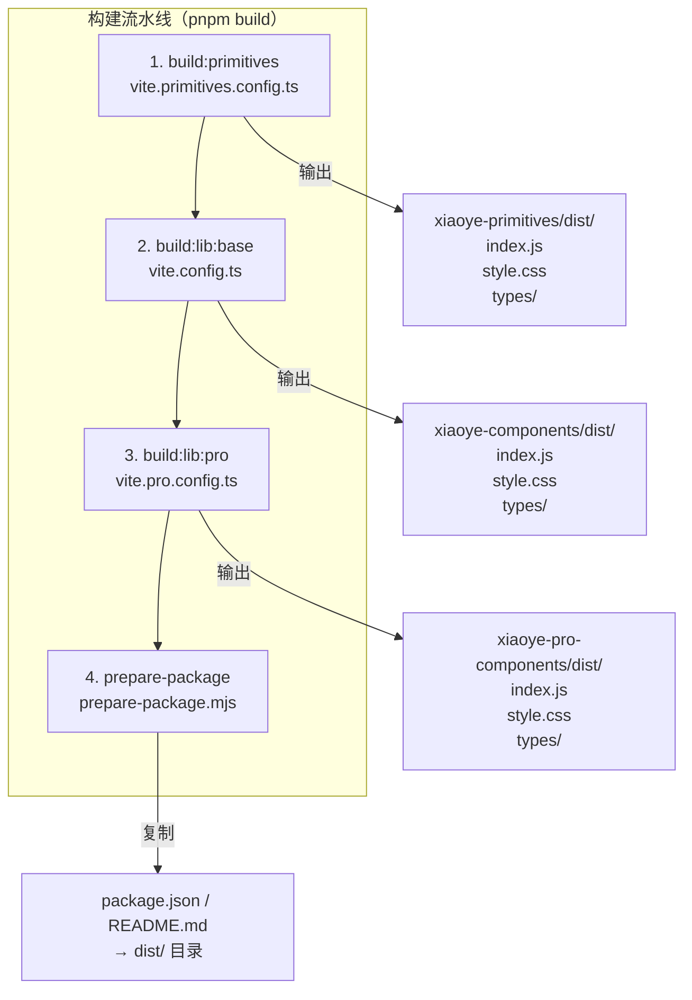
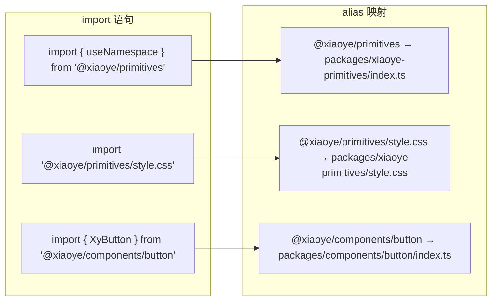
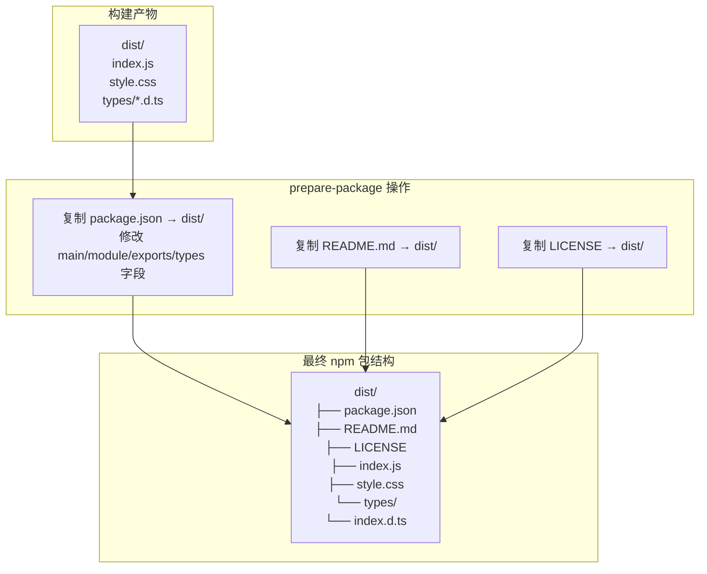
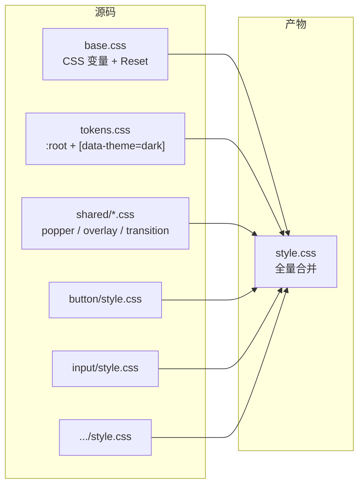
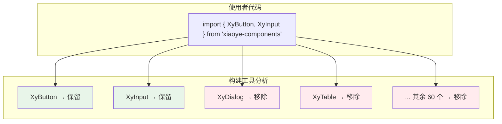
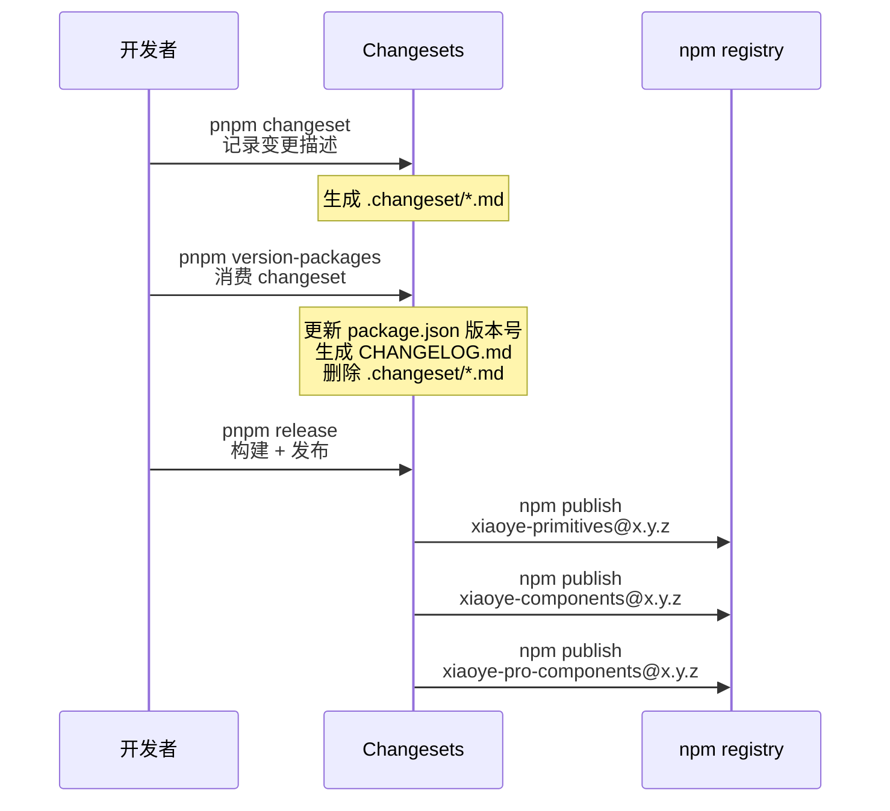
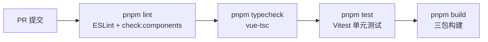

# 05 构建与发布工程

> 导读：xiaoye-components 的构建体系围绕一个核心目标——将 Monorepo 中的三个包（primitives / components / pro-components）独立打包为 ES Module 产物，同时保证类型声明、CSS 和 source map 的正确输出。本文拆解三包独立构建的 Vite 配置策略、workspace alias 的路径解析、CSS 抽离与 tree-shaking 设计，以及 Changesets 驱动的版本管理。

## 构建全景



三个包必须按顺序构建——因为 components 依赖 primitives 的构建产物，pro-components 依赖 components 的构建产物。但每个包的构建配置是独立的，互不干扰。

## Vite 构建配置

### 统一工厂函数：createLibraryConfig

三个 Vite 配置共享同一个工厂函数 `createLibraryConfig`，通过参数差异化：

```ts
function createLibraryConfig(options: {
  entry: string;              // 入口文件
  outDir: string;             // 输出目录
  name: string;               // 库名称（用于 UMD 全局变量名）
  dtsInclude: string[];       // 类型声明包含的文件路径
  external: string[];         // 外部化依赖
  cssFileName?: string;       // CSS 文件名
}): UserConfig;
```

每个包的配置差异：

| 参数 | primitives | components | pro-components |
|------|-----------|------------|----------------|
| entry | `src/index.ts` | `index.ts` | `index.ts` |
| outDir | `dist` | `dist` | `dist` |
| dtsInclude | `src/**/*.ts` | `index.ts` + `exports.ts` + `**/types.ts` + `core.ts` + `field-schema.ts` + `request-utils.ts` | 同 components |
| external | `vue` | `vue` + `@xiaoye/*` + 运行时依赖 | `vue` + `@xiaoye/*` + 运行时依赖 |

### 关键配置项

**1. 仅输出 ES Module**

```ts
build: {
  lib: {
    entry: options.entry,
    formats: ["es"],          // 只输出 ES Module
    fileName: () => "index.js"
  }
}
```

不做 UMD 兼容——中后台场景的构建工具（Vite / Webpack 5）均原生支持 ESM，UMD 的额外体积和复杂度不值得。

**2. 运行时依赖全部外部化**

```ts
rollupOptions: {
  external: (id) => {
    return options.external.some(
      (ext) => id === ext || id.startsWith(ext + "/")
    );
  }
}
```

`vue`、`@xiaoye/primitives`、`@xiaoye/tokens`、`echarts`、`@fullcalendar/core`、`video.js` 等全部作为外部依赖，不打包进产物。这确保了：
- 产物体积最小化
- 使用者的项目中 vue 只有一份实例（避免多版本冲突）
- 大型运行时依赖（echarts 约 1MB、video.js 约 500KB）由使用者按需引入

**3. 类型声明生成**

```ts
plugins: [
  dts({
    outDir: "dist/types",
    include: options.dtsInclude,
    // 确保引用的源码类型也被包含
    rollupTypes: true
  })
]
```

`dtsInclude` 需要显式列出所有需要包含类型声明的文件路径。这是因为 `vite-plugin-dts` 默认只处理入口文件直接引用的类型，而组件的 `types.ts`、Pro 层的 `field-schema.ts` 等独立类型文件可能未被入口直接引用。

**4. CSS 抽离**

```ts
build: {
  cssCodeSplit: false   // 所有 CSS 合并为一个 style.css
}
```

Vite 默认按入口拆分 CSS，但组件库需要将所有样式合并为一个 `style.css`，方便使用者一次性导入。

## Workspace Alias 体系

Monorepo 中包之间通过 npm 包名（如 `@xiaoye/primitives`）互相引用，但 Vite 构建时需要将它们解析到源码路径：



### 别名定义的优先级陷阱

```ts
export const aliases = [
  // ❌ 错误顺序：通用正则先匹配，CSS 被当作 TS 模块
  // { find: /^@xiaoye\/primitives\/(.*)$/, replacement: "packages/xiaoye-primitives/$1" },
  // { find: "@xiaoye/primitives/style.css", replacement: "packages/xiaoye-primitives/style.css" },

  // ✅ 正确顺序：CSS 精确匹配在前，通用正则兜底
  { find: "@xiaoye/primitives/style.css", replacement: "packages/xiaoye-primitives/style.css" },
  { find: /^@xiaoye\/primitives\/(.*)$/, replacement: "packages/xiaoye-primitives/$1" },
];
```

**CSS 别名必须在通用别名之前**。如果 `@xiaoye/primitives/style.css` 被通用正则 `@xiaoye/primitives/(.*)` 先匹配到，`$1` 会是 `style.css`，Vite 会尝试把 CSS 文件当作 TypeScript 模块解析——构建直接报错。

### 精确别名 vs 正则别名

对于频繁引用的热路径（如 `@xiaoye/components/button`），使用精确别名可以获得更好的构建性能：

```ts
// 精确别名（优先级高，匹配快）
{ find: "@xiaoye/components/button", replacement: "packages/components/button/index.ts" }

// 正则别名（兜底，每次都需要正则匹配）
{ find: /^@xiaoye\/components\/(.*)$/, replacement: "packages/components/$1" }
```

当前项目中 64 个基础组件 + 31 个 Pro 组件 = 95 个精确别名，加上对应的正则兜底。

## prepare-package.mjs：产物整理

Vite 构建完成后，产物散落在 `dist/` 目录中。`prepare-package.mjs` 负责整理产物为可发布的 npm 包结构：



关键操作是修改 `package.json` 的入口字段：

```json
{
  "main": "index.js",
  "module": "index.js",
  "types": "types/index.d.ts",
  "exports": {
    ".": {
      "import": "./index.js",
      "types": "./types/index.d.ts"
    },
    "./style.css": "./style.css"
  },
  "sideEffects": ["*.css", "**/*.css"],
  "files": ["index.js", "style.css", "types/"]
}
```

## CSS 策略

### 全量 CSS 打包

当前采用全量 CSS 打包策略——所有组件的样式合并为一个 `style.css`：



全量 CSS 的 trade-off：

| | 全量 CSS | 按需 CSS |
|---|---------|---------|
| 使用复杂度 | 一行 `import "style.css"` | 每个组件导入对应 CSS |
| 产物体积 | ~80KB（gzip ~15KB） | 仅使用的组件 |
| 维护成本 | 低——无需维护每个组件的 CSS 入口 | 高——每个组件需要独立的 CSS 入口 |
| Tree-shaking | 不支持 | 理论支持，但 CSS tree-shaking 效果有限 |

选择全量 CSS 的理由：组件库的 CSS 体积通常在 50-100KB 以内（gzip 后更小），而按需 CSS 的维护成本和构建复杂度远大于体积收益。

### CSS 中的 namespace 变量

组件样式中通过 CSS 变量引用令牌值，而不是硬编码：

```css
.xy-button {
  background: var(--xy-brand);
  color: var(--xy-text-primary-inverse);
  border-radius: var(--xy-radius-md);
  padding: var(--xy-space-xs) var(--xy-space-lg);
  transition: background var(--xy-transition-duration-fast);
}
```

这确保了运行时通过覆盖 CSS 变量即可定制主题，无需重新构建。

## Tree-shaking 设计

ES Module 的 tree-shaking 依赖两个条件：

1. **静态导入**：`import { XyButton } from "xiaoye-components"` 是静态的，Vite/Webpack 可以分析出未使用的导出
2. **无副作用**：`sideEffects: ["*.css"]` 告知构建工具，除了 CSS 文件外，所有模块都是纯的（没有顶级副作用）



**但 tree-shaking 对 CSS 不生效**——即使只用了 `XyButton`，`style.css` 中的所有组件样式都会被包含。这是全量 CSS 策略的固有局限，也是未来可以优化的方向。

## 发布流程

### Changesets 管理

采用 [Changesets](https://github.com/changesets/changesets) 管理版本和变更日志：



### 多包独立版本

三个包的版本号独立管理，互不影响：

```json
// packages/xiaoye-primitives/package.json
{ "version": "1.2.0" }

// packages/components/package.json
{ "version": "1.5.0" }

// packages/pro-components/package.json
{ "version": "0.8.0" }
```

Pro-Components 仍处于快速迭代期，版本号可能远低于基础组件。Changesets 会根据 changeset 文件中的包声明，只更新相关包的版本号。

### MCP Server 的独立发布

MCP Server 是独立的 npm 包 `xiaoye-mcp-server`，有自己的构建和发布流程：

```json
{
  "name": "xiaoye-mcp-server",
  "bin": {
    "xiaoye-mcp-server": "./dist/index.js"
  }
}
```

使用者通过 `npx xiaoye-mcp-server` 即可启动，或在 AI IDE 的 MCP 配置中添加：

```json
{
  "mcpServers": {
    "xiaoye-components": {
      "command": "npx",
      "args": ["xiaoye-mcp-server"]
    }
  }
}
```

## CI/CD 流水线



PR 提交时运行 lint + typecheck + test + build 四道关卡，确保不会引入类型错误或构建失败。

## 小结

xiaoye-components 的构建与发布体系可以总结为三个核心设计：

1. **三包独立构建**：primitives → components → pro-components 顺序构建，每个包有独立的 Vite 配置和产物
2. **ES-only + 全量 CSS**：只输出 ES Module，CSS 合并为单个 `style.css`，在体积和维护成本间取得平衡
3. **Changesets 独立版本**：三个包版本号独立管理，通过 changeset 文件精确控制版本更新范围

下一篇 [[testing]] 将拆解测试体系——Vitest 单元测试 + Playwright E2E 测试的双轨策略。