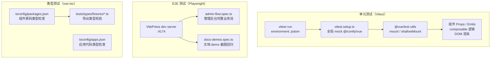
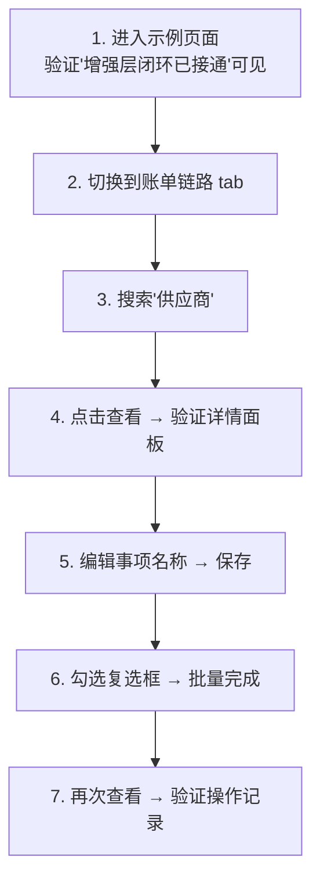
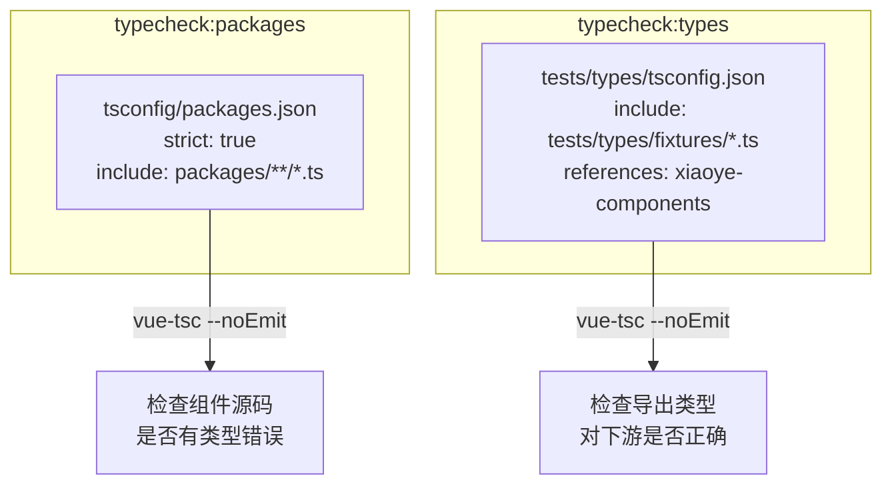
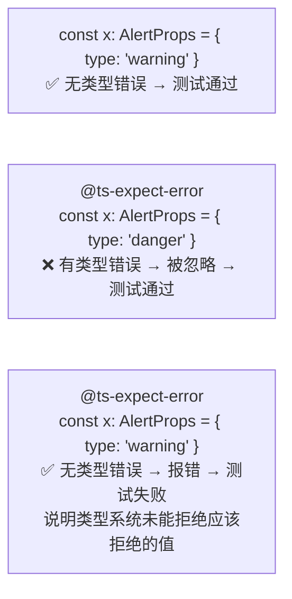
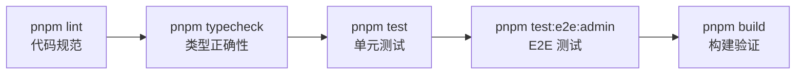
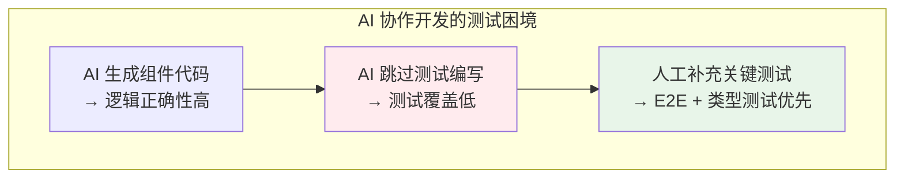

# 06 测试体系

> 导读：xiaoye-components 采用 Vitest 单元测试 + Playwright E2E 测试 + vue-tsc 类型测试的三轨策略。单元测试覆盖组件逻辑，E2E 测试覆盖业务闭环流程，类型测试确保导出类型对下游项目的正确性。本文拆解每种测试的配置策略、测试文件组织方式和关键设计决策。

## 三轨测试架构



## Vitest 单元测试

### 配置

```ts
export default defineConfig({
  plugins: [vue()],
  resolve: {
    alias: workspaceAlias    // 与构建配置共享同一套 alias
  },
  test: {
    environment: "jsdom",    // 在 jsdom 中模拟浏览器环境
    globals: true,           // 全局注入 describe / test / expect
    setupFiles: ["./vitest.setup.ts"],
    exclude: [
      "tests/e2e/**",        // E2E 测试由 Playwright 运行
      "node_modules/**",
      "dist/**"
    ]
  }
});
```

关键配置决策：

1. **environment: "jsdom"**：组件测试需要在浏览器环境中运行（访问 DOM API、触发事件），jsdom 提供了足够轻量的浏览器模拟。不需要完整的浏览器环境（如 Playwright 的 Chromium），因为单元测试主要验证逻辑而非视觉渲染。

2. **globals: true**：全局注入 `describe / test / expect / vi` 等测试工具函数，不需要在每个测试文件中手动 `import { test } from "vitest"`。这在大型测试套件中减少了大量重复导入。

3. **alias: workspaceAlias**：单元测试和构建共享同一套 workspace alias，确保测试中 `import { XyButton } from "@xiaoye/components"` 能正确解析到源码路径。

### 全局 Setup：mock @iconify/vue

```ts
vi.mock("@iconify/vue", () => ({
  Icon: defineComponent({
    name: "MockIconifyIcon",
    props: { icon: { type: String, required: true } },
    setup(props, { attrs }) {
      return () => h("svg", { ...attrs, "data-icon": props.icon });
    }
  }),
  addCollection: vi.fn()
}));
```

所有组件使用 `@iconify/vue` 的 `Icon` 组件来渲染图标。但在测试环境中，Iconify 的图标数据需要网络加载，会导致测试不稳定和缓慢。通过全局 mock，所有 `<Icon icon="mdi:loading" />` 替换为简单的 `<svg data-icon="mdi:loading" />`，测试仍然可以验证图标是否正确渲染，但不需要真正的 Iconify 运行时。

### 测试文件组织

组件测试文件通常与组件源码放在同一目录下（`__tests__/` 目录或 `.spec.ts` 后缀），但当前项目中大部分组件缺少单元测试文件——这是 AI 协作开发的一个典型问题：AI 生成的组件代码质量足够好，但测试覆盖不够全面，后续需要逐步补充。

## Playwright E2E 测试

### 配置

```ts
export default defineConfig({
  testDir: "./tests/e2e",
  timeout: 60_000,
  fullyParallel: false,      // 管理后台测试有依赖关系，不能并行
  retries: 0,
  use: {
    baseURL: "http://127.0.0.1:4174",
    trace: "on-first-retry"   // 首次失败时录制 trace，便于调试
  },
  projects: [
    { name: "chromium", use: { ...devices["Desktop Chrome"] } }
  ],
  webServer: {
    command: "pnpm --filter @xiaoye/docs exec vitepress dev . --host 127.0.0.1 --port 4174",
    url: "http://127.0.0.1:4174/examples/admin",
    reuseExistingServer: !process.env.CI,   // CI 中每次新建 server
    timeout: 120_000
  }
});
```

关键配置决策：

1. **fullyParallel: false**：管理后台测试涉及页面状态流转（筛选 → 查看详情 → 编辑 → 批量操作），这些步骤之间有数据依赖关系，不能并行执行。

2. **baseURL: "http://127.0.0.1:4174"**：E2E 测试基于文档站运行，因为文档站中的 admin 示例页面包含了完整的 CRUD 业务流，是最好的 E2E 测试载体。

3. **reuseExistingServer: !process.env.CI**：本地开发时复用已启动的 dev server 避免每次测试都要等待 server 启动；CI 中每次新建确保环境干净。

4. **trace: "on-first-retry"**：只在测试失败重试时录制 trace（包含 DOM 快照、网络日志、控制台消息），避免每次测试都生成大量 trace 文件。

### 管理后台闭环测试

`admin-flow.spec.ts` 是项目最重要的 E2E 测试——它验证了一个完整的管理后台业务流：



这个测试覆盖了 SearchForm + ProTable + DetailPanel + DialogForm + CrudPage 五个 Pro 组件的协作，比单独测试每个组件更有价值——因为组件间协作是 Pro-Components 的核心价值。

## vue-tsc 类型测试

### 双 tsconfig 策略



两个 tsconfig 的职责不同：

1. **tsconfig/packages.json**：检查组件源码是否有类型错误（如 Props 类型不匹配、事件类型不正确）
2. **tests/types/tsconfig.json**：检查组件库的导出类型对下游项目是否正确（如使用者能否正确使用 `AlertProps`、`ProFieldSchema` 等）

### 类型测试 fixture

`tests/types/fixtures/` 目录下每个文件对应一个组件的类型测试：

```ts
// tests/types/fixtures/alert.ts
import { XyAlert, XyAlertService } from "xiaoye-components";

// 有效用法
const validProps: AlertProps = {
  modelValue: true,
  title: "高风险提醒",
  type: "warning",
  effect: "dark",
  variant: "banner"
};

// 无效用法——@ts-expect-error 确保类型系统能拒绝错误用法
const invalidType: AlertProps = {
  // @ts-expect-error invalid alert type should be rejected
  type: "danger"          // AlertType 不包含 "danger"
};
```

**@ts-expect-error 测试模式**：这是一个精妙的类型测试技巧——`@ts-expect-error` 注释告诉 TypeScript "下一行应该有类型错误"。如果下一行确实有错误，TypeScript 会忽略它（测试通过）；如果下一行没有错误（即类型系统未能拒绝无效用法），TypeScript 会报错"未预期的 @ts-expect-error"（测试失败）。



这种模式确保了组件类型定义的两个方向都能正确工作：
- **正确用法不报错**：合法的 `AlertProps` 值被类型系统接受
- **错误用法被拒绝**：非法的 `AlertType` 值被类型系统拒绝

## 测试运行命令

| 命令 | 用途 |
|------|------|
| `pnpm test` | 运行所有 Vitest 单元测试（一次性） |
| `pnpm test:watch` | Vitest 监听模式（开发时使用） |
| `pnpm test:e2e:admin` | Playwright 管理后台 E2E 测试 |
| `pnpm typecheck` | 所有类型检查（packages + apps + types） |
| `pnpm lint` | ESLint + check:components + check:pro-components |

完整的质量检查流水线：



## 测试中的 AI 协作实践

这个项目的测试体系有一个特殊性——它是用 AI 协作开发的，但测试覆盖不够全面。这暴露了一个 AI 辅助开发的典型问题：



优先补充 E2E 和类型测试的原因：

1. **E2E 测试**：验证组件间协作是否正确，这是 Pro-Components 的核心价值，也是最容易出现"单个组件正确但组合出错"的地方
2. **类型测试**：确保导出类型对下游项目正确，因为使用者依赖类型提示来使用组件
3. **单元测试**：单个组件的逻辑测试可以后续逐步补充，优先级低于前两者

## 小结

xiaoye-components 的测试体系可以总结为三个核心设计：

1. **三轨策略**：Vitest（逻辑）+ Playwright（流程）+ vue-tsc（类型），各覆盖不同维度
2. **E2E 优先**：管理后台闭环测试覆盖组件间协作，比单独测试每个组件更有价值
3. **@ts-expect-error 模式**：类型测试确保类型系统既能接受正确用法、也能拒绝错误用法

下一篇 [[docs-site]] 将拆解文档站架构——VitePress 配置、自定义插件、侧边栏自动生成。