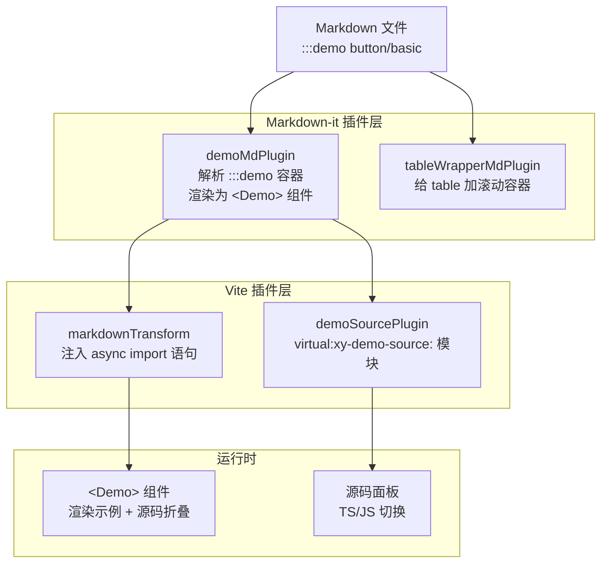
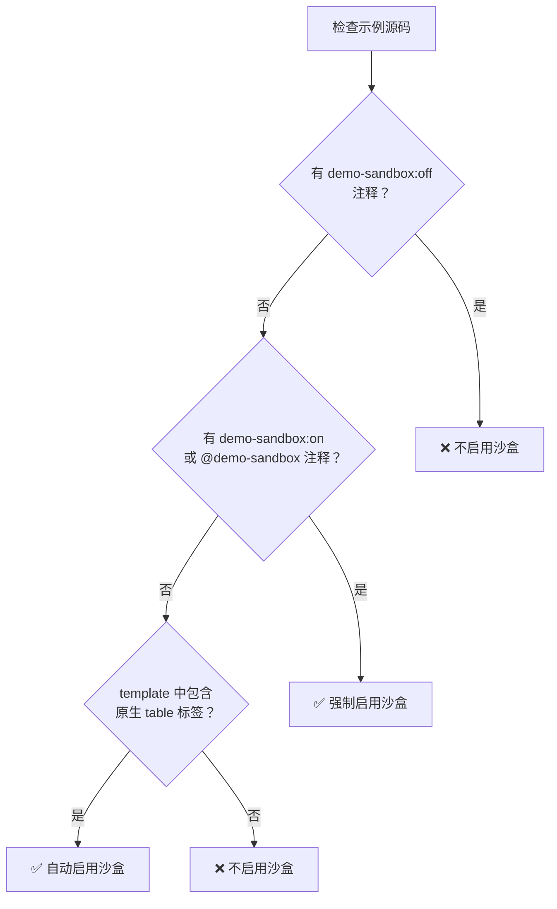
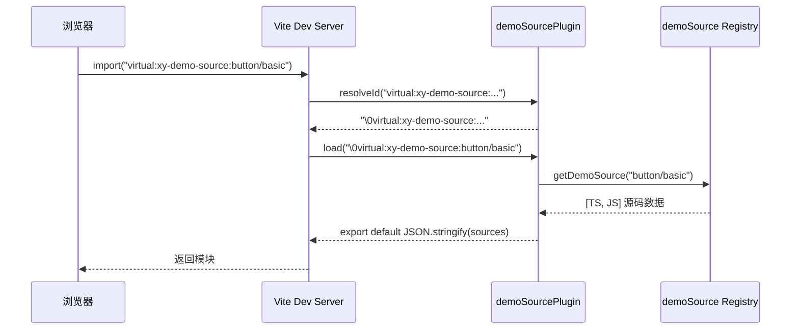
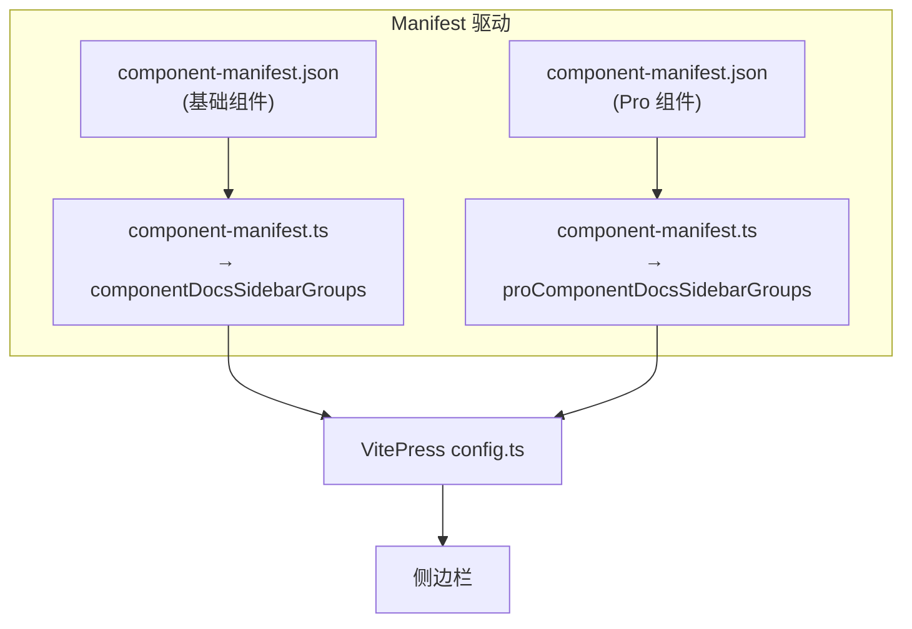
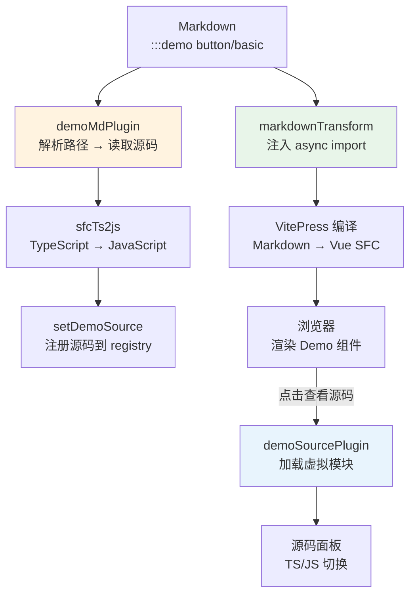

# 07 文档站架构

> 导读：xiaoye-components 的文档站基于 VitePress，通过四个自定义 Markdown 插件和两个 Vite 插件扩展了 demo 渲染、源码查看、表格响应式和 Markdown 预处理能力。侧边栏完全由 Manifest 自动生成。本文拆解每层插件的工作机制和数据流。

## 整体架构



## 四个自定义插件

### 1. demoMdPlugin：Markdown 中的 demo 容器

这是文档站的核心插件——它让组件文档可以在 Markdown 中直接嵌入可交互的组件示例：

```markdown
:::demo button/basic
:::
```

插件的工作流程：

```mermaid
sequenceDiagram
    participant MD as Markdown 解析器
    participant Plugin as demoMdPlugin
    participant FS as 文件系统
    participant Registry as demoSource Registry

    MD->>Plugin: 发现 :::demo 容器
    Plugin->>Plugin: 解析路径 button/basic
    Plugin->>FS: 读取 examples/button/basic.vue
    FS-->>Plugin: 返回源码
    Plugin->>Plugin: sfcTs2js() 生成 JS 版本
    Plugin->>Registry: setDemoSource("button/basic", [TS, JS])
    Plugin-->>MD: 渲染为 &lt;Demo&gt; 组件
```

**路径解析的两种语法**：

```markdown
<!-- 语法1：路径直接写在 :::demo 后面 -->
:::demo button/basic
:::

<!-- 语法2：描述 + 路径分两行 -->
:::demo 按钮的基础用法
button/basic
:::
```

插件通过正则 `/^[a-zA-Z0-9_/.-]+$/` 判断 `:::demo` 后面跟的是路径（纯 ASCII）还是描述（含中文/空格）。

**Sandbox 机制**：

demo 渲染在一个隔离的沙盒容器中，防止 VitePress 的全局 prose 样式污染组件示例。沙盒的启用逻辑：



为什么需要沙盒？VitePress 的 prose 样式会给 `table` 设置 100% 宽度和边框，如果组件示例中使用了 `xy-table`（自定义组件），这些样式会冲突。沙盒通过 CSS 隔离（`all: initial` + scoped 重置）解决此问题。

### 2. demoSourcePlugin：虚拟模块源码加载

这个 Vite 插件创建了一个虚拟模块系统，让 demo 源码可以按需异步加载：

```ts
// 虚拟模块路径
import("virtual:xy-demo-source:button/basic")

// 解析为虚拟 ID
"\0virtual:xy-demo-source:button/basic"

// 返回导出
export default [
  { label: "TS", raw: "...", rendered: "..." },
  { label: "JS", raw: "...", rendered: "..." }
];
```



**HMR 支持**：当示例 `.vue` 文件被修改时，插件清空 registry 缓存并发送 full-reload 信号，确保文档站即时反映修改。

### 3. markdownTransform：自动注入 import 语句

这个 Vite 插件在 Markdown 文件中自动注入 demo 组件的异步导入语句，避免作者手动编写 `<script setup>`：

```mermaid
graph LR
    Before["## 按钮组件\n\n:::demo button/basic\n:::"]
    After["## 按钮组件\n\n<script setup lang=\"ts\">\nimport { defineAsyncComponent } from \"vue\";\nconst ButtonBasic = defineAsyncComponent(() => import(\"./examples/button/basic.vue\"));\nconst ButtonBasicSourceLoader = () => import(\"virtual:xy-demo-source:button/basic\");\n</script>\n\n:::demo button/basic\n:::"]

    Before --> |"markdownTransform"| After
```

关键实现细节：

1. **路径计算**：从当前 Markdown 文件的位置推导 `examples/` 目录的根路径，确保相对路径正确
2. **组件命名**：通过 `getDemoComponentName("button/basic")` → `"ButtonBasic"` 生成唯一的组件名
3. **插入位置**：优先插入到已有的 `<script setup>` 中；没有则创建新的 `<script setup>` 块，放在 frontmatter 之后

### 4. tableWrapperMdPlugin：响应式表格容器

最简单的插件，但解决了实际问题——给所有 Markdown 表格添加滚动容器：

```ts
md.renderer.rules.table_open = () => '<div class="xy-vp-table"><table>';
md.renderer.rules.table_close = () => "</table></div>";
```

VitePress 的表格样式设置 `width: 100%`，当 Props 表格列数多时会在移动端溢出。包裹一个 div 后，可以通过 CSS 设置 `overflow-x: auto` 实现水平滚动。

## 侧边栏自动生成



侧边栏结构完全由 Manifest 驱动：

```ts
sidebar: {
  "/components/": [
    { text: "总览", items: [{ text: "组件总览", link: "/components/overview" }] },
    ...componentDocsSidebarGroups  // 自动生成
  ],
  "/pro-components/": [
    { text: "总览", items: [{ text: "增强组件总览", link: "/pro-components/overview" }] },
    ...proComponentDocsSidebarGroups  // 自动生成
  ]
}
```

当新增组件时，只需更新 `component-manifest.json`，侧边栏自动跟随——无需手动维护导航配置。

## Demo 渲染流程

完整的 demo 渲染数据流：



**TS → JS 转换**：`sfcTs2js` 工具将 `.vue` 文件中的 TypeScript 代码转换为 JavaScript，让使用者可以选择查看 TS（带类型注解）或 JS（更简洁）版本的示例代码。

## 文档站配置

### 导航结构

```ts
nav: [
  { text: "指南", link: "/guide/quick-start" },
  { text: "组件", link: "/components/overview" },
  { text: "增强", link: "/pro-components/overview" },
  { text: "示例", link: "/examples/admin" },
  { text: "CodeGraph", link: "/guide/codegraph" },
  { text: "设计令牌", link: "/design-tokens" },
  { text: "更新日志", link: "/changelog" }
]
```

### 构建优化

```ts
vite: {
  build: {
    cssCodeSplit: true,
    chunkSizeWarningLimit: 700,
    rollupOptions: {
      output: {
        manualChunks(id) {
          // 大型依赖拆分为独立 chunk
          if (id.includes("node_modules/echarts")) return "vendor-echarts";
          if (id.includes("node_modules/video.js") || id.includes("node_modules/vditor")) return "vendor-media";
          if (id.includes("node_modules/@fullcalendar")) return "vendor-scheduler";
        }
      }
    }
  }
}
```

文档站是组件库中唯一引入所有运行时依赖的地方（因为示例需要用到 Charts、Video、Editor 等重型组件）。手动 chunk 拆分确保这些大型依赖不会被打包到主页路由中，用户只有在访问相关示例页面时才会加载。

## 小结

xiaoye-components 的文档站架构可以总结为三个核心设计：

1. **Markdown 容器扩展**：`:::demo` 语法让组件示例与文档内容无缝融合，作者只需关注"展示什么"，不用关心"怎么渲染"
2. **虚拟模块按需加载**：demo 源码通过 `virtual:xy-demo-source:` 异步加载，首屏不加载任何源码文本
3. **Manifest 自动侧边栏**：新增组件时更新 JSON 即可，侧边栏、install 函数、一致性校验全部自动跟随

下一篇 [[mcp-server]] 将拆解 MCP Server——它如何让 AI IDE 自动理解组件 API，实现"用 AI 开发的组件库"被"AI 开发工具"自动感知的闭环。