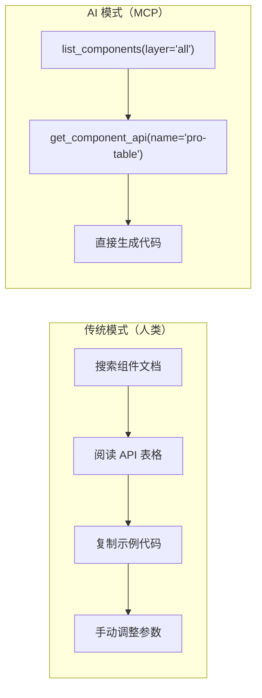
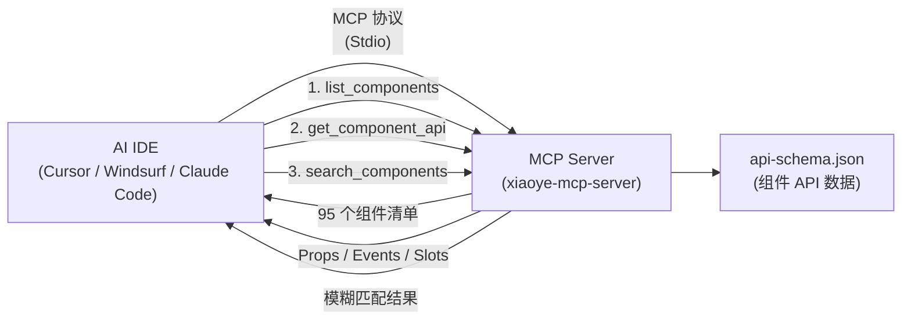
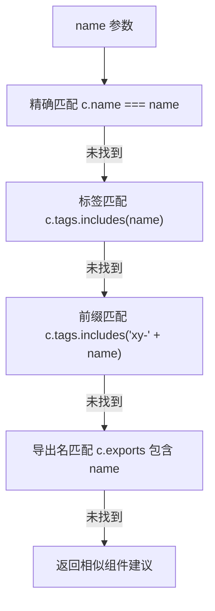
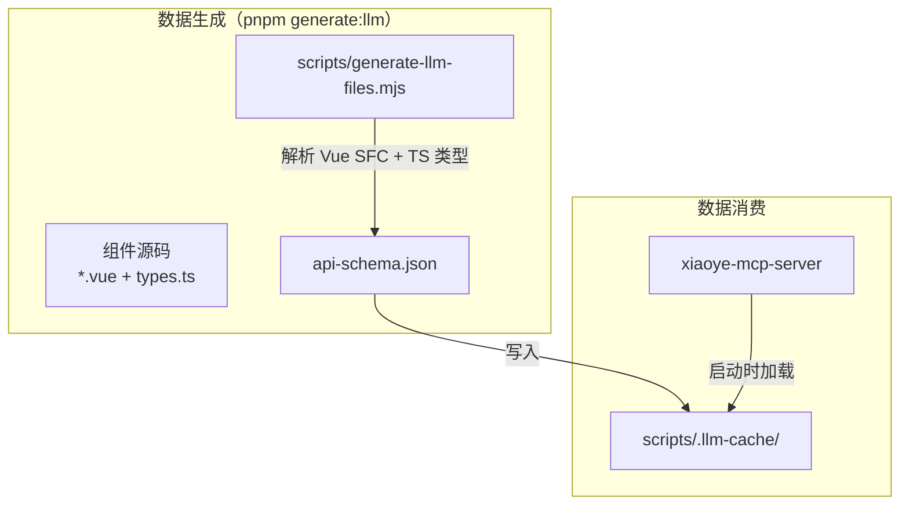
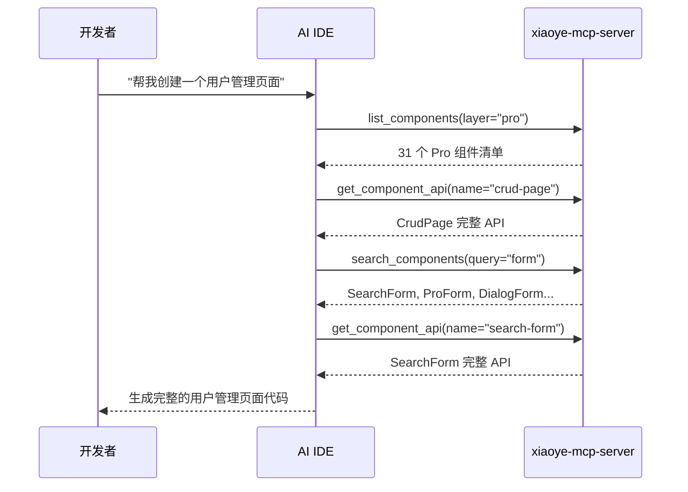
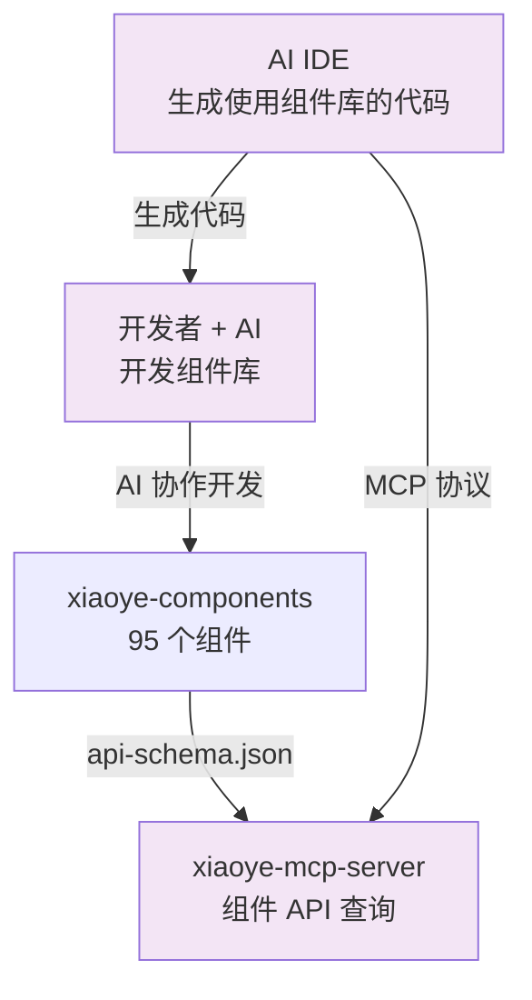

# 08 MCP Server：让 AI 理解组件库

> 导读：xiaoye-mcp-server 是一个 MCP（Model Context Protocol）工具服务器，它让 AI IDE（Cursor、Windsurf、Claude Code 等）可以直接查询组件库的 API——从 95 个组件中找到正确的那个，获取它的 Props / Events / Slots 完整定义。本文拆解 MCP Server 的架构、三个 tool 的实现细节，以及 api-schema.json 的数据生成管道。

## 为什么组件库需要 MCP Server

传统的组件库文档面向人类——开发者在浏览器中搜索、阅读文档、复制示例代码。但 AI 编码助手的交互模式完全不同：



AI 不会"阅读"文档——它需要结构化数据。MCP Server 将组件 API 以机器可读的方式暴露给 AI，避免了"AI 凭记忆猜测组件 API"的问题。

## MCP 协议基础

MCP（Model Context Protocol）是 Anthropic 提出的标准化协议，让 AI 模型可以调用外部工具。核心概念：



MCP 使用 Stdio 传输协议——AI IDE 启动 MCP Server 作为子进程，通过 stdin/stdout 通信。这意味着 MCP Server 是无状态的，每次调用都是独立的。

## 三个 Tool 的实现

### 1. list_components：组件清单

```ts
server.tool(
  "list_components",
  "List all available components with brief descriptions.",
  {
    layer: z.enum(["all", "base", "pro"]).default("all")
      .describe("Filter by component layer")
  },
  async ({ layer }) => {
    const list = layer === "base" ? baseComponents
               : layer === "pro" ? proComponents
               : components;

    // 返回 Markdown 表格格式的组件清单
    return {
      content: [{ type: "text", text: formatAsTable(list) }]
    };
  }
);
```

输出格式：

```markdown
# xiaoye-components (95 components)

| Component | Tag | Layer | Description |
|-----------|-----|-------|-------------|
| button | `xy-button` | base | Button 按钮 |
| pro-table | `xy-pro-table` | pro | ProTable 增强表格 |
| ... |
```

**为什么返回 Markdown 表格而非 JSON？** 因为 AI 模型处理 Markdown 表格比 JSON 更高效——表格是 AI 训练数据中最常见的结构化格式之一。

### 2. get_component_api：组件 API 详情

```ts
server.tool(
  "get_component_api",
  "Get the full API reference for a specific component.",
  {
    name: z.string()
      .describe("Component name in kebab-case (e.g. 'button', 'pro-table')")
  },
  async ({ name }) => {
    // 模糊匹配：支持 name / tag / export 名
    const comp = components.find(c =>
      c.name === name ||
      c.tags.includes(name) ||
      c.tags.includes(`xy-${name}`) ||
      c.exports.some(e => e.toLowerCase() === name.toLowerCase())
    );

    if (!comp) {
      // 返回建议的相似组件
      const suggestions = components
        .filter(c => c.name.includes(name) || c.title.includes(name))
        .slice(0, 5);
      return { content: [{ type: "text", text: `Not found. Did you mean: ${suggestions}?` }], isError: true };
    }

    return { content: [{ type: "text", text: renderComponentApi(comp) }] };
  }
);
```

`renderComponentApi` 函数将组件数据渲染为结构化的 Markdown 文档：

```markdown
# ProTable 增强表格

- **Tag**: `xy-pro-table`
- **Exports**: `XyProTable`
- **Layer**: @xiaoye/pro-components

## Props

| Property | Type | Default | Description |
|----------|------|---------|-------------|
| `columns` | `ProTableColumn[]` | - | 列定义 |
| `request` | `(context) => Promise<ProRequestResult>` | - | 数据请求函数 |

## Events

| Event | Params | Description |
|-------|--------|-------------|
| `load` | `{ data, total }` | 数据加载完成 |

## Slots

| Slot | Description |
|------|-------------|
| `toolbar` | 工具栏区域 |

## Exposes

| Name | Type | Description |
|------|------|-------------|
| `reload` | `() => Promise<void>` | 重新加载数据 |
```

**模糊匹配策略**：AI 可能传入 `button`、`xy-button`、`XyButton` 等不同格式的组件名。`get_component_api` 通过四种匹配方式确保尽可能找到正确的组件：



### 3. search_components：关键词搜索

```ts
server.tool(
  "search_components",
  "Search components by keyword.",
  { query: z.string().describe("Search keyword") },
  async ({ query }) => {
    const lowerQuery = query.toLowerCase();
    const matches = components.filter(comp => {
      const searchable = [
        comp.name, comp.title, comp.description,
        ...comp.tags, ...comp.exports
      ].join(" ").toLowerCase();
      return searchable.includes(lowerQuery);
    });

    return { content: [{ type: "text", text: formatSearchResults(matches) }] };
  }
);
```

搜索覆盖所有文本字段（name / title / description / tags / exports），让 AI 可以用模糊关键词找到组件：

- `form` → SearchForm, ProForm, DialogForm, DrawerForm, StepsForm...
- `table` → Table, ProTable, ColumnSettingPanel, TableFilterDrawer...
- `upload` → Upload, ImportWizard

## 数据管道：api-schema.json

MCP Server 不直接读取组件源码——它消费一个预生成的 `api-schema.json`：



`api-schema.json` 的结构：

```ts
interface ApiSchema {
  version: string;
  generatedAt: string;
  components: ComponentData[];
}

interface ComponentData {
  name: string;               // "button"
  title: string;              // "Button 按钮"
  description: string;        // 组件描述
  tags: string[];             // ["xy-button", "xy-button-group"]
  exports: string[];          // ["XyButton", "XyButtonGroup"]
  layer: "base" | "pro";     // 所属层级
  props: ComponentProp[];     // Props 列表
  events: ComponentEvent[];   // Events 列表
  slots: ComponentSlot[];     // Slots 列表
  exposes: ComponentExpose[]; // Exposes 列表
}
```

数据在 `pnpm generate:llm` 时预生成，MCP Server 启动时从 `scripts/.llm-cache/api-schema.json` 加载。这意味着 MCP Server 不依赖组件源码，可以独立部署。

## Server Instructions

MCP Server 在启动时注册了一段 instructions 文本，让 AI 了解组件库的基本约定：

```ts
const server = new McpServer(
  { name: "xiaoye-components", version: "0.1.0" },
  {
    instructions: `You are working with xiaoye-components...

Key conventions:
- Component tags use kebab-case with "xy-" prefix: xy-button, xy-dialog
- TypeScript identifiers use PascalCase with "Xy" prefix: XyButton, XyDialog
- v-model convention: v-model="value" maps to modelValue / update:model-value
- Global sizes: "sm" | "md" | "lg"
- Icons use Iconify format: icon="mdi:loading"

When suggesting components, prefer:
- ProTable over Table for data-heavy pages
- SearchForm for filter bars, ProForm for complex forms
- ListPage/CrudPage for standard CRUD pages

Always call list_components first, then get_component_api for details.`
  }
);
```

这段 instructions 会被 AI IDE 在每次对话开始时注入到 AI 的上下文中，确保 AI 知道组件库的命名约定和推荐用法。

## 使用方式

### 配置 AI IDE

在 Cursor / Windsurf / Claude Code 的 MCP 配置中添加：

```json
{
  "mcpServers": {
    "xiaoye-components": {
      "command": "npx",
      "args": ["xiaoye-mcp-server"]
    }
  }
}
```

### 典型工作流



## AI 闭环：自洽的架构



这是 xiaoye-components 架构中最精妙的闭环：

1. **开发者用 AI 开发组件库** → 组件库诞生
2. **组件库的 API 数据喂给 MCP Server** → AI IDE 可以查询组件 API
3. **AI IDE 根据组件 API 生成使用组件库的代码** → 开发者得到更高效的开发体验

"用 AI 开发的组件库"被"AI 开发工具"自动理解——这不是巧合，而是架构上的有意设计。

## 小结

xiaoye-components 的 MCP Server 可以总结为三个核心设计：

1. **三个 Tool 覆盖全部查询需求**：list（清单）→ get（详情）→ search（模糊），AI 可以从探索到精确定位
2. **预生成数据 + 无状态服务**：api-schema.json 在构建时生成，MCP Server 启动时加载，运行时零依赖
3. **AI 闭环**：组件库 → API 数据 → MCP Server → AI IDE → 生成代码，形成自洽的 AI 协作生态

下一篇 [[ai-collaboration]] 将是架构篇的终章——拆解整个项目的 AI 协作开发实践：Prompt 工程策略、组件开发流水线、质量守护机制、人机协作分工模型。