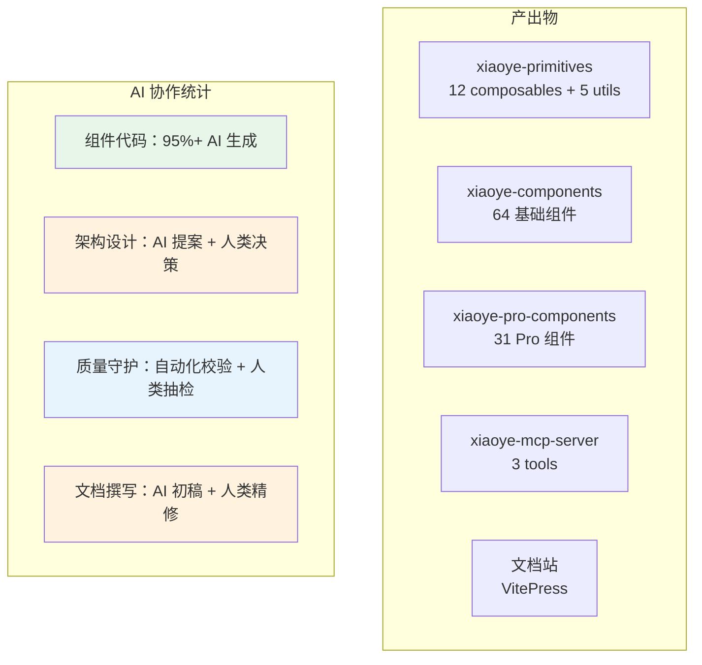
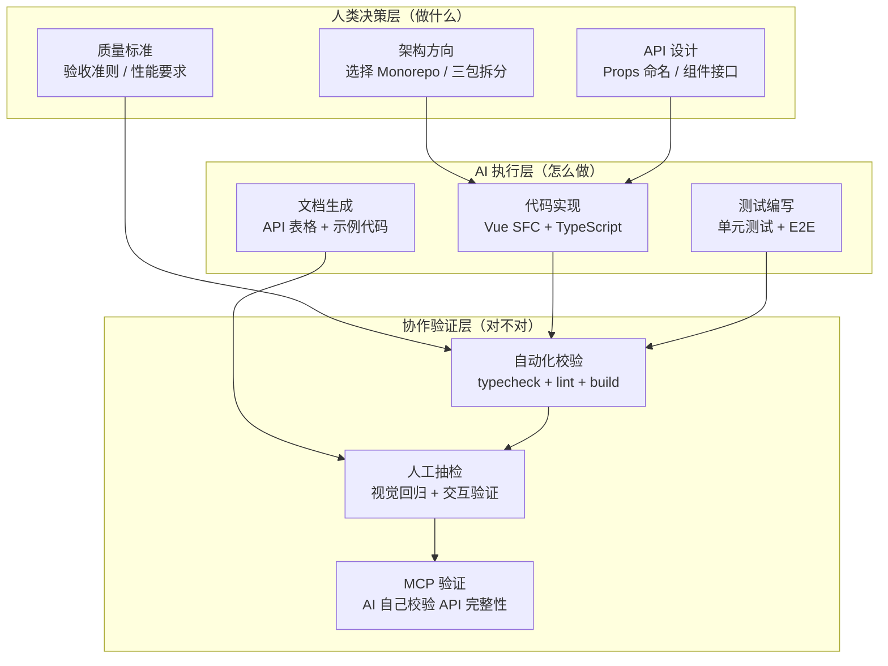
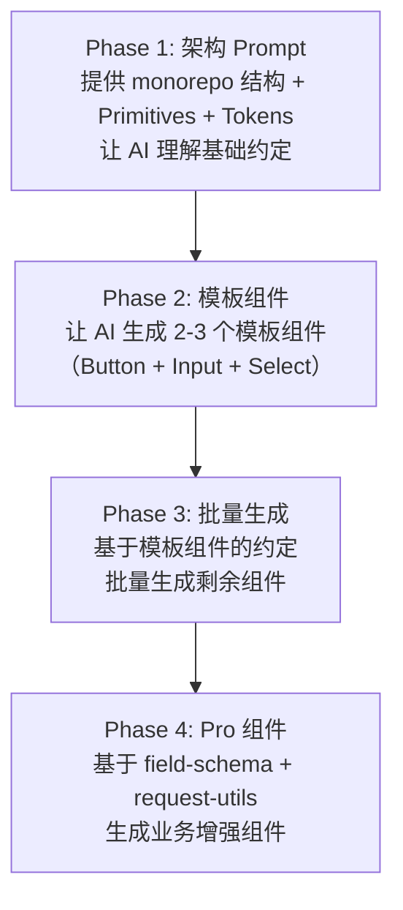
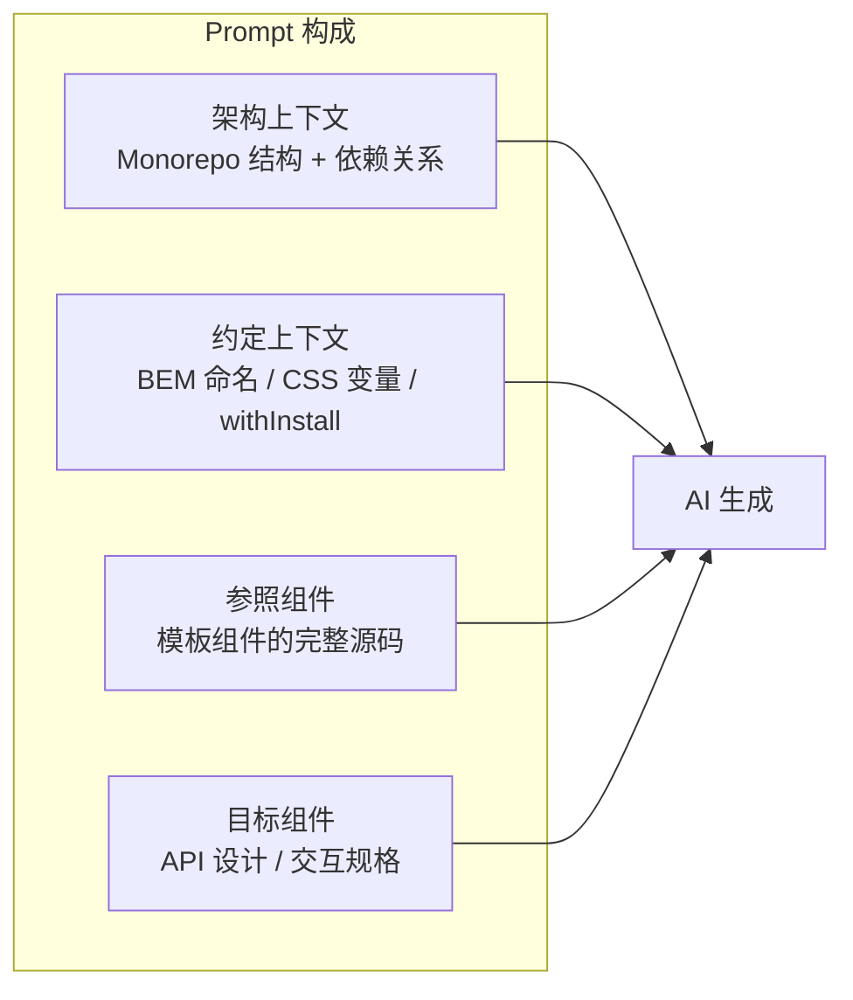
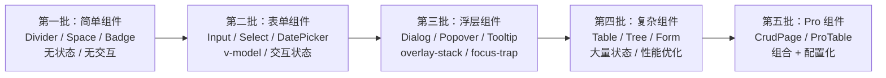
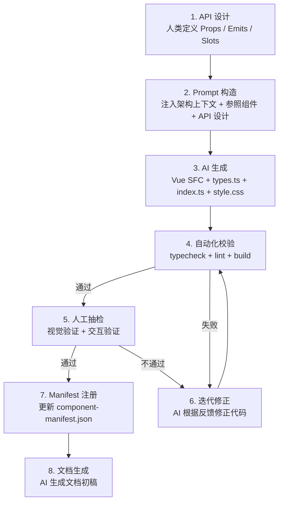
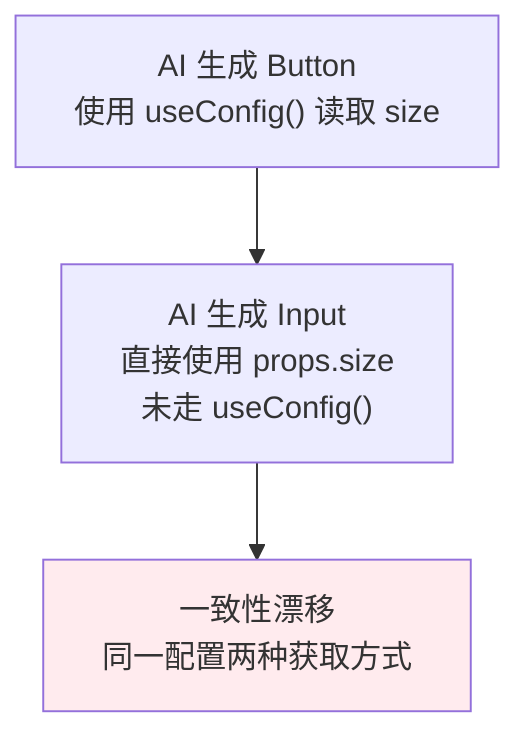
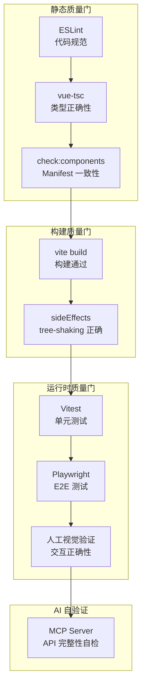
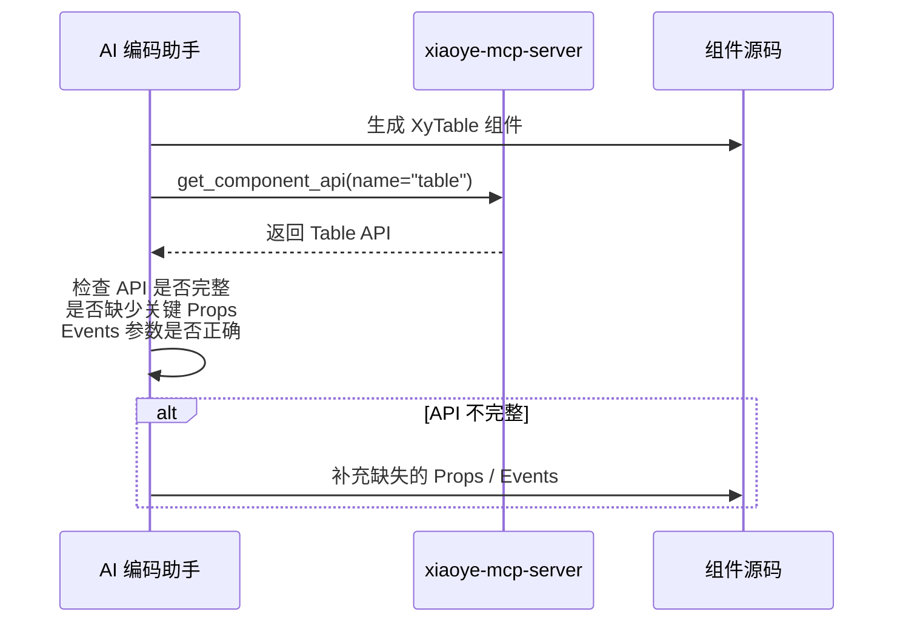

# 09 AI 协作开发实践

> 导读：xiaoye-components 是一个 95 组件的企业级组件库，完全通过 AI 协作开发完成。本文不是"AI 编程入门教程"——而是从工程视角拆解：如何用 AI 完成一个原本需要团队数月的项目，包括 Prompt 工程策略、组件开发流水线、质量守护机制，以及人机协作的分工模型。

## 项目全景：95 组件的 AI 协作开发

## 人机协作分工模型

### 三层分工

关键原则：**人类做决策，AI 做执行，双方共同验证**。

这个分工不是静态的——在项目初期，人类决策占比较高（架构选择、API 设计）；在项目中期，AI 执行占比较高（批量生成组件）；在项目后期，协作验证占比较高（质量守护、文档精修）。

## Prompt 工程策略

### 策略一：架构先行，组件批量生成

不是"一个一个让 AI 写组件"——而是先让 AI 理解整个架构，再批量生成：

**为什么需要 Phase 2？** 因为 AI 对"组件应该怎么写"的理解可能和项目约定不一致。通过先让 AI 生成 2-3 个模板组件，人类可以校准 AI 的理解——比如 BEM 命名约定、composable 的使用方式、CSS 变量引用方式等。校准后再批量生成，一致性会显著提高。

### 策略二：Context 注入

AI 生成组件代码时，需要在 Prompt 中注入足够的上下文：

最关键的是 **参照组件**——给 AI 一个符合项目约定的完整组件源码作为参照，比写 10 段规则描述更有效。因为代码是"规则的实例化"，AI 从实例中学习比从规则中学习更准确。

### 策略三：渐进式复杂度

组件按复杂度分批生成：

每一批组件的生成都为下一批提供了可复用的 composable 和类型定义。如果先让 AI 生成 Table（最复杂的组件之一），它不知道项目中有 `useOverlayStack`、`useFloatingPanel` 等可复用的 composable，可能会自己重新实现一遍——造成代码冗余和不一致。

## 组件开发流水线

每个组件的开发遵循标准化的流水线：

### API 设计阶段

API 设计是人类决策的核心——AI 可以生成代码，但它无法判断"Button 的 type 应该支持哪些值"这种业务决策。API 设计通常包含：

1. **Props 定义**：属性名、类型、默认值、是否必填
2. **Emits 定义**：事件名、参数类型
3. **Slots 定义**：插槽名、作用域参数
4. **Exposes 定义**：对外暴露的方法

### 自动化校验阶段

AI 生成的代码必须通过四道自动化关卡：

| 关卡 | 命令 | 检查内容 |
|------|------|---------|
| 类型检查 | `vue-tsc --noEmit` | Props 类型 / Emits 类型 / 泛型约束 |
| 代码规范 | `eslint` | 命名约定 / 导入顺序 / 未使用变量 |
| 构建验证 | `vite build` | 导出完整性 / CSS 抽离 / 类型声明生成 |
| 一致性 | `check:components` | Manifest 与组件目录一致 |

这四道关卡构成了 AI 代码的"质量门"——如果 AI 生成的代码不通过，就不会进入下一阶段。

## AI 协作中的典型陷阱与应对

### 陷阱一：一致性漂移

**应对**：在 Prompt 中明确约定"全局配置通过 useConfig() 读取"，并在自动化校验中检查是否有直接访问 props 而不经过 useConfig 的情况。

### 陷阱二：composable 重复实现

AI 不知道项目中已有某个 composable，可能会在组件内部重新实现一遍。例如：

- 项目中有 `useOverlayStack`，但 AI 在 Dialog 中自己实现了一套浮层管理逻辑
- 项目中有 `useControlled`，但 AI 在 Select 中自己实现了受控/非受控判断

**应对**：在 Prompt 中列出所有可用的 composable 及其签名，让 AI 知道"有哪些轮子可以不重复造"。

### 陷阱三：过度设计

AI 倾向于生成"看起来更专业"的代码——比如给简单组件添加不必要的抽象层、泛型约束或配置项。

**应对**：在 Prompt 中明确"只实现 API 设计中要求的特性，不要自行添加'可能有用的'功能"。KISS 原则对 AI 生成代码尤其重要。

### 陷阱四：测试缺失

AI 生成的代码通常"看起来正确"但缺乏边界情况处理和测试覆盖。

**应对**：
1. 优先补充 E2E 测试（覆盖组件间协作）
2. 类型测试使用 `@ts-expect-error` 模式（确保类型系统正确拒绝无效用法）
3. 逐步补充单元测试（优先覆盖有复杂交互逻辑的组件）

## 质量守护体系

**MCP Server 的自验证能力**是一个独特的设计——AI 生成组件后，可以通过 MCP Server 查询组件 API，验证 Props / Events / Slots 是否完整定义。这是一种"AI 自己校验 AI"的机制：

## 可复用的方法论

从 xiaoye-components 的 AI 协作开发中，可以提炼出以下方法论：

### 1. 架构决定 AI 效率

好的架构让 AI 更容易生成一致的代码。xiaoye-components 的三层分离（Primitives / Components / Pro-Components）确保了：

- AI 生成 Components 时只需关注组件逻辑，基础设施由 Primitives 提供
- AI 生成 Pro-Components 时只需关注业务组合，基础组件由 Components 提供
- 每层有清晰的依赖边界，AI 不会"越界"引入不该依赖的包

### 2. 约定比规则更有效

告诉 AI "请使用 BEM 命名"不如给它一个完整的使用 BEM 命名的组件源码。代码约定是规则的实例化，AI 从实例中学习比从规则描述中学习更准确。

### 3. 自动化校验是底线

AI 生成的代码不能依赖"AI 觉得对"——必须有自动化校验作为底线。typecheck + lint + build + check 是不可妥协的四道关卡。

### 4. 渐进式复杂度控制

从简单到复杂、从底层到上层的生成顺序，让 AI 在每个阶段都有足够的可复用代码作为参照，避免重复实现和一致性漂移。

### 5. 闭环设计

MCP Server 实现了"AI 开发的组件库 → AI 理解组件 API → AI 生成使用代码"的闭环。这种自洽设计不仅提高了使用效率，还提供了一种"AI 自己校验 AI"的质量保障机制。

## 小结

xiaoye-components 的 AI 协作开发实践可以总结为五个核心原则：

1. **人类决策 + AI 执行 + 双方验证**：人类决定"做什么"，AI 决定"怎么做"，双方共同验证"对不对"
2. **架构先行 + 模板校准 + 批量生成**：先建立架构和模板，再批量生成，确保一致性
3. **渐进式复杂度**：从简单到复杂、从底层到上层，每一步都有可复用的参照
4. **自动化四道关卡**：typecheck + lint + build + check 是 AI 代码的底线
5. **AI 闭环**：MCP Server 让"AI 开发的库"被"AI 工具"自动理解，形成自洽生态

架构篇至此完结。接下来的基础组件篇将从 basic 组开始，逐个拆解 64 个基础组件的设计哲学、源码架构和核心实现。