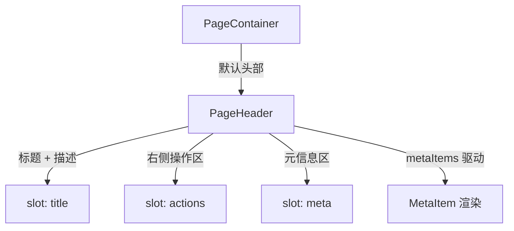

# 100 PageHeader 页面头部

> 导读：PageHeader 将中后台页面顶部「标题 + 描述 + 元信息 + 操作按钮」四段信息收敛为一个语义化的 header 容器，是 PageContainer 的默认头部实现。

## 设计哲学

中后台页面的头部信息有着稳定的结构模式：左上角是标题和描述，右上角是操作按钮，中间可能有一行元信息（如"创建人"、"状态"等键值对）。这套模式在详情页、列表页、运营面板中反复出现，但往往被分散在各自页面模板中，导致对齐方式、间距、字体层级不一致。

PageHeader 的设计理念是**语义分区 + 声明式元信息**：

- **语义分区**：将 header 内部划分为 heading（标题/描述）、actions（操作区）、meta（元信息）三个语义区域，每个区域都有明确的 CSS 类名和布局规则。
- **声明式元信息**：通过 `metaItems` 数组配置元信息行，每项支持图标、标签、值、自定义类名，比手写模板更简洁，同时保留 `meta` slot 兜底自定义需求。

PageHeader 作为 PageContainer 的默认头部，被 ListPage、CrudPage 间接消费，是整个 Pro 页面体系的视觉锚点。

## 源码架构

### 文件结构

```
page-header/
├── index.ts                 # 导出入口
└── src/
    ├── page-header.vue      # 组件实现
    └── page-header.ts       # 类型定义
```

### 组件关系图



### 核心 type 定义

```ts
export type PageIcon = string

export interface PageMetaItem {
  /** 元信息标签 */
  label?: string
  /** 元信息值 */
  value?: string | number
  /** 图标名，沿 XyIcon 字符串入口 */
  icon?: PageIcon
  /** 元信息项根节点类名 */
  className?: string
  /** 标签区类名 */
  labelClassName?: string
  /** 值区类名 */
  valueClassName?: string
}

export interface PageHeaderProps {
  title?: string
  description?: string
  metaItems?: PageMetaItem[]
  divider?: boolean
  bordered?: boolean
}
```

## 核心实现

### 三区布局

PageHeader 模板将 header 内部划分为两层：

```vue
<template>
  <header :class="rootClasses">
    <div class="xy-page-header__main">
      <div class="xy-page-header__heading">
        <slot name="title">
          <h2 v-if="props.title" class="xy-page-header__title">{{ props.title }}</h2>
        </slot>
        <p v-if="props.description" class="xy-page-header__description">
          {{ props.description }}
        </p>
      </div>
      <div v-if="$slots.actions" class="xy-page-header__actions">
        <slot name="actions" />
      </div>
    </div>
    <div v-if="props.metaItems.length > 0 || $slots.meta" class="xy-page-header__meta">
      <slot name="meta">
        <!-- metaItems 渲染 -->
      </slot>
    </div>
  </header>
</template>
```

关键设计点：

- **`__main`** 区域用 flexbox 水平排列 heading 和 actions，heading 左对齐、actions 右对齐。
- **`__meta`** 区域条件渲染：当 `metaItems` 非空或提供了 `meta` slot 时才出现。
- `divider` 和 `bordered` 通过 CSS 修饰类 `is-divider`、`is-bordered` 控制。

### metaItems 声明式渲染

当未提供 `meta` slot 时，PageHeader 自动将 `metaItems` 渲染为一行键值对：

```vue
<div v-for="(item, index) in props.metaItems" :key="`${item.label ?? 'meta'}-${index}`"
     :class="['xy-page-header__meta-item', item.className]">
  <span :class="['xy-page-header__meta-label', item.labelClassName]">
    <XyIcon v-if="item.icon" :icon="item.icon" :size="14" />
    {{ item.label }}
  </span>
  <strong :class="['xy-page-header__meta-value', item.valueClassName]">
    {{ item.value }}
  </strong>
</div>
```

每项由 label + value 两个行内元素组成，label 区可前置图标，value 用 `<strong>` 加粗强调。

### 与 PageContainer 的协作

PageContainer 在未提供 `header` slot 时，会根据 title/description/metaItems/actions 自动生成 PageHeader：

```ts
const showDefaultHeader = computed(
  () =>
    !slots.header &&
    (Boolean(props.title) ||
      Boolean(props.description) ||
      props.metaItems.length > 0 ||
      Boolean(slots.extra) ||
      Boolean(slots.actions))
)
```

这保证了简单场景零配置即可得到标准化头部，复杂场景可通过 `header` slot 完全接管。

## API 参考

### Props

| 属性 | 类型 | 默认值 | 说明 |
|------|------|--------|------|
| title | `string` | `''` | 页面标题 |
| description | `string` | `''` | 页面描述文案 |
| meta-items | `PageMetaItem[]` | `[]` | 头部元信息列表 |
| divider | `boolean` | `false` | 是否在底部显示分隔线 |
| bordered | `boolean` | `false` | 是否显示边框容器样式 |

### PageMetaItem

| 属性 | 类型 | 默认值 | 说明 |
|------|------|--------|------|
| label | `string` | — | 元信息标签 |
| value | `string \| number` | — | 元信息值 |
| icon | `string` | — | 图标名，沿用 XyIcon 字符串入口 |
| className | `string` | — | 元信息项根节点类名 |
| labelClassName | `string` | — | 标签区类名 |
| valueClassName | `string` | — | 值区类名 |

### Slots

| 插槽名 | 说明 |
|--------|------|
| title | 自定义标题区域，覆盖默认 h2 渲染 |
| actions | 右侧操作区 |
| meta | 自定义元信息区，覆盖 metaItems 声明式渲染 |

### Emits

无

### Exposes

无

## 小结

1. **三区语义分区**：heading / actions / meta 三区自动排布，heading 左对齐、actions 右对齐，消除了手动 flex 对齐的样板代码。
2. **声明式 metaItems**：用数组配置替代手写元信息模板，每项支持图标、标签、值和类名定制。
3. **与 PageContainer 自动协作**：PageContainer 会根据条件自动生成 PageHeader，简单场景零配置，复杂场景可通过 header slot 接管。