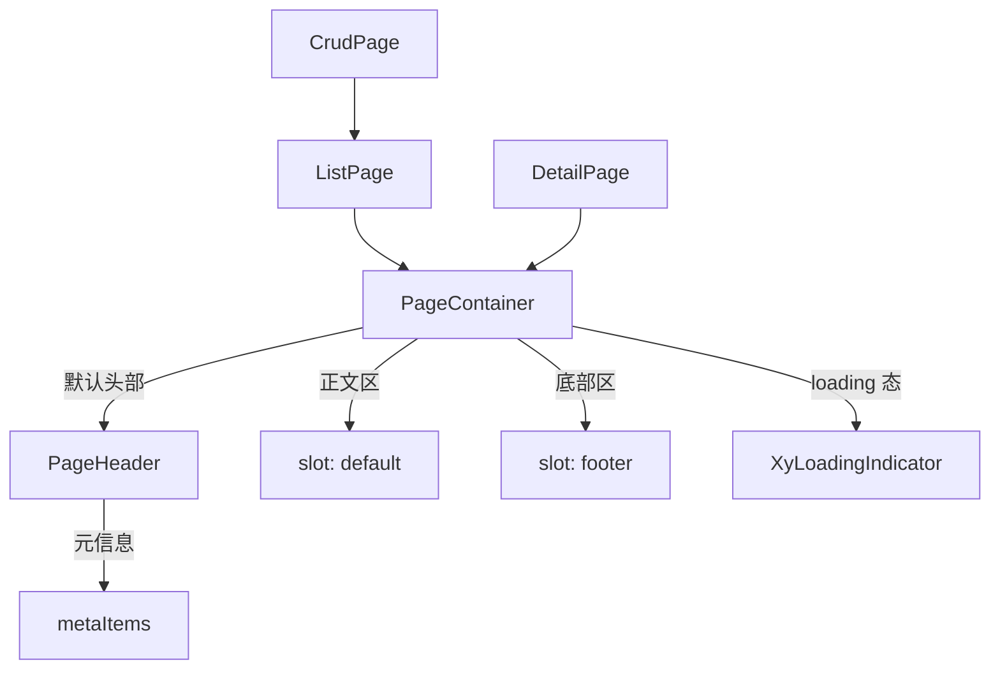

# 101 PageContainer 页面容器

> 导读：PageContainer 是中后台页面的标准壳层，将「头部 + 正文 + 底部」三层结构收敛为统一容器，自动生成 PageHeader 并提供全局 loading 状态管理。

## 设计哲学

中后台页面无论列表页、详情页还是运营面板，都有着相同的壳层结构：顶部是标题和操作区，中间是正文内容，底部可能有确认按钮或辅助信息。然而这套壳层在项目里往往被每个页面自行拼装——有人用 `<div>` + flex，有人用自定义 wrapper，导致间距、边框、背景色等视觉表现极不统一。

PageContainer 的核心设计理念是**壳层标准化**：

- **自动头部**：传入 title/description/metaItems/actions 即可自动生成 PageHeader，无需手写 `<header>` 模板。
- **统一 loading**：通过 `loading` prop 控制正文区的全局加载状态，底层使用 `XyLoadingIndicator` 组件渲染，视觉与全局 Loading 配置联动。
- **三层分区**：header / body / footer 三层结构通过语义化标签和 CSS 类名明确区分，footer 区域条件渲染。

PageContainer 是整个 Pro 页面体系的基石——ListPage、CrudPage、DetailPage 等高级组件都以它作为外层容器。

## 源码架构

### 文件结构

```
page-container/
├── index.ts                   # 导出入口
└── src/
    ├── page-container.vue     # 组件实现
    └── page-container.ts      # 类型定义（继承 PageHeaderProps）
```

### 组件关系图



### 核心 type 定义

```ts
export interface PageContainerProps extends PageHeaderProps {
  loading?: boolean
  bordered?: boolean
  shadow?: boolean
  bodyClass?: string
  bodyStyle?: CSSProperties
}
```

PageContainerProps 继承自 PageHeaderProps，意味着 PageHeader 的所有 prop（title、description、metaItems、divider、bordered）都可直接在 PageContainer 上使用。

## 核心实现

### 自动头部生成

PageContainer 最核心的逻辑是判断是否自动生成 PageHeader：

```ts
const showDefaultHeader = computed(
  () =>
    !slots.header &&
    (Boolean(props.title) ||
      Boolean(props.description) ||
      props.metaItems.length > 0 ||
      Boolean(slots.extra) ||
      Boolean(slots.actions))
)
```

判断条件：当且仅当**未提供 `header` slot**，且至少存在一种头部内容（标题、描述、元信息、操作区或扩展区）时，自动渲染 PageHeader。

模板中的对应实现：

```vue
<slot v-if="$slots.header" name="header" />
<xy-page-header
  v-else-if="showDefaultHeader"
  :title="props.title"
  :description="props.description"
  :meta-items="props.metaItems"
  :divider="props.divider"
  :bordered="false"
>
  <template v-if="$slots.extra || $slots.actions" #actions>
    <slot name="actions">
      <slot name="extra" />
    </slot>
  </template>
  <template v-if="$slots.meta" #meta>
    <slot name="meta" />
  </template>
</xy-page-header>
```

注意 `actions` slot 与 `extra` slot 的关系：`extra` 是 `actions` 的兜底，当两者都提供时以 `actions` 为准。

### 全局 loading 状态

PageContainer 的 body 区域根据 `loading` prop 切换两种状态：

```vue
<div v-if="props.loading" class="xy-page-container__loading">
  <xy-loading-indicator
    :text="loadingVisual.text"
    :spinner="loadingVisual.spinner"
    :svg="loadingVisual.svg"
    :svg-view-box="loadingVisual.svgViewBox"
    layout="stacked"
    size="md"
    surface
  />
</div>
<div v-else class="xy-page-container__body-inner" :style="props.bodyStyle">
  <slot />
</div>
```

`loadingVisual` 通过 `resolveLoadingVisualConfig` 解析全局 Loading 配置，确保 PageContainer 的加载视觉与项目级配置一致：

```ts
const { loading: globalLoading } = useConfig<unknown, LoadingGlobalConfig>()
const loadingVisual = computed(() =>
  resolveLoadingVisualConfig(globalLoading.value, '加载中...', false)
)
```

### 容器样式修饰

PageContainer 支持两种视觉修饰：

- **`bordered`**：添加 1px 边框，默认值为 `true`（大多数场景需要边框容器）。
- **`shadow`**：添加卡片阴影，用于需要浮起效果的页面。

两者都通过 CSS 修饰类 `is-bordered`、`is-shadow` 控制。

### footer 条件渲染

```vue
<footer v-if="$slots.footer" class="xy-page-container__footer">
  <slot name="footer" />
</footer>
```

footer 只在提供了 `footer` slot 时渲染，典型的使用场景是详情页底部的确认/取消按钮。

## API 参考

### Props

| 属性 | 类型 | 默认值 | 说明 |
|------|------|--------|------|
| title | `string` | `''` | 页面标题，传递给默认 PageHeader |
| description | `string` | `''` | 页面描述，传递给默认 PageHeader |
| meta-items | `PageMetaItem[]` | `[]` | 页面元信息列表，传递给默认 PageHeader |
| divider | `boolean` | `false` | 默认头部是否显示分隔线 |
| bordered | `boolean` | `true` | 是否显示边框容器样式 |
| loading | `boolean` | `false` | 是否显示全局 loading 视觉 |
| shadow | `boolean` | `false` | 是否显示阴影容器样式 |
| body-class | `string` | `''` | body 区额外类名 |
| body-style | `CSSProperties` | — | body 区内联样式 |

### Slots

| 插槽名 | 说明 |
|--------|------|
| header | 自定义头部，提供后完全覆盖默认 PageHeader |
| actions | 默认头部右侧动作区 |
| extra | 默认头部右侧扩展区，未提供 `actions` 时作为兜底 |
| meta | 默认头部元信息区 |
| default | 页面主体内容 |
| footer | 页面底部区 |

### Emits

无

### Exposes

无

## 小结

1. **继承式 Props 设计**：PageContainerProps 继承 PageHeaderProps，让头部配置可以直接写在容器层级，减少嵌套层级。
2. **自动头部生成**：根据条件自动渲染 PageHeader，简单场景零配置，复杂场景通过 `header` slot 完全接管。
3. **全局 loading 与配置联动**：loading 视觉通过 `useConfig` 读取全局配置，确保项目级 Loading 定制在 PageContainer 中生效。