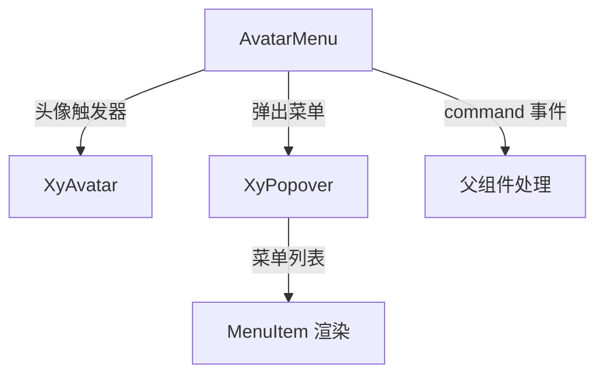

# 102 AvatarMenu 头像菜单

> 导读：AvatarMenu 将「用户头像 + 下拉菜单」的组合封装为即插即用的导航组件，是中后台布局头部用户身份区的事实标准。

## 设计哲学

几乎每个中后台系统的布局头部右侧都有相同的一套交互：展示当前用户头像，点击后弹出下拉菜单，菜单里放着个人信息、设置、退出登录等操作。这套交互看似简单，但在多项目中反复手写 Popover + Menu 的组合、处理菜单项的图标和点击事件，累积起来是不小的样板代码。

AvatarMenu 的设计理念是**即插即用的身份操作入口**：

- **头像即触发器**：用 `XyAvatar` 作为 Popover 的触发元素，点击即弹出菜单，无需额外写触发按钮。
- **声明式菜单项**：通过 `items` 数组配置菜单内容，每项支持图标、标签、禁用状态和命令标识，告别手写 `<XyMenuItem>` 的重复劳动。
- **事件命令化**：点击菜单项时 emit `command` 事件并携带 `item.command`，父组件只需一个事件处理函数即可分发所有菜单操作。

AvatarMenu 通常被放置在 PageHeader 的 actions 区或布局头部的右侧，作为用户身份与操作的统一入口。

## 源码架构

### 文件结构

```
avatar-menu/
├── index.ts                 # 导出入口
└── src/
    ├── avatar-menu.vue      # 组件实现
    └── avatar-menu.ts       # 类型定义
```

### 组件关系图



### 核心 type 定义

```ts
export type AvatarSize = 'large' | 'default' | 'small'

export interface AvatarMenuItem {
  /** 菜单项命令标识，点击时通过 command 事件发出 */
  command?: string | number
  /** 菜单项文本 */
  label: string
  /** 图标名，沿 XyIcon 字符串入口 */
  icon?: string
  /** 是否禁用 */
  disabled?: boolean
  /** 是否显示分隔线（分隔线项仅需设置 divided） */
  divided?: boolean
}

export interface AvatarMenuProps {
  avatar?: string
  username?: string
  size?: AvatarSize
  items?: AvatarMenuItem[]
  popperClass?: string
}
```

## 核心实现

### Popover + Avatar 触发器

AvatarMenu 使用 `XyPopover` 包裹 `XyAvatar`，点击头像时弹出菜单面板：

```vue
<template>
  <xy-popover
    :visible="visible"
    placement="bottom-end"
    :width="200"
    :popper-class="popperClass"
    @update:visible="onVisibleChange"
  >
    <template #reference>
      <xy-avatar
        :src="props.avatar"
        :size="props.size"
        class="xy-avatar-menu__trigger"
      >
        {{ avatarFallback }}
      </xy-avatar>
    </template>
    <!-- 菜单内容 -->
  </xy-popover>
</template>
```

头像的回退逻辑：当未提供 `avatar` 图片地址时，取 `username` 的首字符作为文字头像。

### 声明式菜单渲染

菜单项由 `items` 数组驱动，自动渲染为可点击的列表项：

```vue
<div class="xy-avatar-menu__list">
  <template v-for="(item, index) in props.items" :key="index">
    <div v-if="item.divided" class="xy-avatar-menu__divider" />
    <div
      :class="[
        'xy-avatar-menu__item',
        { 'is-disabled': item.disabled }
      ]"
      @click="handleItemClick(item)"
    >
      <xy-icon v-if="item.icon" :icon="item.icon" :size="16" />
      <span>{{ item.label }}</span>
    </div>
  </template>
</div>
```

关键设计点：

- **divided 分隔线**：通过 `item.divided` 在菜单项之间插入视觉分隔，用于区分不同类别的操作。
- **disabled 禁用态**：禁用项添加 `is-disabled` 修饰类，同时点击事件中跳过 disabled 项。
- **无第三方 Menu 依赖**：不依赖 `XyMenu` 组件，用原生 div 渲染菜单项，保持轻量。

### command 事件

点击非禁用菜单项时，emit `command` 事件：

```ts
const handleItemClick = (item: AvatarMenuItem) => {
  if (item.disabled) return
  emit('command', item.command ?? item.label)
  visible.value = false
}
```

当 `item.command` 未设置时，回退使用 `item.label` 作为命令标识，保证每个菜单项点击都能产生有效事件。

### username 展示

当提供了 `username` 时，AvatarMenu 会在头像右侧展示用户名：

```vue
<span v-if="props.username" class="xy-avatar-menu__username">
  {{ props.username }}
</span>
```

这使 AvatarMenu 既可作为紧凑的头像按钮使用，也可作为带头像 + 用户名的完整身份展示组件。

## API 参考

### Props

| 属性 | 类型 | 默认值 | 说明 |
|------|------|--------|------|
| avatar | `string` | `''` | 头像图片地址 |
| username | `string` | `''` | 用户名，同时作为文字头像回退 |
| size | `'large' \| 'default' \| 'small'` | `'default'` | 头像尺寸 |
| items | `AvatarMenuItem[]` | `[]` | 下拉菜单项列表 |
| popper-class | `string` | `''` | Popover 弹出层自定义类名 |

### AvatarMenuItem

| 属性 | 类型 | 默认值 | 说明 |
|------|------|--------|------|
| command | `string \| number` | — | 命令标识，点击时通过 command 事件发出 |
| label | `string` | — | 菜单项文本（必填） |
| icon | `string` | — | 图标名 |
| disabled | `boolean` | `false` | 是否禁用 |
| divided | `boolean` | `false` | 是否在此项前显示分隔线 |

### Emits

| 事件名 | 参数 | 说明 |
|--------|------|------|
| command | `(command: string \| number)` | 菜单项点击时触发，携带 item.command 或 item.label |

### Slots

| 插槽名 | 说明 |
|--------|------|
| default | 自定义弹出面板内容，覆盖 items 渲染 |

### Exposes

无

## 小结

1. **头像即触发器**：XyAvatar 作为 Popover reference，点击即弹菜单，交互零配置。
2. **声明式 items 配置**：菜单项通过数组声明，支持图标、禁用、分隔线，告别手写 Menu 模板。
3. **command 事件命令化**：所有菜单操作汇聚为单一 command 事件，父组件一个处理函数即可分发全部操作。