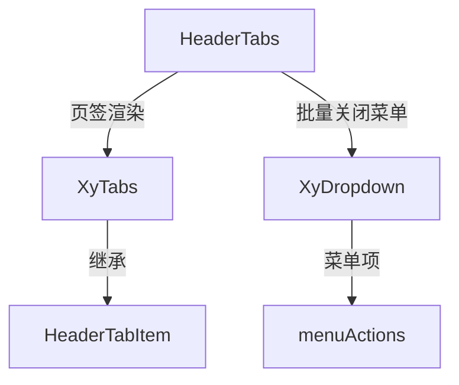

# 103 HeaderTabs 头部页签

> 导读：HeaderTabs 将「多页签切换 + 批量关闭菜单」封装为工作台壳子的标准头部组件，是中后台多页签布局的关键交互单元。

## 设计哲学

中后台管理系统通常采用多页签布局——用户在左侧菜单点击不同功能项，右侧内容区上方出现对应的页签，可以同时打开多个页面并自由切换。这套多页签交互看似只是 Tabs 的简单应用，但实际开发中需要处理页签的添加、关闭、批量操作等复杂逻辑，而且不同项目对这些操作的命名和交互习惯不一致。

HeaderTabs 的设计理念是**页签生命周期管理**：

- **继承 XyTabs 能力**：底层使用 `XyTabs` 组件渲染页签，继承其全部交互能力（切换、编辑、新增、关闭）。
- **批量关闭菜单**：右侧提供 Dropdown 菜单，内置「关闭当前/关闭其他/关闭左侧/关闭右侧/关闭全部」五项操作，开发者只需监听 `tabMenuClick` 事件。
- **badge 支持**：每个页签支持 `badge` 属性，用于标识未读消息数等状态。

HeaderTabs 通常被放置在布局头部的内容区上方，与侧边菜单联动形成完整的多页签工作台。

## 源码架构

### 文件结构

```
header-tabs/
├── index.ts                  # 导出入口
└── src/
    ├── header-tabs.vue       # 组件实现
    └── header-tabs.ts        # 类型定义
```

### 组件关系图



### 核心 type 定义

```ts
export type HeaderTabsMenuAction =
  | 'close-current'
  | 'close-others'
  | 'close-left'
  | 'close-right'
  | 'close-all'

export interface HeaderTabItem extends TabItem {
  badge?: string | number
}

export interface HeaderTabsProps {
  modelValue?: string
  defaultValue?: string
  items: HeaderTabItem[]
  type?: TabsType
  tabPosition?: TabsPosition
  closable?: boolean
  addable?: boolean
  editable?: boolean
  beforeLeave?: TabsBeforeLeave
  menuActions?: Array<{
    key: HeaderTabsMenuAction
    label: string
  }>
}
```

`HeaderTabItem` 继承自基础组件的 `TabItem`，在其上扩展了 `badge` 属性。`HeaderTabsMenuAction` 是一个联合类型，枚举了五种批量关闭操作。

## 核心实现

### XyTabs + Dropdown 组合

HeaderTabs 的模板结构简洁——XyTabs 承载页签切换，Dropdown 承载批量操作：

```vue
<template>
  <div :class="ns.base.value">
    <xy-tabs
      class="xy-header-tabs__tabs"
      :model-value="props.modelValue"
      :default-value="props.defaultValue"
      :items="props.items"
      :type="props.type"
      :tab-position="props.tabPosition"
      :closable="props.closable"
      :addable="props.addable"
      :editable="props.editable"
      :before-leave="props.beforeLeave"
      @update:model-value="handleModelValueUpdate"
      @change="handleChange"
      @edit="handleTabsEdit"
      @tab-remove="handleTabRemove"
      @tab-add="handleTabAdd"
    />
    <xy-dropdown
      class="xy-header-tabs__menu"
      trigger="click"
      :items="dropdownItems"
      @command="handleDropdownCommand"
    >
      <button type="button" class="xy-header-tabs__menu-trigger" aria-label="tab actions">
        <xy-icon icon="mdi:dots-horizontal" />
      </xy-dropdown>
  </div>
</template>
```

关键设计点：

- XyTabs 的事件全部转发到 HeaderTabs 的 emit，保持事件链路透明。
- Dropdown 使用 `mdi:dots-horizontal` 图标作为触发器，风格与工作台头部一致。

### menuActions 默认值

HeaderTabs 为 `menuActions` 提供了完整的中文默认值：

```ts
menuActions: () => [
  { key: 'close-current', label: '关闭当前' },
  { key: 'close-others', label: '关闭其他' },
  { key: 'close-left', label: '关闭左侧' },
  { key: 'close-right', label: '关闭右侧' },
  { key: 'close-all', label: '关闭全部' }
]
```

这意味着开发者不需要手动配置菜单项，默认就拥有完整的批量关闭操作。如果需要自定义操作项或调整文案，只需传入自己的 `menuActions` 数组即可覆盖。

### Dropdown command 转换

Dropdown 的 command 事件需要转换为 HeaderTabs 的 `tabMenuClick` 事件：

```ts
const dropdownItems = computed(() =>
  props.menuActions.map((item) => ({
    key: item.key,
    label: item.label,
    command: item.key
  }))
)

function handleDropdownCommand(command: unknown) {
  if (typeof command !== 'string') return
  emit('tabMenuClick', command as HeaderTabsMenuAction)
}
```

`menuActions` 的 `key` 字段直接作为 Dropdown 的 `command` 值，点击菜单项时将其作为 `HeaderTabsMenuAction` 类型发出，父组件可精确识别操作类型。

### badge 传递

`HeaderTabItem` 的 `badge` 属性会传递到 XyTabs 的渲染层，在页签标签旁显示未读数或状态标记：

```ts
interface HeaderTabItem extends TabItem {
  badge?: string | number
}
```

典型用法：将待审批页签的 badge 设置为未审批数量，让用户一眼看到需要处理的任务。

## API 参考

### Props

| 属性 | 类型 | 默认值 | 说明 |
|------|------|--------|------|
| model-value | `string` | — | 当前激活页签（受控模式） |
| default-value | `string` | — | 默认激活页签（非受控模式） |
| items | `HeaderTabItem[]` | `[]` | 页签列表（必填） |
| type | `TabsType` | `'card'` | 页签类型 |
| tab-position | `TabsPosition` | `'top'` | 页签位置 |
| closable | `boolean` | `true` | 页签是否可关闭 |
| addable | `boolean` | `false` | 是否显示新增页签按钮 |
| editable | `boolean` | `false` | 页签是否可编辑 |
| before-leave | `TabsBeforeLeave` | — | 切换页签前的拦截钩子 |
| menu-actions | `Array<{ key: HeaderTabsMenuAction; label: string }>` | 五项中文默认值 | 批量关闭菜单配置 |

### HeaderTabItem

| 属性 | 类型 | 默认值 | 说明 |
|------|------|--------|------|
| key | `string` | — | 页签标识（继承自 TabItem） |
| label | `string` | — | 页签标题（继承自 TabItem） |
| badge | `string \| number` | — | 页签徽标，用于展示未读数或状态标记 |

### Emits

| 事件名 | 参数 | 说明 |
|--------|------|------|
| update:modelValue | `(value: string)` | 激活页签变化时触发（受控模式） |
| change | `(value: string)` | 页签切换时触发 |
| edit | `(key: string \| undefined, action: 'remove' \| 'add')` | 页签编辑（新增/关闭）时触发 |
| tab-remove | `(key: string)` | 页签关闭时触发 |
| tab-add | `()` | 新增页签按钮点击时触发 |
| tab-menu-click | `(action: HeaderTabsMenuAction)` | 批量关闭菜单项点击时触发 |

### Slots

无

### Exposes

无

## 小结

1. **XyTabs + Dropdown 组合**：页签切换由 XyTabs 承载，批量关闭由 Dropdown 承载，职责清晰互不干扰。
2. **默认 menuActions 五项中文值**：开发者零配置即可获得完整的批量关闭操作，自定义只需覆盖数组。
3. **HeaderTabsMenuAction 类型约束**：五种批量关闭操作被枚举为联合类型，父组件可精确识别操作类型做分发。