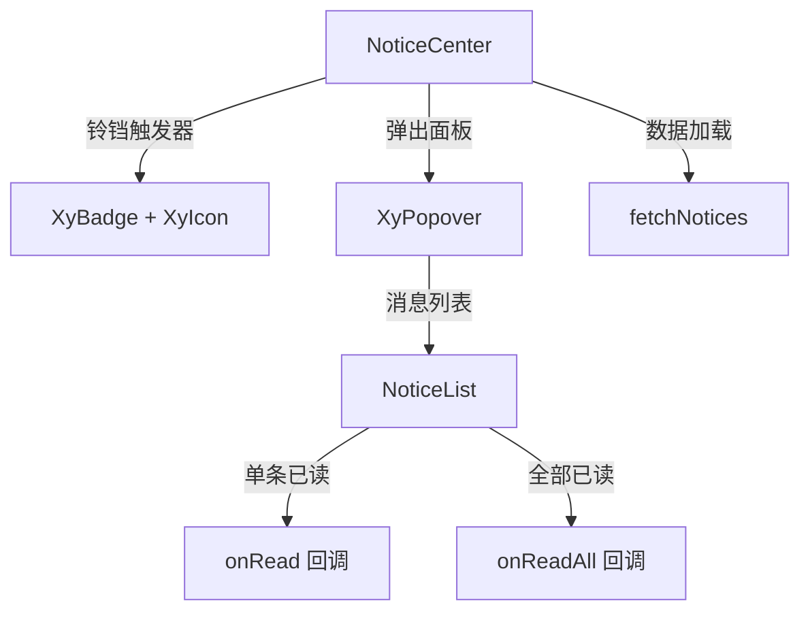
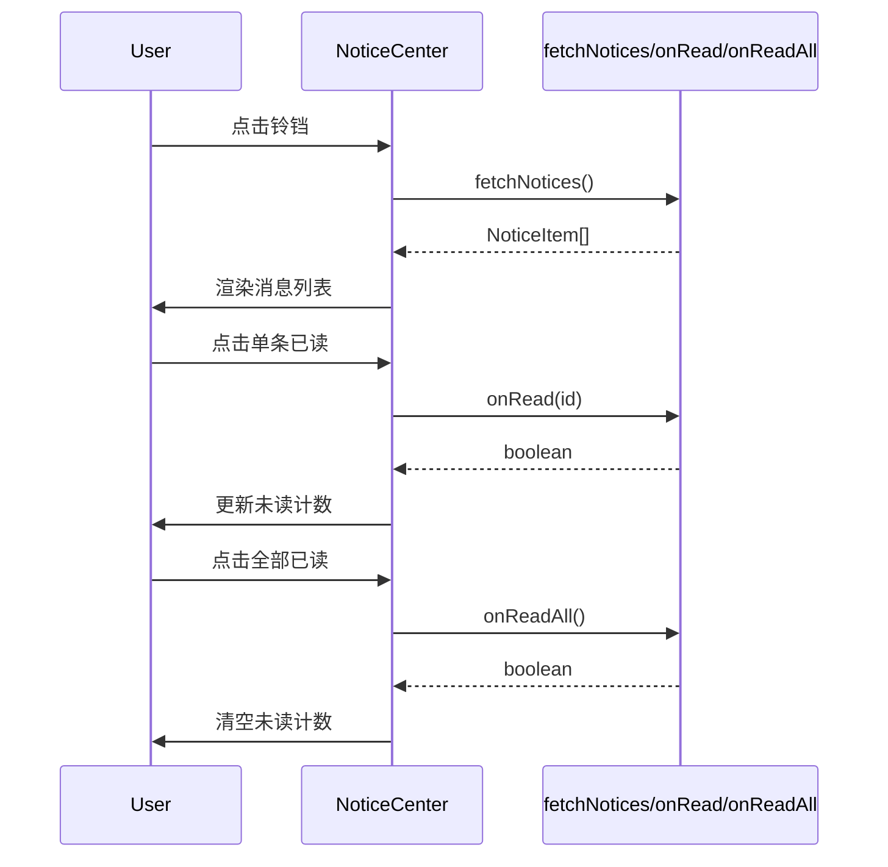

# 104 NoticeCenter 站内消息中心

> 导读：NoticeCenter 将「消息铃铛 + 未读计数 + 消息列表 + 已读操作」封装为即插即用的站内通知组件，是中后台布局头部的标准通知入口。

## 设计哲学

中后台系统几乎都有一套站内消息机制——头部右侧有个铃铛图标，旁边显示未读消息数，点击弹出消息列表，可以标记已读或跳转详情。这套交互的复杂度在于：消息需要分类型展示、未读计数需要实时更新、已读操作需要批量和单条两种模式、消息列表可能需要分页加载。

NoticeCenter 的设计理念是**消息全生命周期管理**：

- **触发器即状态**：铃铛图标上的 Badge 直接反映未读消息数，无需额外状态同步。
- **分类与已读操作**：消息支持类型标签，已读操作支持单条标记和全部标记，由组件内部处理列表更新。
- **外置数据源**：消息列表数据通过 `fetchNotices` 函数获取，已读操作通过 `onRead` / `onReadAll` 回调发出，组件不持有业务数据，只负责展示和交互。

NoticeCenter 通常被放置在布局头部右侧，与 AvatarMenu 并列构成用户身份与通知的双重入口。

## 源码架构

### 文件结构

```
notice-center/
├── index.ts                  # 导出入口
└── src/
    ├── notice-center.vue     # 组件实现
    └── notice-center.ts      # 类型定义
```

### 组件关系图



### 核心 type 定义

```ts
export type NoticeType = 'notification' | 'message' | 'todo'

export interface NoticeItem {
  id: string | number
  type?: NoticeType
  title: string
  description?: string
  time?: string
  read?: boolean
  extra?: string
  avatar?: string
}

export interface NoticeCenterProps {
  maxCount?: number
  emptyText?: string
  showClear?: boolean
  fetchNotices?: () => Promise<NoticeItem[]>
  onRead?: (id: string | number) => Promise<boolean>
  onReadAll?: () => Promise<boolean>
  popperClass?: string
}
```

`NoticeType` 枚举了三种消息类型：通知、私信、待办，对应不同的图标和颜色标识。`fetchNotices` / `onRead` / `onReadAll` 均为异步函数，支持从远程获取数据并执行已读操作。

## 核心实现

### Badge + Popover 触发器

NoticeCenter 的触发器是带 Badge 的铃铛图标：

```vue
<template>
  <xy-popover
    v-model:visible="visible"
    placement="bottom-end"
    :width="380"
    :popper-class="popperClass"
    @show="handlePopoverShow"
  >
    <template #reference>
      <xy-badge :value="unreadCount" :max="99">
        <button type="button" class="xy-notice-center__trigger" aria-label="notifications">
          <xy-icon icon="mdi:bell-outline" :size="20" />
        </button>
      </xy-badge>
    </template>
    <!-- 消息面板 -->
  </xy-popover>
</template>
```

关键设计点：

- **Badge 未读计数**：`unreadCount` 由消息列表中 `read === false` 的项数计算得出，Badge 的 `max` 设为 99 防止数字溢出。
- **Popover show 时加载数据**：`handlePopoverShow` 在弹出面板显示时调用 `fetchNotices`，确保用户看到最新的消息列表。

### 消息列表渲染

面板内部渲染消息列表，支持类型标签、已读/未读区分和空状态：

```vue
<div class="xy-notice-center__list">
  <template v-if="notices.length > 0">
    <div
      v-for="item in notices"
      :key="item.id"
      :class="['xy-notice-center__item', { 'is-read': item.read }]"
      @click="handleNoticeClick(item)"
    >
      <div v-if="item.avatar" class="xy-notice-center__item-avatar">
        <xy-avatar :src="item.avatar" size="small" />
      </div>
      <div v-else class="xy-notice-center__item-icon">
        <xy-icon :icon="typeIconMap[item.type ?? 'notification']" />
      </div>
      <div class="xy-notice-center__item-content">
        <div class="xy-notice-center__item-header">
          <span class="xy-notice-center__item-title">{{ item.title }}</span>
          <span v-if="item.time" class="xy-notice-center__item-time">{{ item.time }}</span>
        </div>
        <p v-if="item.description" class="xy-notice-center__item-desc">
          {{ item.description }}
        </p>
      </div>
    </div>
  </template>
  <xy-empty v-else :description="props.emptyText" />
</div>
```

- 未读消息加粗标题，已读消息降低不透明度（`is-read` 类）。
- 消息类型通过 `typeIconMap` 映射为不同图标。

### 已读操作

NoticeCenter 提供两种已读操作：

**单条标记已读**：鼠标 hover 消息项时出现已读按钮，点击调用 `onRead`：

```ts
async function handleMarkRead(item: NoticeItem) {
  if (props.onRead) {
    const success = await props.onRead(item.id)
    if (success) {
      item.read = true
      unreadCount.value = Math.max(0, unreadCount.value - 1)
    }
  }
}
```

**全部标记已读**：面板底部的「全部已读」按钮，点击调用 `onReadAll`：

```ts
async function handleReadAll() {
  if (props.onReadAll) {
    const success = await props.onReadAll()
    if (success) {
      notices.value.forEach(n => { n.read = true })
      unreadCount.value = 0
    }
  }
}
```

两种操作都是异步的，成功后更新本地状态。如果回调返回 `false` 或抛出异常，本地状态不会被修改，保证了数据一致性。

### 数据流



## API 参考

### Props

| 属性 | 类型 | 默认值 | 说明 |
|------|------|--------|------|
| max-count | `number` | `99` | 未读数最大显示值 |
| empty-text | `string` | `'暂无消息'` | 无消息时的空状态文案 |
| show-clear | `boolean` | `true` | 是否显示「全部已读」按钮 |
| fetch-notices | `() => Promise<NoticeItem[]>` | — | 获取消息列表的异步函数 |
| on-read | `(id: string \| number) => Promise<boolean>` | — | 单条标记已读的异步回调 |
| on-read-all | `() => Promise<boolean>` | — | 全部标记已读的异步回调 |
| popper-class | `string` | `''` | Popover 弹出层自定义类名 |

### NoticeItem

| 属性 | 类型 | 默认值 | 说明 |
|------|------|--------|------|
| id | `string \| number` | — | 消息唯一标识（必填） |
| type | `NoticeType` | `'notification'` | 消息类型 |
| title | `string` | — | 消息标题（必填） |
| description | `string` | — | 消息描述 |
| time | `string` | — | 消息时间文本 |
| read | `boolean` | `false` | 是否已读 |
| extra | `string` | — | 额外标签文本 |
| avatar | `string` | — | 发送者头像地址 |

### Emits

| 事件名 | 参数 | 说明 |
|--------|------|------|
| notice-click | `(item: NoticeItem)` | 点击消息项时触发 |

### Slots

| 插槽名 | 说明 |
|--------|------|
| default | 自定义弹出面板内容 |

### Exposes

无

## 小结

1. **Badge 未读计数自动计算**：由消息列表 `read` 状态驱动，无需外部维护计数状态。
2. **外置异步数据源**：fetchNotices / onRead / onReadAll 均为异步回调，组件不持有业务数据，只负责展示和交互。
3. **单条 + 批量已读双模式**：hover 出现单条已读按钮，底部提供全部已读，覆盖完整的通知处理链路。