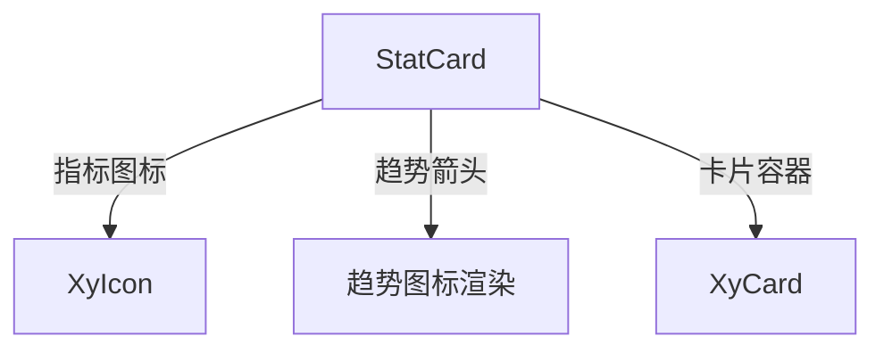

# 105 StatCard 指标卡片

> 导读：StatCard 将「数值 + 标签 + 变化趋势 + 图标」收敛为标准化的指标展示卡片，是中后台仪表盘页面的事实原子单元。

## 设计哲学

运营仪表盘、管理首页、数据大屏——这些页面上几乎每个指标都有相同的展示结构：一个大字号数值、一行标签说明、一个表示变化趋势的箭头和百分比、可能还有一个装饰性图标。然而在真实项目中，这些指标卡片的布局、对齐、颜色、字号往往由各团队自行实现，导致同一套大屏上不同卡片的视觉表现参差不齐。

StatCard 的设计理念是**指标展示标准化**：

- **四要素声明式配置**：value / label / trend / icon 四个核心属性覆盖 90% 的指标展示需求。
- **趋势语义化**：`trend` 支持 `up` / `down` / `flat` 三种方向，自动映射为绿涨红跌（或红涨绿跌）的颜色语义。
- **轻量卡片容器**：默认以卡片形式展示（带边框、圆角、内边距），也可通过 `bordered` 关闭边框变为纯内容模式。

StatCard 常以 3-4 列网格排列在仪表盘页面顶部，提供关键业务指标的一览式总览。

## 源码架构

### 文件结构

```
stat-card/
├── index.ts                 # 导出入口
└── src/
    ├── stat-card.vue        # 组件实现
    └── stat-card.ts         # 类型定义
```

### 组件关系图



### 核心 type 定义

```ts
export type StatTrend = 'up' | 'down' | 'flat'

export interface StatTrendInfo {
  type: StatTrend
  value?: string | number
  label?: string
}

export interface StatCardProps {
  title?: string
  value?: string | number
  prefix?: string
  suffix?: string
  icon?: string
  trend?: StatTrendInfo
  bordered?: boolean
  shadow?: boolean
  bodyClass?: string
  bodyStyle?: CSSProperties
}
```

`StatTrendInfo` 将趋势拆分为方向和数值两部分：`type` 控制箭头方向和颜色，`value` 展示变化百分比，`label` 是趋势的补充说明（如"较昨日"）。

## 核心实现

### 卡片布局

StatCard 的模板分为左右两区：左侧是数值和标签，右侧是装饰图标：

```vue
<template>
  <div :class="rootClasses">
    <div class="xy-stat-card__content">
      <p v-if="props.title" class="xy-stat-card__title">{{ props.title }}</p>
      <div class="xy-stat-card__value-row">
        <span v-if="props.prefix" class="xy-stat-card__prefix">{{ props.prefix }}</span>
        <span class="xy-stat-card__value">{{ displayValue }}</span>
        <span v-if="props.suffix" class="xy-stat-card__suffix">{{ props.suffix }}</span>
      </div>
      <div v-if="props.trend" class="xy-stat-card__trend" :class="trendClass">
        <xy-icon :icon="trendIcon" :size="14" />
        <span v-if="props.trend.value" class="xy-stat-card__trend-value">
          {{ props.trend.value }}
        </span>
        <span v-if="props.trend.label" class="xy-stat-card__trend-label">
          {{ props.trend.label }}
        </span>
      </div>
    </div>
    <div v-if="props.icon" class="xy-stat-card__icon">
      <xy-icon :icon="props.icon" :size="40" />
    </div>
  </div>
</template>
```

关键设计点：

- **value-row 行内排列**：prefix + value + suffix 在同一行内排列，适用于货币符号（prefix="¥"）和单位（suffix="万"）等场景。
- **trend 条件渲染**：只有传入 `trend` 时才渲染趋势行，避免空行占位。
- **icon 右侧装饰**：图标作为视觉装饰放在右侧，不参与数值区布局。

### 趋势方向与颜色

趋势的箭头方向和颜色由 `trend.type` 自动决定：

```ts
const trendClass = computed(() => ({
  'is-up': props.trend?.type === 'up',
  'is-down': props.trend?.type === 'down',
  'is-flat': props.trend?.type === 'flat'
}))

const trendIcon = computed(() => {
  const map: Record<StatTrend, string> = {
    up: 'mdi:arrow-up',
    down: 'mdi:arrow-down',
    flat: 'mdi:arrow-right'
  }
  return map[props.trend?.type ?? 'flat']
})
```

- `up` 箭头向上，默认绿色（`is-up` 类）。
- `down` 箭头向下，默认红色（`is-down` 类）。
- `flat` 箭头向右，默认灰色（`is-flat` 类）。

颜色语义可通过 CSS 变量覆盖，适配不同业务场景的涨跌颜色习惯。

### displayValue 格式化

StatCard 对 `value` 做了简单的展示处理：

```ts
const displayValue = computed(() => {
  if (props.value === undefined || props.value === null) return '--'
  return String(props.value)
})
```

当 `value` 为 `undefined` 或 `null` 时显示占位符 `--`，避免页面出现空白区域。更复杂的格式化（千分位、小数位数等）建议在传入前由业务层处理。

### 容器样式修饰

StatCard 支持两种视觉修饰：

- **`bordered`**：添加边框，默认 `true`。
- **`shadow`**：添加阴影，默认 `false`。

在网格布局中，通常设置 `bordered` 为 `true`、`shadow` 为 `false`，保持卡片的边界清晰但不显浮起。

## API 参考

### Props

| 属性 | 类型 | 默认值 | 说明 |
|------|------|--------|------|
| title | `string` | `''` | 指标标签/标题 |
| value | `string \| number` | — | 指标数值 |
| prefix | `string` | `''` | 数值前缀（如货币符号） |
| suffix | `string` | `''` | 数值后缀（如单位） |
| icon | `string` | `''` | 右侧装饰图标名 |
| trend | `StatTrendInfo` | — | 趋势信息 |
| bordered | `boolean` | `true` | 是否显示边框 |
| shadow | `boolean` | `false` | 是否显示阴影 |
| body-class | `string` | `''` | 内容区额外类名 |
| body-style | `CSSProperties` | — | 内容区内联样式 |

### StatTrendInfo

| 属性 | 类型 | 默认值 | 说明 |
|------|------|--------|------|
| type | `StatTrend` | — | 趋势方向（必填） |
| value | `string \| number` | — | 趋势变化值（如"12%"） |
| label | `string` | — | 趋势补充说明（如"较昨日"） |

### Emits

无

### Slots

| 插槽名 | 说明 |
|--------|------|
| default | 自定义内容区，覆盖默认的 title/value/trend 渲染 |

### Exposes

无

## 小结

1. **四要素声明式配置**：value / label / trend / icon 覆盖 90% 的指标展示需求，告别手写指标卡片模板。
2. **趋势语义化**：trend.type 自动映射箭头方向和颜色，up/down/flat 三态全覆盖。
3. **prefix + suffix 行内排列**：货币符号和单位通过前缀后缀自然拼接，无需手写 span + flex。