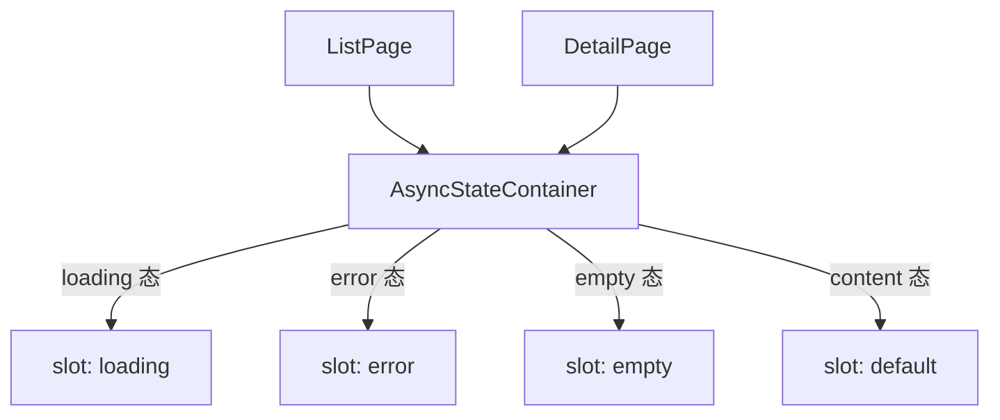

# 106 AsyncStateContainer 异步状态容器

> 导读：AsyncStateContainer 将「loading / error / empty / content」四种异步状态收敛为统一的条件渲染容器，消除中后台页面中反复手写 `v-if/v-else-if/v-else` 状态判断的样板代码。

## 设计哲学

中后台页面几乎每个数据展示区域都要处理异步请求的三种状态：加载中、加载失败、加载成功但无数据。这三种状态加上成功有数据的内容态，构成了四种互斥的渲染分支。在真实项目中，这套 `v-if="loading" ... v-else-if="error" ... v-else-if="empty" ... v-else ...` 的条件判断在每个页面、每个区块反复出现，代码冗余且容易遗漏某个分支。

AsyncStateContainer 的设计理念是**异步状态互斥渲染**：

- **四态互斥**：loading / error / empty / content 四种状态通过 props 驱动，组件内部按优先级互斥渲染，开发者不需要手写条件判断。
- **优先级明确**：loading > error > empty > content，当多个状态同时为 true 时，高优先级状态先展示，避免状态冲突。
- **可定制**：每种状态都提供对应的 slot，允许完全自定义渲染内容，同时保留合理的默认展示。

AsyncStateContainer 是 ListPage、DetailPage 等高级组件的内部基础设施，也可独立用于任何需要异步状态管理的区块。

## 源码架构

### 文件结构

```
async-state-container/
├── index.ts                          # 导出入口
└── src/
    ├── async-state-container.vue     # 组件实现
    └── async-state-container.ts      # 类型定义
```

### 组件关系图



### 核心 type 定义

```ts
export interface AsyncStateContainerProps {
  loading?: boolean
  error?: string | null
  empty?: boolean
  emptyTitle?: string
  emptyDescription?: string
  loadingText?: string
}
```

`error` 的类型是 `string | null`：`null` 表示无错误，非空字符串表示错误信息。`emptyTitle` 和 `emptyDescription` 用于自定义空状态的标题和描述。

## 核心实现

### 四态互斥渲染

AsyncStateContainer 的模板是四段互斥的 `v-if / v-else-if / v-else-if / v-else`：

```vue
<template>
  <div class="xy-async-state-container">
    <slot v-if="props.loading" name="loading">
      <div class="xy-async-state-container__state is-loading">
        <strong>{{ props.loadingText }}</strong>
      </div>
    </slot>
    <slot v-else-if="props.error" name="error" :error="props.error">
      <div class="xy-async-state-container__state is-error">
        <strong>加载失败</strong>
        <xy-text type="danger">{{ props.error }}</xy-text>
        <xy-button type="primary" plain @click="emit('retry')">重新加载</xy-button>
      </div>
    </slot>
    <slot v-else-if="props.empty" name="empty">
      <div class="xy-async-state-container__state is-empty">
        <xy-empty :title="props.emptyTitle" :description="props.emptyDescription" />
      </div>
    </slot>
    <slot v-else />
  </div>
</template>
```

关键设计点：

- **优先级链**：loading 最先判断，error 次之，empty 再次，content 最后。当 loading 和 error 同时为 true 时，只展示 loading 态，避免状态闪烁。
- **slot + 默认内容**：每种状态都先检查 slot 是否提供，有则用 slot 内容，无则用默认渲染。这保证了简单场景零配置即可使用，复杂场景可完全定制。
- **error slot 作用域**：`error` slot 暴露 `error` 参数，让自定义错误展示可以访问错误信息。

### 各状态的默认渲染

**loading 态**：展示一行居中文字，默认文案为"正在加载数据"。

**error 态**：展示三行内容——"加载失败"标题、错误信息文本（红色）、"重新加载"按钮。按钮点击时 emit `retry` 事件，由父组件重新发起请求。

**empty 态**：使用 `XyEmpty` 组件渲染空状态，支持自定义标题和描述文案。

**content 态**：直接渲染 default slot 内容，无额外包裹。

### retry 事件

error 态的"重新加载"按钮是 AsyncStateContainer 唯一主动发出的事件：

```ts
const emit = defineEmits<{
  retry: []
}>()
```

典型用法：

```vue
<AsyncStateContainer
  :loading="loading"
  :error="errorMsg"
  :empty="!loading && !errorMsg && list.length === 0"
  @retry="fetchData"
>
  <List :data="list" />
</AsyncStateContainer>
```

### 在 ListPage 中的使用

ListPage 内部使用 AsyncStateContainer 包裹表格区域，将请求的 loading / error / empty 状态统一管理：

```ts
// ListPage 内部逻辑（简化）
const loading = ref(false)
const error = ref<string | null>(null)
const empty = computed(() => !loading.value && !error.value && data.value.length === 0)
```

开发者通过 ListPage 的 `loading` / `empty` slot 可以自定义对应状态的展示。

## API 参考

### Props

| 属性 | 类型 | 默认值 | 说明 |
|------|------|--------|------|
| loading | `boolean` | `false` | 是否处于加载状态 |
| error | `string \| null` | `null` | 错误信息，null 表示无错误 |
| empty | `boolean` | `false` | 是否处于空数据状态 |
| empty-title | `string` | `'暂无数据'` | 空状态标题 |
| empty-description | `string` | `'当前条件下没有可展示的内容。'` | 空状态描述 |
| loading-text | `string` | `'正在加载数据'` | 加载态文案 |

### Slots

| 插槽名 | 参数 | 说明 |
|--------|------|------|
| loading | — | 自定义加载态内容 |
| error | `{ error: string }` | 自定义错误态内容，可访问错误信息 |
| empty | — | 自定义空态内容 |
| default | — | 正常内容态（仅在其他三态均为 false 时渲染） |

### Emits

| 事件名 | 参数 | 说明 |
|--------|------|------|
| retry | `()` | error 态的"重新加载"按钮点击时触发 |

### Exposes

无

## 小结

1. **四态互斥渲染**：loading / error / empty / content 按优先级互斥展示，消除手写 v-if/v-else-if/v-else 的样板代码。
2. **slot + 默认内容双模式**：每种状态都提供 slot 兜底自定义，同时保留合理的默认展示，简单场景零配置。
3. **retry 事件驱动重试**：error 态内置"重新加载"按钮，点击 emit retry 事件，与请求重发逻辑自然衔接。