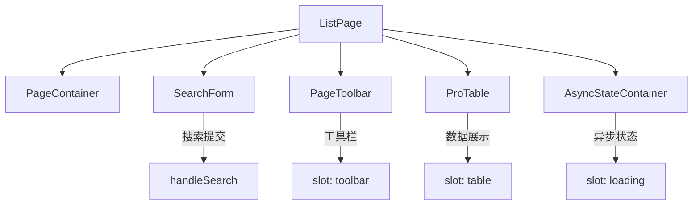
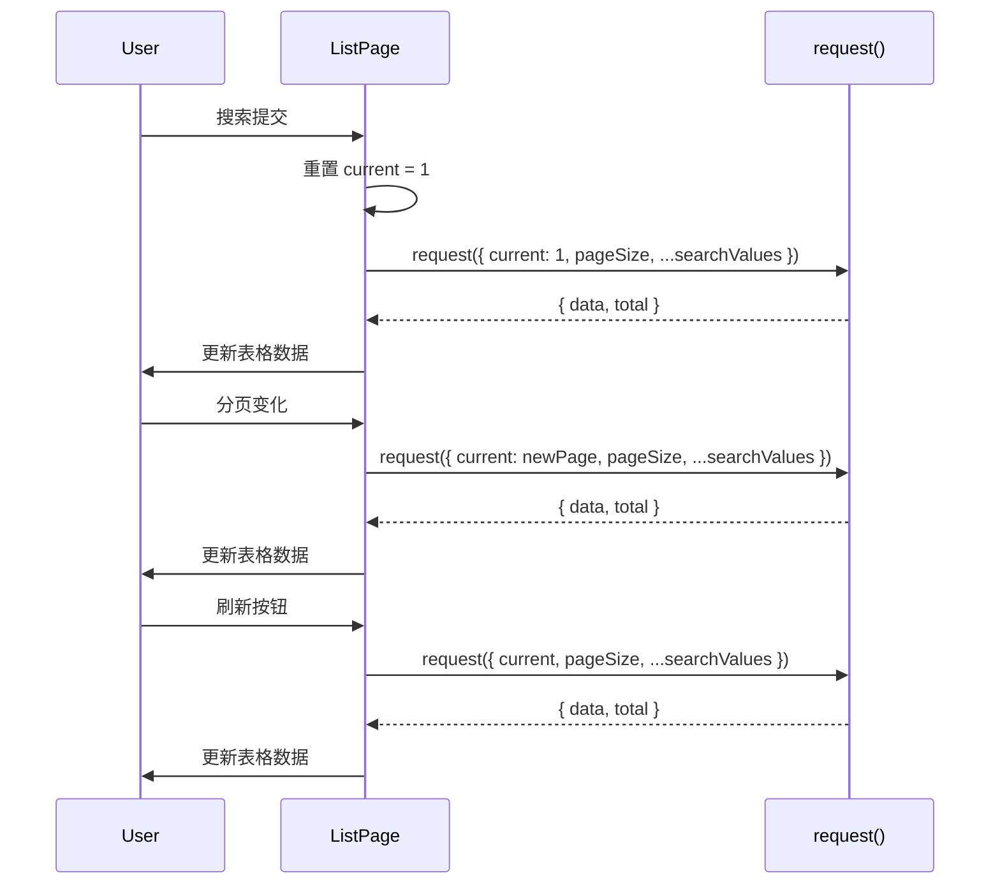

# 107 ListPage 列表页面

> 导读：ListPage 将「搜索表单 + 工具栏 + 数据表格 + 分页」四段组合收敛为声明式配置的列表页容器，一条 `request` 函数驱动整页数据流。

## 设计哲学

中后台系统中数量最多的页面类型就是列表页——顶部搜索表单，中间工具栏和数据表格，底部分页器。然而每写一个列表页，都要重复搭建这四段结构、手动管理搜索条件与表格分页的联动、处理 loading 和空状态。这种重复劳动不仅低效，还导致不同列表页的交互逻辑不一致（如搜索后是否重置页码、分页变化是否保留搜索条件等）。

ListPage 的设计理念是**数据驱动 + 组合封装**：

- **request 数据流**：一个 `request` 函数定义从「搜索条件 + 分页参数」到「数据 + 总数」的映射，ListPage 负责在搜索、分页、刷新等时机自动调用。
- **组合封装**：内部组合 PageContainer + PageToolbar + SearchForm + ProTable + AsyncStateContainer，开发者通过 props 和 slot 控制每个子组件的配置和内容。
- **交互约定**：搜索时自动重置页码到第 1 页、分页变化时保留搜索条件、刷新时保持当前页码——这些交互约定由 ListPage 统一处理，消除每个页面自行实现的歧义。

ListPage 是最常用的 Pro 页面组件，覆盖 80% 以上的中后台页面场景。

## 源码架构

### 文件结构

```
list-page/
├── index.ts                 # 导出入口
└── src/
    ├── list-page.vue        # 组件实现
    └── list-page.ts         # 类型定义
```

### 组件关系图



### 核心 type 定义

```ts
export interface ListPageRequestParams {
  current: number
  pageSize: number
  [key: string]: any
}

export interface ListPageRequestResult {
  data: any[]
  total: number
}

export type ListPageRequestFn =
  (params: ListPageRequestParams) => Promise<ListPageRequestResult>

export interface ListPageProps {
  title?: string
  description?: string
  columns: ProTableColumn[]
  request: ListPageRequestFn
  searchFields?: SearchFieldSchema[]
  pageSize?: number
  immediate?: boolean
  bordered?: boolean
  loading?: boolean
  showToolbar?: boolean
  toolbarActive?: boolean
  metaItems?: PageMetaItem[]
}
```

`ListPageRequestFn` 是 ListPage 的核心契约——它接收搜索条件和分页参数，返回数据和总数。ListPage 负责在正确的时机调用这个函数并更新表格数据。

## 核心实现

### request 数据流

ListPage 的数据流由 `request` 函数驱动，通过 `useRequest` 组合式函数管理请求状态：



核心请求逻辑：

```ts
const current = ref(1)
const pageSize = ref(props.pageSize)
const searchValues = ref<Record<string, any>>({})

async function fetchData() {
  const result = await props.request({
    current: current.value,
    pageSize: pageSize.value,
    ...searchValues.value
  })
  tableData.value = result.data
  total.value = result.total
}
```

### 搜索与分页联动

搜索提交时自动重置页码：

```ts
function handleSearch(values: Record<string, any>) {
  searchValues.value = values
  current.value = 1
  fetchData()
}
```

分页变化时保留搜索条件：

```ts
function handlePageChange(page: number) {
  current.value = page
  fetchData()
}

function handleSizeChange(size: number) {
  pageSize.value = size
  current.value = 1
  fetchData()
}
```

### 组件组合方式

ListPage 的模板将四个子组件按固定结构组合：

```vue
<template>
  <xy-page-container v-bind="containerProps">
    <xy-search-form
      v-if="props.searchFields?.length"
      :fields="props.searchFields"
      @search="handleSearch"
      @reset="handleReset"
    />

    <xy-page-toolbar v-if="props.showToolbar" :active="props.toolbarActive">
      <template #search>
        <slot name="toolbar-search" />
      </template>
      <template #actions>
        <slot name="toolbar-actions" />
      </template>
      <template #batch-actions>
        <slot name="toolbar-batch" />
      </template>
    </xy-page-toolbar>

    <xy-async-state-container
      :loading="loading"
      :error="errorMsg"
      :empty="isEmpty"
    >
      <xy-pro-table
        :data="tableData"
        :columns="props.columns"
        :total="total"
        :current="current"
        :page-size="pageSize"
        @page-change="handlePageChange"
        @size-change="handleSizeChange"
      >
        <template v-for="(_, name) in tableSlots" :key="name" #[name]="scope">
          <slot :name="name" v-bind="scope" />
        </template>
      </xy-pro-table>
    </xy-async-state-container>

    <template #footer>
      <slot name="footer" />
    </template>
  </xy-page-container>
</template>
```

关键设计点：

- **SearchForm 条件渲染**：仅在提供 `searchFields` 时渲染搜索表单。
- **PageToolbar 条件渲染**：通过 `showToolbar` 控制，默认为 `true`。
- **AsyncStateContainer 包裹表格**：将 loading / error / empty 三种状态统一管理。
- **table slot 透传**：ProTable 的所有 slot 通过 `v-for` 透传到 ListPage，开发者可以在 ListPage 上直接使用 ProTable 的 slot。

### immediate 首次加载

`immediate` prop 控制组件挂载时是否自动发起首次请求：

```ts
onMounted(() => {
  if (props.immediate) {
    fetchData()
  }
})
```

默认 `immediate` 为 `true`，适用于大多数列表页场景。设为 `false` 时，需要手动调用 `reload()` 方法触发首次加载。

### reload 方法

ListPage expose 了 `reload` 方法，供父组件手动触发刷新：

```ts
defineExpose({
  reload: fetchData
})
```

典型用法：新增/编辑操作完成后，调用 `listPageRef.value.reload()` 刷新列表。

## API 参考

### Props

| 属性 | 类型 | 默认值 | 说明 |
|------|------|--------|------|
| title | `string` | `''` | 页面标题 |
| description | `string` | `''` | 页面描述 |
| columns | `ProTableColumn[]` | `[]` | 表格列定义（必填） |
| request | `ListPageRequestFn` | — | 数据请求函数（必填） |
| search-fields | `SearchFieldSchema[]` | `[]` | 搜索表单字段定义 |
| page-size | `number` | `20` | 每页条数 |
| immediate | `boolean` | `true` | 是否在挂载时自动发起请求 |
| bordered | `boolean` | `true` | 容器是否显示边框 |
| loading | `boolean` | `false` | 外部控制 loading 态 |
| show-toolbar | `boolean` | `true` | 是否显示工具栏 |
| toolbar-active | `boolean` | `false` | 工具栏批量操作栏是否激活 |
| meta-items | `PageMetaItem[]` | `[]` | 页面头部元信息 |

### Emits

| 事件名 | 参数 | 说明 |
|--------|------|------|
| search | `(values: Record<string, any>)` | 搜索提交时触发 |
| reset | `()` | 搜索表单重置时触发 |
| page-change | `(page: number)` | 页码变化时触发 |
| size-change | `(size: number)` | 每页条数变化时触发 |

### Slots

| 插槽名 | 说明 |
|--------|------|
| toolbar-search | 工具栏左侧搜索区 |
| toolbar-actions | 工具栏右侧操作区 |
| toolbar-batch | 工具栏批量操作区 |
| table-* | ProTable 的所有 slot 均可透传使用 |
| loading | 自定义加载态内容 |
| error | 自定义错误态内容 |
| empty | 自定义空态内容 |
| footer | 页面底部区 |

### Exposes

| 方法 | 参数 | 说明 |
|------|------|------|
| reload | `()` | 手动刷新列表数据 |

## 小结

1. **request 数据流**：一个请求函数定义从搜索条件+分页参数到数据+总数的映射，ListPage 自动在搜索/分页/刷新时调用。
2. **搜索重置页码 + 分页保留搜索**：搜索提交自动重置到第 1 页，分页变化保留当前搜索条件，交互约定统一。
3. **四段组合封装**：PageContainer + SearchForm + PageToolbar + ProTable + AsyncStateContainer 的固定组合，通过 props 和 slot 提供完整的可配置性。