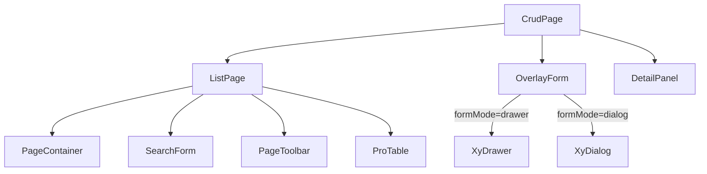
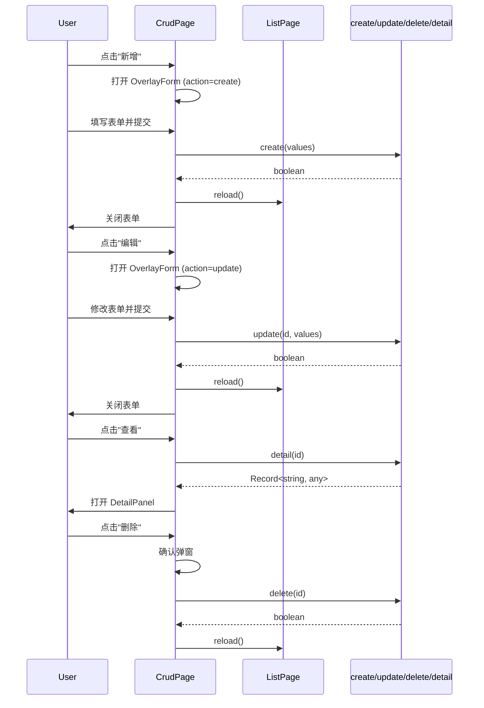

# 108 CrudPage 增删改查页面

> 导读：CrudPage 在 ListPage 之上叠加「新增/编辑表单 + 详情面板」的 CRUD 操作层，一个组件覆盖中后台最经典的增删改查全流程。

## 设计哲学

如果说 ListPage 解决了"列表展示"的问题，那么 CrudPage 解决的就是"列表 + 新建 + 编辑 + 查看"的完整 CRUD 问题。在中后台系统中，90% 的功能页面都可以抽象为：一个列表页 + 一个新增/编辑表单 + 一个详情面板。然而这三者的组合方式在不同项目中千差万别——有人用弹窗表单，有人用抽屉表单，有人跳转新页面，导致交互不一致且重复开发。

CrudPage 的设计理念是**ListPage + OverlayForm + DetailPanel 的三层叠加**：

- **ListPage 底座**：继承 ListPage 的全部能力（搜索、表格、分页），作为 CRUD 操作的起点。
- **OverlayForm 浮层表单**：新增和编辑操作通过 OverlayForm 承载，支持 `drawer`（抽屉）和 `dialog`（弹窗）两种模式，由 `formMode` prop 控制。
- **DetailPanel 详情面板**：查看操作通过 DetailPanel 承载，默认为右侧抽屉面板，展示行数据的只读视图。

CrudPage 通过 `create` / `update` / `detail` 三个请求函数定义 CRUD 的数据流，组件自动在对应的操作时机调用。

## 源码架构

### 文件结构

```
crud-page/
├── index.ts                 # 导出入口
└── src/
    ├── crud-page.vue        # 组件实现
    └── crud-page.ts         # 类型定义
```

### 组件关系图



### 核心 type 定义

```ts
export type FormMode = 'drawer' | 'dialog'

export type CrudAction = 'create' | 'update' | 'detail'

export interface CrudPageFormSchema {
  fields: FormFieldSchema[]
  defaultValues?: Record<string, any>
  colSpan?: number
}

export interface CrudPageProps {
  title?: string
  description?: string
  columns: ProTableColumn[]
  request: ListPageRequestFn
  searchFields?: SearchFieldSchema[]
  formSchema: CrudPageFormSchema
  formMode?: FormMode
  create?: (values: Record<string, any>) => Promise<boolean>
  update?: (id: string | number, values: Record<string, any>) => Promise<boolean>
  detail?: (id: string | number) => Promise<Record<string, any>>
  delete?: (id: string | number) => Promise<boolean>
  pageSize?: number
  immediate?: boolean
  bordered?: boolean
  showToolbar?: boolean
}
```

`FormMode` 枚举了两种浮层模式，`CrudAction` 枚举了三种 CRUD 操作。`CrudPageFormSchema` 定义了表单的字段和布局配置。

## 核心实现

### ListPage + OverlayForm + DetailPanel 三层叠加

CrudPage 的模板在 ListPage 之上叠加了 OverlayForm 和 DetailPanel：

```vue
<template>
  <xy-list-page v-bind="listPageProps" ref="listPageRef">
    <!-- 透传 ListPage 的所有 slot -->
    <template v-for="(_, name) in listPageSlots" :key="name" #[name]="scope">
      <slot :name="name" v-bind="scope" />
    </template>

    <!-- 新增/编辑按钮注入到工具栏 -->
    <template #toolbar-actions>
      <xy-button type="primary" @click="handleCreate">
        {{ createButtonText }}
      </xy-button>
      <slot name="toolbar-actions" />
    </template>

    <!-- 表格操作列 -->
    <template #column-actions="{ row }">
      <xy-button link type="primary" @click="handleDetail(row)">查看</xy-button>
      <xy-button link type="primary" @click="handleUpdate(row)">编辑</xy-button>
      <xy-button link type="danger" @click="handleDelete(row)">删除</xy-button>
      <slot name="column-actions" :row="row" />
    </template>
  </xy-list-page>

  <!-- 新增/编辑浮层表单 -->
  <xy-overlay-form
    v-model:visible="formVisible"
    :mode="props.formMode"
    :title="formTitle"
    :fields="props.formSchema.fields"
    :default-values="formDefaultValues"
    :confirm-loading="formSubmitting"
    @confirm="handleFormConfirm"
  >
    <template v-for="(_, name) in formSlots" :key="name" #[name]="scope">
      <slot :name="`form-${name}`" v-bind="scope" />
    </template>
  </xy-overlay-form>

  <!-- 详情面板 -->
  <xy-detail-panel
    v-model:visible="detailVisible"
    :title="detailTitle"
    :data="detailData"
    :loading="detailLoading"
  >
    <template v-for="(_, name) in detailSlots" :key="name" #[name]="scope">
      <slot :name="`detail-${name}`" v-bind="scope" />
    </template>
  </xy-detail-panel>
</template>
```

关键设计点：

- **ListPage slot 全透传**：CrudPage 的所有 ListPage slot 直接透传，开发者无需关心 CrudPage 的内部封装。
- **操作列自动注入**：CrudPage 自动在表格最后一列添加"查看/编辑/删除"操作按钮，开发者可通过 `column-actions` slot 扩展。
- **OverlayForm slot 前缀化**：表单 slot 在 CrudPage 上以 `form-` 前缀暴露（如 `form-fieldName`），避免与 ListPage slot 命名冲突。

### CRUD 数据流



### 表单提交处理

OverlayForm 的 confirm 事件由 `handleFormConfirm` 处理，根据当前 `action` 分发到不同的请求函数：

```ts
async function handleFormConfirm(values: Record<string, any>) {
  formSubmitting.value = true
  try {
    let success = false
    if (currentAction.value === 'create' && props.create) {
      success = await props.create(values)
    } else if (currentAction.value === 'update' && props.update) {
      success = await props.update(currentRowId.value!, values)
    }
    if (success) {
      formVisible.value = false
      listPageRef.value?.reload()
    }
  } finally {
    formSubmitting.value = false
  }
}
```

关键设计点：

- `currentAction` 区分新增和编辑，决定调用 `create` 还是 `update`。
- 成功后自动关闭表单并刷新列表，失败时保持表单打开让用户修正。
- `formSubmitting` 状态传递给 OverlayForm 的 `confirmLoading`，防止重复提交。

### 删除确认

删除操作通过 `XyMessageBox` 弹出确认框：

```ts
async function handleDelete(row: any) {
  try {
    await XyMessageBox.confirm('确定要删除该条记录吗？', '删除确认', {
      confirmButtonText: '确定',
      cancelButtonText: '取消',
      type: 'warning'
    })
    const success = await props.delete?.(row.id)
    if (success) {
      listPageRef.value?.reload()
    }
  } catch {
    // 用户取消
  }
}
```

### 详情面板

点击"查看"时，CrudPage 调用 `detail` 函数获取详情数据并打开 DetailPanel：

```ts
async function handleDetail(row: any) {
  currentRowId.value = row.id
  detailVisible.value = true
  detailLoading.value = true
  try {
    const data = await props.detail?.(row.id)
    detailData.value = data ?? {}
  } catch {
    detailData.value = {}
  } finally {
    detailLoading.value = false
  }
}
```

DetailPanel 支持加载态，在数据请求期间展示 loading 视觉。

## API 参考

### Props

| 属性 | 类型 | 默认值 | 说明 |
|------|------|--------|------|
| title | `string` | `''` | 页面标题 |
| description | `string` | `''` | 页面描述 |
| columns | `ProTableColumn[]` | `[]` | 表格列定义（必填） |
| request | `ListPageRequestFn` | — | 列表数据请求函数（必填） |
| search-fields | `SearchFieldSchema[]` | `[]` | 搜索表单字段定义 |
| form-schema | `CrudPageFormSchema` | — | 新增/编辑表单定义（必填） |
| form-mode | `'drawer' \| 'dialog'` | `'drawer'` | 表单浮层模式 |
| create | `(values: Record<string, any>) => Promise<boolean>` | — | 新增请求函数 |
| update | `(id, values) => Promise<boolean>` | — | 编辑请求函数 |
| detail | `(id) => Promise<Record<string, any>>` | — | 详情请求函数 |
| delete | `(id) => Promise<boolean>` | — | 删除请求函数 |
| page-size | `number` | `20` | 每页条数 |
| immediate | `boolean` | `true` | 是否在挂载时自动发起请求 |
| bordered | `boolean` | `true` | 容器是否显示边框 |
| show-toolbar | `boolean` | `true` | 是否显示工具栏 |

### Emits

| 事件名 | 参数 | 说明 |
|--------|------|------|
| create | `(values: Record<string, any>)` | 新增操作触发 |
| update | `(id, values: Record<string, any>)` | 编辑操作触发 |
| delete | `(id: string \| number)` | 删除操作触发 |
| detail | `(id: string \| number)` | 查看详情触发 |

### Slots

| 插槽名 | 说明 |
|--------|------|
| toolbar-actions | 工具栏操作区（在新增按钮之后） |
| column-actions | 表格操作列扩展（在查看/编辑/删除按钮之后） |
| form-{name} | OverlayForm 的 slot 透传，前缀 `form-` |
| detail-{name} | DetailPanel 的 slot 透传，前缀 `detail-` |
| toolbar-search | 透传 ListPage 的工具栏搜索区 |
| toolbar-batch | 透传 ListPage 的工具栏批量操作区 |

### Exposes

| 方法 | 参数 | 说明 |
|------|------|------|
| reload | `()` | 手动刷新列表数据 |
| openCreate | `()` | 手动打开新增表单 |
| openUpdate | `(row: any)` | 手动打开编辑表单 |
| openDetail | `(row: any)` | 手动打开详情面板 |

## 小结

1. **ListPage + OverlayForm + DetailPanel 三层叠加**：继承 ListPage 的全部列表能力，叠加新增/编辑表单和详情面板，一个组件覆盖完整 CRUD 流程。
2. **formMode drawer/dialog 双模式**：表单浮层支持抽屉和弹窗两种模式，通过 `formMode` prop 一键切换。
3. **action 分发 + 自动 reload**：新增/编辑/删除成功后自动刷新列表，失败时保持表单打开，无需手动处理刷新逻辑。