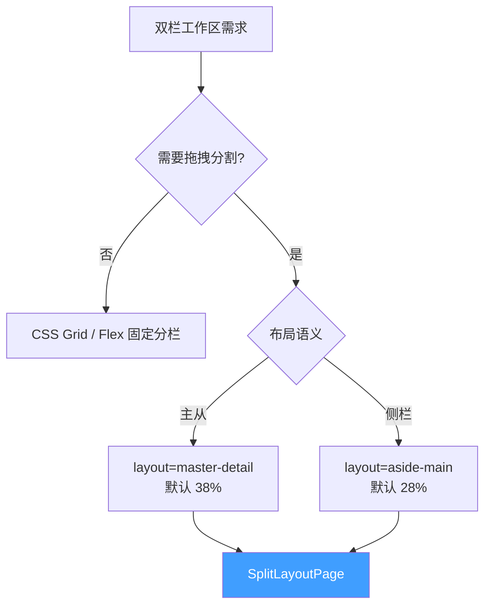
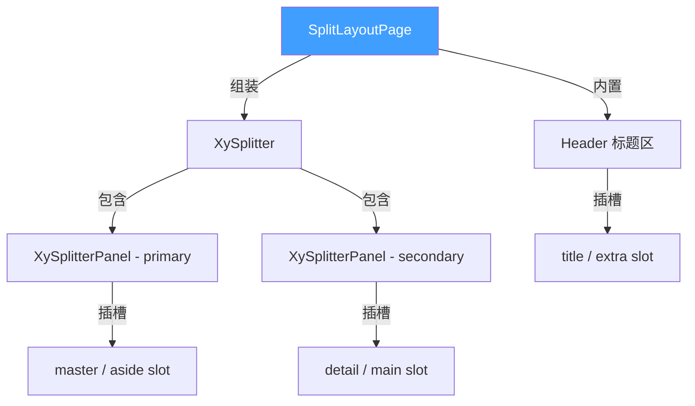
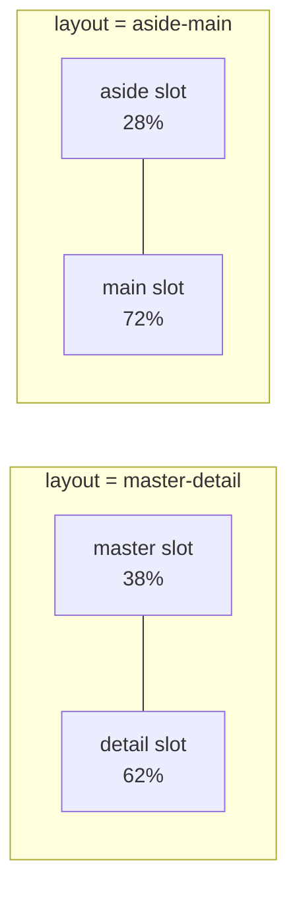
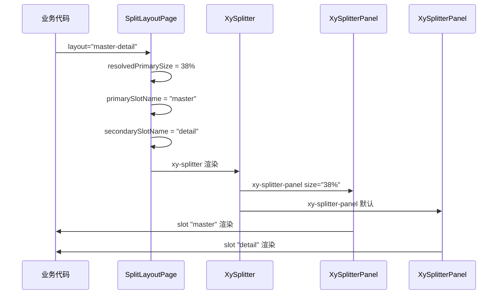
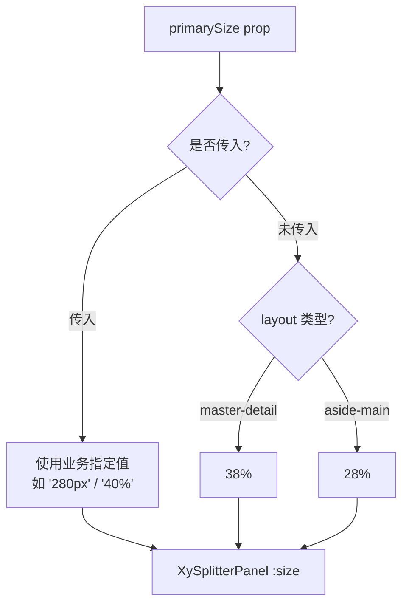
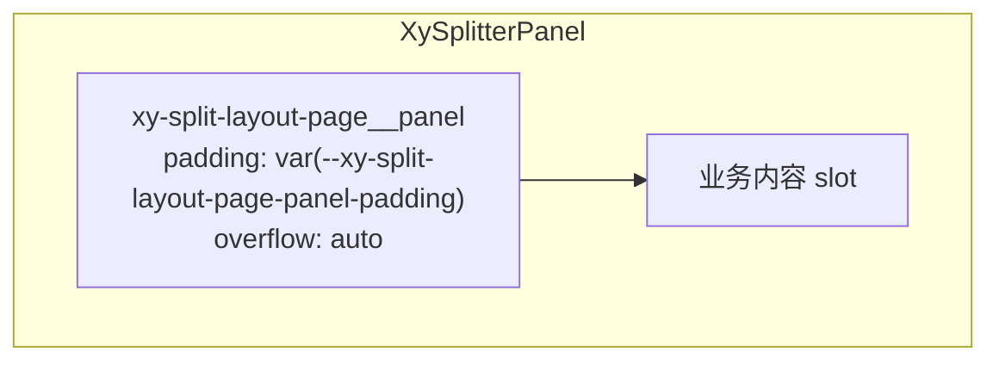
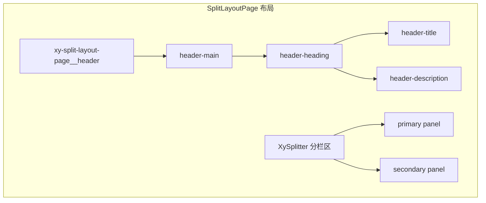
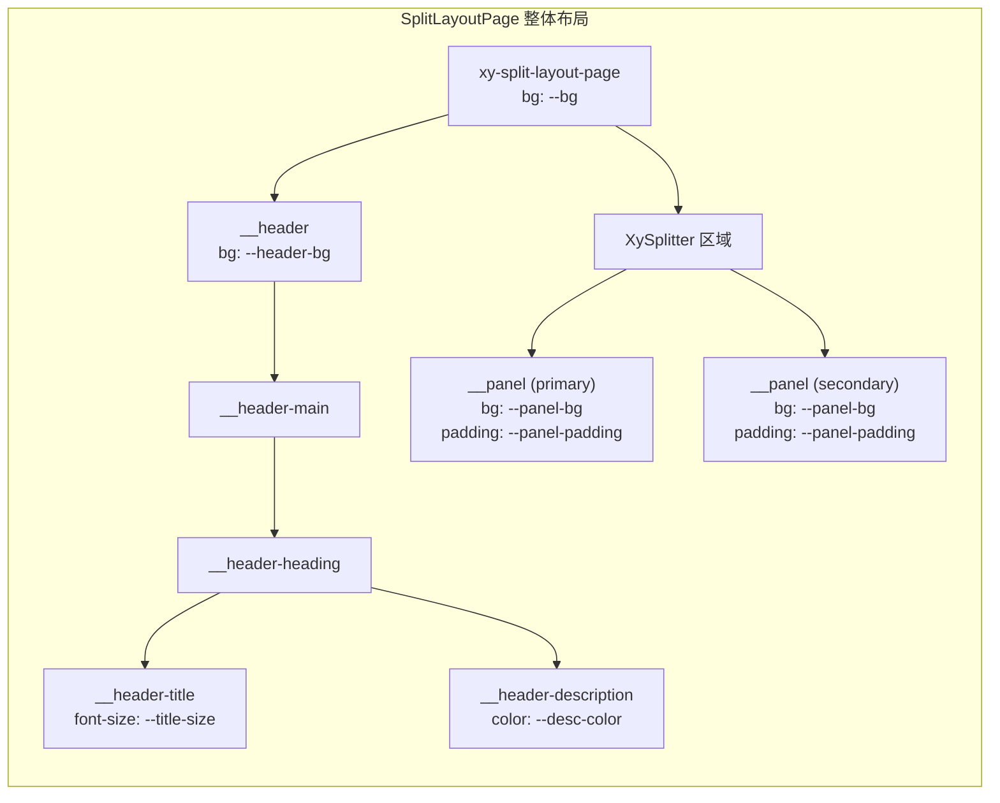

# 109 SplitLayoutPage 分栏页面

> 导读：将"主从布局"和"侧栏布局"两种双栏工作区收敛为统一的分栏页面模型，通过 layout prop 一键切换布局语义，底层由 XySplitter 驱动实现可拖拽的分栏比例

## 设计哲学

### 为什么需要 SplitLayoutPage

企业级后台系统中，"分栏布局"是最常见的工作区形态，两个核心变体：

1. **主从布局（master-detail）** — 左侧列表/树，右侧详情/编辑区。左侧窄、右侧宽（默认 38% : 62%）
2. **侧栏布局（aside-main）** — 左侧筛选/导航面板，右侧内容区。左侧更窄、右侧更宽（默认 28% : 72%）

两者结构相同（双栏 + 可拖拽分割线），差异在于语义与默认比例。SplitLayoutPage 的价值是 **"用一个组件 + 一个 prop 统一两种语义"** — 业务不需要自己算比例、不需要自己写 Splitter、不需要自己排版标题区。

### 设计决策



| 决策点 | 选择 | 理由 |
|--------|------|------|
| 底层引擎 | XySplitter + XySplitterPanel | 复用已有分栏拖拽能力，不重复实现 |
| 布局语义 | layout prop 区分 | master-detail 和 aside-main 的默认比例不同，语义明确 |
| 标题区 | 内置 header 结构 | 分栏页通常有统一的标题区，避免业务重复布局 |
| 面板插槽 | 动态插槽名 | 根据 layout 自动映射 master/aside 和 detail/main 插槽 |
| 面板容器 | 内嵌 wrapper div | 为面板内容提供统一内边距和溢出处理 |

## 源码架构

### 文件结构

```
packages/pro-components/split-layout-page/
├── index.ts                    # 模块导出入口（withInstall 注册）
└── src/
    ├── split-layout-page.ts    # 类型定义（Props / Layout）
    └── split-layout-page.vue   # 组件实现
```

### 组件关系图



### 核心 Type 定义

```ts
/** 布局语义枚举 */
export type SplitLayoutPageLayout = 'master-detail' | 'aside-main'

/** 组件 Props */
export interface SplitLayoutPageProps {
  title?: string
  description?: string
  layout?: SplitLayoutPageLayout
  primarySize?: string
}
```

## 核心实现

### 1. layout 语义映射 — 比例 + 插槽名

**WHY** — master-detail 和 aside-main 的核心差异是：① 默认比例不同 ② 插槽名不同。SplitLayoutPage 通过 computed 自动映射，业务只需声明 layout 值。

```ts
const resolvedPrimarySize = computed(() => {
  if (props.primarySize) return props.primarySize
  return props.layout === 'master-detail' ? '38%' : '28%'
})

const primarySlotName = computed(() =>
  props.layout === 'master-detail' ? 'master' : 'aside'
)

const secondarySlotName = computed(() =>
  props.layout === 'master-detail' ? 'detail' : 'main'
)
```



**插槽命名的语义价值**：使用 `master`/`detail` 或 `aside`/`main` 而非 `left`/`right`，是因为插槽名应表达"内容的语义角色"而非"视觉位置"。未来如需支持 RTL 或竖向布局，语义名无需改动。

### 2. Splitter 组装与面板渲染

**WHY** — SplitLayoutPage 不自己实现拖拽分栏，而是组装 XySplitter + XySplitterPanel。这保证了分栏交互（拖拽、最小宽度约束、键盘 resize）的统一性和可维护性。

```vue
<template>
  <div class="xy-split-layout-page">
    <!-- 内置标题区 -->
    <div class="xy-split-layout-page__header">
      <div class="xy-split-layout-page__header-main">
        <div class="xy-split-layout-page__header-heading">
          <h2 v-if="props.title"
              class="xy-split-layout-page__header-title">
            {{ props.title }}
          </h2>
          <p v-if="props.description"
              class="xy-split-layout-page__header-description">
            {{ props.description }}
          </p>
        </div>
      </div>
    </div>
    <!-- Splitter 分栏区 -->
    <xy-splitter>
      <xy-splitter-panel :size="resolvedPrimarySize">
        <div class="xy-split-layout-page__panel">
          <slot :name="primarySlotName" />
        </div>
      </xy-splitter-panel>
      <xy-splitter-panel>
        <div class="xy-split-layout-page__panel">
          <slot :name="secondarySlotName" />
        </div>
      </xy-splitter-panel>
    </xy-splitter>
  </div>
</template>
```



### 3. primarySize 覆盖机制

**WHY** — 默认比例适合大多数场景，但业务可能有特殊需求（如侧栏固定 280px 而非百分比）。primarySize prop 允许覆盖默认值，支持百分比和像素值两种格式。

```ts
const resolvedPrimarySize = computed(() => {
  // 业务显式指定 → 直接使用
  if (props.primarySize) return props.primarySize
  // 否则使用 layout 对应的默认值
  return props.layout === 'master-detail' ? '38%' : '28%'
})
```



使用示例：

```vue
<!-- 默认比例：aside-main → 28% -->
<xy-split-layout-page layout="aside-main">
  <template #aside>侧栏</template>
  <template #main>内容</template>
</xy-split-layout-page>

<!-- 覆盖为固定 280px -->
<xy-split-layout-page layout="aside-main" primary-size="280px">
  <template #aside>侧栏</template>
  <template #main>内容</template>
</xy-split-layout-page>

<!-- master-detail → 38% -->
<xy-split-layout-page layout="master-detail" title="用户管理">
  <template #master>用户列表</template>
  <template #detail>用户详情</template>
</xy-split-layout-page>
```

### 4. 面板内嵌容器

**WHY** — 每个 SplitterPanel 内部包裹了一个 `xy-split-layout-page__panel` div。这个容器为面板内容提供统一的内边距和溢出处理，避免内容紧贴分割线或溢出到相邻面板。

```vue
<xy-splitter-panel :size="resolvedPrimarySize">
  <div class="xy-split-layout-page__panel">
    <slot :name="primarySlotName" />
  </div>
</xy-splitter-panel>
```



### 5. 标题区结构

**WHY** — 分栏页面通常需要统一的标题/描述区域，位于分栏区上方。SplitLayoutPage 内置了 header 结构，支持 `title` / `description` props 和同名插槽覆盖。



标题区只在 `title` 或 `description` 非空时渲染，避免空 div 占位。

### 6. 动态插槽名实现

**WHY** — Vue 的 `<slot :name="dynamicName" />` 语法允许根据运行时条件切换插槽名。这使得同一个组件通过 `layout` prop 切换时，插槽名自动变化，业务代码无需条件判断。

```ts
// layout 从 master-detail 切换为 aside-main 时
// primarySlotName: 'master' → 'aside'
// secondarySlotName: 'detail' → 'main'
// 业务侧只需使用对应的插槽名即可
```

## API 参考

### Props

| 属性 | 类型 | 默认值 | 说明 |
|------|------|--------|------|
| title | `string` | `''` | 页面标题 |
| description | `string` | `''` | 页面描述 |
| layout | `'master-detail' \| 'aside-main'` | `'aside-main'` | 布局语义模式 |
| primarySize | `string` | `''` | 主面板尺寸，覆盖默认比例 |

### Emits

无自定义事件。Splitter 的拖拽事件可通过 ref 获取 Splitter 实例后监听。

### Slots

| 插槽名 | layout=master-detail | layout=aside-main | 说明 |
|--------|----------------------|-------------------|------|
| master | 主面板（左侧 38%） | — | 列表/树区域 |
| detail | — | — | 详情/编辑区域 |
| aside | — | 侧面板（左侧 28%） | 筛选/导航面板 |
| main | — | — | 内容区域 |

> 插槽名由 `layout` prop 自动映射：master-detail 使用 `master` + `detail`，aside-main 使用 `aside` + `main`。

### Exposes

无 expose 方法。可通过 ref 获取内部 XySplitter 实例进行高级操作。

## 样式系统

### BEM 类名

| 类名 | 说明 |
|------|------|
| `xy-split-layout-page` | 根容器 |
| `xy-split-layout-page__header` | 标题区 |
| `xy-split-layout-page__header-main` | 标题区主内容 |
| `xy-split-layout-page__header-heading` | 标题/描述包裹 |
| `xy-split-layout-page__header-title` | 标题文本 |
| `xy-split-layout-page__header-description` | 描述文本 |
| `xy-split-layout-page__panel` | 面板内嵌容器 |

### CSS 变量

| 变量名 | 默认值 | 说明 |
|--------|--------|------|
| `--xy-split-layout-page-bg` | `#f5f7fa` | 页面背景色 |
| `--xy-split-layout-page-header-bg` | `#fff` | 标题区背景色 |
| `--xy-split-layout-page-panel-bg` | `#fff` | 面板背景色 |
| `--xy-split-layout-page-panel-padding` | `16px` | 面板内边距 |
| `--xy-split-layout-page-title-size` | `18px` | 标题字号 |
| `--xy-split-layout-page-desc-color` | `#909399` | 描述文字颜色 |

### 布局结构示意



## 小结

1. **layout 语义统一** — 一个 prop 区分 master-detail / aside-main，自动映射默认比例与插槽名，消除"两种布局两套代码"的重复
2. **组装 Splitter 而非自建分栏** — 复用 XySplitter 的拖拽/键盘/最小宽度能力，SplitLayoutPage 只负责语义映射和标题区布局
3. **primarySize 覆盖 + 默认兜底** — 业务可传百分比或像素值覆盖默认比例，未传时自动使用 layout 对应的最佳默认值