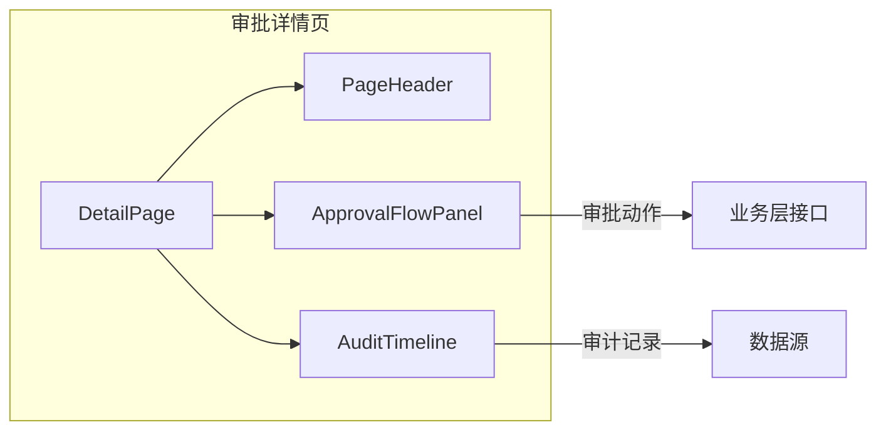
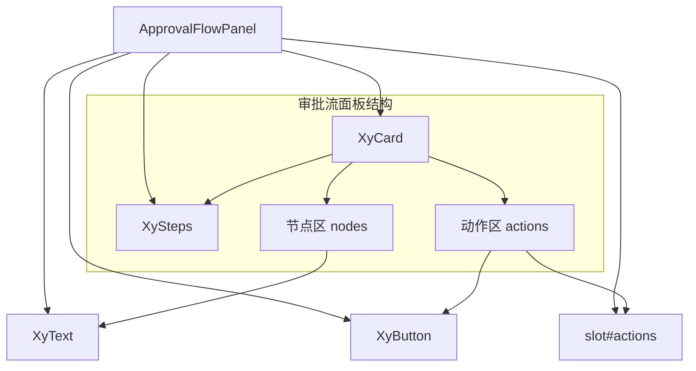
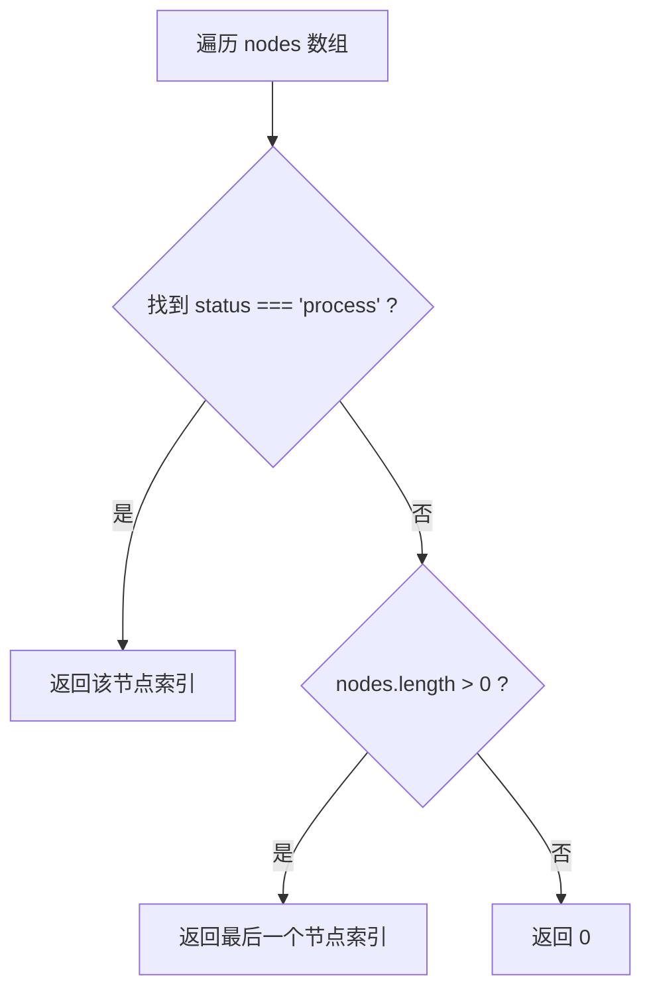

# 110 ApprovalFlowPanel 审批流面板

> 导读：ApprovalFlowPanel 是面向审批场景的可视化面板，将审批节点、当前状态与操作动作收拢为一块稳定交互区，让审批详情页不再手拼步骤条和节点信息。

## 设计哲学

### Pro 组件的工作流视角

Pro 组件的设计理念是"场景先行、组合收口"。对于审批流这种典型工作流场景，组件不试图覆盖流程编排引擎的全部能力，而是聚焦于"展示审批进度 + 触发审批动作"这个稳定契约。组件把步骤条、节点详情和操作区三层收进一个 `xy-card` 容器，页面层只需关心数据注入和动作响应。

这意味着 ApprovalFlowPanel 故意不做以下事情：

- 不内置审批接口调用，审批动作的执行由页面层响应 `action` 事件后处理。
- 不维护审批流状态机，节点的 `status` 变化由外部数据驱动。
- 不处理分支流程和会签逻辑，这些属于流程引擎的职责。

### 审批流的特殊性

审批流与普通步骤流的核心区别在于：

- **节点存在状态语义**：每个审批节点有独立的 `wait / process / finish / error / success` 状态，而非简单的"已过 / 未到"。`error` 表示审批驳回，`wait` 表示尚未到达，这两个状态是普通步骤流不具备的。
- **节点携带人和时间**：审批人（`assignee`）和审批时间（`time`）是审批流的核心信息，不是可选的辅助描述。一个审批节点如果不知道谁审批、何时审批，其信息价值就大打折扣。
- **动作与节点解耦**：操作按钮（通过、驳回等）属于流程动作，不属于某个节点，需要独立于节点列表存在。这是审批流与向导流的关键差异——向导的"下一步"绑定在当前步骤上，审批的"通过"绑定在整个流程上。

ApprovalFlowPanel 的设计正是围绕这三点展开：步骤条映射状态、节点区展示人与时间、动作区响应流程操作。

### 与 DetailPage 的配合

在典型审批详情页中，ApprovalFlowPanel 通常嵌入 `DetailPage` 或 `DetailPanel` 中，与 `AuditTimeline` 配合使用：



ApprovalFlowPanel 负责展示"当前审批走到哪一步"，AuditTimeline 负责展示"历史上每一步做了什么"。两者互补而非互斥。

## 源码架构

### 文件结构

```
approval-flow-panel/
├── index.ts                      # 导出入口，withInstall 注册
├── src/
│   ├── approval-flow-panel.ts    # 类型定义（Props / Node / Action）
│   └── approval-flow-panel.vue   # 组件实现
└── __tests__/
    └── approval-flow-panel.spec.ts
```

文件结构遵循 Pro 组件的标准范式：`.ts` 文件负责类型定义，`.vue` 文件负责渲染逻辑，`index.ts` 通过 `withInstall` 包装后导出。这种拆分方式让类型可以在不引入 Vue 运行时的情况下被独立引用。

### 组件关系图



组件基于四个基础组件构建：

- **XyCard**：提供面板容器和标题栏，`title` 直接透传给 `xy-card` 的 `header`。
- **XySteps**：渲染审批步骤条，`activeIndex()` 计算的激活索引和节点列表映射后传入。
- **XyText**：在节点区中渲染审批人和时间，利用 `type` 和 `size` 属性控制视觉层级。
- **XyButton**：在动作区中渲染操作按钮，`type` 属性来自 `ProPageAction` 协议。

### 核心 type 定义

组件的类型体系分三层：节点、动作和面板 Props。

```ts
interface ApprovalFlowNode {
  key: string                          // 节点唯一标识
  title: string                        // 节点标题
  status?: "wait" | "process" | "finish" | "error" | "success"
  assignee?: string                    // 审批人
  time?: string                        // 审批时间
  description?: string                 // 补充说明
}

type ApprovalFlowAction = ProPageAction // 复用全局动作类型

interface ApprovalFlowPanelProps {
  title?: string                       // 面板标题
  nodes: ApprovalFlowNode[]            // 审批节点列表
  actions?: ApprovalFlowAction[]       // 操作按钮组
}
```

`ApprovalFlowAction` 直接复用 `ProPageAction`，保持动作协议在 Pro 组件体系内一致。这意味着动作按钮天然支持 `type / plain / text / link / danger / disabled / loading / icon / visible` 全部配置项，无需为审批场景另起一套。

`ProPageAction` 的完整定义如下：

```ts
interface ProPageAction {
  key: string          // 动作唯一标识
  label: string        // 按钮文案
  type?: ButtonType    // 按钮类型（primary / success / warning / danger / info）
  plain?: boolean
  text?: boolean
  link?: boolean
  danger?: boolean
  disabled?: boolean
  loading?: boolean
  icon?: string
  visible?: boolean    // 控制按钮显隐，无需 v-if
}
```

## 核心实现

### 工作流状态定位

审批流面板的核心逻辑是确定当前激活步骤。组件通过 `activeIndex()` 函数从节点列表中找到第一个 `status === "process"` 的节点：

```ts
function activeIndex() {
  const index = props.nodes.findIndex((node) => node.status === "process");
  return index >= 0 ? index : Math.max(props.nodes.length - 1, 0);
}
```

这里的回退策略是：如果没有任何节点处于 `process` 状态（比如流程已结束或尚未开始），则激活最后一个节点。这保证了步骤条始终有明确的视觉焦点。



为什么不选择激活第一个 `wait` 状态节点作为回退？因为在"流程全部完成"的场景下，激活最后一个 `finish` 节点比激活下一个 `wait` 节点更符合视觉直觉——用户看到的是"流程走到最后一步并完成了"，而非"流程停在下一步等待中"。

### 步骤条与节点区的数据映射

组件将节点数据分别映射给步骤条和节点区：

```ts
// 步骤条：只取展示字段
props.nodes.map((node) => ({
  key: node.key,
  title: node.title,
  description: node.description,
  status: node.status
}))
```

步骤条接收 `key / title / description / status`，节点区接收完整的 `ApprovalFlowNode`。这种差异化的数据映射保证了步骤条只关心进度可视化，节点区才承载完整的审批信息。

### 节点区的交互设计

节点区用原生 `<button>` 渲染每个节点，而非纯文本。这是一个有意为之的设计选择：

- **可交互**：节点点击通过 `node-click` 事件暴露，页面层可以响应查看节点详情。
- **语义正确**：节点是可点击的交互元素，用 `<button>` 而非 `<div>` 更符合无障碍规范。
- **样式控制**：按钮原生支持 focus 和 hover 状态，无需额外手写交互样式。

```html
<button
  v-for="node in props.nodes"
  :key="node.key"
  type="button"
  class="xy-approval-flow-panel__node"
  @click="emit('node-click', node)"
>
  <strong>{{ node.title }}</strong>
  <xy-text v-if="node.assignee" type="default">{{ node.assignee }}</xy-text>
  <xy-text v-if="node.time" size="sm">{{ node.time }}</xy-text>
</button>
```

节点区的信息展示遵循视觉层级：标题用 `<strong>` 强调，审批人用 `XyText` 的默认样式，时间用 `size="sm"` 弱化。`assignee` 和 `time` 都是条件渲染，没有审批人（如等待节点）或没有审批时间（如进行中节点）时不会留白。

### 动作区的组合方式

动作区同时支持 Props 驱动和 Slot 驱动两种模式：

```html
<div v-if="props.actions.length > 0 || $slots.actions" class="xy-approval-flow-panel__actions">
  <slot name="actions">
    <xy-button
      v-for="action in props.actions"
      :key="action.key"
      :type="action.type"
      @click="emit('action', action)"
    >
      {{ action.label }}
    </xy-button>
  </slot>
</div>
```

- **Props 模式**：传入 `actions` 数组，组件自动渲染按钮组，点击触发 `action` 事件。适合"通过 / 驳回"这类简单的审批动作场景。
- **Slot 模式**：使用 `#actions` 插槽完全自定义动作区内容，适合需要更复杂布局（如确认弹窗、权限控制、审批意见输入）的场景。

两种模式互斥：Slot 存在时 Props 配置不生效，这是 Vue `<slot>` 的默认回退机制。

动作区的容器本身也是条件渲染的：`v-if="props.actions.length > 0 || $slots.actions"` 保证在没有动作内容时不会渲染空的容器元素。

### 典型使用模式

```vue
<xy-approval-flow-panel
  :nodes="approvalNodes"
  :actions="approvalActions"
  @action="handleApprovalAction"
  @node-click="handleNodeClick"
/>

<script setup lang="ts">
const approvalNodes = [
  { key: "submit", title: "提交申请", status: "finish", assignee: "张三", time: "2024-01-01 10:00" },
  { key: "review", title: "主管审批", status: "process", assignee: "李四" },
  { key: "finance", title: "财务审批", status: "wait" },
  { key: "complete", title: "流程结束", status: "wait" }
];

const approvalActions = [
  { key: "approve", label: "通过", type: "primary" },
  { key: "reject", label: "驳回", type: "danger" }
];

function handleApprovalAction(action) {
  if (action.key === "approve") {
    // 调用审批通过接口
  } else if (action.key === "reject") {
    // 调用审批驳回接口
  }
}

function handleNodeClick(node) {
  // 打开节点详情抽屉
}
</script>
```

## API 参考

### Props

| 属性 | 说明 | 类型 | 默认值 |
| --- | --- | --- | --- |
| `title` | 面板标题，传递给 `xy-card` 的 header | `string` | `'审批流程'` |
| `nodes` | 审批节点列表 | `ApprovalFlowNode[]` | `[]` |
| `actions` | 操作按钮组，复用 `ProPageAction` 协议 | `ApprovalFlowAction[]` | `[]` |

### ApprovalFlowNode

| 字段 | 说明 | 类型 | 默认值 |
| --- | --- | --- | --- |
| `key` | 节点唯一标识 | `string` | — |
| `title` | 节点标题 | `string` | — |
| `status` | 节点状态 | `'wait' \| 'process' \| 'finish' \| 'error' \| 'success'` | `undefined` |
| `assignee` | 审批人 | `string` | `undefined` |
| `time` | 审批时间 | `string` | `undefined` |
| `description` | 补充说明，透传给步骤条 description | `string` | `undefined` |

### ApprovalFlowAction

继承自 `ProPageAction`，完整字段如下：

| 字段 | 说明 | 类型 | 默认值 |
| --- | --- | --- | --- |
| `key` | 动作唯一标识 | `string` | — |
| `label` | 按钮文案 | `string` | — |
| `type` | 按钮类型 | `ButtonType` | `undefined` |
| `plain` | 是否朴素按钮 | `boolean` | `undefined` |
| `text` | 是否文本按钮 | `boolean` | `undefined` |
| `link` | 是否链接按钮 | `boolean` | `undefined` |
| `danger` | 是否危险按钮 | `boolean` | `undefined` |
| `disabled` | 是否禁用 | `boolean` | `undefined` |
| `loading` | 是否加载中 | `boolean` | `undefined` |
| `icon` | 图标类名 | `string` | `undefined` |
| `visible` | 是否可见 | `boolean` | `undefined` |

### Emits

| 事件名 | 说明 | 参数 |
| --- | --- | --- |
| `action` | 点击操作按钮时派发 | `(action: ApprovalFlowAction) => void` |
| `node-click` | 点击节点时派发 | `(node: { key: string }) => void` |

### Slots

| 插槽 | 说明 |
| --- | --- |
| `actions` | 自定义动作区内容，存在时覆盖 Props 中的 `actions` 渲染 |

### Exposes

当前版本不暴露内部方法或状态引用，面板完全通过 Props + Emits 驱动。

## 小结

1. **状态定位驱动步骤高亮**：`activeIndex()` 以 `process` 状态为锚点，回退到最后一个节点，保证步骤条始终有视觉焦点。
2. **节点可交互而非纯展示**：节点区使用 `<button>` 渲染，通过 `node-click` 事件暴露交互能力，兼顾无障碍语义。
3. **动作区双模式收口**：Props 驱动覆盖简单场景，Slot 驱动覆盖复杂场景，两者通过 Vue slot 回退机制自然互斥。
