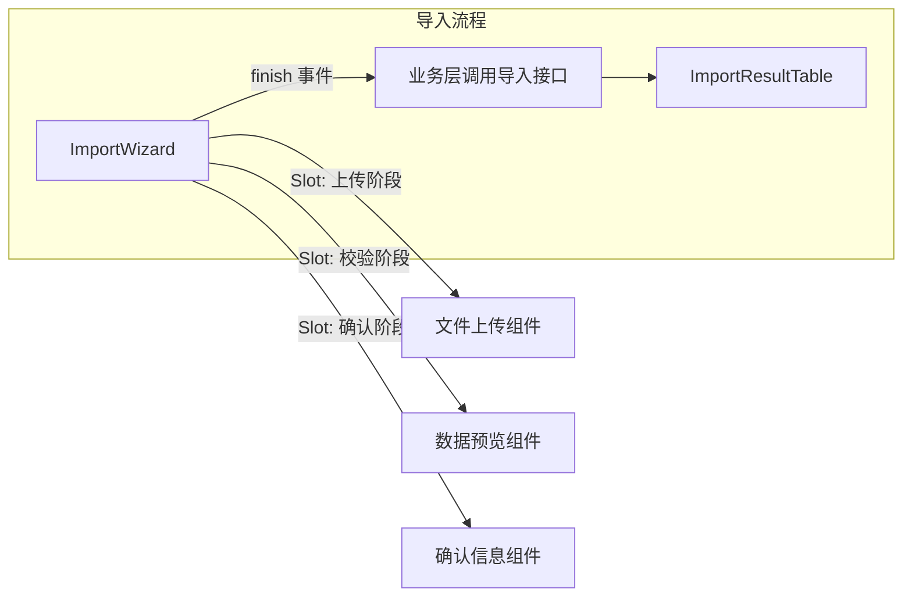
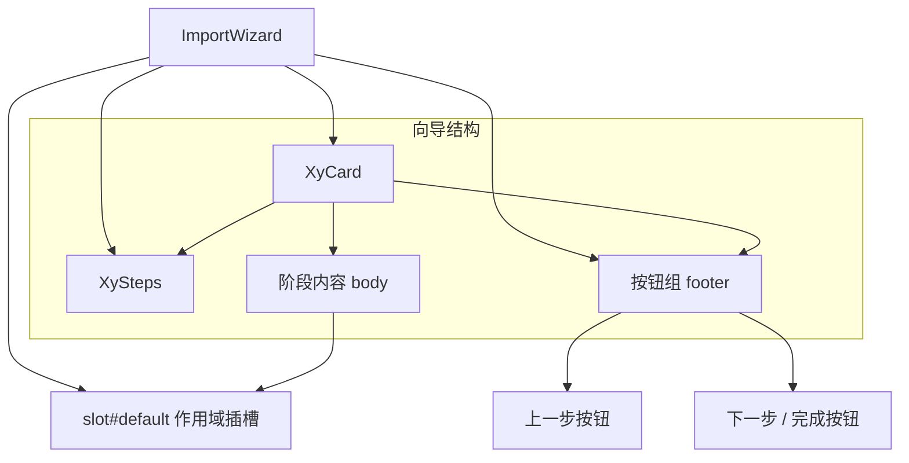
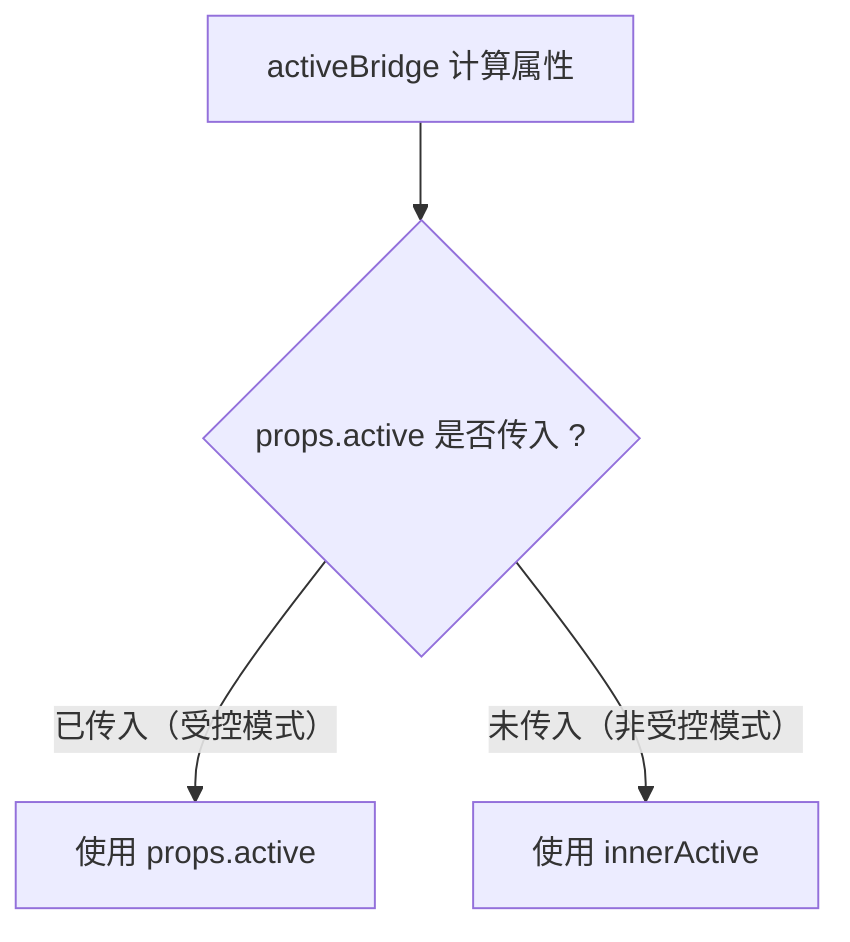

# 111 ImportWizard 导入向导

> 导读：ImportWizard 是面向多阶段导入流程的向导容器，将步骤导航、阶段内容与前后翻页动作收拢为一个稳定闭环，让"上传 -> 校验 -> 确认"这类导入链路不再手拼步骤条和按钮组。

## 设计哲学

### Pro 组件的向导模式

Pro 组件的设计理念是"场景先行、组合收口"。对于导入向导这种多步骤交互场景，组件不试图内置文件上传、数据解析等业务逻辑，而是聚焦于"步骤导航 + 阶段内容承接 + 翻页动作控制"这个稳定容器契约。业务层通过 Slot 注入每个阶段的具体内容，组件负责步骤流转和按钮状态。

这意味着 ImportWizard 故意不做以下事情：

- 不内置文件上传组件，上传逻辑由页面层通过 Slot 注入。
- 不内置数据校验和解析，校验结果由页面层决定是否允许进入下一步。
- 不维护导入状态（成功 / 失败 / 部分失败），这些属于业务层状态管理。

### 多步骤交互的特殊性

导入向导与普通步骤展示的核心区别在于：

- **步骤是可回退的**：用户可以在"下一步"和"上一步"之间自由切换，而非单向推进。这要求组件同时支持前进和后退两种流转方向。
- **步骤状态需要受控与非受控两种模式**：简单场景用内部状态驱动，复杂场景（如校验未通过时不允许进入下一步）需要外部控制当前步骤。
- **最后一步是完成而非下一步**：步骤到达终点时，按钮语义从"下一步"切换为"完成"，触发的是 `finish` 事件而非 `next` 事件。

ImportWizard 的设计正是围绕这三点展开：双模式步骤状态、三事件流转协议、条件渲染按钮语义。

### 与 ImportResultTable 的配合

在完整导入流程中，ImportWizard 负责引导用户走完"上传 -> 校验 -> 确认"的步骤，ImportResultTable 负责展示导入结果：



两个组件是松耦合的：ImportWizard 的 `finish` 事件触发导入操作，导入完成后页面层切换到 ImportResultTable 展示结果。它们不依赖彼此的存在。

## 源码架构

### 文件结构

```
import-wizard/
├── index.ts                    # 导出入口，withInstall 注册
├── src/
│   ├── import-wizard.ts        # 类型定义（Props / Step）
│   └── import-wizard.vue       # 组件实现
└── __tests__/
    └── import-wizard.spec.ts
```

文件结构遵循 Pro 组件的标准范式：`.ts` 文件负责类型定义，`.vue` 文件负责渲染逻辑，`index.ts` 通过 `withInstall` 包装后导出。`ImportWizardStep` 只保留步骤条需要的展示信息，步骤内容完全通过 Slot 注入，保持容器与内容的解耦。

### 组件关系图



组件基于两个基础组件构建：

- **XyCard**：提供向导容器和标题栏，`title` 直接透传给 `xy-card` 的 `header`。
- **XySteps**：渲染步骤导航条，`activeBridge` 计算的激活索引和步骤列表映射后传入。

按钮组由 `XyButton` 直接渲染，不依赖额外的按钮组组件，保持 footer 布局的灵活性。

### 核心 type 定义

```ts
interface ImportWizardStep {
  key: string          // 步骤唯一标识
  title: string        // 步骤标题
  description?: string // 步骤描述，透传给步骤条
}

interface ImportWizardProps {
  title?: string              // 向导标题
  steps: ImportWizardStep[]   // 步骤列表
  active?: number             // 受控模式：当前步骤索引
  defaultActive?: number      // 非受控模式：初始步骤索引
}
```

`ImportWizardStep` 的字段设计遵循"最小可用"原则：只保留步骤条需要的展示信息。步骤内容完全通过 Slot 注入，保持容器与内容的解耦。`key` 字段为步骤提供稳定的标识，避免用索引作为 key 在步骤动态增减时产生问题。

## 核心实现

### 双模式步骤状态

组件通过 `active` + `innerActive` + `activeBridge` 三层实现受控与非受控两种模式：

```ts
const innerActive = ref(props.defaultActive);
const activeBridge = computed(() => props.active ?? innerActive.value);
const currentStep = computed(() => props.steps[activeBridge.value]);
```



- **非受控模式**（`active` 未传入）：`activeBridge` 读取 `innerActive`，组件内部管理步骤切换。适用于简单的线性向导，无需外部干预步骤流转。
- **受控模式**（`active` 已传入）：`activeBridge` 读取 `props.active`，步骤切换由外部驱动。适用于需要校验拦截、异步确认等复杂场景。

两种模式都通过 `updateActive` 函数统一处理状态更新：

```ts
function updateActive(value: number) {
  if (props.active === undefined) {
    innerActive.value = value;
  }
  emit("update:active", value);
}
```

无论哪种模式，`update:active` 事件始终派发，保证外部始终能感知步骤变化。这是 Vue 受控组件的标准实践，也使得 `v-model:active` 可以直接绑定。

### 三事件流转协议

步骤切换通过三个独立事件暴露，而非一个泛化的 `change` 事件：

```ts
const emit = defineEmits<{
  "update:active": [value: number];
  next: [value: number];
  prev: [value: number];
  finish: [];
}>();
```

| 事件 | 触发时机 | 参数 |
| --- | --- | --- |
| `update:active` | 步骤索引变化时 | 新索引 |
| `next` | 点击"下一步"时 | 新索引 |
| `prev` | 点击"上一步"时 | 新索引 |
| `finish` | 点击"完成"时 | — |

`next` 和 `prev` 的参数是变化后的索引值，而非变化量。这样页面层可以直接用这个值更新状态，无需再做加减运算。

`finish` 事件不携带参数，因为流程已结束，步骤索引不再有意义。页面层在 `finish` 回调中应该执行导入操作，而非更新步骤状态。

### 条件渲染按钮语义

Footer 区域的按钮根据当前步骤位置动态切换：

```html
<xy-button
  :disabled="activeBridge === 0"
  @click="() => { updateActive(activeBridge - 1); emit('prev', activeBridge - 1); }"
>
  上一步
</xy-button>
<xy-button
  v-if="activeBridge < props.steps.length - 1"
  type="primary"
  @click="() => { const nextIndex = activeBridge + 1; updateActive(nextIndex); emit('next', nextIndex); }"
>
  下一步
</xy-button>
<xy-button v-else type="primary" @click="emit('finish')">
  完成
</xy-button>
```

```mermaid
stateDiagram-v2
    [*] --> 第一步
    第一步 --> 中间步骤 : 下一步
    中间步骤 --> 第一步 : 上一步
    中间步骤 --> 中间步骤 : 下一步 / 上一步
    中间步骤 --> 最后一步 : 下一步
    最后一步 --> 中间步骤 : 上一步
    最后一步 --> [*] : 完成

    state 第一步 {
        note right of 第一步: 上一步按钮 disabled
    }
    state 最后一步 {
        note right of 最后一步: 按钮文案切换为"完成"
    }
```

三个关键行为：

1. **"上一步"在第一步时禁用**：通过 `:disabled="activeBridge === 0"` 控制，而非隐藏按钮，保持布局稳定。
2. **"下一步"与"完成"互斥渲染**：通过 `v-if / v-else` 切换，最后一步只显示"完成"按钮。
3. **"完成"不触发步骤更新**：`finish` 事件不携带索引，因为流程已结束，步骤索引不再有意义。

### 作用域插槽传递当前步骤

默认插槽通过作用域暴露当前步骤对象和索引，让阶段内容可以根据步骤信息动态渲染：

```html
<div class="xy-import-wizard__body">
  <slot :step="currentStep" :active="activeBridge" />
</div>
```

页面层可以这样使用：

```vue
<xy-import-wizard :steps="steps">
  <template #default="{ step, active }">
    <upload-stage v-if="active === 0" />
    <validate-stage v-if="active === 1" />
    <confirm-stage v-if="active === 2" />
  </template>
</xy-import-wizard>
```

作用域参数提供了两种访问方式：

- `step`：当前步骤的完整对象，包含 `key / title / description`，适合根据步骤属性渲染标题等。
- `active`：当前步骤索引，适合根据索引条件渲染不同阶段内容。

### 典型使用模式

非受控模式（简单场景）：

```vue
<xy-import-wizard
  :steps="[
    { key: 'upload', title: '上传文件' },
    { key: 'validate', title: '数据校验' },
    { key: 'confirm', title: '确认导入' }
  ]"
  @finish="handleImport"
>
  <template #default="{ active }">
    <upload-stage v-if="active === 0" />
    <validate-stage v-if="active === 1" />
    <confirm-stage v-if="active === 2" />
  </template>
</xy-import-wizard>
```

受控模式（校验拦截场景）：

```vue
<xy-import-wizard
  v-model:active="currentStep"
  :steps="steps"
  @next="handleNext"
  @finish="handleImport"
>
  <template #default="{ active }">
    <upload-stage v-if="active === 0" />
    <validate-stage v-if="active === 1" />
    <confirm-stage v-if="active === 2" />
  </template>
</xy-import-wizard>

<script setup lang="ts">
const currentStep = ref(0);

function handleNext(index: number) {
  // 校验未通过时阻止步骤前进
  if (index === 1 && !validateResult.value) {
    currentStep.value = 0;
  }
}
</script>
```

## API 参考

### Props

| 属性 | 说明 | 类型 | 默认值 |
| --- | --- | --- | --- |
| `title` | 向导标题，传递给 `xy-card` 的 header | `string` | `'导入向导'` |
| `steps` | 步骤列表 | `ImportWizardStep[]` | `[]` |
| `active` | 受控模式：当前步骤索引，支持 `v-model:active` | `number` | `undefined` |
| `default-active` | 非受控模式：初始步骤索引 | `number` | `0` |

### ImportWizardStep

| 字段 | 说明 | 类型 | 默认值 |
| --- | --- | --- | --- |
| `key` | 步骤唯一标识 | `string` | — |
| `title` | 步骤标题 | `string` | — |
| `description` | 步骤描述，透传给步骤条 | `string` | `undefined` |

### Emits

| 事件名 | 说明 | 参数 |
| --- | --- | --- |
| `update:active` | 步骤索引变化时派发，支持 `v-model:active` | `(value: number) => void` |
| `next` | 点击"下一步"时派发 | `(value: number) => void` |
| `prev` | 点击"上一步"时派发 | `(value: number) => void` |
| `finish` | 点击"完成"时派发 | `() => void` |

### Slots

| 插槽 | 说明 | 作用域参数 |
| --- | --- | --- |
| `default` | 阶段内容区 | `{ step: ImportWizardStep, active: number }` |

### Exposes

当前版本不暴露内部方法或状态引用。步骤控制完全通过 Props + Emits 驱动，受控模式通过 `v-model:active` 实现。

## 小结

1. **双模式步骤状态**：`activeBridge` 计算属性统一受控与非受控两种模式，`updateActive` 保证两种模式下 `update:active` 事件始终派发。
2. **三事件流转协议**：`next / prev / finish` 三个独立事件替代泛化的 `change`，让页面层可以精确响应不同流转方向。
3. **条件渲染按钮语义**：第一步禁用"上一步"、最后一步切换为"完成"，通过 `v-if / v-else` 保证按钮语义与步骤位置始终一致。
