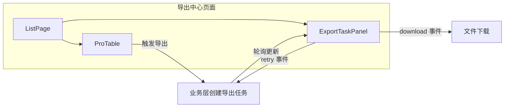
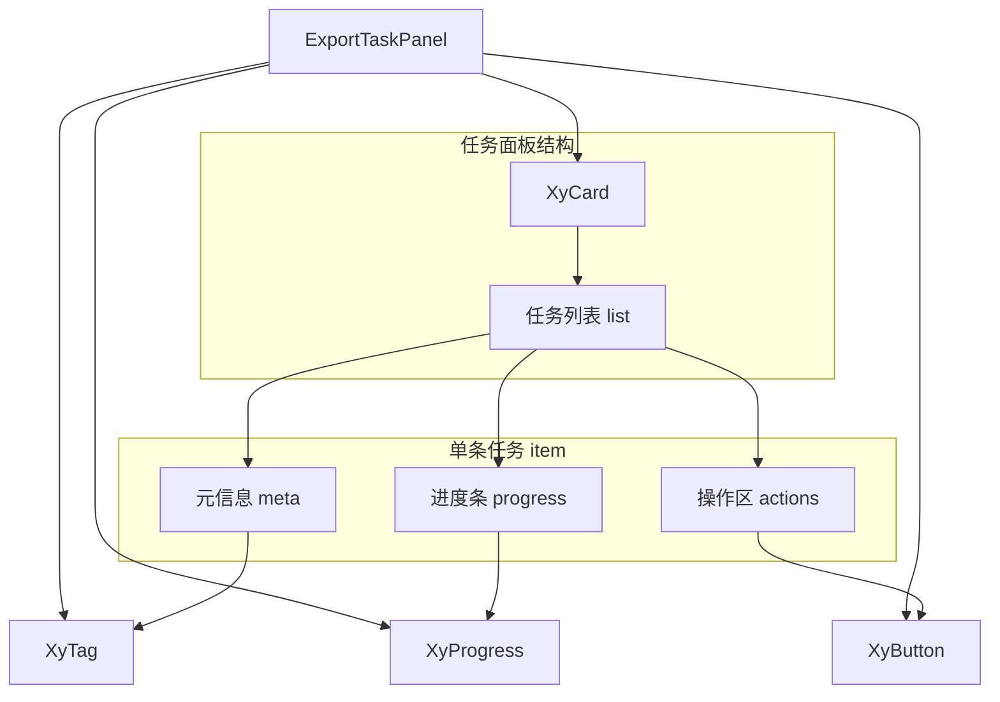
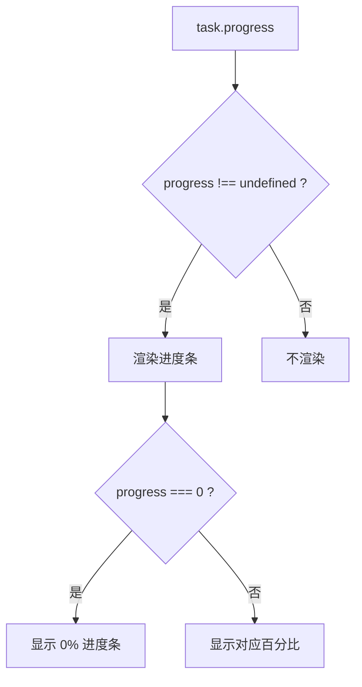

# 112 ExportTaskPanel 导出任务面板

> 导读：ExportTaskPanel 是面向后台导出场景的任务状态面板，将导出任务的排队、处理、成功和失败四种状态收拢为统一列表，让导出中心和任务工作台不再手拼任务卡片和进度条。

## 设计哲学

### Pro 组件的任务面板视角

Pro 组件的设计理念是"场景先行、组合收口"。对于导出任务这种后台异步场景，组件不试图覆盖任务调度、轮询通知和下载鉴权等基础设施，而是聚焦于"任务状态展示 + 操作入口响应"这个稳定契约。组件把任务列表、进度条和操作按钮三层收进一个 `xy-card` 容器，页面层只需关心任务数据注入和操作响应。

这意味着 ExportTaskPanel 故意不做以下事情：

- 不内置轮询逻辑，任务状态的更新由页面层通过定时器或 WebSocket 驱动，组件只负责渲染最新数据。
- 不处理下载鉴权，下载按钮的 `download` 事件只传递任务对象，页面层根据 `task.url` 决定如何下载。
- 不维护任务生命周期，任务的创建、轮询和清理由业务层管理，组件是纯展示 + 操作入口。

### 导出任务的状态特殊性

导出任务与普通列表数据的核心区别在于：

- **状态是异步流转的**：每个任务有 `waiting -> processing -> success / error` 的完整生命周期，而非静态数据。组件需要为每种状态提供不同的视觉反馈和操作入口。
- **操作与状态强绑定**：成功任务显示"下载"，失败任务显示"重试"，所有任务都有"移除"。按钮的显隐完全由状态决定，而非由页面层通过 `v-if` 控制。
- **进度是可选的**：`progress` 字段可选，意味着有些任务（如等待中）没有进度条，有些任务（如处理中）需要展示进度。组件需要正确处理进度字段的缺失。

ExportTaskPanel 的设计正是围绕这三点展开：状态到标签的映射、条件渲染操作按钮、可选进度条。

### 与 ListPage 的配合

在典型导出中心页面中，ExportTaskPanel 通常嵌入 `ListPage` 的侧边栏或作为独立页面使用：



ProTable 的工具栏提供"导出"按钮触发任务创建，ExportTaskPanel 展示任务进度和结果。两者通过业务层的任务数据关联，组件之间没有直接依赖。

## 源码架构

### 文件结构

```
export-task-panel/
├── index.ts                      # 导出入口，withInstall 注册
├── src/
│   ├── export-task-panel.ts      # 类型定义（Props / TaskItem）
│   └── export-task-panel.vue     # 组件实现
└── __tests__/
    └── export-task-panel.spec.ts
```

文件结构遵循 Pro 组件的标准范式：`.ts` 文件负责类型定义，`.vue` 文件负责渲染逻辑，`index.ts` 通过 `withInstall` 包装后导出。`ExportTaskItem` 的字段设计遵循"最小可用"原则，所有可选字段都用 `?` 标注，让简单场景不必构造完整对象。

### 组件关系图



组件基于三个基础组件构建：

- **XyCard**：提供面板容器和标题栏，`title` 直接透传给 `xy-card` 的 `header`。
- **XyTag**：渲染任务状态标签，`status` 属性由 `resolveStatus` 映射得到。
- **XyProgress**：渲染任务进度条，`percentage` 来自 `task.progress`，`stroke-width` 固定为 8。
- **XyButton**：渲染操作按钮，使用 `text` 属性保持紧凑布局。

### 核心 type 定义

```ts
interface ExportTaskItem {
  id: string | number              // 任务唯一标识
  name: string                     // 任务名称
  status: "waiting" | "processing" | "success" | "error"
  progress?: number                // 进度百分比 0-100
  createdAt?: string               // 创建时间
  url?: string                     // 下载地址（成功后可用）
}

interface ExportTaskPanelProps {
  title?: string                   // 面板标题
  tasks: ExportTaskItem[]          // 任务列表
}
```

`id` 支持 `string | number` 两种类型，兼容不同后端的 ID 生成策略。`url` 字段只在任务成功后由业务层填充，组件不关心 URL 的生成逻辑，只通过 `download` 事件将完整任务对象传递给页面层。

## 核心实现

### 状态到标签的映射

组件通过 `resolveStatus` 函数将任务状态映射为标签颜色：

```ts
function resolveStatus(status: ExportTaskItem["status"]) {
  if (status === "success") return "success";
  if (status === "error") return "danger";
  if (status === "processing") return "primary";
  return "warning"; // waiting
}
```

映射关系：

| 任务状态 | 标签颜色 | 视觉含义 |
| --- | --- | --- |
| `waiting` | `warning` | 等待中，黄色提示 |
| `processing` | `primary` | 处理中，蓝色进行态 |
| `success` | `success` | 已完成，绿色成功态 |
| `error` | `danger` | 已失败，红色错误态 |

```mermaid
stateDiagram-v2
    [*] --> waiting
    waiting --> processing : 开始处理
    processing --> success : 导出完成
    processing --> error : 导出失败
    error --> processing : 重新导出

    state waiting {
        note right of waiting: 标签颜色 warning
    }
    state processing {
        note right of processing: 标签颜色 primary
    }
    state success {
        note right of success: 标签颜色 success\n显示下载按钮
    }
    state error {
        note right of error: 标签颜色 danger\n显示重试按钮
    }
```

这个映射是单向的：任务状态 -> 标签颜色。组件不持有状态机，状态的流转由业务层驱动，组件只负责根据当前状态渲染对应的视觉反馈。

### 条件渲染操作按钮

操作区的三个按钮通过 `v-if` 与任务状态绑定：

```html
<div class="xy-export-task-panel__actions">
  <xy-button v-if="task.status === 'success'" text @click="emit('download', task)">
    下载
  </xy-button>
  <xy-button v-if="task.status === 'error'" text @click="emit('retry', task)">
    重试
  </xy-button>
  <xy-button text @click="emit('remove', task)">移除</xy-button>
</div>
```

按钮与状态的对应关系：

| 状态 | 下载 | 重试 | 移除 |
| --- | --- | --- | --- |
| `waiting` | - | - | 显示 |
| `processing` | - | - | 显示 |
| `success` | 显示 | - | 显示 |
| `error` | - | 显示 | 显示 |

"移除"按钮在所有状态下都显示，因为无论任务处于什么状态，用户都应该能清理它。"下载"和"重试"是状态独占的：只有成功的任务可以下载，只有失败的任务可以重试。

所有操作按钮都使用 `text` 属性渲染为文本按钮，保持任务列表的紧凑布局。在任务面板中，操作按钮不应该占据过多空间，文本按钮是最合适的选择。

### 可选进度条

进度条的渲染由 `task.progress !== undefined` 控制：

```html
<xy-progress
  v-if="task.progress !== undefined"
  :percentage="task.progress"
  :stroke-width="8"
/>
```

这里用 `!== undefined` 而非简单的 truthy 判断，是因为 `progress` 为 `0` 时仍然需要显示进度条（表示任务刚启动，进度为零）。如果用 `v-if="task.progress"`，进度为零时进度条会消失，这是不正确的。



`stroke-width` 固定为 `8`，在任务列表的紧凑布局中保持视觉一致性。这个值比默认进度条更细，适合在列表项中使用。

### 事件与任务数据的绑定

三个事件都以完整的 `ExportTaskItem` 对象作为参数：

```ts
const emit = defineEmits<{
  download: [task: ExportTaskItem];
  retry: [task: ExportTaskItem];
  remove: [task: ExportTaskItem];
}>();
```

传递完整任务对象而非 `id` 的好处是：页面层在事件回调中可以直接访问 `task.url`（下载地址）、`task.name`（任务名称）等信息，无需再根据 id 去查找。这对于导出下载场景尤其重要，因为 `url` 字段通常只在任务成功后才存在。

### 任务项的渲染结构

每条任务项的渲染结构如下：

```html
<div class="xy-export-task-panel__item">
  <!-- 元信息：任务名称 + 状态标签 + 创建时间 -->
  <div class="xy-export-task-panel__meta">
    <strong>{{ task.name }}</strong>
    <xy-tag size="sm" :status="resolveStatus(task.status)">{{ task.status }}</xy-tag>
    <span v-if="task.createdAt" class="xy-export-task-panel__time">{{ task.createdAt }}</span>
  </div>
  <!-- 进度条（可选） -->
  <xy-progress v-if="task.progress !== undefined" :percentage="task.progress" :stroke-width="8" />
  <!-- 操作区 -->
  <div class="xy-export-task-panel__actions">
    <!-- 条件渲染的按钮 -->
  </div>
</div>
```

元信息区的视觉层级：任务名称用 `<strong>` 强调，状态标签用 `size="sm"` 保持紧凑，创建时间用 `<span>` 弱化。三者水平排列，信息密度高但不拥挤。

### 典型使用模式

```vue
<xy-export-task-panel
  :tasks="exportTasks"
  @download="handleDownload"
  @retry="handleRetry"
  @remove="handleRemove"
/>

<script setup lang="ts">
const exportTasks = ref([
  { id: 1, name: "成员列表导出", status: "success", progress: 100, url: "/download/1", createdAt: "2024-01-01 10:00" },
  { id: 2, name: "订单数据导出", status: "processing", progress: 65, createdAt: "2024-01-01 10:05" },
  { id: 3, name: "报表导出", status: "error", createdAt: "2024-01-01 09:50" },
  { id: 4, name: "日志导出", status: "waiting", createdAt: "2024-01-01 10:10" }
]);

function handleDownload(task) {
  window.open(task.url);
}

function handleRetry(task) {
  // 重新触发导出
}

function handleRemove(task) {
  exportTasks.value = exportTasks.value.filter(t => t.id !== task.id);
}
</script>
```

## API 参考

### Props

| 属性 | 说明 | 类型 | 默认值 |
| --- | --- | --- | --- |
| `title` | 面板标题，传递给 `xy-card` 的 header | `string` | `'导出任务'` |
| `tasks` | 导出任务列表 | `ExportTaskItem[]` | `[]` |

### ExportTaskItem

| 字段 | 说明 | 类型 | 默认值 |
| --- | --- | --- | --- |
| `id` | 任务唯一标识 | `string \| number` | — |
| `name` | 任务名称 | `string` | — |
| `status` | 任务状态 | `'waiting' \| 'processing' \| 'success' \| 'error'` | — |
| `progress` | 进度百分比 0-100 | `number` | `undefined` |
| `createdAt` | 创建时间 | `string` | `undefined` |
| `url` | 下载地址，成功后由业务层填充 | `string` | `undefined` |

### 状态映射规则

| 任务 `status` | XyTag `status` | 显示文案 |
| --- | --- | --- |
| `waiting` | `warning` | waiting |
| `processing` | `primary` | processing |
| `success` | `success` | success |
| `error` | `danger` | error |

### Emits

| 事件名 | 说明 | 参数 |
| --- | --- | --- |
| `download` | 点击"下载"按钮时派发 | `(task: ExportTaskItem) => void` |
| `retry` | 点击"重试"按钮时派发 | `(task: ExportTaskItem) => void` |
| `remove` | 点击"移除"按钮时派发 | `(task: ExportTaskItem) => void` |

### Slots

当前版本不提供自定义插槽。任务项的渲染逻辑完全由组件内部控制，保证状态与操作按钮的绑定关系不被破坏。如果需要自定义任务项布局，建议在页面层自行组合基础组件。

### Exposes

当前版本不暴露内部方法或状态引用。面板完全通过 Props + Emits 驱动。

## 小结

1. **状态到标签的单向映射**：`resolveStatus` 将四种任务状态映射为四种标签颜色，组件不持有状态机，状态的流转由业务层驱动。
2. **条件渲染操作按钮**：下载、重试与任务状态强绑定，移除按钮全局可见，保证用户始终能清理任务。
3. **可选进度条的精确判断**：`progress !== undefined` 保证了进度为零时进度条仍然显示，避免 truthy 判断导致 `0%` 进度消失的问题。
