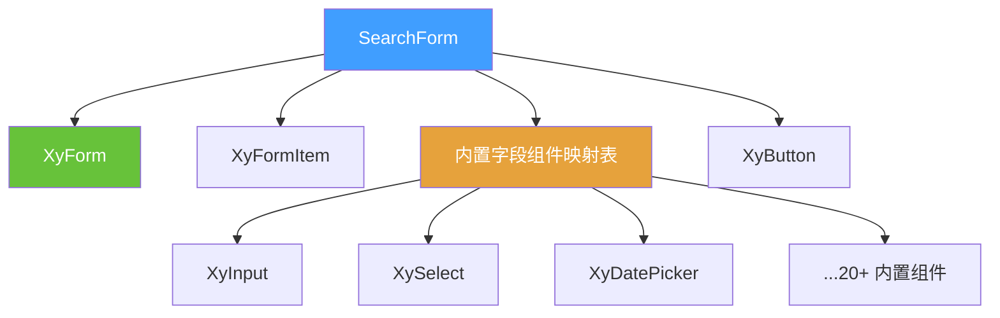
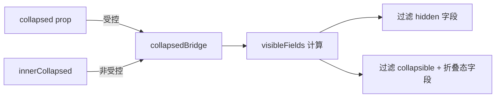

# 82 SearchForm 搜索表单

> 导读：把中后台列表页里反复出现的"筛选字段 + 查询 + 重置 + 折叠更多"收成一块稳定的配置驱动区域。

## 设计哲学

### Pro 组件与基础组件的区别

基础组件（`xy-form`、`xy-select` 等）遵循声明式范式：开发者手动排列 `<xy-form-item>`、绑定 `v-model`、编排布局。SearchForm 则采用**配置驱动**范式：只需传入 `fields` 数组与 `model` 对象，组件即可自动完成字段映射、栅格布局、占位符生成和动作区渲染。

核心差异一览：

| 维度 | 基础组件 | Pro 组件 |
| --- | --- | --- |
| 编排方式 | 手动声明模板 | schema 数组驱动 |
| 布局 | 手写 CSS / 行内样式 | 内置 CSS Grid 栅格 |
| 占位符 | 每个字段手动写 | 自动推导（请输入/请选择 + label） |
| 折叠 | 需自行实现 | `collapsible` + `collapsed` 收口 |
| 动作区 | 手动放置按钮 | 内置查询/重置/展开收起 |

### ProFieldSchema 的核心理念

SearchForm 的 `SearchFormField` 是 `ProFieldSchema` 在搜索场景的特化版本。它保留了 schema 的核心字段（`prop`、`label`、`component`、`hidden`、`disabled`），同时增加了搜索场景独有的 `collapsible` 属性。二者共享同一套字段解析机制——`resolveProFieldComponent`、`resolveProFieldPlaceholder`、`resolveProFieldProps`——确保行为一致性。

### 与同类 Pro 组件库的差异化

- **不侵入请求层**：SearchForm 只负责收集筛选参数并派发 `search` 事件，不内置 `request`。数据请求交由 `ProTable` 或页面层编排。
- **字段折叠作为一等公民**：`collapsible` + `collapsed` 形成完整的受控/非受控折叠协议，而非简单的显隐切换。
- **Enter 提交**：内置 `input` 字段回车自动触发 `search`，无需额外绑定。

## 源码架构

### 文件结构

```
search-form/
├── index.ts                  # withInstall 导出
├── src/
│   ├── search-form.ts        # SearchFormField / SearchFormProps / SearchFormInstance 类型定义
│   └── search-form.vue       # 组件实现
└── __tests__/
    ├── search-form.spec.ts
    └── search-form-builtins.spec.ts
```

### 组件关系图



### 核心 type 定义

**SearchFormField**——搜索场景的字段 schema：

```ts
interface SearchFormField {
  prop: string;                                       // 字段键名
  label: string;                                      // 字段标签
  component?: SearchFormFieldBuiltinComponent | Component;  // 内置类型或自定义组件
  componentProps?: Record<string, unknown>;            // 透传给字段组件
  options?: SearchFormFieldOption[];                   // select 等选项列表
  slot?: string;                                      // 自定义插槽名
  span?: number;                                      // 跨列数
  hidden?: boolean | ((model: Record<string, unknown>) => boolean);
  disabled?: boolean | ((model: Record<string, unknown>) => boolean);
  collapsible?: boolean;                              // 折叠时是否收起
  rules?: XyFormRule[];                               // 字段级校验规则
  required?: boolean;
  help?: string;
  placeholder?: string;
}
```

**SearchFormProps** 与 **SearchFormInstance**：

```ts
interface SearchFormProps {
  model: Record<string, unknown>;
  fields: SearchFormField[];
  columns?: number;              // 栅格列数，默认 3
  collapsed?: boolean;           // 受控折叠
  defaultCollapsed?: boolean;    // 非受控初始折叠态，默认 true
  submitOnReset?: boolean;       // 重置后是否再次 search，默认 true
  validateOnSearch?: boolean;    // 查询前是否校验，默认 false
  // ...label/size/按钮文案等
}

interface SearchFormInstance {
  validate: () => Promise<boolean>;
  submit: () => Promise<boolean>;
  reset: () => void;
  resetFields: () => void;
  clearValidate: () => void;
  toggleCollapse: (force?: boolean) => void;
}
```

## 核心实现

### schema 如何映射到基础组件

SearchForm 内部维护了一张 `builtInComponentMap`，将字符串标识映射到 `@xiaoye/components` 中的真实组件：

```ts
const builtInComponentMap: Record<string, Component> = {
  input: XyInput,
  select: XySelect,
  'date-picker': XyDatePicker,
  'checkbox-group': XyCheckboxGroup,
  // ...共 21 个内置映射
};
```

渲染时通过 `resolveFieldComponent(field)` 解析：若 `component` 为字符串则查表，若为 Component 则直接使用，否则降级到 `XyInput`。

字段属性通过 `resolveFieldRenderProps(field)` 一站式合并：

1. `resolveFieldProps` —— 合并 `componentProps`、自动推导 `placeholder`、注入 `options`
2. `resolveFieldDisabled` —— 支持函数式联动
3. `resolveFieldBindings` —— 绑定 `modelValue` + `onUpdate:modelValue`
4. `createFieldKeydownHandler` —— input 组件 Enter 键提交

### 折叠机制

折叠采用**双轨受控协议**：



- 若 `props.collapsed` 为 `boolean`，则完全受控，组件只派发事件不修改内部状态。
- 若 `props.collapsed` 为 `undefined`，则组件内部 `innerCollapsed` 自管理。

### Enter 提交

所有 input 类字段内置 `@keyup.enter` 处理器，回车自动触发 `submit()`。这覆盖了中后台搜索场景中最常见的交互模式——输入筛选条件后直接回车查询，无需移动鼠标点击按钮。

Enter 提交通过 `createFieldKeydownHandler` 工具函数实现，该函数判断 `event.key === 'Enter'` 后调用 `submit()`，并阻止默认行为避免表单重复提交。

### 占位符自动推导

SearchForm 为每个字段自动推导占位符，规则如下：

1. 若 `field.placeholder` 显式指定，使用指定值。
2. 若 `field.component` 为 `input` / `textarea` 等输入类组件，推导为 `'请输入' + field.label`。
3. 若 `field.component` 为 `select` / `date-picker` 等选择类组件，推导为 `'请选择' + field.label`。

推导逻辑收敛在 `resolveProFieldPlaceholder` 函数中，与 ProForm 共享同一套规则。

### 与 ProTable 联动

SearchForm 不内置 `request`，而是通过 `search` 事件将筛选快照派发给外层：

```vue
<xy-pro-table :columns="columns" :request="fetchData">
  <template #search="{ model }">
    <xy-search-form :model="model" :fields="searchFields" @search="handleSearch" />
  </template>
</xy-pro-table>
```

在 `CrudPage` 中，SearchForm 作为搜索区被自动编排，无需手动对接。

## API 参考

### Props

| 属性 | 说明 | 类型 | 默认值 |
| --- | --- | --- | --- |
| `model` | 表单数据对象 | `Record<string, unknown>` | — |
| `fields` | 字段 schema 数组 | `SearchFormField[]` | `[]` |
| `rules` | 表单校验规则 | `FormRules` | `{}` |
| `label-width` | 标签宽度 | `string \| number` | `'96px'` |
| `label-position` | 标签位置 | `'left' \| 'top'` | `'left'` |
| `size` | 组件尺寸 | `ComponentSize` | `'md'` |
| `columns` | 栅格列数 | `number` | `3` |
| `collapsed` | 是否折叠（受控） | `boolean` | `undefined` |
| `default-collapsed` | 默认是否折叠（非受控） | `boolean` | `true` |
| `submit-text` | 查询按钮文案 | `string` | `'查询'` |
| `reset-text` | 重置按钮文案 | `string` | `'重置'` |
| `expand-text` | 展开按钮文案 | `string` | `'展开更多'` |
| `collapse-text` | 收起按钮文案 | `string` | `'收起筛选'` |
| `show-submit` | 是否显示查询按钮 | `boolean` | `true` |
| `show-reset` | 是否显示重置按钮 | `boolean` | `true` |
| `submit-on-reset` | 重置后是否再次派发 search | `boolean` | `true` |
| `validate-on-search` | 查询前是否校验 | `boolean` | `false` |

### Emits

| 事件 | 说明 | 参数 |
| --- | --- | --- |
| `search` | 点击查询或 Enter 触发 | `(modelSnapshot: Record<string, unknown>)` |
| `reset` | 点击重置后派发 | `(modelSnapshot: Record<string, unknown>)` |
| `update:collapsed` | 折叠状态变化（v-model） | `(value: boolean)` |
| `collapse-change` | 折叠状态变化 | `(value: boolean)` |

### Slots

| 插槽 | 说明 | 作用域参数 |
| --- | --- | --- |
| `meta` | 动作区左侧元信息 | `{ collapsed, hiddenCount }` |
| `actions` | 自定义动作区 | `{ collapsed, toggleCollapse, reset, submit }` |
| `[field.slot / field.prop]` | 自定义字段内容 | `{ field, model, value, update }` |

### Exposes

| 方法 | 说明 | 返回值 |
| --- | --- | --- |
| `validate()` | 校验表单 | `Promise<boolean>` |
| `submit()` | 触发查询 | `Promise<boolean>` |
| `reset()` | 重置字段并派发事件 | `void` |
| `resetFields()` | 仅重置字段值 | `void` |
| `clearValidate()` | 清除校验状态 | `void` |
| `toggleCollapse(force?)` | 切换折叠状态 | `void` |

## 样式系统

### BEM 类名

| 类名 | 说明 |
| --- | --- |
| `.xy-search-form` | 根容器 |
| `.xy-search-form__grid` | CSS Grid 栅格容器 |
| `.xy-search-form__field` | 单个字段包裹层 |
| `.xy-search-form__actions` | 动作区（含 meta 和按钮） |
| `.xy-search-form__meta` | 动作区左侧元信息 |
| `.xy-search-form__actions-main` | 动作区按钮行 |
| `.xy-search-form__toggle` | 展开/收起文字按钮 |

### CSS 变量引用

| 变量 | 用途 |
| --- | --- |
| `--xy-border-color` | 边框色 |
| `--xy-bg-color` / `--xy-bg-color-muted` | 背景色 |
| `--xy-mix-light` | 边框/背景混色调节 |
| `--xy-radius-lg` | 圆角 |
| `--xy-text-color-secondary` | 次要文字色 |
| `--xy-color-primary` | 主色（展开按钮） |
| `--xy-font-size-sm` | 小号字号 |

## 小结

1. **配置驱动**：`fields` 数组 + `model` 对象即可完成筛选栏的全部编排，无需手写模板。
2. **折叠一等公民**：`collapsible` + 受控/非受控双轨折叠协议，覆盖中后台搜索场景的核心交互。
3. **不侵入请求层**：只派发 `search` 事件，数据请求编排权留给 ProTable 或页面层，保持职责单一。
