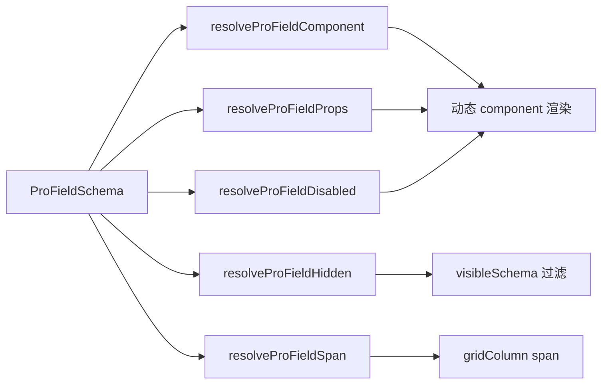
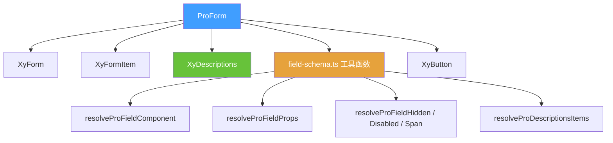
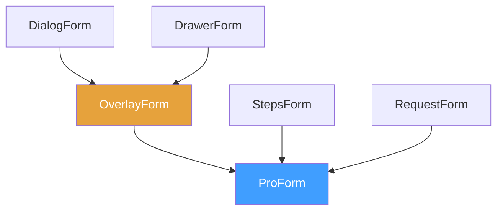

# 83 ProForm 增强表单

> 导读：中后台页面的表单编排层——统一标题区、网格栅格、只读展示和提交动作区，是所有 Pro 表单组组件的基座。

## 设计哲学

### Pro 组件与基础组件的区别

`xy-form` 是通用表单容器，只负责数据绑定与校验。`xy-pro-form` 在此之上增加了三层编排能力：

1. **头部层**：标题（`title`）+ 描述（`description`）+ 自定义 `header` / `meta` 插槽。
2. **栅格层**：通过 `columns` 自动构建 CSS Grid 布局，`schema` 中每个字段的 `span` 控制跨列。
3. **动作层**：内置提交/重置按钮，支持 `submitting` 加载态。

这意味着开发者不再需要为每个表单页面重复搭建"标题行 + 表单网格 + 底部按钮"的骨架。

### ProFieldSchema 的核心理念

ProForm 是 `ProFieldSchema` 的主要消费方。schema 中每个字段通过 `field-schema.ts` 导出的工具函数完成从声明到渲染的全链路解析：



所有 Pro 表单组组件（OverlayForm、StepsForm、RequestForm 等）都通过 ProForm 间接消费 schema，保证字段解析逻辑的唯一性。

### 与同类 Pro 组件库的差异化

- **只读切换是一等公民**：`readonly` 为 `true` 时，ProForm 将 schema 字段区整体切换为 `xy-descriptions` 只读展示，而非逐字段 `disabled`。这避免了"禁用态表单"与"真正只读展示"的视觉歧义。
- **不内置请求**：ProForm 只负责 `submit` 事件派发，`request` 编排交给 `RequestForm` 或页面层。
- **与 Descriptions 无缝对接**：`resolveProDescriptionsItems` 函数将 schema 直接映射为 Descriptions 的 items 数组，零配置切换。

## 源码架构

### 文件结构

```
pro-form/
├── index.ts                  # withInstall 导出
├── src/
│   ├── pro-form.ts            # ProFormProps / ProFormInstance 类型定义
│   └── pro-form.vue           # 组件实现
└── __tests__/
    └── pro-form.spec.ts
```

### 组件关系图



### 核心 type 定义

**ProFormProps**：

```ts
interface ProFormProps {
  title?: string;
  description?: string;
  model: Record<string, unknown>;
  schema?: ProFieldSchema[];              // 字段 schema
  rules?: FormRules;
  labelWidth?: string | number;           // 默认 '112px'
  labelPosition?: 'left' | 'top';         // 默认 'top'
  size?: ComponentSize;
  columns?: number;                        // 栅格列数，默认 2
  loading?: boolean;                       // 加载骨架态
  readonly?: boolean;                      // 只读展示模式
  readonlyDescriptionsProps?: Omit<DescriptionsProps, 'items' | 'title' | 'extra'>;
  submitting?: boolean;                    // 提交中态
  submitText?: string;                     // 默认 '保存'
  resetText?: string;                     // 默认 '重置'
  showSubmit?: boolean;
  showReset?: boolean;
}
```

**ProFormInstance**：

```ts
interface ProFormInstance {
  validate: () => Promise<boolean>;
  submit: () => Promise<boolean>;
  reset: (prop?: FormProp | FormProp[]) => void;
  clearValidate: (prop?: FormProp | FormProp[]) => void;
}
```

## 核心实现

### schema 如何映射到基础组件

ProForm 通过 `field-schema.ts` 的工具函数完成 schema 到渲染的转换：

1. **过滤隐藏字段**：`visibleSchema = schema.filter(f => !resolveProFieldHidden(f, model))`
2. **解析组件**：`resolveProFieldComponent(field)` 从 `builtInComponentMap` 查表
3. **合并属性**：`resolveProFieldProps(field)` 合并 `componentProps`、自动 `placeholder`、`options`
4. **计算跨列**：`resolveProFieldSpan(field, columns)` 将 `span` 映射到 `gridColumn: span N`

模板中的渲染核心片段：

```html
<component
  :is="resolveProFieldComponent(field)"
  v-bind="{
    ...resolveProFieldProps(field),
    modelValue: model[field.prop],
    disabled: resolveProFieldDisabled(field, model),
    'onUpdate:modelValue': (v) => updateProModelValue(model, field.prop, v)
  }"
/>
```

### 只读模式切换

当 `readonly=true` 且有 schema 字段时，ProForm 切换到 `xy-descriptions` 渲染：

```ts
const readonlyItems = computed(() =>
  resolveProDescriptionsItems(visibleSchema, model)
);
```

`resolveProDescriptionsItems` 将每个 `ProFieldSchema` 转换为 `DescriptionsDataItem`，保留 `formatter`、`render`、`renderHTML`、`valueType`、`options`、`emptyValue`、`span`、`slot` 等全部展示协议，实现零配置切换。

### 加载骨架态

`loading=true` 时显示占位提示而非字段区，避免用户在数据未就绪时误操作：

```html
<div v-if="loading" class="xy-pro-form__loading">
  <strong>正在准备表单</strong>
  <span>字段和默认值就绪后会恢复编辑。</span>
</div>
```

### 组件间组合方式

ProForm 作为基座被上层 Pro 表单组组件复用：



- **OverlayForm**：在抽屉/弹窗容器中嵌入 ProForm，增加 `mode`（create/edit/view）和 `resetOnClose`/`destroyOnClose` 生命周期。
- **StepsForm**：将多个 ProForm 实例串联为步骤流，每步独立 schema。
- **RequestForm**：在 ProForm 外包裹 `AsyncStateContainer`，注入 `initialRequest` / `submitRequest` 数据流。

## API 参考

### Props

| 属性 | 说明 | 类型 | 默认值 |
| --- | --- | --- | --- |
| `title` | 表单标题 | `string` | `''` |
| `description` | 表单描述 | `string` | `''` |
| `model` | 表单数据对象 | `Record<string, unknown>` | — |
| `schema` | 字段 schema 数组 | `ProFieldSchema[]` | `[]` |
| `rules` | 表单校验规则 | `FormRules` | `{}` |
| `label-width` | 标签宽度 | `string \| number` | `'112px'` |
| `label-position` | 标签位置 | `'left' \| 'top'` | `'top'` |
| `size` | 组件尺寸 | `ComponentSize` | `'md'` |
| `columns` | 栅格列数 | `number` | `2` |
| `loading` | 加载骨架态 | `boolean` | `false` |
| `readonly` | 只读展示模式 | `boolean` | `false` |
| `readonly-descriptions-props` | 只读模式 Descriptions 属性 | `Omit<DescriptionsProps, 'items' \| 'title' \| 'extra'>` | `{}` |
| `submitting` | 提交中态 | `boolean` | `false` |
| `submit-text` | 提交按钮文案 | `string` | `'保存'` |
| `reset-text` | 重置按钮文案 | `string` | `'重置'` |
| `show-submit` | 是否显示提交按钮 | `boolean` | `true` |
| `show-reset` | 是否显示重置按钮 | `boolean` | `true` |

### Emits

| 事件 | 说明 | 参数 |
| --- | --- | --- |
| `submit` | 表单校验通过后派发 | `(payload: Record<string, unknown>)` |
| `reset` | 重置后派发 | `(payload: Record<string, unknown>)` |

### Slots

| 插槽 | 说明 | 作用域参数 |
| --- | --- | --- |
| `header` | 自定义头部区域 | — |
| `meta` | 头部右侧元信息 | — |
| `default` | 自定义表单内容（无 schema 时使用） | `{ model, readonly }` |
| `[field.slot]` | 自定义字段内容 | `{ field, model }` |
| `actions` | 自定义底部动作区 | `{ model, submit, reset, submitting }` |

### Exposes

| 方法 | 说明 | 返回值 |
| --- | --- | --- |
| `validate()` | 校验表单 | `Promise<boolean>` |
| `submit()` | 触发提交（校验 + 派发事件） | `Promise<boolean>` |
| `reset(prop?)` | 重置字段并派发事件 | `void` |
| `clearValidate(prop?)` | 清除校验状态 | `void` |

## 样式系统

### BEM 类名

| 类名 | 说明 |
| --- | --- |
| `.xy-pro-form` | 根容器 |
| `.xy-pro-form__header` | 头部区域（标题 + meta） |
| `.xy-pro-form__heading` | 标题组（标题 + 描述） |
| `.xy-pro-form__title` | 标题文本 |
| `.xy-pro-form__description` | 描述文本 |
| `.xy-pro-form__meta` | 头部右侧元信息 |
| `.xy-pro-form__body` | 表单主体 |
| `.xy-pro-form__grid` | CSS Grid 栅格容器 |
| `.xy-pro-form__field` | 单个字段包裹层 |
| `.xy-pro-form__descriptions` | 只读模式 Descriptions |
| `.xy-pro-form__loading` | 加载骨架态 |
| `.xy-pro-form__footer` | 底部动作区 |

### 修饰符

| 修饰符 | 说明 |
| --- | --- |
| `.xy-pro-form.is-loading` | 加载态 |

### CSS 变量引用

| 变量 | 用途 |
| --- | --- |
| `--xy-border` | 边框色 |
| `--xy-bg-container` | 背景色 |
| `--xy-mix-light` | 混色调节 |
| `--xy-radius-lg` | 大圆角 |
| `--xy-text-secondary` | 次要文字色 |

## 小结

1. **表单编排基座**：ProForm 统一了标题区、栅格、动作区的骨架搭建，所有 Pro 表单组组件都基于它构建。
2. **只读一等公民**：`readonly` 模式将 schema 字段直接映射为 Descriptions，而非逐字段 disabled，消除视觉歧义。
3. **schema 单一消费链**：所有字段解析逻辑收敛在 `field-schema.ts`，ProForm 及其上层组件共享同一套解析规则。