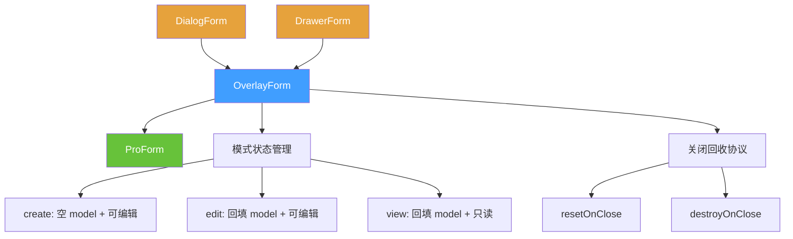
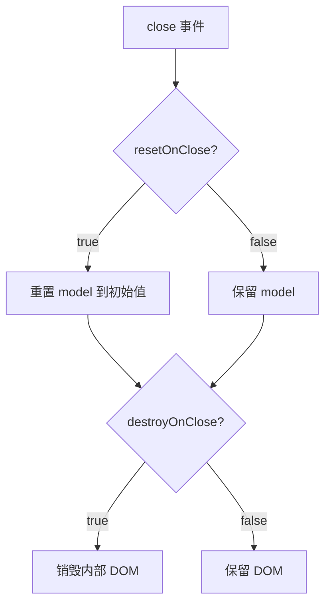
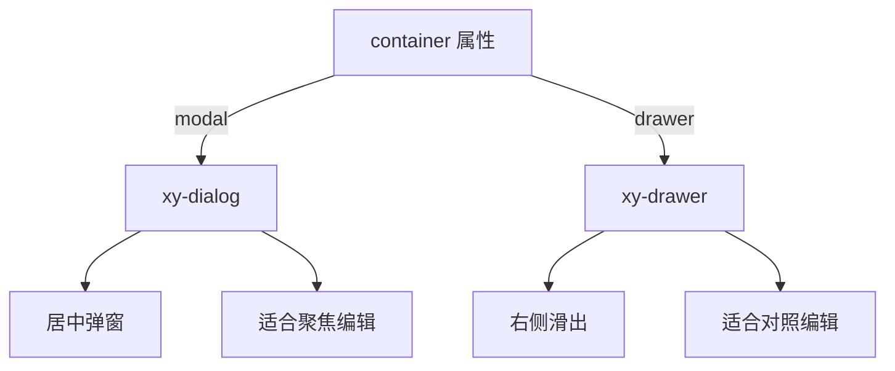

# 84 OverlayForm 浮层表单

> 导读：在抽屉/弹窗等浮层容器中编排表单——内建模式切换（create/edit/view）、关闭重置、销毁回收，是 DialogForm 与 DrawerForm 的共享内核。

## 设计哲学

### Pro 组件与基础组件的区别

手动在 `xy-dialog` 或 `xy-drawer` 中嵌套 `xy-form`，开发者需要自行处理三个反复出现的痛点：

1. **模式切换**：新建时字段为空，编辑时回填数据，查看时只读展示——三种模式的 schema/初始值/可编辑状态各不相同。
2. **关闭回收**：浮层关闭后表单数据是否重置？是否销毁 DOM？开发者每次都要写 `@close` 清理逻辑。
3. **打开/提交/关闭 流程编排**：打开→回填→编辑→校验→提交→关闭，这个流程在不同业务场景高度雷同。

OverlayForm 将上述三点收口为 `mode`、`resetOnClose`、`destroyOnClose` 三个声明式配置，并暴露 `open()` / `close()` 命令式 API。

### ProFieldSchema 的核心理念

OverlayForm 并不直接消费 schema，而是将 `schema`、`model`、`title`、`description` 等属性透传给内部的 ProForm 实例。OverlayForm 的职责是**浮层生命周期编排**，字段解析完全委托给 ProForm + field-schema.ts。

这种分层使得 OverlayForm 的 schema 行为与独立使用的 ProForm 完全一致——字段映射、占位符推导、只读切换等无需额外适配。

### 与同类 Pro 组件库的差异化

- **模式三元组**：`mode: 'create' | 'edit' | 'view'` 是一等配置。view 模式自动将 ProForm 切换为只读展示，无需额外 `readonly` 配置。
- **容器无关**：OverlayForm 本身不渲染浮层容器，只提供状态编排。DialogForm 和 DrawerForm 分别注入 `xy-dialog` / `xy-drawer` 作为容器。
- **关闭协议**：`resetOnClose`（重置数据）+ `destroyOnClose`（销毁 DOM）两个维度正交组合，覆盖 4 种关闭策略。

## 源码架构

### 文件结构

```
overlay-form/
├── index.ts                  # withInstall 导出
├── src/
│   ├── overlay-form.ts        # OverlayFormProps / OverlayFormInstance 类型定义
│   └── overlay-form.vue       # 组件实现
└── __tests__/
    └── overlay-form.spec.ts
```

### 组件关系图



### 核心 type 定义

**OverlayFormProps**：

```ts
interface OverlayFormProps {
  title?: string;
  description?: string;
  model: Record<string, unknown>;
  schema?: ProFieldSchema[];
  rules?: FormRules;
  labelWidth?: string | number;
  labelPosition?: 'left' | 'top';
  size?: ComponentSize;
  columns?: number;
  mode?: 'create' | 'edit' | 'view';  // 默认 'create'
  resetOnClose?: boolean;               // 默认 true
  destroyOnClose?: boolean;             // 默认 false
  submitting?: boolean;
  submitText?: string;
  resetText?: string;
  showSubmit?: boolean;
  showReset?: boolean;
}
```

**OverlayFormInstance**：

```ts
interface OverlayFormInstance {
  open: (payload?: { mode?: OverlayFormMode; model?: Record<string, unknown> }) => void;
  close: () => void;
  validate: () => Promise<boolean>;
  submit: () => Promise<boolean>;
  reset: (prop?: FormProp | FormProp[]) => void;
  clearValidate: (prop?: FormProp | FormProp[]) => void;
}
```

## 核心实现

### open() 方法——模式切换核心

`open()` 接收一个可选的 `payload`，其中 `mode` 决定表单行为，`model` 决定初始数据：

```ts
function open(payload?: { mode?: OverlayFormMode; model?: Record<string, unknown> }) {
  const mode = payload?.mode ?? props.mode;
  const incomingModel = payload?.model ?? {};

  if (mode === 'view') {
    Object.assign(model, cloneDeep(incomingModel));
    readonly = true;
  } else if (mode === 'edit') {
    Object.assign(model, cloneDeep(incomingModel));
    readonly = false;
  } else {
    Object.assign(model, cloneDeep(props.model)); // 回到初始 model
    readonly = false;
  }

  currentMode = mode;
  visible = true;
}
```

关键点：`view` 模式设置 `readonly=true`，让 ProForm 自动切换到 Descriptions 只读展示。

### 关闭回收协议

浮层关闭时根据配置执行回收策略：



实现上，`resetOnClose` 在 `handleClose` 中重置 ProForm 的 `model`，`destroyOnClose` 通过 `v-if` 控制内部 ProForm 的 DOM 生命周期。

### 提交与取消流程

OverlayForm 的提交/取消按钮文案根据 `mode` 和 `readonly` 自动推导：

```ts
const modeTextMap = {
  create: '新建',
  edit: '编辑',
  view: '查看'
};

const submitTextMap = {
  create: '创建',
  edit: '保存',
  view: ''             // view 模式不显示提交按钮
};

const cancelTextMap = {
  default: '取消',
  readonly: '关闭'     // 只读模式下取消按钮变为"关闭"
};
```

这意味着开发者无需为不同模式配置不同的按钮文案——OverlayForm 会根据 `mode` 自动推导。

### 容器选择策略

OverlayForm 根据外层 facade 提供的 `container` 属性选择渲染路径：



选择原则：
- **DialogForm**（modal）：编辑是独立操作，不需要参考列表上下文。
- **DrawerForm**（drawer）：编辑需要参考当前列表数据，如对照行内容修改。

### DialogForm 与 DrawerForm 如何复用 OverlayForm

DialogForm 和 DrawerForm 的实现极简——它们只负责：

1. 渲染浮层容器（`xy-dialog` / `xy-drawer`），将 `visible` 双向绑定到容器的 `modelValue`。
2. 在容器 default 插槽中渲染 OverlayForm，将其 `open` / `close` / `submit` 等事件桥接到容器的关闭逻辑。

```vue
<!-- DialogForm 核心模板 -->
<xy-dialog v-model="dialogVisible" v-bind="dialogProps">
  <xy-overlay-form
    ref="formRef"
    v-bind="overlayFormProps"
    @submit="handleSubmit"
    @reset="handleReset"
  />
</xy-dialog>
```

### 组件间组合方式

OverlayForm 是浮层表单的内核，被 DialogForm 和 DrawerForm 复用。更上层，CrudPage 的"新增/编辑/查看"动作直接操作 DialogForm 或 DrawerForm 的 `open()` 方法：

```ts
// CrudPage 中的典型用法
function handleCreate() {
  formRef.value?.open({ mode: 'create' });
}
function handleEdit(row) {
  formRef.value?.open({ mode: 'edit', model: row });
}
function handleView(row) {
  formRef.value?.open({ mode: 'view', model: row });
}
```

## API 参考

### Props

| 属性 | 说明 | 类型 | 默认值 |
| --- | --- | --- | --- |
| `title` | 表单标题 | `string` | `''` |
| `description` | 表单描述 | `string` | `''` |
| `model` | 表单数据对象 | `Record<string, unknown>` | — |
| `schema` | 字段 schema 数组 | `ProFieldSchema[]` | `[]` |
| `rules` | 表单校验规则 | `FormRules` | `{}` |
| `label-width` | 标签宽度 | `string \| number` | `'112px'` |
| `label-position` | 标签位置 | `'left' \| 'top'` | `'top'` |
| `size` | 组件尺寸 | `ComponentSize` | `'md'` |
| `columns` | 栅格列数 | `number` | `2` |
| `mode` | 表单模式 | `'create' \| 'edit' \| 'view'` | `'create'` |
| `reset-on-close` | 关闭时重置数据 | `boolean` | `true` |
| `destroy-on-close` | 关闭时销毁 DOM | `boolean` | `false` |
| `submitting` | 提交中态 | `boolean` | `false` |
| `submit-text` | 提交按钮文案 | `string` | `'保存'` |
| `reset-text` | 重置按钮文案 | `string` | `'重置'` |
| `show-submit` | 是否显示提交按钮 | `boolean` | `true` |
| `show-reset` | 是否显示重置按钮 | `boolean` | `true` |

### Emits

| 事件 | 说明 | 参数 |
| --- | --- | --- |
| `submit` | 表单校验通过后派发 | `(payload: Record<string, unknown>)` |
| `reset` | 重置后派发 | `(payload: Record<string, unknown>)` |
| `open` | 浮层打开后派发 | `()` |
| `close` | 浮层关闭后派发 | `()` |

### Slots

| 插槽 | 说明 | 作用域参数 |
| --- | --- | --- |
| `header` | 自定义头部区域 | — |
| `meta` | 头部右侧元信息 | — |
| `default` | 自定义表单内容 | `{ model, readonly }` |
| `[field.slot]` | 自定义字段内容 | `{ field, model }` |
| `actions` | 自定义底部动作区 | `{ model, submit, reset, submitting }` |

### Exposes

| 方法 | 说明 | 返回值 |
| --- | --- | --- |
| `open(payload?)` | 打开浮层 | `void` |
| `close()` | 关闭浮层 | `void` |
| `validate()` | 校验表单 | `Promise<boolean>` |
| `submit()` | 触发提交 | `Promise<boolean>` |
| `reset(prop?)` | 重置字段 | `void` |
| `clearValidate(prop?)` | 清除校验 | `void` |

## 样式系统

### BEM 类名

| 类名 | 说明 |
| --- | --- |
| `.xy-overlay-form` | 根容器 |

OverlayForm 本身不渲染外层容器，样式委托给内部 ProForm 和外层浮层容器。ProForm 的 BEM 类名在浮层内保持一致。

### CSS 变量引用

OverlayForm 继承 ProForm 的全部 CSS 变量，无独立变量。

## 小结

1. **模式三元组**：`create`/`edit`/`view` 一等配置，view 模式自动切换只读展示，消除手动 `readonly` 编排。
2. **关闭回收正交协议**：`resetOnClose` 和 `destroyOnClose` 两个维度独立组合，覆盖 4 种关闭策略。
3. **容器无关内核**：OverlayForm 不渲染浮层容器，只提供状态编排，DialogForm / DrawerForm 注入不同容器即可复用全部逻辑。