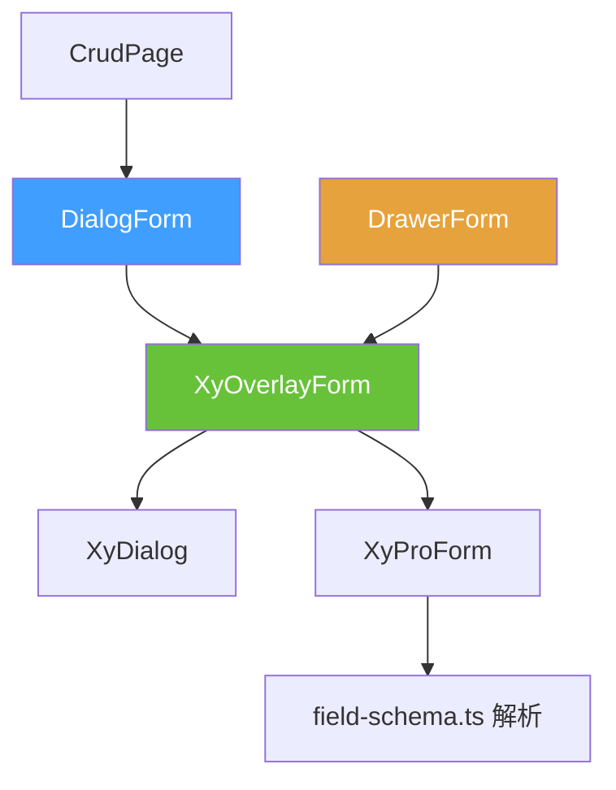
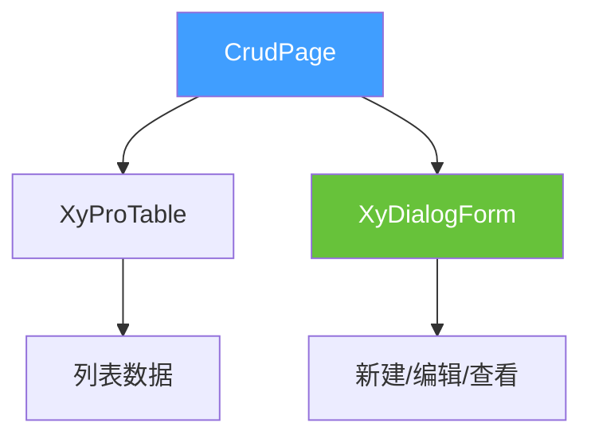

# 85 DialogForm 弹窗表单

> 导读：OverlayForm 的弹窗容器 facade——固定 `container="modal"`，一行 `open()` 即可完成弹窗内的新建/编辑/查看表单交互。

## 设计哲学

### Pro 组件与基础组件的区别

手动在 `xy-dialog` 中嵌套 `xy-form`，开发者需要自行处理弹窗可见性、表单校验、提交关闭联动、数据回填与重置等重复逻辑。DialogForm 将这些编排收敛到 `open()` / `close()` 两个命令式调用，让弹窗表单从"组装"变为"配置"。

DialogForm 的设计遵循**Facade + 内核**分层原则：
- **Facade 层**：DialogForm 固定 `container="modal"`，锁定弹窗容器语义。
- **内核层**：OverlayForm 负责模式切换、关闭回收、schema 解析。

这种分层使得 DialogForm 的实现极薄——全部核心逻辑复用 OverlayForm，自身只做容器绑定和插槽转发。

### ProFieldSchema 的核心理念

DialogForm 将 `schema`、`model`、`title` 等属性透传给内部 OverlayForm，再由 OverlayForm 透传给 ProForm。字段解析链路为：

```
DialogForm.schema → OverlayForm.schema → ProForm.schema → field-schema.ts 解析
```

三个组件共享同一套 schema 解析规则，无需适配。

### 与同类 Pro 组件库的差异化

- **Facade 模式而非独立内核**：DialogForm 不是"第二套弹窗表单实现"，而是 OverlayForm 的语义化薄包装。这意味着 OverlayForm 的所有能力（模式切换、关闭回收、只读展示）在 DialogForm 中完整可用。
- **dialogProps 完整透传**：DialogForm 的 `dialogProps` 属性接受 `xy-dialog` 的全部配置（宽度、自定义 class、footer 等），不裁剪能力。
- **与 CrudPage 深度集成**：CrudPage 的"新增/编辑/查看"动作直接调用 DialogForm 的 `open()` 方法，无需额外对接。

## 源码架构

### 文件结构

```
dialog-form/
├── index.ts                  # withInstall 导出
├── src/
│   ├── dialog-form.ts         # DialogFormProps / DialogFormInstance 类型定义
│   └── dialog-form.vue        # 组件实现
└── __tests__/
    └── dialog-form.spec.ts
```

### 组件关系图



### 核心 type 定义

**DialogFormProps**——继承 OverlayFormProps，但移除了 `container` 和 `drawerProps`（弹窗场景不需要抽屉配置）：

```ts
interface DialogFormProps extends Omit<OverlayFormProps, 'container' | 'drawerProps'> {
  // OverlayForm 全部属性直接可用
  // container 被固定为 'modal'，drawerProps 不再暴露
}
```

**OverlayFormSubmitPayload**——提交时携带的模式和数据快照：

```ts
interface OverlayFormSubmitPayload {
  mode: OverlayFormMode;               // 'create' | 'edit' | 'view'
  model: Record<string, unknown>;       // model 的深拷贝快照
}
```

**DialogFormInstance**——与 OverlayFormInstance 类型完全相同：

```ts
type DialogFormInstance = OverlayFormInstance;

interface OverlayFormInstance {
  validate: () => Promise<boolean>;
  submit: () => Promise<boolean>;
  close: () => void;
}
```

## 核心实现

### OverlayForm facade 桥接

DialogForm 的实现只有约 60 行，核心逻辑是将所有 props 透传给 `xy-overlay-form`，并固定 `container="modal"`：

```vue
<xy-overlay-form
  ref="overlayFormRef"
  v-bind="props"
  container="modal"
  @update:open="emit('update:open', $event)"
  @submit="emit('submit', $event)"
  @cancel="emit('cancel', $event)"
  @closed="emit('closed')"
>
  <template v-for="(_, name) in slots" :key="name" #[name]="slotProps">
    <slot :name="name" v-bind="slotProps ?? {}" />
  </template>
</xy-overlay-form>
```

关键设计点：
- `v-bind="props"` 一次性透传全部属性，不做逐字段映射。
- `container="modal"` 锁定弹窗容器。
- 插槽通过 `v-for` 全量转发，不做裁剪。

### 模式自动推导

OverlayForm 内部根据 `mode` 自动推导 UI 行为：

```ts
const modeTextMap = {
  create: '新建',
  edit: '编辑',
  view: '查看'
};

const submitTextMap = {
  create: '创建',
  edit: '保存',
  view: ''             // view 模式不显示提交按钮
};
```

这意味着 DialogForm 无需为不同模式配置不同的标题和按钮文案——OverlayForm 会根据 `mode` 自动推导。

### 组件间组合方式

DialogForm 在 CrudPage 中的典型用法：



CrudPage 的新增/编辑/查看动作直接调用 DialogForm 的 `open()`：

```ts
function handleCreate() {
  formRef.value?.open({ mode: 'create' });
}
function handleEdit(row) {
  formRef.value?.open({ mode: 'edit', model: row });
}
function handleView(row) {
  formRef.value?.open({ mode: 'view', model: row });
}
```

## API 参考

### Props

继承 OverlayFormProps 的全部属性（移除 `container` 和 `drawerProps`）：

| 属性 | 说明 | 类型 | 默认值 |
| --- | --- | --- | --- |
| `open` | 是否打开弹窗（v-model） | `boolean` | `false` |
| `mode` | 表单模式 | `'create' \| 'edit' \| 'view'` | `'create'` |
| `title` | 表单标题（空则根据 mode 自动推导） | `string` | `''` |
| `model` | 表单数据对象 | `Record<string, unknown>` | — |
| `schema` | 字段 schema 数组 | `ProFieldSchema[]` | `[]` |
| `rules` | 表单校验规则 | `FormRules` | `{}` |
| `label-width` | 标签宽度 | `string \| number` | `'112px'` |
| `label-position` | 标签位置 | `'left' \| 'top'` | `'top'` |
| `size` | 组件尺寸 | `ComponentSize` | `'md'` |
| `loading` | 加载态 | `boolean` | `false` |
| `submitting` | 提交中态 | `boolean` | `false` |
| `readonly` | 只读模式 | `boolean` | `false` |
| `submit-text` | 提交按钮文案（空则根据 mode 推导） | `string` | `''` |
| `cancel-text` | 取消按钮文案（空则根据 readonly 推导） | `string` | `''` |
| `reset-on-close` | 关闭时重置表单状态 | `boolean` | `false` |
| `destroy-on-close` | 关闭时销毁 DOM | `boolean` | `false` |
| `dialog-props` | 透传给 xy-dialog 的属性 | `Omit<Partial<DialogProps>, 'modelValue' \| 'title'>` | `{}` |

### Emits

| 事件 | 说明 | 参数 |
| --- | --- | --- |
| `update:open` | 打开状态变化 | `(value: boolean)` |
| `submit` | 提交成功 | `(payload: OverlayFormSubmitPayload)` |
| `cancel` | 取消操作 | `(payload: OverlayFormSubmitPayload)` |
| `closed` | 弹窗完全关闭后 | `()` |

### Slots

继承 OverlayForm 的全部插槽：

| 插槽 | 说明 | 作用域参数 |
| --- | --- | --- |
| `default` | 自定义表单内容 | `{ model, mode, readonly }` |
| `actions` | 自定义底部动作区 | `{ model, mode, readonly, submitting, submit, cancel, close }` |
| `[field.slot]` | 自定义字段内容 | `{ field, model }` |

### Exposes

| 方法 | 说明 | 返回值 |
| --- | --- | --- |
| `validate()` | 校验表单 | `Promise<boolean>` |
| `submit()` | 触发提交 | `Promise<boolean>` |
| `close()` | 关闭弹窗 | `void` |

## 样式系统

### BEM 类名

| 类名 | 说明 |
| --- | --- |
| `.xy-overlay-form` | OverlayForm 根容器 |
| `.xy-overlay-form--modal` | 弹窗容器修饰符 |
| `.xy-overlay-form__footer` | 底部动作区 |

DialogForm 复用 OverlayForm 的样式，`dialog-form.css` 仅引入 `overlay-form.css`：

```css
@import "./overlay-form.css";
```

### CSS 变量引用

继承 OverlayForm 和 ProForm 的全部 CSS 变量，无独立变量。

## 小结

1. **Facade 模式**：DialogForm 是 OverlayForm 的薄包装，固定弹窗容器，不做二次实现，OverlayForm 全部能力完整可用。
2. **模式自动推导**：标题、按钮文案、只读状态根据 `mode` 自动推导，减少配置量。
3. **插槽全量转发**：通过 `v-for` 将所有插槽透传给 OverlayForm，不做裁剪，保持扩展性。