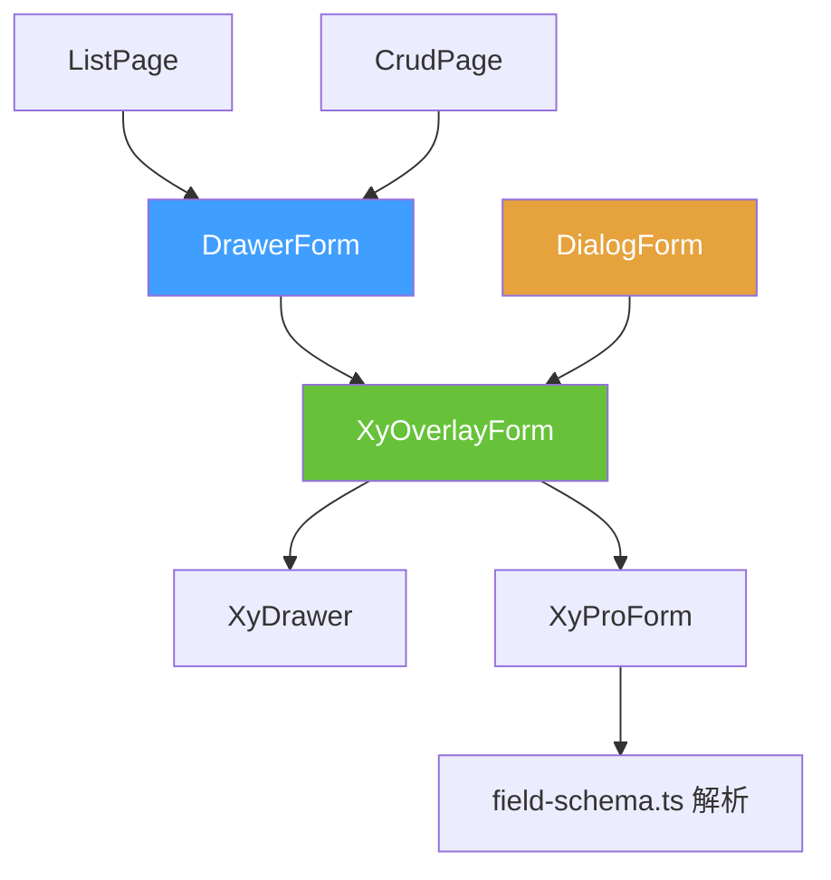
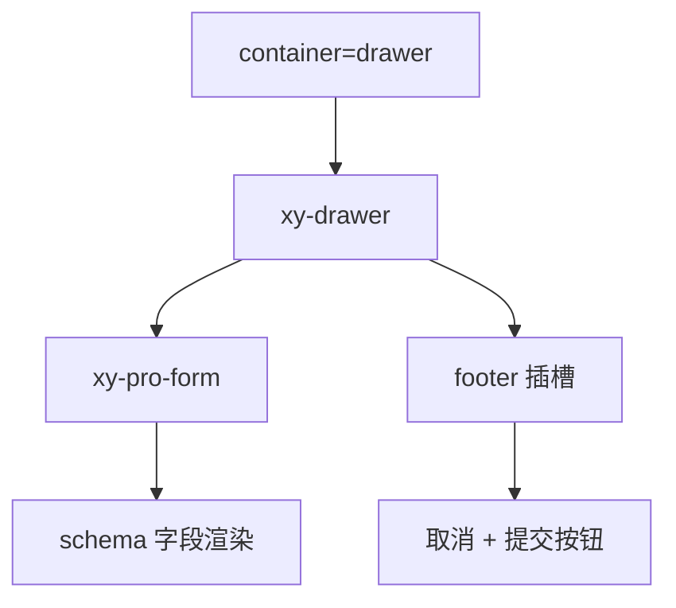
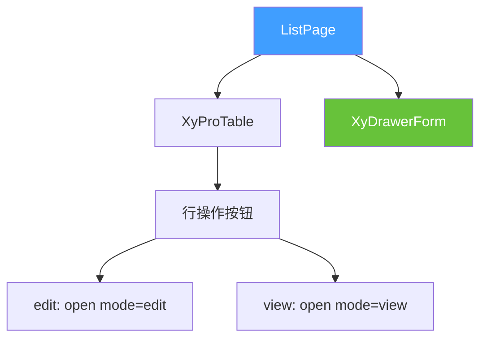

# 86 DrawerForm 抽屉表单

> 导读：OverlayForm 的抽屉容器 facade——固定 `container="drawer"`，一行 `open()` 即可在右侧抽屉中完成新建/编辑/查看表单交互，同时保留页面上下文。

## 设计哲学

### Pro 组件与基础组件的区别

手动在 `xy-drawer` 中嵌套 `xy-form`，开发者需要自行处理抽屉可见性、表单校验、提交关闭联动、数据回填与重置等重复逻辑。DrawerForm 将这些编排收敛到 `open()` / `close()` 两个命令式调用，让抽屉表单从"组装"变为"配置"。

DrawerForm 与 DialogForm 是一对**对称 facade**——二者共享同一套 OverlayForm 内核，只是锁定的容器不同：
- **DrawerForm**：固定 `container="drawer"`，右侧滑出，保留页面上下文。
- **DialogForm**：固定 `container="modal"`，居中弹窗，聚焦编辑内容。

选择原则：当编辑需要参考当前列表数据时（如对照行内容编辑），优先用 DrawerForm；当编辑是独立操作时，优先用 DialogForm。

### ProFieldSchema 的核心理念

DrawerForm 与 DialogForm 一样，将 `schema`、`model`、`title` 等属性透传给 OverlayForm，字段解析链路完全一致：

```
DrawerForm.schema → OverlayForm.schema → ProForm.schema → field-schema.ts 解析
```

这种一致性意味着开发者在 DialogForm 和 DrawerForm 之间切换时，只需替换组件标签，无需调整 schema 或逻辑。

### 与同类 Pro 组件库的差异化

- **对称 facade 设计**：DrawerForm 和 DialogForm 是 OverlayForm 的两个对称出口，而非两个独立实现。这避免了"抽屉表单"和"弹窗表单"行为不一致的问题。
- **drawerProps 完整透传**：DrawerForm 的 `drawerProps` 属性接受 `xy-drawer` 的全部配置（尺寸、位置、可拖拽等），不裁剪能力。
- **与列表页深度集成**：ListPage 和 CrudPage 的编辑动作直接调用 DrawerForm 的 `open()` 方法，无需额外对接。

## 源码架构

### 文件结构

```
drawer-form/
├── index.ts                  # withInstall 导出
├── src/
│   ├── drawer-form.ts         # DrawerFormProps / DrawerFormInstance 类型定义
│   └── drawer-form.vue        # 组件实现
└── __tests__/
    └── drawer-form.spec.ts
```

### 组件关系图



### 核心 type 定义

**DrawerFormProps**——继承 OverlayFormProps，但移除了 `container` 和 `dialogProps`（抽屉场景不需要弹窗配置）：

```ts
interface DrawerFormProps extends Omit<OverlayFormProps, 'container' | 'dialogProps'> {
  // OverlayForm 全部属性直接可用
  // container 被固定为 'drawer'，dialogProps 不再暴露
}
```

**DrawerFormSubmitPayload** 与 **DrawerFormInstance**：

```ts
type DrawerFormSubmitPayload = OverlayFormSubmitPayload;
type DrawerFormInstance = OverlayFormInstance;
```

与 DialogForm 完全相同的提交载荷和实例类型，体现了对称 facade 设计。

## 核心实现

### OverlayForm facade 桥接

DrawerForm 的实现与 DialogForm 几乎对称，唯一区别是 `container="drawer"`：

```vue
<xy-overlay-form
  ref="overlayFormRef"
  v-bind="props"
  container="drawer"
  @update:open="emit('update:open', $event)"
  @submit="emit('submit', $event)"
  @cancel="emit('cancel', $event)"
  @closed="emit('closed')"
>
  <template v-for="(_, name) in slots" :key="name" #[name]="slotProps">
    <slot :name="name" v-bind="slotProps ?? {}" />
  </template>
</xy-overlay-form>
```

关键设计点：
- `v-bind="props"` 一次性透传全部属性。
- `container="drawer"` 锁定抽屉容器。
- 插槽通过 `v-for` 全量转发。

### OverlayForm 内部的抽屉渲染路径

当 `container="drawer"` 时，OverlayForm 渲染 `xy-drawer` 并在其中嵌入 ProForm：



OverlayForm 为抽屉模式设置了合理的默认值：
- 默认宽度 `560px`（通过 `drawerProps.size` 可覆盖）。
- 提交按钮根据 `mode` 自动推导文案（创建/保存）。
- `view` 模式下提交按钮不显示，取消按钮文案变为"关闭"。

### 组件间组合方式

DrawerForm 在 ListPage 和 CrudPage 中的典型用法：



ListPage/CrudPage 中的行操作回调：

```ts
function handleEdit(row: Record<string, unknown>) {
  drawerFormRef.value?.open({ mode: 'edit', model: { ...row } });
}
function handleView(row: Record<string, unknown>) {
  drawerFormRef.value?.open({ mode: 'view', model: { ...row } });
}
```

## API 参考

### Props

继承 OverlayFormProps 的全部属性（移除 `container` 和 `dialogProps`）：

| 属性 | 说明 | 类型 | 默认值 |
| --- | --- | --- | --- |
| `open` | 是否打开抽屉（v-model） | `boolean` | `false` |
| `mode` | 表单模式 | `'create' \| 'edit' \| 'view'` | `'create'` |
| `title` | 表单标题（空则根据 mode 自动推导） | `string` | `''` |
| `model` | 表单数据对象 | `Record<string, unknown>` | — |
| `schema` | 字段 schema 数组 | `ProFieldSchema[]` | `[]` |
| `rules` | 表单校验规则 | `FormRules` | `{}` |
| `label-width` | 标签宽度 | `string \| number` | `'112px'` |
| `label-position` | 标签位置 | `'left' \| 'top'` | `'top'` |
| `size` | 组件尺寸 | `ComponentSize` | `'md'` |
| `loading` | 加载态 | `boolean` | `false` |
| `submitting` | 提交中态 | `boolean` | `false` |
| `readonly` | 只读模式 | `boolean` | `false` |
| `submit-text` | 提交按钮文案（空则根据 mode 推导） | `string` | `''` |
| `cancel-text` | 取消按钮文案（空则根据 readonly 推导） | `string` | `''` |
| `reset-on-close` | 关闭时重置表单状态 | `boolean` | `false` |
| `destroy-on-close` | 关闭时销毁 DOM | `boolean` | `false` |
| `drawer-props` | 透传给 xy-drawer 的属性 | `Omit<Partial<DrawerProps>, 'modelValue' \| 'title'>` | `{}` |

### Emits

| 事件 | 说明 | 参数 |
| --- | --- | --- |
| `update:open` | 打开状态变化 | `(value: boolean)` |
| `submit` | 提交成功 | `(payload: OverlayFormSubmitPayload)` |
| `cancel` | 取消操作 | `(payload: OverlayFormSubmitPayload)` |
| `closed` | 抽屉完全关闭后 | `()` |

### Slots

继承 OverlayForm 的全部插槽：

| 插槽 | 说明 | 作用域参数 |
| --- | --- | --- |
| `default` | 自定义表单内容 | `{ model, mode, readonly }` |
| `actions` | 自定义底部动作区 | `{ model, mode, readonly, submitting, submit, cancel, close }` |
| `[field.slot]` | 自定义字段内容 | `{ field, model }` |

### Exposes

| 方法 | 说明 | 返回值 |
| --- | --- | --- |
| `validate()` | 校验表单 | `Promise<boolean>` |
| `submit()` | 触发提交 | `Promise<boolean>` |
| `close()` | 关闭抽屉 | `void` |

## 样式系统

### BEM 类名

| 类名 | 说明 |
| --- | --- |
| `.xy-overlay-form` | OverlayForm 根容器 |
| `.xy-overlay-form--drawer` | 抽屉容器修饰符 |
| `.xy-overlay-form__footer` | 底部动作区 |

DrawerForm 复用 OverlayForm 的样式，`drawer-form.css` 仅引入 `overlay-form.css`：

```css
@import "./overlay-form.css";
```

### CSS 变量引用

继承 OverlayForm 和 ProForm 的全部 CSS 变量，无独立变量。

## 小结

1. **对称 facade 设计**：DrawerForm 与 DialogForm 是 OverlayForm 的两个对称出口，共享同一套模式切换和关闭回收逻辑，行为完全一致。
2. **保留页面上下文**：抽屉从右侧滑出，用户可以同时看到列表和表单内容，适合需要对照编辑的场景。
3. **drawerProps 完整透传**：不裁剪 `xy-drawer` 的任何能力，开发者可完全控制抽屉尺寸、位置等属性。